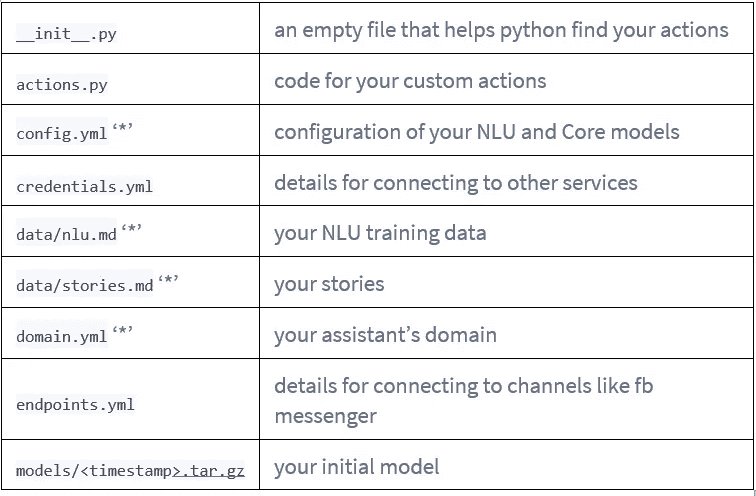
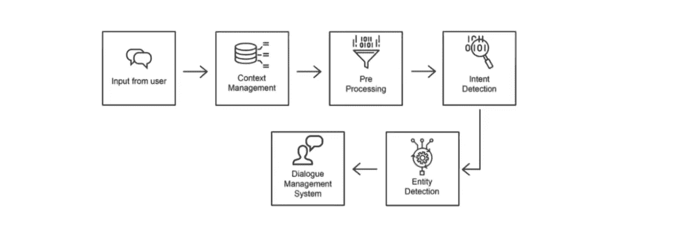
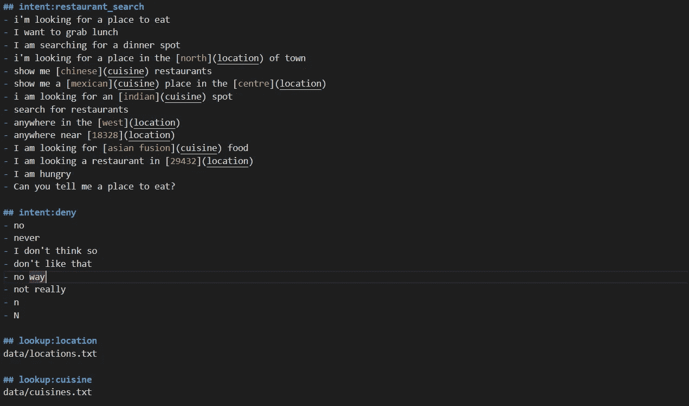
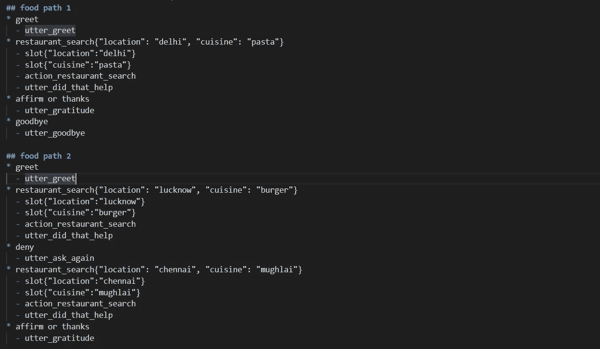
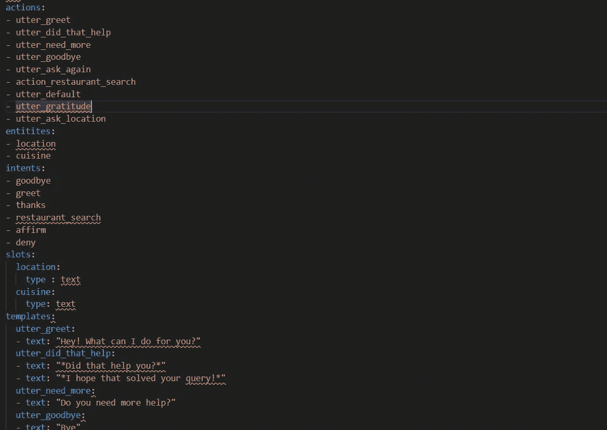

# 如何使用 Rasa 框架构建智能聊天机器人

> 原文：<https://medium.datadriveninvestor.com/how-to-build-a-smart-chatbot-using-rasa-framework-1ed468db0e01?source=collection_archive---------3----------------------->


> 如今，聊天机器人是任何自动化任务或以交互方式向用户提供一些信息的应用程序的重要组成部分。在这篇博客中，我们将看到如何通过利用机器学习和深度学习模型，使用 Rasa 框架轻松构建聊天机器人。

asa 是一个用于自然语言理解、对话管理和集成的开源框架。让我们看看 Rasa 的组件，了解它的工作方式。

*   [NLU](https://rasa.com/docs/rasa/nlu/about/) :确定用户想要什么，并捕捉关键的上下文信息
*   [核心](https://rasa.com/docs/rasa/core/about/):根据对话历史选择下一个最佳回应或行动
*   [通道](https://rasa.com/docs/rasa/user-guide/messaging-and-voice-channels/)和[集成](https://rasa.com/docs/rasa/core/actions/#custom-actions/):将助手连接到用户和后端系统

# 拉莎·NLU:

Rasa NLU 是一个开源的自然语言处理工具，用于聊天机器人中的意图分类、响应检索和实体提取。例如，举一个类似这样的句子

```
"I am looking for a Mexican restaurant in the center of town"
```

NLU 句子的返回结构是

```
{
  **"intent"**: "search_restaurant",
  **"entities"**: {
    **"cuisine"** : "Mexican",
    **"location"** : "center"
  }
}
```

# Rasa 核心:

Rasa Core 是一个用于构建 AI 助手的对话引擎。它不是一堆 if/else 语句，而是使用一个经过示例对话训练的机器学习模型来决定下一步该做什么。当你想超越这一点，创建一个可以处理更多复杂性的机器人时，Rasa 可以帮助你。

让我们来理解使用 Rasa 框架构建项目所使用的文件。



让我们通过构建一个简单的餐馆搜索聊天机器人来理解 Rasa 框架的实现。



Flow Diagram

环境管理由 Rasa NLU 组件完成，对话管理系统由 Rasa 核心组件构建。我们将在项目中使用以下组件。

*   拉萨 NLU 和拉萨核心。[https://rasa.com/](https://rasa.com/)
*   Zomato 的开放 API。[https://developers.zomato.com/api](https://developers.zomato.com/api)
*   松弛部署。

我们的聊天机器人将响应以下基本操作:

*   可以寻找吃饭的地方
*   获取信息，如美食，地址等。
*   支持与用户闲聊。
*   记住一些对话的上下文。

让我们深入研究项目文件，探索如何工作。你可以在 Github 上找到项目文件。

[](https://github.com/shubham-baghel/NLP/tree/master/Chatbot%20RASA) [## 舒巴姆-巴盖尔/NLP

### 这是聊天机器人的完整版本，可以通过填充 slack_credentials.yml 和…

github.com](https://github.com/shubham-baghel/NLP/tree/master/Chatbot%20RASA) 

要设置和运行项目，您可以在项目文件中找到步骤。

让我们深入研究作为框架核心部分的文件。数据对于训练聊天机器人来说是最重要的。


# 数据:

我们在 nlu_data.md 文件中定义了以下格式的数据。意图指定对应于该句子的用户意图。例如，意图可以是问候、搜索餐馆或菜肴、拒绝。为了定义实体(位置，美食)，我们已经定义了一个位置和不同类型的美食查找，以便当用户查询它们时，它可以被识别。



nlu_Data

我们在数据中定义的第二件事是故事。在故事中，我们定义了一些可能的路径，用户可以通过这些路径与我们的聊天机器人进行对话。 **(*)** 定义用户命令 **(-)** 定义聊天机器人响应。在下面的例子中，我们可以看到 **utter_greet** 作为聊天机器人的响应，我们可以在 domain.yml 文件下为 utter_greet 定义多个响应，我们很快就会看到。**槽**用于保存实体，这些实体可以在将来用于了解上下文。这样，我们的聊天机器人就能够记住对话中的上下文。



Stories

在 domain.yml 文件中，我们可以定义聊天机器人应该知道的整个上下文。动作定义了我们回应用户的方式。操作响应在模板下定义。其他东西是我们需要在领域下定义的实体和意图。



Domain

我们使用 Zomato API 来获取餐馆的详细信息。您可以访问 API 页面，在那里注册并生成一个 API 密钥来与我们的 API 集成。与 API 调用相关的操作在 actions.py 文件中定义。

[](https://www.datadriveninvestor.com/2020/02/03/how-an-ai-based-chatbot-can-help-you-form-better-long-term-habits/) [## 基于人工智能的聊天机器人如何帮助你形成更好的长期习惯

### 当我们思考我们的日常行为时，我们经常没有意识到，我们所做的行为占了多大的比例…

www.datadriveninvestor.com](https://www.datadriveninvestor.com/2020/02/03/how-an-ai-based-chatbot-can-help-you-form-better-long-term-habits/) 

在 endpoints.yml 文件中，我们为动作服务器定义了端点。Make 文件用于定义训练 nlu 模型和部署 rasa 核心组件的命令。

我希望现在你能对 Rasa 有一个基本的了解。如有任何疑问，欢迎在 LinkedIn 上评论或 ping 我。

[](https://www.linkedin.com/in/shubhambaghel/) [## Shubham Baghel -助理技术主管- Nagarro | LinkedIn

### 探索者和学习者。深入数据科学领域。分析来自真实世界实体的数据集…

www.linkedin.com](https://www.linkedin.com/in/shubhambaghel/)