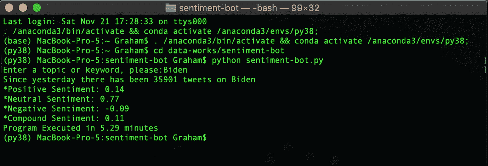

# 如何用 Python 构建一个 Twitter 抓取 App

> 原文：<https://medium.datadriveninvestor.com/how-to-build-a-twitter-scraping-app-with-python-b3fc069a19c6?source=collection_archive---------1----------------------->

## 一个简单的 Python 应用程序，可以让你对你能想到的任何话题都有有价值的见解


Photo by [camilo jimenez](https://unsplash.com/@coolmilo?utm_source=medium&utm_medium=referral) on [Unsplash](https://unsplash.com?utm_source=medium&utm_medium=referral)

每秒钟大约有 6000 条推文****每天发布 5 亿条*** ，普通人甚至无法想象如何解析所有这些数据。除非普通人正在阅读这篇文章:那么你可以大胆尝试。现在我们不会检查每一条推文，而是定制的推文。我们可以提取提到特定关键词或短语的推文，并利用这些信息来衡量“twitter-verse”对所述主题或短语的感受。*

*本教程将是非常 noob 友好的，事实上，它不需要任何先前的编码经验来运行和安装。你只需要一台笔记本电脑和 Python 3.8——剩下的我会解释。如果你从未接触过 Python，那么最困难的部分将是用 Python 3.8 设置你的 IDE 并安装所需的依赖项。这个项目使用了与我的上一篇文章 相同的代码，然而，虽然这个项目主要集中于提出和测试一个想法，这个项目的最终产品是一个可执行文件。py 应用程序。*

*同样，我们将在这个项目中使用 Python 3.8，因此如果您使用的是以前的版本，您将需要使用 3.8 建立一个新的虚拟环境，或者更新您当前的环境。使用以下工具检查您的 Python 版本:*

```
*from platform import python_version
print(python_version())*
```

## ***安装依赖关系***

*首先，和所有编码项目一样，让我们安装一些依赖项:*

```
*import pandas as pd
import numpy as np
import csv
import snscrape.modules.twitter as sntwitter
from vaderSentiment.vaderSentiment import SentimentIntensityAnalyzer
import datetime as dt
import time*
```

*如果你在安装这些软件包时收到一个错误，只需 pip3 安装它们(例如 pip3 安装 snscrape)或谷歌如何安装它们。*

*我们初始化日期-时间对象，以便从前一天开始提取数据。这意味着我们不是专门提取过去 24 小时的推文，而是提取前一天开始的推文以及今天到目前为止发布的所有推文。*

```
*# Generating datetime objects
from datetime import datetime, timedelta
now = datetime.now()
now = now.strftime('%Y-%m-%d')
yesterday = datetime.now() - timedelta(days = 1)
yesterday = yesterday.strftime('%Y-%m-%d')*
```

*提示用户输入关键字:*

```
*keyword = input('Enter a topic or keyword, please:')*
```

## *Twitter 抓取*

*抓取 twitter 并编写一个独特的 CSV 文件，标题为我们在用户输入中选择的关键字和我们运行代码的日期。*

*正在初始化 VADER 情绪分析器:*

```
*analyzer = SentimentIntensityAnalyzer()*
```

*从这里，我们将 CSV 文件读回到我们的程序中，创建包含每个单独提取的 tweet 的各种情绪得分的列，获取自前一天开始发布的所有 tweet 的每个情绪得分的平均值，并最终打印出所有这些信息。*

*我还在代码中包含了一个计时器，它会告诉我运行完整代码需要多长时间。您可以在我的 Github 上找到并下载完整代码:*

*[](https://github.com/grsahagian/data-works) [## grsahagian/数据工程

### 各种与数据分析相关的项目笔记本 GitHub 是 5000 多万开发人员的家园，他们共同工作来管理…

github.com](https://github.com/grsahagian/data-works) 

**运行我们的应用**

要运行代码，只需打开您的命令终端，然后导航到包含您的应用程序的文件夹(在我的情况下，它位于与我的 Github repo 对应的 data-works 文件夹中的一个文件夹中):

```
cd data-works/sentiment-bot
```

然后用下面的代码 *(* ***注:*** *确保你的终端使用的是你的 Python 3.8 虚拟环境)*。

```
python sentiment-bot.py
```

下面是我的终端成功运行我们刚刚编写的程序后的截图:



Running sentiment-bot.py in Mac Terminal

在 5 分 17 秒的时间里，我们抓取了不到 3.6 万条推文，其中包括关键词“拜登”，显示了整体的中立情绪，略有积极倾向。

***从我们的数据中获得更多:***

虽然这些信息很有趣也很有价值，但我们可以进一步分析*以给出更多**可行的见解**。例如，如果你正在推出一个与现有产品竞争的新产品，你可以在 twitter 上找到该产品在网上的负面反馈，然后调整你的新产品来补救这些投诉。有很多方法可以处理用户生成的数据，twitter 抓取程序是一个很好的起点。*

*如果你喜欢这篇文章并想看更多相关内容，可以考虑在媒体上关注我或者查看我的其他文章。** 

**sagefuentes。2020 年 9 月 17 日。" HTTP 错误，给出 404，但 URL 正在工作#98 . "[https://github.com/Mottl/GetOldTweets3/issues/98](https://github.com/Mottl/GetOldTweets3/issues/98)。**

**伊夫·希尔皮什。“面向金融的 Python:掌握数据驱动的金融”。奥莱利 2014。**

***原载于 2020 年 12 月 1 日 https://www.datadriveninvestor.com*[](https://www.datadriveninvestor.com/2020/12/01/how-to-build-a-twitter-scraping-app-with-python/)**。****