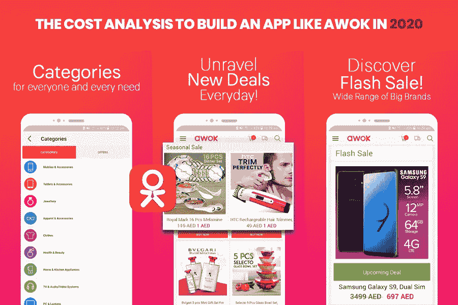

# 如何建立一个像 AWOK 甚至更好的电子商务应用程序

> 原文：<https://medium.datadriveninvestor.com/how-to-build-an-e-commerce-app-like-awok-or-even-better-397d01d011a5?source=collection_archive---------26----------------------->

**电子商务是全球增长率的引擎**

你知道吗！

“电子商务是新的现实”，有潜力

*   重写客户购买轨迹
*   重新表述新客户体验
*   打破传统的商业模式，为大型和小型零售商以及纯电子商务公司的进入者带来巨大的增长机会

毫无疑问，中东是一个指数级增长的在线商业中心。从古驰、范思哲、LV 和许多其他设计师品牌，到像法拉利、布加迪和兰博基尼这样的 SUV 和超级跑车，一切都触手可及。

2015 年，电子商务行业领先于最优秀的 [**应用开发公司**](https://www.xicom.ae/services/mobile-app-development/) 在中东设立了新的基准，在线销售额飙升至 150 亿美元大关，这是一个从未预计到的数字。然而，它确实发生了，在该地区的 444 万购物者中，几乎每个人都贡献了哪怕是最小的一部分。

随着电子商务成为零售的引擎，it 投入从 2012 年的 7%飙升至 2017 年的 39%，预计 2020 年将超过 50%。当数字化浪潮席卷全球时，中东和北非地区进入了数字化应用的第三个阶段——与其他市场不同，该地区的发展道路不同。

# 为什么“像 AWOK 一样的电子商务应用”是创新的正确导航

2000 年代中期，互联网的普及主要是由智能手机和社交媒体推动的，标志着“数字消费者阶段”的开始。2010 年后，该行业开始见证数字化趋势在商业战略中发挥核心作用，让每个人都成为购物狂。

因此，转变是不可或缺的。

这标志着中东和北非一个新的数字阶段“电子商务阶段”的开始。此外，迪拜经济和 visa 的一项联合研究表明，“阿联酋的电子商务交易在 2019 年达到 160 亿美元(590 亿迪拉姆)，预计在 2018 年至 2022 年之间每年增长 23%”。

此外，详细的统计数据显示，顶级电子商务应用程序通过巩固其足迹和获取巨额利润来占领市场份额。但是，在流行和不断变化的趋势中，如果你也在考虑拥有一个电子商务应用程序，当所有重要的事情都是在线购物时，那就在迪拜寻找最好的 [**应用程序开发者**](https://www.xicom.ae/services/mobile-app-development/) 来启动你的业务。

# 以下是“AWOK 是如何做到的”的答案

随着中东和北非地区的电子商务市场正在经历一场充满活力的变革，并购成为新的常数——亚马逊收购 Souq，Jadopado 被亿万富翁 Mohamed Alabbar 领导的技术基金收购，以及最近推出的 10 亿美元 noon。在它们出现之前，有 AWOK，电子商务应用的激烈竞争。它成立于 2013 年，进入市场的使命是让买家随时可以买到日常消费品。
到 2015 年，其销售额翻了三倍，2017 年，它超越了阿联酋，进入了沙特阿拉伯，并计划在 2019 年建立更广泛的 GCC。它同时在阿联酋和 KSA 推出了当天送达服务。
目前，他们正在与专业的第三方物流公司合作，以更快、更有效地完成交付任务，他们现在能够尽可能快地提供服务。然而，这说明了为电子商务物流运营创造一个生态系统的重要性。
虽然支持电子商务领域的增长对 AWOK 至关重要，因为这是使跨境业务在经济上可行的可行选择。否则，如果你不发展生态系统，将跨境服务扩展到新市场会变得有点挑战，但通过新兴的翅膀，你正在提高在线用户的渗透率，这将从长远来看有利于你的业务。

这就是 AWOK 有所作为的地方。它欢迎新的电子商务进入市场，目的是使消费者和电子商务业务的当地基础设施受益。

这揭示了一个最深刻的秘密，即当你将阿联酋与其他地区的经济相比时，这里的渗透率是两倍。他们总是努力保持领先地位，专注于当前的客户群，并与迪拜领先的 [**移动应用开发公司**](https://www.xicom.ae/services/mobile-app-development/) 合作整合新技术。这里很少列出像改善物流，使其更有效，同时投资于多个质量控制点，以保持检查客户满意度水平。

任何电子商务应用程序的重要组成部分都是 WMS，对于 AWOK 来说，它是在内部开发的，因为没有什么可以轻松满足 AWOK 首席执行官尤尔达舍夫对应用程序的独特需求。

如果你认为“仅此而已”，令人兴奋的事情就在路上了！

最好的在这里！

自动化是 AWOK 考虑未来效率的另一个领域。他们希望整合当天送达，或者可能在两小时内送达。然而，如果你也对这一广泛的功能着迷，并希望它也出现在你的应用程序中，请确保你与一家值得信赖的移动应用程序开发公司合作，该公司拥有将人工智能和大数据作为必需品的专业知识。否则，产品在出售前就已经准备好了。

WMS 使用大量数据源来决定仓库的随机顺序。此外，它使用现有 SKU 的历史销售数据以及最新 ins 的客户兴趣趋势，只是因为它每天大约增加 1k 个没有历史销售的 SKU。通过这种独特的随机存储系统，AWOK 可以在下单后 18 分钟内提货并发货。

# 是时候选择了——手机应用、网站，还是两者都选？

现在你一定在想，该选择什么——手机应用还是网站？

如果两者兼而有之会更好。

你一定在想是不是很难管理？

实际上不是，它有利于你获得更多的观众和吸引你的目标观众，管理他们都很简单，如果你有一个网站，网站和移动应用程序。

移动应用程序将连接到与网站相同的管理面板，面板上的任何更新都将直接影响两者。就这么简单，但当然，如果你想为应用程序用户提供特殊的推广，也可以选择这个选项。所以，这里的一条建议是，如果你有推出电商平台的计划，最好从头开始，谁不更爱呢？

# AWOK 独有的功能，如电子商务应用程序

AWOK 特别重视折扣和小商品，因此你可以以低价买到任何东西。该应用程序有产品分类到特殊类别，这是非常简单的导航，他们也确保一个订单是最少的点击次数！

但是，为了让图片更清晰，以下是该应用程序中包含的功能。让我们看一看。

快速购物体验。它通过单一来源提供多种选择，让您轻松购物。多语言支持—阿拉伯语和英语。

100，000 种商品可供选择。

在沙特阿拉伯和阿联酋可以使用。

提供每日交易、季节性销售和闪购。

通过无数独特的产品和专属类别轻松搜索选项。

在购买产品之前，可以看到关于产品和细节的完整信息，以便进行良好的投资。

真正低成本的产品，最好的交易，和大量的优惠。

合同生效时弹出通知。

易于在网上与他人分享选择和优惠。

满足您个性化需求的安全支付选项。

查看您的请求细节，甚至跟踪您的请求，从您下订单到它到达您家门口。

AWOK 优先考虑他们的物流，即产品在预订时讨论的时间范围内发送和交付；因此，他们也有实时跟踪和推送通知系统，以保持客户更新。AWOK 有几类产品可供选择，从时装到电子产品到家用产品，从汽车到美容产品和宠物用品到日常用品，而 AWOK 在一个保护伞下可以为用户提供一切。

因此，最好有一个网站和手机 app，遵循与他们网站相同的规则，也非常人性化，易于使用。

# Magento 对你的电子商务发展有多大帮助？

推出像 AWOK 这样的电子商务应用不再是为什么的问题；这是一个如何正确地做这件事的问题。

和哪家 app 开发公司合作？
选择什么电商平台？

答案在这里！

与拥有电子商务项目所需专业知识的最佳移动应用开发公司合作。Magento 是迪拜和全球许多应用程序开发人员开发最佳电子商务应用程序的正确选择，它是一个开源解决方案，包含数千个定制选项和与第三方的集成。

Magento 有潜力将你的电子商店理念提升到一个新的水平，并增加你的销售收入。它可以打开网上购物的多维视角，为你完成无数的任务。万磁王平台以其可定制的选项和额外的集成而闻名。

它具有惊人的功能，如购物车选项，海关税收条例选项，支付选项，安全，地区明智的航运和列表继续下去。

是什么让 Magento 在数百万中脱颖而出呢？

*   与第三方应用的定制集成
*   动态加载存储
*   移动应用程序管理
*   网页设计定制
*   搜索引擎优化和移动友好
*   多语言和货币支持
*   托管选项—为众多托管平台提供支持
*   多网站选择
*   安全订单偏好和产品管理
*   补充一下，Magento 平台管理面板易于理解和使用。同一个管理面板可用于管理 Magento 移动应用程序，无需为您的网站和移动应用程序保留单独的空间。

所以，在迪拜 拥有最好的 [**移动应用程序开发是必不可少的，让你的应用程序在人群中脱颖而出。**](https://www.xicom.ae/services/mobile-app-development/)

**最终…** 将想法转化为现实是一件非常具有挑战性的事情。一个移动应用程序开发计划需要大量的计划、时间、努力和资金。企业主需要确保该应用程序包含所有强大的功能，使他们有别于传统的应用程序。为此，您需要像 Xicom 这样值得信赖的应用程序开发公司作为您的开发合作伙伴，专注于优化设计并满足客户的行业需求。

接下来，Xicom 的专家与您讨论项目，指导您正确选择平台，并开始着手 MVP。此外，它还对真实用户进行测试，并展示成功启动应用程序的必备条件。

众所周知，阿联酋的应用程序开发市场竞争激烈，众多移动应用程序开发公司随时准备为您提供解决方案。但是，如果你能在迪拜 雇佣最好的 [**移动应用程序开发人员的同时还能省钱呢？**](https://www.xicom.ae/services/mobile-app-development/)

Xicom 提供同类最佳的开发服务，拥有专门的专业团队，以每小时 25-49 美元的合理成本为您的项目工作

获得您的 [**免费项目讨论**](https://www.xicom.ae/services/mobile-app-development/) ，让您的电子商务应用创意获得巨大成功。

*原载于 2020 年 7 月 28 日*[*https://www . xicom . AE*](https://www.xicom.ae/blog/the-cost-analysis-to-build-an-app-like-awok-in-2020/)*。*