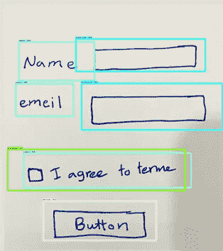
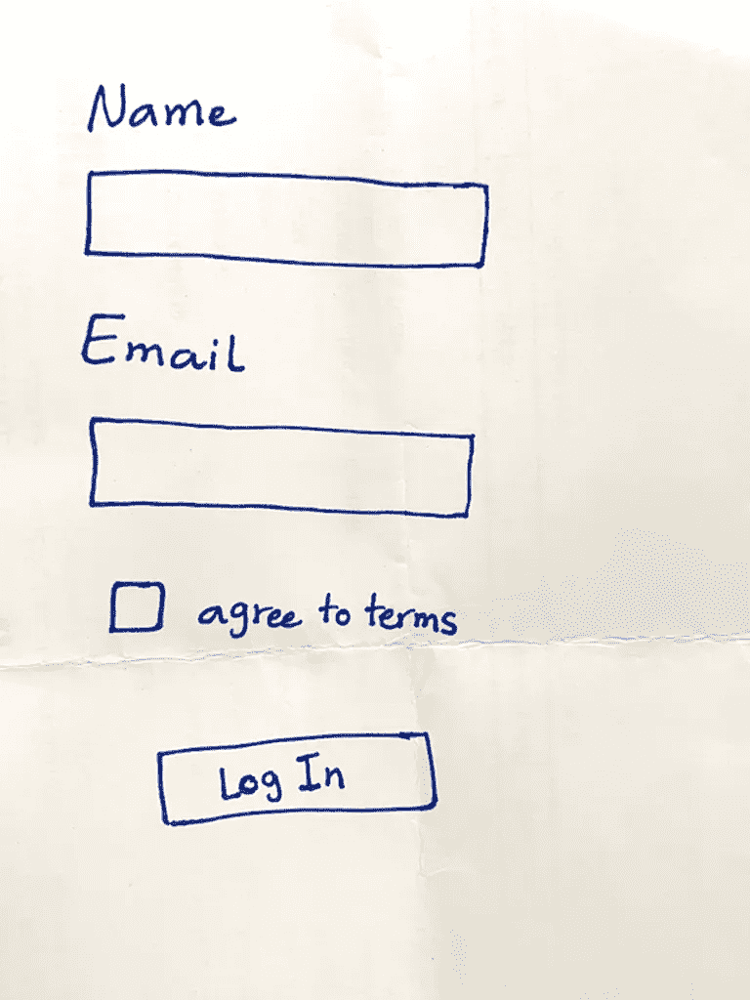
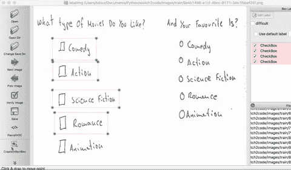
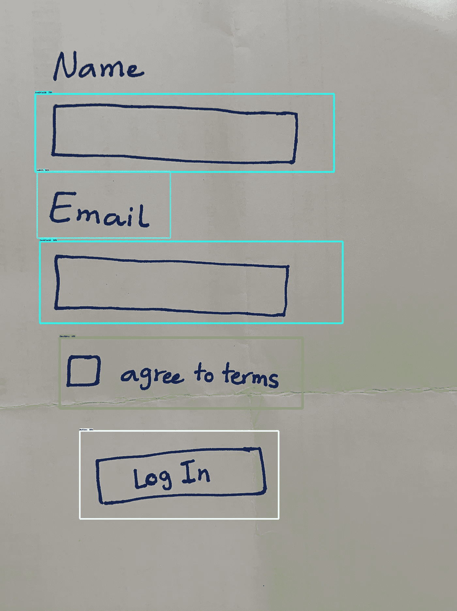
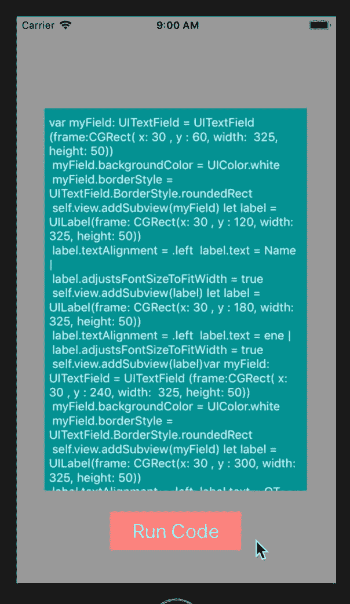
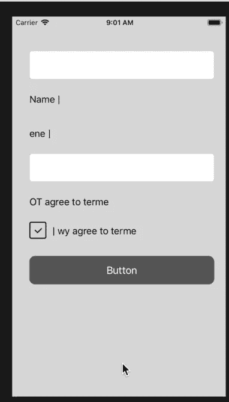

# 如何搭建一个针对草图的物体检测 app？

> 原文：<https://medium.datadriveninvestor.com/how-to-build-an-object-detection-app-for-sketches-7671ffde4989?source=collection_archive---------2----------------------->



几周前，我读到了微软的新工具(sketch2code ),它可以将草图转换成 HTML 代码。所以我决定挑战自己，做同样的转换，但对斯威夫特来说。不到 20 天后，该应用程序已经准备好进行测试，结果很好。

How app work from image selection to conversion to code

## 要制作这样的移动应用程序，我们需要遵循以下步骤:

1-收集数据集

2-图像分割和数据标记

三目标检测模型

4- OCR

5-部署模型

6-创建转换算法

这些过程是构建您想要的任何对象检测器应用程序的基础，您可以只替换数据集。在本教程的最后，你会找到完整的代码和重要的资源。

# 1-数据收集

我们建立任何深度学习模型首先需要的是数据集。所以我做了一些快速搜索准备使用数据集，但我没有找到一个。于是 10 点左右开始画一些草图，从 google images 下载其他草图。



Sample of Dataset

现在，我们需要调整图像的大小，以降低分辨率，使训练模型更快，我发现这个 python 代码是由 Tanner Gilber 编写的。

```
from PIL import Image 
import os import argparse def rescale_images(directory, size):
     for img in os.listdir(directory):         
         im = Image.open(directory+img)
         im_resized = im.resize(size, Image.ANTIALIAS) 
         im_resized.save(directory+img)if __name__ == '__main__':
     parser = argparse.ArgumentParser(description="Rescale images")
     parser.add_argument('-d', '--directory', type=str,
     required=True, help='Directory containing the images')
     parser.add_argument('-s', '--size', type=int, nargs=2,
     required=True, metavar=('width', 'height'), help='Image size')
     args = parser.parse_args()
     rescale_images(args.directory, args.size)
```

在图片的父目录中保存这个脚本为 *reseize_images.py* ，然后在同一个文件夹中打开一个终端，输入以下命令:

```
> python reseize_images.py -d images/ -s 400 600
```

在开始标记之前，我们需要随机拆分文件夹中的图片。一个用于训练，需要 80%的图像，另外 20%的图像用于测试文件夹。如果你有一个小的数据集，你可以手动分割图像，否则，你需要使用像 [split-folders 0.3.1](https://pypi.org/project/split-folders/) 这样的库。

# 2-图像分割和标记

对于标注，我们将使用 [LabelImg](https://github.com/tzutalin/labelImg) ，它是一个图形图像注释工具，通过在图像中的对象周围绘制边界框。我们需要从 GitHub 下载它，并按照安装说明进行操作。

[](https://www.datadriveninvestor.com/2019/01/23/deep-learning-explained-in-7-steps/) [## 深度学习用 7 个步骤解释-更新|数据驱动的投资者

### 在深度学习的帮助下，自动驾驶汽车、Alexa、医学成像-小工具正在我们周围变得超级智能…

www.datadriveninvestor.com](https://www.datadriveninvestor.com/2019/01/23/deep-learning-explained-in-7-steps/) 

在 LabelImg 界面出现后，您可以使用“打开目录”按钮打开培训目录，并通过“创建矩形框”按钮绘制边界框，并写入标签名称，然后单击保存。需要对训练和测试目录中的所有映像重复这个过程。



LabelImg interface

接下来，我们需要生成一个 TFRecord，这是一个将数据存储为二进制记录序列的文件。这可以帮助我们减少存储空间和培训时间。为了创建 TFRecords，我们需要在将数据写入文件之前指定数据的结构。所以我们会从 [Dat Tran 的浣熊探测器](https://github.com/datitran/raccoon_dataset) ( *xml_to_csv.py* 和 *generate_tfrecord.py* )下载两个脚本。如果您打开培训目录，您可以看到每个图像都有一个相应的 xml 文件，现在将通过对 main 函数进行一些更改，使用 *xml_to_csv.py 将这些 xml 文件转换为 csv。*

```
def main():
     for folder in ['train', 'test']:
         image_path = os.path.join(os.getcwd(), ('images/' +
         folder))
         xml_df = xml_to_csv(image_path)
         xml_df.to_csv(('images/'+folder+'_labels.csv'), index=None)
     print('Successfully converted xml to csv.')
```

在终端窗口中，在项目文件夹中键入以下命令:

```
> python xml_to_csv.py
```

稍后，我们要进行转换，我们将打开 *generate_tfrecord.py，更新 class_text_to_int 函数中的标签名称:*

```
 def class_text_to_int(row_label):
 if row_label == ‘CheckBox’:
 return 1
 elif row_label == ‘TextField’:
 return 2
 elif row_label == ‘Label’:
 return 3
 elif row_label == ‘Button’:
 return 4
 elif row_label == ‘TextView’:
 return 5
 elif row_label == ‘ImageView’:
 return 6
 else:
 return None
```

现在，可以通过键入以下命令来生成 TFRecords:

```
> python generate_tfrecord.py — csv_input=images/train_labels.csv — image_dir=images/train — output_path=train.record > python generate_tfrecord.py — csv_input=images/test_labels.csv — image_dir=images/test — output_path=test.record
```

最后，我们将创建一个标签映射，保存每个标签的 ID。id 应该与 *generate_tfrecord.py 中的一个数字相匹配。S* 另存为 *labelmap.pbtxt*

```
item {
 id: 1
 name: ‘CheckBox’
 }
 item {
 id: 2
 name: ‘TextField’
 }
 item {
 id: 3
 name: ‘Label’
 }
 item {
 id: 4
 name: ‘Button’
 }
 item {
 id: 5
 name: ‘TextView’
 }
 item {
 id: 6
 name: ‘ImageView’
 }
```

# 三目标检测模型

我们需要一个模型来训练我们的分类器。基于掩蔽区域的卷积神经网络或掩蔽 R-CNN 模型是用于对象识别任务的最先进方法之一。例如，更快的 R-CNN 生成提议(区域),其假设是这些区域很可能包含对象，然后通过对每个区域包含的类别进行分类来进行额外的步骤。此外，Tensorflow 的对象检测 API 是一个强大的工具，使每个人都能创建自己的强大图像分类器。

在终端中键入以下命令:

```
> git clone [https://github.com/tensorflow/models](https://github.com/tensorflow/models)
```

接下来，我们将把之前创建的 *train.record* 和 *test.record* 移动到*model/research/object _ detection*中，然后创建一个名为 *training* 的新目录，并将 *labelmap.pbtxt 放入其中。* Tensorflow 的物体检测 API 自带了很多预训练的模型，我们会下载[faster _ rcnn _ inception _ v2 _ coco](http://download.tensorflow.org/models/object_detection/faster_rcnn_inception_v2_coco_2018_01_28.tar.gz)你提取物体检测文件夹中的文件夹。然后我们需要配置文件，因为我们在这个项目中使用了一个 *faster_rcnn_inception* 模型，从 object _ detection \ samples \ configs 中复制*faster _ rcnn _ inception _ v2 _ pets . config*文件并粘贴到之前创建的培训目录中。然后，我将使用文本编辑器打开它，以便更改配置中的几行内容。

第 9 行:将类的数量更改为您想要检测的对象的数量

```
num_classes: 6
```

第 106 行:将*微调检查点*改为 *model.ckpt* 文件的路径:

```
fine_tune_checkpoint:"/Users/bdour/Documents/Python/Sketch2Swift/models/research/object_detection/faster_rcnn_inception_v2_coco_2018_01_28/model.ckpt"
```

第 123 行:将*输入 _ 路径*改为 *train.records* 文件的路径:

```
input_path: "/Users/bdour/Documents/Python/Sketch2Swift/models/research/object_detection/train.record"
```

第 135 行:将*输入路径*改为*测试记录*文件的路径:

```
input_path: "/Users/bdour/Documents/Python/Sketch2Swift/models/research/object_detection/test.record"
```

第 125 行和第 137 行:将 *label_map_path* 改为标签地图的路径:

```
label_map_path:  "/Users/bdour/Documents/Python/Sketch2Swift/models/research/object_detection/training/labelmap.pbtxt"
```

第 130 行:将 num_examples 参数设置为测试目录中图像的数量。

```
num_examples: 7
```

## 让我们训练我们的模型，

您可以在 object_detection/legacy/位置找到一个名为 *train.py* 的文件。复制并粘贴到 object_detection 目录中。

运行以下命令开始训练。

```
> python model_main.py --logtostderr --model_dir=training/ --pipeline_config_path=training/faster_rcnn_inception_v2_pets.config
```

Tensorflow 每 5 分钟创建一个检查点并存储。所有检查点都保存在培训目录中。培训过程可能需要大约 4 个小时。如果我们迷路小于或等于 0.1，我们可以终止训练。

在进入下一步之前，我们需要保存我们训练好的模型。我们将使用模型配置和经过训练的检查点，通过将变量和图形的所有值保存在我们称为冻结图的单个文件中，来准备用于推断的对象检测张量流图。冻结图意味着将模型的结构与其权重(检查点)结合起来。我们需要导航到培训目录，并寻找具有最大索引的 *model.ckpt* 文件。然后，我们可以通过在命令行中键入以下命令来创建推理图。

```
> python export_inference_graph.py 
--input_type image_tensor 
--pipeline_config_path training/faster_rcnn_inception_v2_pets.config --trained_checkpoint_prefix training/model.ckpt-XXXX 
--output_directory inference_graph
```

XXXX 应该由最高的检查点编号填充。

就这样，如果我们转到\ object _ detection \ inference _ graph 文件夹，我们会看到我们的对象检测分类器:*frozen _ inference _ graph . Pb*文件。

## 测试时间到了，

在 object_detection 文件夹中打开新的 Jupiter 笔记本，复制并粘贴一些代码来下载我们的模型，并从[这里](https://github.com/TannerGilbert/Tutorials/blob/master/Tensorflow%20Object%20Detection/object_detection_with_own_model.ipynb)中绘制检测结果框。结果应该是这样的:



# 3- **光学字符识别** ( **OCR**

要检测按钮或标签内的文本，我们需要使用 Tesseract 对图像应用(OCR)。首先，我们需要安装库:

```
$ pip install pytesseract
```

然后，在*visualize _ boxes _ and _ labels _ on _ image _ array*函数中添加下一行，这样我们就可以从图像中获取文本:

```
text = pytesseract.image_to_string(Image.open(filename))
```

# 4-部署模型

在移动应用中部署深度学习模型有很多好的方法，我在这里列举了:

[](https://medium.com/@BdourEbrahim/how-to-integrate-machine-learning-models-into-your-app-b77717e2702) [## 如何将机器学习模型集成到你的 app 中？

### 。近来，对…的需求

medium.com](https://medium.com/@BdourEbrahim/how-to-integrate-machine-learning-models-into-your-app-b77717e2702) 

但在这里，我们将使用一种快速简单的方法，通过使用 Flask API 将训练好的模型投入生产，在移动应用程序中测试我们的模型。在 object_detection 文件夹中，创建 2 个脚本来建立连接。第一个， *app.py :*

```
import flask
from flask import Flask, jsonify, request
import json
import videoAndImageDetection
app = Flask(__name__)
[@app](http://twitter.com/app).route(‘/predict’, methods=[‘POST’])
def predict():response = “failure”request_json = request.get_json(force=True)image_data = request_json[‘input’]

responseList = videoAndImageDetection.getjson(image_data)if responseList :
 response = json.dumps({‘response’: responseList[0],’response2': responseList[1]})

 return response, 200if __name__ == ‘__main__’:
 application.run(debug=True)
```

第二个，wsgi.py:

```
from app import app as application
if __name__ == “__main__”:
 application.run()
```

要通过在命令行中键入来启动连接:

```
> gunicorn — bind 0.0.0.0:8080 wsgi:application -w 1
```

# 5-创建转换算法

在 Xcode 中，我们创建了一个算法来获取所有坐标及其位置、大小和文本的字典。然后，我们可以使用这些信息轻松地以编程方式创建任何 UIKit 元素。



# 就这些，谢谢你的阅读。

**资源:**[YouTube 上的吉尔伯特·坦纳](https://www.youtube.com/channel/UCBOKpYBjPe2kD8FSvGRhJwA)频道。