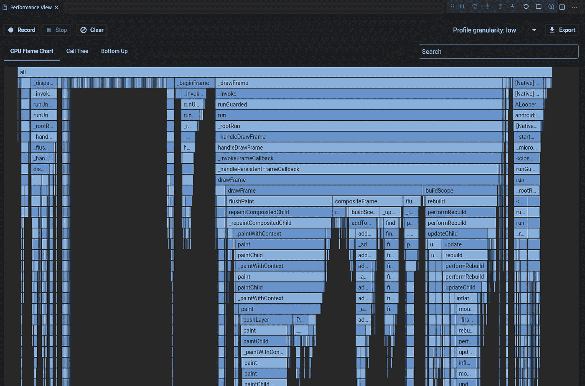
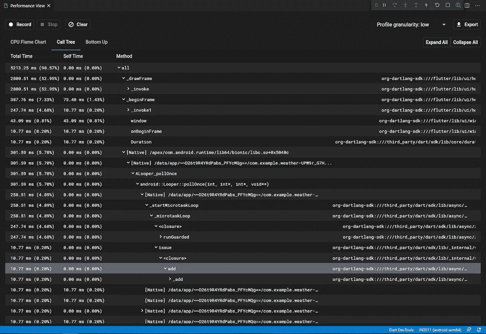
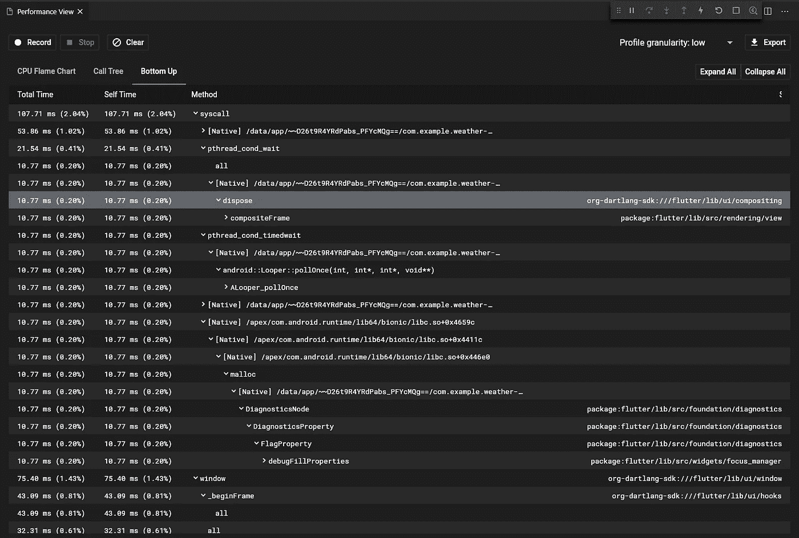
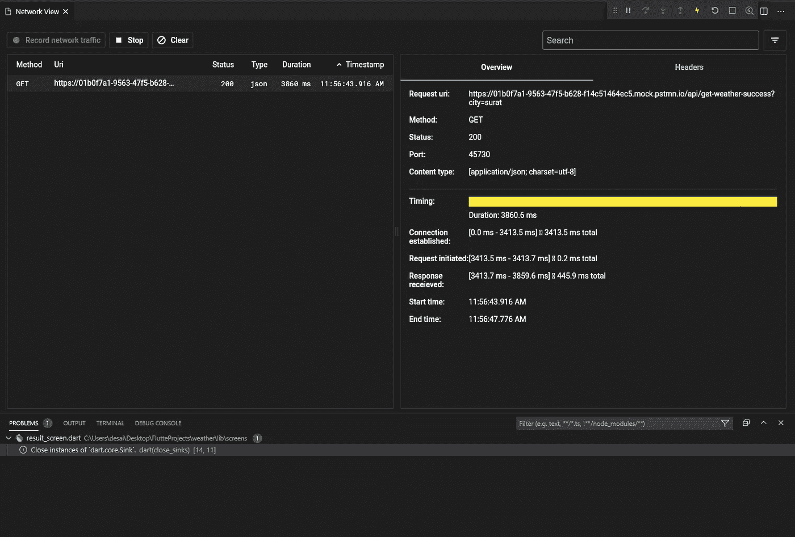
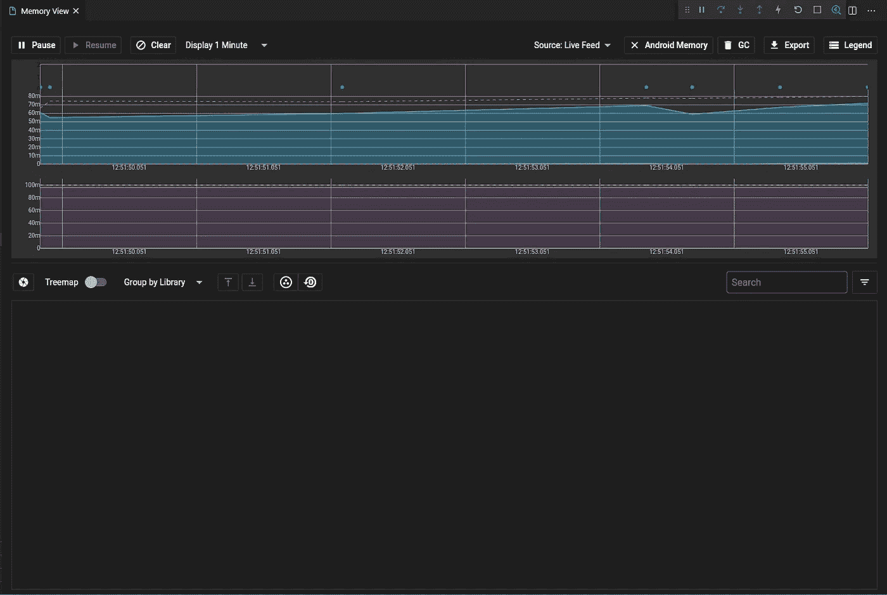
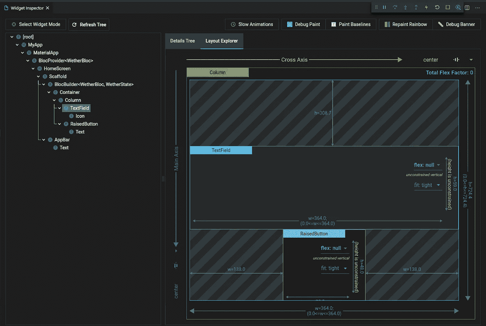

# 如何打造一款优秀的移动 App【Flutter Dev Tools】

> 原文：<https://medium.datadriveninvestor.com/how-to-build-an-outstanding-mobile-app-flutter-dev-tools-32186ca36685?source=collection_archive---------18----------------------->

如何使用这套测试版的性能和调试工具，让您的应用从运行到“惊艳”

现在，flutter 因其性能和速度呈指数级增长而广受欢迎，每天都有成千上万的开发人员在开发应用程序。你可以只是他们中的一员，也可以脱颖而出。开发人员怎样做才能使他/她开发的应用程序脱颖而出？好吧，这就是你的答案——“颤振开发工具”。

所以现在你可能会问这到底是什么开发工具？开发工具是不同功能的集合，将帮助我们检查我们的应用程序如何为不同的标准工作。现在，它处于测试阶段，但好的一面是它处于非常活跃的状态。所以希望我们能尽快有一个稳定的版本。正如我之前提到的，Flutter Dev Tools 不仅仅是一个工具，而是一套工具，包括:

*   时间轴视图
*   内存视图
*   性能视图
*   网络视图
*   调试器

这些工具都有自己的用途，并且以非常不同的方式运行。如果使用正确，每个工具将向我们展示我们的应用在每个标准中的表现。例如，如果我们的应用程序使用了太多的内存，memory-view 会向我们发出警告，这样我们就可以改善这种情况，并正确管理我们的应用程序空间。

最后，所有工具都会以自己的方式让我们的应用程序变得更好。因此，在一天结束时，我们拥有的应用程序将比使用开发工具之前好得多。

解释够了，让我们更深入地看看一些工具，这样会更容易理解。但是要在我们的应用程序中使用它们，我们首先必须知道如何安装它们，对吗？

嗯，这个过程在所有的 IDEs 中都是不同的。我们将看到两个广泛使用的 ide，即 Visual Studio code 和 Android studio。

## 安卓工作室

去安卓工作室，打开市场。搜索 Flutter 插件的市场。一旦我们找到它，只需下载和安装。但是要使用 flutter 开发工具，我们需要一个在连接设备上运行的应用程序。因为它现在处于测试状态，我们现在不能在模拟器上使用它。我们希望它将很快问世。

因此，请确保我们连接了设备，并且应用程序处于运行或调试状态，以便使用不同的工具。一旦应用程序处于其中一种状态，进入运行->打开 DevTools，或者只有 android studio 在 Flutter inspector-view 上有一个快捷方式。只需点击更多操作，我们就会在那里找到开发工具。

## VISUAL STUDIO 代码

在 visual studio 代码中使用开发工具更容易，我们需要做的就是安装 dart 插件。但我希望它已经被涵盖，因为我们即将测试应用程序。我们应该已经安装了 flutter 扩展，但是如果没有，让我们看看如何安装它。

现在困难的部分已经完成，我们要做的就是运行应用程序。现在打开 visual studio 命令面板(Ctrl + Shift + P)。键入“Dart:打开 DevTools”。这将在你的状态栏显示 Dart DevTools。现在我们可以走了。

## 命令提示符

如果没有一个是为我们工作的，我们能做的就是在你的命令提示符的帮助下安装它。这个过程相当漫长，也可能有点令人困惑。Flutter docs 详细介绍了该程序，可在此处找到:

[https://flutter.dev/docs/development/tools/devtools/cli](https://flutter.dev/docs/development/tools/devtools/cli)

现在安装部分已经完成，我们可以开始使用工具了。让我们深入了解一下目前可用的一些工具。我们要介绍的第一个工具是性能视图，这是最常用的工具之一。

# 性能视图

您想记录您的应用程序在 CPU 上的执行情况吗？您是否希望在特定时间记录应用程序的会话，然后对其进行分析？这是我们都需要的工具。

我们将要使用的工具叫做 CPU profiler。CPU profiler 所做的是，一旦您按下“开始记录”按钮，它将开始记录不同的数据，并将它们存储在虚拟内存中。一旦您按下“停止”按钮，它将获取所有数据，并以不同的形式显示出来，您可以在 profiler 视图中看到这些数据。有三种不同类型的图表可以显示不同的数据。

# 1.火焰图

火焰图被认为是从上到下的图表。其中每个条目称为一个堆栈。这意味着最顶层的栈是其下所有栈的父栈。换句话说，顶层堆栈调用它下面的堆栈。现在这包括了图表的垂直部分。它横向是什么意思？因此，每个堆栈的宽度就是它在 CPU 上花费的时间。宽度越高，它在 CPU 上花费的时间就越高。

现在，一旦我们记录了一段时间，我们可以做的就是找出哪个堆栈花费的时间比它应该花费的时间多，并尝试以某种方式修改它，减少它在 CPU 上花费的时间。这将极大地提高你的表现。

这是在设备中运行的小应用程序的屏幕截图。我们还可以通过点击右上角的 Export 按钮为这个图表下载一个 JSON 文件。这将下载一个 JSON 文件，您可以与您的同事共享。这只是一个概览，您可以放大图表中的任何部分，以便更清楚地看到它们。

# 2.调用树

对于这一个，名称是不言自明的。它向你展示了方法调用的层次结构。我们可以展开任何一个方法来查看它或者它的子方法所做的调用。简而言之，这是一个自顶向下的剖析，与火焰图相同，但采用文本表示。

正如您在示例中看到的，每种方法都有三个类别。

1.  总时间显示此方法及其子方法所花费的总时间。
2.  Self-Time 仅显示该方法在 CPU 上花费的时间。这还不包括儿童花费的时间
3.  方法的名称。我们可以单击方法名称旁边的小展开图标来查看其子方法。

# 3.颠倒

在某种程度上，自底向上和调用树是一样的，只是方向相反。这意味着上面的方法是 CPU 中的最后一个方法。同样，在数据结构语言中，上面的方法是叶节点，下面的方法是它的专利。否则，显示的类别与调用树相同。下面是同一个应用程序的屏幕截图。

因此，这基本上总结了性能视图中的所有内容。但是这个屏幕中剩下的一部分是粒度。有一个选择粒度的选项。粒度的意思是记录样本的速度有多快。如果粒度设置为“高性能”,视图将快速连续采样，如果设置为“低”,将等待一段时间后再采样。

这就是你测量 CPU 性能的方法，读完之后，我们可以做一些快速的改变。让我们跳到下一个工具，即网络视图。

# 网络视图

在物联网时代，大多数应用都使用互联网。因此，我们将要开发的应用程序也很有可能使用互联网。

现在，我们不希望我们的应用程序在每次页面改变时发出太多请求或下载大量数据。这将使我们的应用程序感觉不那么灵敏，并且在应用程序和我们的用户之间会有一些延迟。

因此，我们应该限制网络请求的使用，并跟踪它们。对于所有这些需求，dev-tools 提供了一个工具，那就是网络工具。

网络工具允许你监控所有的 HTTP 和 HTTPs 请求的应用程序。不只是请求，但如果你想检查有关套接字使用网络工具的信息是你要去的家伙。

这个屏幕截图显示了一个简单的 GET 请求。在 details 中，您可以找到获得响应所用的时间、请求类型、状态、端口号、连接类型和许多更有用的详细信息。

# 内存视图

内存视图的主要目的是检查堆内部的内存分配情况。最常见的问题之一是内存泄漏。如果我们想找出应用程序中的内存泄漏，这是最好的工具。

内存工具有如此多的选项可供探索，这超出了本文的范围。不像我们之前见过的其他工具，我们不需要开始记录记忆。一旦我们进入内存视图页面，它将自动开始记录。可以从控制面板暂停它。

顶部的蓝色图表显示了您的应用在选定时间段内使用的内存。这个时间可以是 1 分钟，5 分钟，10 分钟，可以从上面选择。我们可以单击“legend”来查看关于该特定点内存的更多信息。

X 轴上的数据显示了获取堆记录的时间。而 Y 轴表示应用程序在特定时间段使用的堆或内存的大小。

如果您在 android 设备上运行，内存视图将从 Android 调试桥收集数据，这些数据在屏幕截图中以紫色图形显示。

# 颤动检查员

在你期望的窗口部件树和你在屏幕上看到的窗口部件树之间感到困惑？你的救世主来了。颤振检查员是一个帮助工具，而不是像我们之前看到的所有性能测量工具。

Flutter inspector 将向我们展示我们确切的部件树。这将有助于我们了解当前的树，并找出可能导致您的用户界面看起来不同或与您的期望不同的问题。

在这里，我们可以看到我们的窗口小部件树完美的层次结构。更容易发现哪个小部件位置不正确或者导致了一些问题。一旦我们确定哪个小部件是问题的一部分，我们只需单击右侧小部件的名称，工具将自动带您到定义。

# 颤振布局浏览器

对你到目前为止看到的所有工具印象深刻？我把最好的留到了最后，那就是 Flutter 布局浏览器。它目前正在开发中，正因为如此，它只支持行，列和 Flex 小部件，但仍然是非常强大和有用的工具。

我确信作为 flutter 开发者，你已经面临了像素溢出错误的问题。大多数时候这很简单，但有时也很棘手。Well flutter explorer 可以让你看到你的小部件是如何实时呈现的。我们可以调整部件的大小，位置，对齐，伸缩等。这样你就可以根据你的需要来调整你的小部件，以及我们在 flutter inspector 中看到的所有功能。

仅仅借助静态图像来解释这个工具有点困难。试一试吧，它非常容易理解，也是非常强大的工具。

在成千上万的开发人员中，给自己一个优势。使用所有这些强大的工具来突出和大大提高您的应用程序的质量。

参考资料:

1.  [https://flutter . dev/docs/development/tools/dev tools/overview](https://flutter.dev/docs/development/tools/devtools/overview)
2.  [https://flutter . dev/docs/development/tools/devtools/Android-studio](https://flutter.dev/docs/development/tools/devtools/android-studio)
3.  [https://flutter . dev/docs/development/tools/dev tools/inspector](https://flutter.dev/docs/development/tools/devtools/inspector)
4.  [https://flutter . dev/docs/development/tools/dev tools/timeline](https://flutter.dev/docs/development/tools/devtools/timeline)
5.  [https://flutter.dev/docs/development/tools/devtools/memory](https://flutter.dev/docs/development/tools/devtools/memory)
6.  [https://flutter . dev/docs/development/tools/dev tools/performance](https://flutter.dev/docs/development/tools/devtools/performance)
7.  [https://flutter.dev/docs/development/tools/devtools/network](https://flutter.dev/docs/development/tools/devtools/network)

**访问专家视图—** [**订阅 DDI 英特尔**](https://datadriveninvestor.com/ddi-intel)