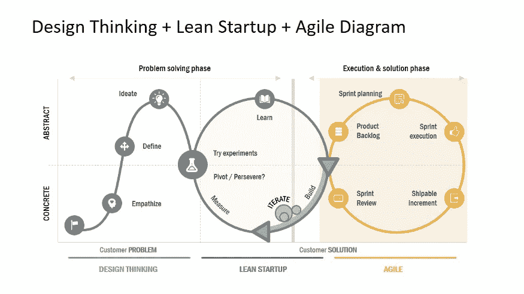
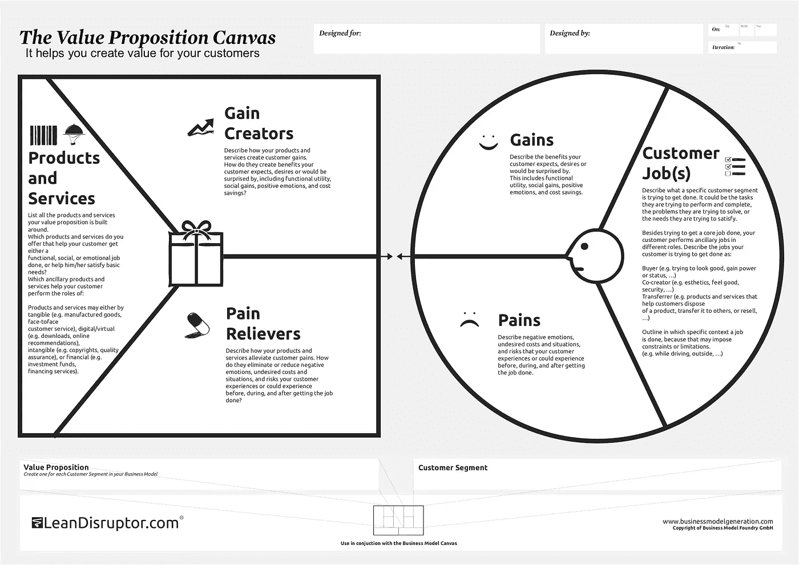
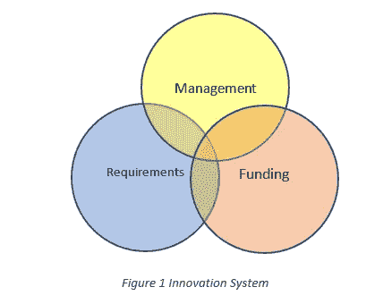
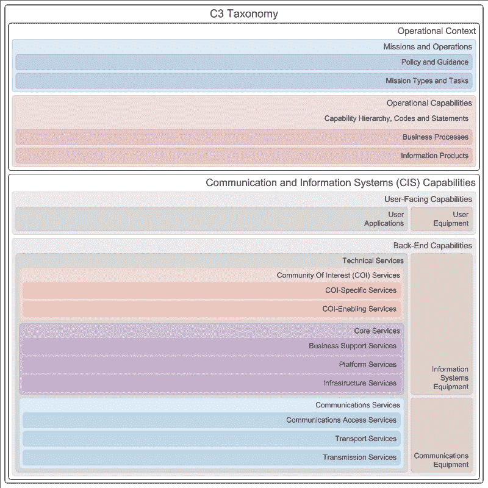

# 如何构建和加速数字化转型和创新

> 原文：<https://medium.datadriveninvestor.com/how-to-build-and-accelerate-digital-transformation-and-innovation-8b46cbc29877?source=collection_archive---------5----------------------->

微软的首席执行官塞特亚·纳德拉重复了这句话:“所有的公司都是软件公司”。“每个公司都是软件公司。你必须开始像一家数字公司一样思考和运营。这不再仅仅是购买和部署一个解决方案。这不仅仅是一个简单的软件解决方案。这真的是你自己在思考自己作为一家数字公司的未来。”

为了保持竞争力，组织应该转向“快速渐进主义”——逐步改变现有的结构，充分利用现有的结构。

要利用数字化转型机遇，组织需要深入了解快速增长的数字化转型市场的机遇和规模、其最终客户的数字化成熟度以及取得成功的业务属性。因此，他们将根据数字化转型市场机遇调整业务战略。

# 什么是数字化转型？

***数字化转型*** 是将数字技术整合到业务的各个领域，从根本上改变组织的运营方式和向客户交付价值的方式。这也是一种文化变革，要求组织不断挑战现状，进行实验，并接受失败。

创新是一个新的想法，创造性的思想，和新的想象力，作为应用更好的解决方案，以满足新的要求，明确的需求，或现有的需求。

Design Thinking Lean and Agile

创新中最流行的方法之一是设计思维，这是一种更好地理解需求、挑战假设、重新构建问题并提出解决方案的方法。它通常与精益画布一起使用，以开发提议的服务/产品，并使用敏捷方法来交付提议的服务/产品。我想强调的是，精益画布就是在企业内部开发特定的服务/产品。业务模型画布用于总体业务，以找到适合组织的运营模型。

Value Proposition Canvas

价值主张画布是一种工具，可以帮助确保产品或服务围绕客户的价值和需求进行定位。然后你可以用设计思维来开发新的概念进行实验。在使用 lean canvas for 后，通过应用企业架构和敏捷方法来转变产品或服务，以提供结合新兴技术(云、区块链、人工智能等)的拟议服务/产品。)与人。最后，新商业模式的商业模式画布。

# 构建和加速数字化转型和创新的秘诀？

定义清晰的愿景和战略是制定强有力的路线图以帮助组织前进的关键。行动是根据数字化转型调整业务战略。

创造一个统一而有弹性的文化，邀请多元化，让变革被积极地接受。行动是应用智能简单性并赋予员工权力。

放大组织的独特潜力，将你目前拥有的转化为你能成为的。行动是吸引客户和优化运营。

不断发展组织的能力使你能够提高生产力和效率。行动是改造产品和优化运营

# 数字化转型和创新支柱

**吸引客户** : *调整客户参与战略，在数字化之旅中取得成功* *为客户提供他们喜欢的新体验*了解组织如何在整个转型生命周期中吸引客户，并通过数据驱动的洞察力在业务中整合以客户为中心的理念。调整客户参与战略，帮助客户在数字化之旅中取得成功。您可以通过利用数据和得出可操作的见解来定制个人客户体验。要脱颖而出，你必须将顾客理解为个体，并找到与他们互动的新方式。

**赋予员工权力** [**和智能简约**](https://www.bcg.com/en-tr/capabilities/smart-simplicity/six-simple-rules-overcoming-complexity) **:** *让技能组合和文化与数字革命保持一致* 帮助员工创造智能、灵活和安全的工作环境，并为人们在任何地点、任何设备上进行协作创造机会，从而实现更多目标。通过识别和解决不必要的复杂性来简化组织，并交付持久的、可衡量的变化。Smart Simplicity 的六个简单规则本身并不是解决方案，而是一套基于经济学、博弈论和组织社会学的策略。这些规则使组织能够促进新的行为并提高绩效。前三条规则为个人自主和赋权以提高绩效创造了条件。

了解人们在做什么:找出你的组织中到底发生了什么，了解塑造行为的背景。了解你的员工如何合作、寻找资源、解决问题或失败。

**2)** **强化整合者:**通过寻找紧张点来识别整合者——那些对他人的工作有影响的个人或单位——在那里人们正在努力合作。集成商将其他人聚集在一起，推动流程。他们在约束和需求经常相遇的地方工作。给予整合者权力和兴趣来促进合作以应对复杂性。去除没有附加值的管理层。

**3)** **增加权力总量:**在组织中创建新角色时，授权他们做出决策，而不从他人手中夺走权力。同时提供一些工具比依次提供许多工具更有效。定期充实权力基础，以确保敏捷性、灵活性和适应能力。权力决定了推动合作的能力——这对于解决业务复杂性至关重要。

**4)** **增加互惠:**设定明确的目标，激发双方合作的兴趣。让每个人的成功依赖于其他人的成功。消除垄断，减少资源，创造新的互动网络。

**5)** **延伸未来的阴影**:让人们体验他们的行为和决定所带来的后果。收紧反馈回路。缩短项目持续时间。让人们看到他们的成功是如何通过帮助他人的成功而获得的。

**6)** **奖励那些合作的人**:当他们以有益的方式合作时，增加所有人的回报。对那些不合作的人进行处罚。绩效评估和奖励系统是关键——但是与其用它们来惩罚失败，不如用它们来惩罚帮助或请求帮助的失败。聪明的组织承认问题发生的原因有很多，解决问题的唯一方法是减少那些对解决方案没有贡献的人的回报

**优化运营** : *实现产品组合现代化，转变流程和技能。自动化业务流程以参与竞争。*
通过智能流程加快业务响应速度，提高服务水平，降低成本。通过更有效地协调人员和资产，您可以实时响应问题，甚至抢先解决问题。

**转型产品** : *创新产品、服务和商业模式。*
拥抱知识产权的广度和价值。了解如何开发和利用产品并拥有知识产权(IP)，利用数据进入新市场，修改业务模式以优先考虑敏捷性，以及在联合数字化之旅中让客户成为新的业务合作伙伴。了解自有知识产权的广度和价值，以及您的战略应该与何处保持一致。将数据作为一种战略资产，从后见之明转变为远见卓识，您将能够区分并捕捉新出现的机会。将软件和技术直接嵌入产品和服务的机会正在改变组织交付价值的方式。

创新来自于它的资金和管理。因此，组织需要强大的创新系统来处理其在技术、计划、产品和客户支持方面的投资，这是实现其目标和为其客户创造价值所必需的。该系统的主要目标是创造满足特定需求的产品和服务，并以公平合理的价格为组织能力提供可测量的改进。下面是创新体系。

Figure 1 Innovation System

**资金流程(计划、方案、预算和执行)**:财务管理(FM)是对组织的货币资源进行规划、指导、监控、组织和控制。*资助流程侧重于当前和未来项目的财务管理和资源分配*。融资过程有 4 个阶段；

1.**规划:** *规划阶段是根据战略指导确定未来需要哪些能力的过程*。
规划阶段是定义和检查备选策略，分析变化的条件和趋势(威胁、技术等)。)和经济评估。理解当前和未来选择的含义(短期、中期和长期)。

2.**规划:** *规划阶段是按照一定的优先级，在各个项目之间平衡和整合资源的过程。*
规划阶段定义并分析备选结构、系统和支持系统及其多年资源影响，以及各种权衡选项的评估。

3.**预算编制:** *预算编制阶段是说服投资者和高管提供必要资源，然后平衡支票簿以确保资源得到相应使用的过程。预算阶段包括预算的制定、论证、执行和控制。主要目的是审查项目预算的头一年或两年，以确保资源的有效利用。*

4.**执行** : *执行阶段是融资流程的实际应用。* 执行评审与计划和预算评审同时进行。执行审查向高层领导提供关于当前和先前资源分配有效性的反馈。随着时间的推移，正在开发度量标准来支持执行审查，该审查将衡量项目的实际产出与计划绩效。执行审查可能导致调整资源和/或重组程序的建议，以实现期望的性能目标。

**管理过程:**管理过程侧重于领导、设定目标、计划、组织、协调、激励、控制和沟通。管理过程为所有计划提供治理政策，原则和形式管理基础。风险管理流程为每个里程碑审查和决策点确定具体的法定和监管报告以及其他信息。该过程具有以下步骤:

1.**规划**，它确定目标，评估不同的备选方案并选择最好的。它正在决定未来的目标和实现这些目标的行动方针。

2.**组织**，明确集团的职能，建立关系，明确权责。识别实现企业目标和实施计划所需的活动；将活动分组到工作中；将这些工作和活动分配给部门和个人；履行职责和权力的委托，以及活动的纵向和横向协调的规定。

3.**人员配备**，招聘、安置、选择、培训和发展人员技能，以配备工作人员。

4.**指导**，就是给员工指明方向，带领员工高效工作，为组织目标的实现做出最佳贡献。以热情(巨大的动机和热情)激励员工为实现共同目标而工作和合作。

5.**协调**，在组织的各个部分之间建立这样的关系，使它们一起朝着组织目标的方向前进。因此，它是将所有组织决策、运作、活动和努力联系在一起的过程，以便为实现组织目标而实现行动的统一。

6.**控制**，确保分部、部门、部门和个人的绩效符合预定的目标和目的。必须识别和调查与目标和计划的偏差，并采取纠正措施。

7.**沟通**，在正确的时间把正确的事情通知给正确的人。

**需求流程:**提供既定的方法来识别、评估、验证和优先处理能力需求、理论范围内的差距和冗余、组织、培训、材料、领导、教育、人员、设施和互操作性、政策。(DOTMLPF-IP)通过:

**基于能力的规划**(定义能力、评估需求、提出解决方案)

**运营概念** (CONOPS)、分析、实验、紧急需求和任务)和集成架构(企业架构)在实验、基础、迁移、现代化和优化阶段的应用。检查解决当前或新出现的问题所需的当前、新的或建议的功能。从不同涉众的角度描述如何使用一个系统。这在项目开始时常常含糊不清的能力和取得成功所需的具体技术需求之间架起了一座桥梁。

**整合、协作的评审流程**

**利用行业标准、最佳实践和所有利益相关方的专业知识。**

其结果是初始能力、能力发展、能力部署和操作支持。从而定义了组织标准和规范。

**DOTMLPF-IP** 频谱是为了避免“锤到每个解决方案看起来都像钉子”的方法:

**教义:**事情的既定原则。组织创造价值的方式

**组织**:组织如何组织自己创造价值

**训练:**如何组织战术上的准备；基础训练到高级单兵训练，各种类型的单元训练，联合演习等。

物资:装备军队，使他们能够有效运作的所有必需的东西。

领导和教育:组织如何培养他们的领导者去领导。从高层领导到管理者；职业发展。

人员:和平时期和各种应急行动中合格人员的可用性

**设施**:不动产；支持部队的设施和工业设备。

互操作性:与整个联盟中的部队进行互操作的能力

**政策**:任何可能妨碍在其他 DOTMLPF-IP 领域有效实施变更的机构间或国际政策问题

让我们来看一个模型，它代表了功能的所有生命周期活动中涉及的概念及其关系。创新 C3 分类法支持一种通用语言和工具来同步这些活动，并通过在数字化转型工作中表达的雄心水平，将战略概念和指导改进为通信和信息技术架构和设计结构。这是一个通用的框架，有助于互连性和互操作性的一个关键组成部分:利用技术来帮助实现互操作性。下面的分类法描述了组织的高级操作环境，将愿景、任务和操作能力与技术能力联系起来。

C3 Taxonomy