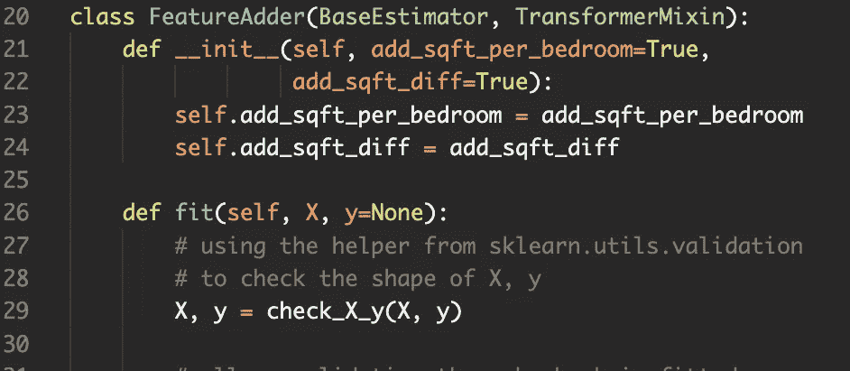
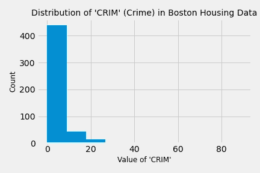
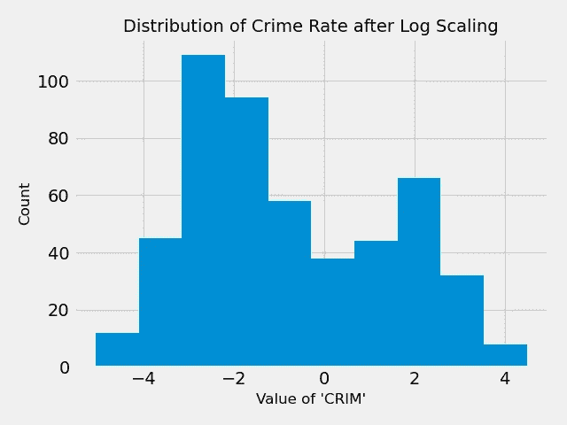

# 如何在 Scikit 中构建自定义变压器-学习

> 原文：<https://medium.datadriveninvestor.com/how-to-build-custom-transformers-in-scikit-learn-edd65951b2e8?source=collection_archive---------10----------------------->

## 使用您自己的管道兼容预处理工具扩展内置功能

我们都知道预处理在机器学习项目中的重要性。处理一些缺失值、缩放各种特性、一次性编码其他特性等通常是有意义的。，scikit-learn 具有预构建的工具，开箱即可出色完成所有这些步骤。但是添加新的特性，或者应用一个定制的转换呢？您是否知道 scikit-learn 还可以轻松地将这些步骤构建到标准的管道工作流程中？祝您身体健康

# 功能变压器

让我们从一个伟大的动态转换工具开始: [FunctionTransformer](https://scikit-learn.org/stable/modules/generated/sklearn.preprocessing.FunctionTransformer.html) 。FunctionTransformer 可以用于任何事情，从将预定义的函数应用到特性，到在特性集中选择特定的列。基本思想是 FunctionTransformer 接受一个函数(也可以传递一个反函数)，并通过 fit_transform 方法将该函数应用于数据。这使得它成为可以封装在一个简单函数中的不复杂转换的一个很好的工具；你几乎可以认为这是 scikit-learn 预处理的“lambda 函数”。下面我们展示几个用例。

## 选择功能:

这里，我们使用 FunctionTransformer 从完整的波士顿住房数据集中选择十三个要素中的两个。

Output of the above Code (Image by Author)

## 简单转换:

我们能够选择我们想要的特性，但是也许我们想要缩放“CRIM”(犯罪率)特性的值。我们可以使用 [StandardScaler](https://scikit-learn.org/stable/modules/generated/sklearn.preprocessing.StandardScaler.html) ，但是我们将应用对数标度来演示如何使用 FunctionTransformer 动态应用简单的函数。

Output of the above Code (Image by Author)

# 完全定制的估计量

如果您想用更复杂的转换来扩展这个基本功能，该怎么办呢？设计一些功能？添加一些超参数使网格搜索变得轻而易举？Scikit-learn 也涵盖了这一点，我们在下面为您提供了一个示例。

在我们开始之前，我们应该注意，虽然文档通常是任何软件包的良好起点，但 scikit-learn 特别以拥有非常好的文档而闻名。Scikit-learn 对象(在 sklearn 的说法中称为“估计器”)有一些通用的约定，遵循这些约定是很好的实践，这样它们就可以很好地与其他管道风格的概念配合使用。为此，scikit-learn 提供了几个工具来以兼容的方式轻松实现这些功能，您可以在下面的代码中[本页](https://scikit-learn.org/stable/developers/develop.html)了解更多关于我们为什么使用它们的信息。

 [## 机器学习和人工智能如何改变电子商务的面貌？|数据驱动…

### 电子商务开发公司，现在，整合先进的客户体验到一个新的水平…

www.datadriveninvestor.com](https://www.datadriveninvestor.com/2020/11/19/how-machine-learning-and-artificial-intelligence-changing-the-face-of-ecommerce/) 

在本节中，我们将使用一个多了一些功能的数据集，让事情变得更有趣一些。那个数据集是国王郡房屋数据集，你可以在这里下载[。](https://www.kaggle.com/harlfoxem/housesalesprediction)

事不宜迟，下面是一些代码:

**访问专家视图—** [**订阅 DDI 英特尔**](https://datadriveninvestor.com/ddi-intel)