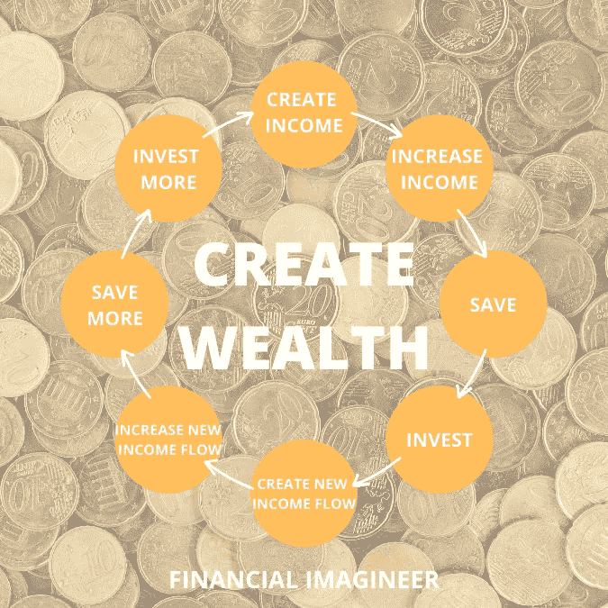
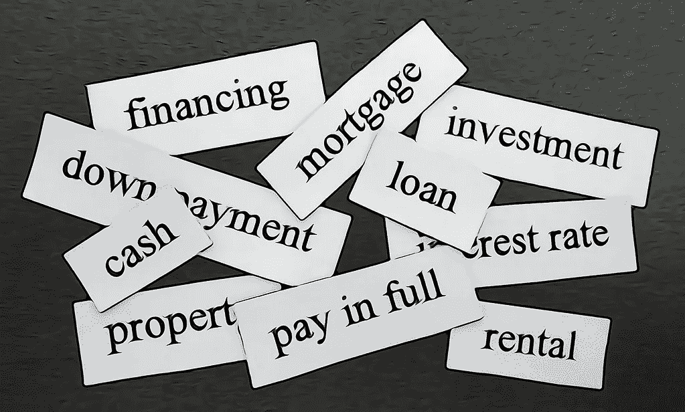
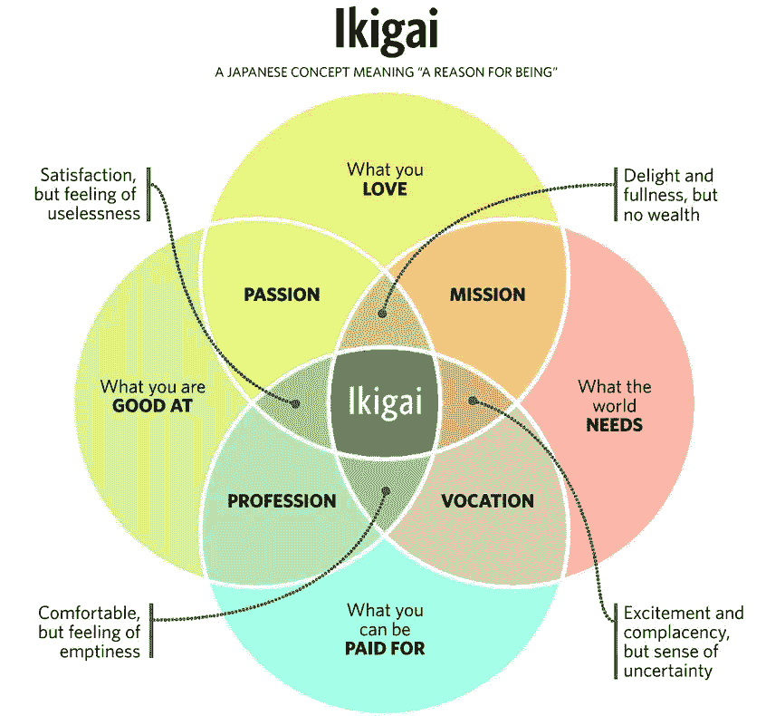

# 如何构建你丰富的收入流瀑布

> 原文：<https://medium.datadriveninvestor.com/how-to-build-your-abundant-waterfall-of-income-streams-financial-imagineer-b535e1f7e9d4?source=collection_archive---------9----------------------->

不管人们怎么想或试图告诉你，最简单和最常见的致富方法是建立多种收入来源。

你知道百万富翁平均有七种收入来源吗？

是的，有一份好工作就有可能变得相当富有。是的，你可以通过股票发财。是的，你可以把所有的精力都放在工作或生意上。然而，如果你过于专注于一个单一的收入来源，你会限制你的增长，并仍然处于风险之中。

为自己增加额外的收入来源让我可以冒更多的风险，放弃朝九晚五的工作，去冒险探索，成长为一名企业家——提高我的生活质量。

不要仅仅依赖一种收入来源:增加收入来源并使之多样化。

多元化增长是最自然的现象。看看树木是如何也不依赖于单一的根或枝生长的。随着树木的生长，树根和树枝开始蔓延。通过伸出手，它们试图进入无争议的土壤，而树枝试图最大限度地吸收阳光。如果一棵树不能从任何一方获得足够的营养，无法养活自己，它就会死去，给其他树让路。

关于收入流的问题在某种程度上是一个先有鸡还是先有蛋的难题。尚不清楚是额外的收入流首先造就了百万富翁，还是百万富翁只是明白了游戏规则，并让更多的收入流流向他们。

不管怎样，有一点是清楚的:

多种收入来源是财富创造公式的重要组成部分。增加你的收入被认为是通往财务自由和富足的最可靠的途径。

 [## 金融顾问今天应该拥抱虚拟实践模式的 5 个理由|数据驱动…

### 随着对办公空间长期租赁的需求在新冠肺炎疫情时代彻底崩溃，办公空间的需求也在下降

www.datadriveninvestor.com](https://www.datadriveninvestor.com/2020/05/21/5-reasons-why-financial-advisors-should-embrace-the-virtual-practice-model-today/) 

起点是你现在所在的地方。你目前有多少收入来源？你知道其中有多少？)的？哪种方式最适合你？哪一个流程最有潜力继续改进？

了解如何优化现有流程并添加额外的流程。

> *“睡觉的时候不找到赚钱的方法，就工作到死。”*
> 
> *沃伦·巴菲特*

换句话说:不要躺在床上，除非你已经学会了如何从床上赚钱。目标是睡觉时更富有，醒来时更富有。

# 主要收入来源

大多数人开始了他们的金钱生活，通过工作赚取收入。工作是出卖你的技能和时间来换取金钱。工作可以提供安全感、舒适感和一定程度的满足感。被雇用的人通常在月底定期得到工资。虽然不同的工作支付不同的钱，有些少，有些多，但他们都支付。

Primary stream of income — your job.

保住工作，想办法优化。你可以以升职为目标，开始向上爬。你可以通过分析你的价值贡献来确定加薪的目标。另一种方法可以是协商兼职工作，保持你的基本贡献(甚至你的工资),让你有更多的时间从事额外的收入来源。

计算出为了保住这份工作，你每单位时间需要牺牲多少钱。你真正赚到的钱是你的工资，减去扣除额、税收，再减去你维持工作的成本(例如，你的通勤、昂贵的服装、社交等等)。).扣除最后的$$$金额，然后除以你的总时间努力，你可能会惊讶于你实际上挣得很少——每小时。

然而，当务之急应该是不断优化你的主要收入来源，直到没有进一步改善的可能。

这是开始的地方。

# 次要收入来源

对于第二点，让我们假设你有一个同样在工作的伴侣。情况可能是这样，也可能不是。如果你的伴侣有独立于你的收入来源，你可以参与团队合作，优化两个人的收入来源，而不是一个主要的收入来源。

Two streams of income — two jobs — teamwork!

考虑因素:如果你们都在同一家公司或同一行业工作，你可能仍然要考虑到集中风险，以防你所在的行业受到冲击或公司裁员。

多样化不是必须的，但在这里可能是一个有意义的考虑。

你的合伙人的薪水可能会让你们中的一个人放弃工作，以便另一个人努力建立额外的收入来源或探索企业家精神。

如果你们作为一个团队工作，拥有[是一个很好的选择](https://www.getrichslowly.org/couple-goals/#more-237050)！

# 创造额外的收入来源

每当有人需要额外收入时，他们给出的老一套建议是“找份兼职”。这可能是一个解决方案。但这不是好建议。大部分是。如果你没有时间或精力投入额外的时间怎么办？沿着兼职工作的道路走下去，可能仍然算作“用时间换取金钱”。

出售更多时间是有意义的，但也有一些例外。

利用你必须“无论如何都要做”的事情。让我解释一下。如果你考虑做优步司机，试着只在你无论如何都要开的路线上开优步:比如你的日常通勤。这样，你就不会花更多的时间或做一些你本来不会做的事情，释放你的时间潜力，并“激活”额外的收入流，而不会改变你的日常生活或习惯，或出售更多你有先见之明的时间。

其他的例子有合伙洗衣服(帮别人洗衣服收费)、照看孩子(“合伙带孩子”)、做更多的饭菜并卖掉剩余的，或者任何你认为可以“分享”以获得报酬的事情。

增加更多的收入来源需要努力。没有免费的东西。扩大你的收入潜力通常需要金钱或时间的投入。不管你有什么想法，把你的注意力从出售你的时间上移开。

你的时间是你最宝贵的资源。

当我年轻的时候，我读过像《富爸爸穷爸爸》和《T2》这样的书，它们点燃了我的热情，让我对创造源源不断的被动收入产生了极大的兴趣。

你看，出卖你的时间被认为是“主动收入”，而不出卖你的时间而赚钱被称为“被动收入”。如果你只关注“积极收入”，你就把自己限制在每天 24 小时，不会释放潜在的额外收入。

试着找到一些方法来开辟额外的收入来源，这些收入来源与你出售(更多)时间没有直接联系。构建系统。小水流，变得更大，成长为溪流，收入的溪流。

Streams of income flowing towards you.

你可以马上做的小事情是在网上填写调查，在网上出售你漂亮的照片，嘿，在今天的世界里，你甚至可以出售你的网上行为。是的，如果你愿意，你就是产品。有些应用程序实际上是付费给你安装在你的手机上的。安装一个间谍可能不是最受欢迎的赚钱方式，对其他人来说，这可能是完全合法的。

就我而言，把我的信用卡奖励积分算作被动收入是完全有道理的。这些奖励积分让我每年至少一次乘坐商务舱或头等舱/套房环游世界，而无需额外花钱。只要找出哪些信用卡最有回报，并相应地引导你的支出。

Singapore Airlines Suites Class Flight Zurich to Singapore — for free!

释放隐藏的潜力。否则你就让它白白浪费了。

简单地出卖你的时间限制了你的全部收入潜力，而且不可利用。

# 创造财富——被动收入

你今天赚的比花的多吗？厉害！你需要那笔额外的钱来支付明天的开销吗？省省吧！你有明天不需要的东西吗？投资它！

这个创造财富的公式很简单:就像拿着你赚来的钱，把它——而不是你——送回去工作——为你——以再次提高未来的收入流。

最常见和最容易的额外被动收入来源是资本市场投资。投资并从债券中赚取利息，从股票中获得股息，或者——取决于你怎么看待它——通过随着时间的推移提高资产价格来产生资本增长。

一个证券化资产的投资组合，提供足够的收入来支付你的开支，是大多数致力于财务独立的人的基石。

# 分散你的收入来源

资本市场是波动的，虽然这是建立真正的被动收入的最简单的选择，但你也可以分散到与你的投资组合无关的额外收入流中。

第二常见的是房地产。

如果你真的想积累财富，请不要说你永远没有足够的钱、时间或专业知识来进入这个行业。你可以从小做起，边做边学，成长为一个地主。

# 房间出租

我的一个朋友开始在另一个城镇代表他的公司。为了送他去那里，公司给他提供了住房补贴。他聪明地优化了这个提议。他没有租房子住，而是用几乎没有首付的钱买了一套两居室的小公寓，并用公司的住房补贴来还房贷。与此同时，他出租了自己的第二间卧室，并从第一个房客那里获得了被动收入。十年后，他的公寓升值了，抵押贷款缩水了，而我的朋友一直将差额投资于股票。这就是如何白手起家建立财富。太美了。

在人生的后期阶段，许多人希望组建一个家庭，并希望改善他们的住房。如果你买一套更大的公寓，你有没有考虑过把一个房间出租给房客？如果你选择正确和合适的租户，这可能是一个伟大的解决方案。我们过去成功地做到了这一点，并享受了与租户共同生活的美好时光。

# 爱彼迎

我们也有朋友在 AirBnB 上提供额外的卧室，就像酒店一样，按晚上收费。他们认识了很多有趣的人，并极大地扩展了他们的关系网！做 AirBnB 是一种非常灵活的方式，可以“激活”现有资本，让它为你工作。你是 AirBnB 的老板，如果有一天你不再有心情，你可能会“关店”。

# 停车场

你可能碰巧拥有额外的停车场:试着把它租出去。

有了停车场，你就不必修理厕所或投资翻新预算。根据你可能获得的收益，这可能是比租房更好的选择。投资停车场并简单地专注于此以被动创收可能是有意义的。

Starting to get unstoppable… how many streams of income do you have?

# 税收优惠和信贷

在大多数司法管辖区，房地产具有税收优势——这是投资股票和债券通常不具备的(除了退休账户)——并且可以[提高你在银行的信用额度](https://www.financial-imagineer.com/2017/11/15/your-gravity-defying-money-bazooka/)，这些信用额度可以再次用于进一步优化你的银行平台设置。谈到优化:如果你有现有的抵押贷款，请检查现在是否是一个好主意，因为利率是最低的。

并不是“越大越好”。有时，几个小的被动收入流一起可能比一个大的更好。

# 企业家精神

创业可能不是每个人的目标。与拥有一份工作和建立更被动的收入流相比，这需要更多的时间和努力。然而，如果你以正确的方式去做，它会在很多方面带来最大的回报。

[找到你的 Ikigai](https://www.financial-imagineer.com/2020/07/24/ikigai/) 并围绕它创造一种职业生活/身份。

开始的时候，你可以试一试。提供一项服务或创造你可以销售的产品。考虑出售你作为顾问的专业知识、数字产品、课程或写博客或书。

Read more about finding your [ikigai here](https://www.financial-imagineer.com/2020/07/24/ikigai/).

因为不确定自己有没有价值而犹豫不决？

知道你比 99%的人都擅长做*某事*。

找到这个东西，你的核心能力，你的“ [ikigai](https://www.financial-imagineer.com/2020/07/24/ikigai/) ”。大多数和你一样好，甚至比你更好的人，只是懒得去做一些事情。这是你的机会。

创业就是掌控自己的生活。你拥有所有的权力。但是俗话说“权力越大，责任越大”。当你是一名员工，事情出了差错，你可以归咎于经济、公司、你的同事或老板。当你接管并成为老板时，一切都在你身上。没有借口。

然而，好的一面是，如果你做得对，所有的好处也是你的。

> 这是一个简单的算术:你的收入只能增长到你做的程度。
> 
> *T·哈维·艾克*

与在朝九晚五的工作中表现出色相比，作为企业家表现出色的好处自然要大得多，因为你不必支付公司股东、老板、人力资源等服务部门、办公室租金、营销等费用。然而，你也必须自己做所有这些事情。这是一种交换。

创业是一个广泛的话题。一旦你建立了足够的收入来源来维持舒适的生活方式，这是大多数人的下一步逻辑。你不必建立一个帝国，建立一个生活方式的企业。与房地产相比，拥有一家公司会带来更多的税收优惠。

建立网上业务是最时尚的方式。但是不要把自己局限于这种想法。只要你专注于为客户增加价值，你有很多方法可以发掘额外的收入来源。

# 焦点

如果你从事的是一份收入很高的职业，并且对自己的工作很满意，难道你不应该把更多的时间放在你的职业上，而不是冒险建立其他的收入来源吗？

我对此的想法很简单:是的！一定要专注于你热爱的、擅长的、能得到报酬的事情。

然而，你不必一直向雇主推销你的时间和技能。

> 富人和穷人的唯一区别是他们如何利用时间。
> 
> *罗伯特·清崎*

你越依赖一种收入来源——不管它多高或多好——风险就越大。想象一下明天被解雇。

恭喜你，如果你有一份高薪工作，实际上更容易(开始)，因为你可以将更多的多余现金重新投入资产，尝试实验，你可以在旅途中犯更多的错误。

简而言之，更多的收入来源意味着更多的安全。

努力成为自己的老板——跳过中间人——直接从你的客户那里获得报酬。这也有利于减少潜在的利益冲突，因为你可以更好地为你的客户服务，而不必让你的雇主也满意。

专注于掌握并带来第一笔额外的收入，稳定下来，然后将你的注意力转移到下一笔收入上，如此反复。随着时间的推移，你将建立一个多元化的被动和主动收入流的优化系统，它符合你的生活习惯、生活方式和梦想，最终让你忘记何时是发薪日。

This is how financial abundance looks to me.

我有银行业背景，我自己的主要收入来源是商业(咨询、建议、为他人理财)、资本增值、股息和租金。

# 结论

出售更多的时间是不可扩展的。这也可能是不可持续的，也不是令人愉快的。去寻找与你想象的生活方式相一致的额外收入来源，并且尽可能的灵活被动。

增加你的收入并使其多样化很简单，但并不容易。

这绝对值得。

如果你不开始，你将永远只是一个远离街道的薪水。

> *不要为了现实而贬低你的梦想，要为了命运而提升你的信念！*

你有多少收入来源，你目前在做哪些？

财务想象者你的生活，

马特(男子名ˌ等于 Matthew)

免责声明:请注意，上面使用的一些链接可能是附属链接，Financial Imagineer 可能会收到补偿。

*原载于 2020 年 8 月 1 日*[*【https://www.financial-imagineer.com】*](https://www.financial-imagineer.com/2020/08/01/how-to-build-your-abundant-waterfall-of-income-streams/)*。*

**访问专家视图—** [**订阅 DDI 英特尔**](https://datadriveninvestor.com/ddi-intel)