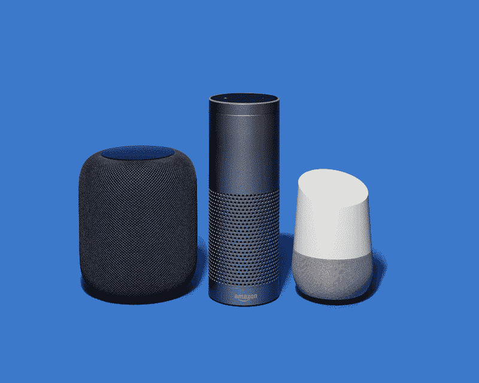
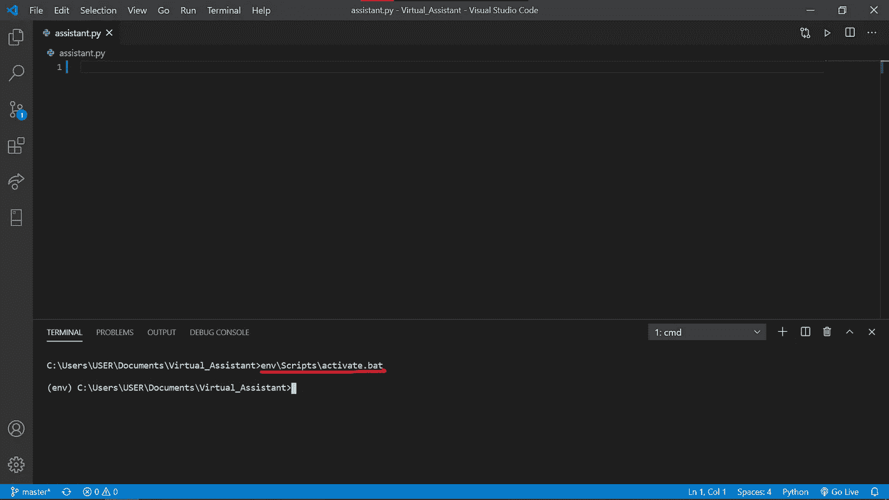
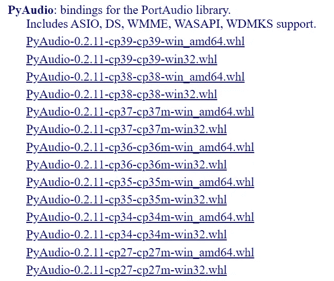
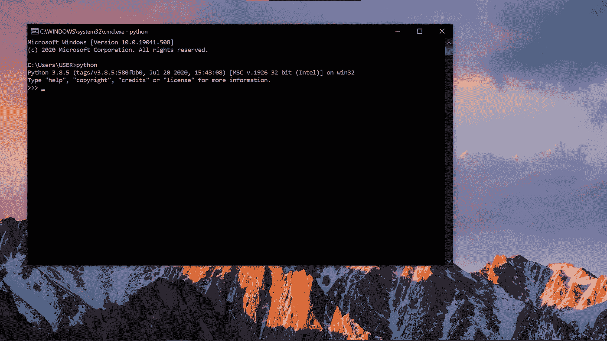
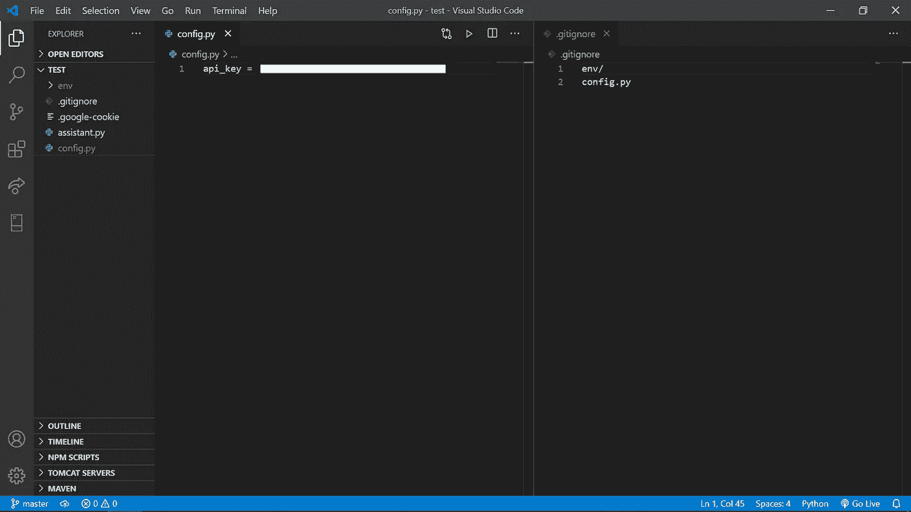
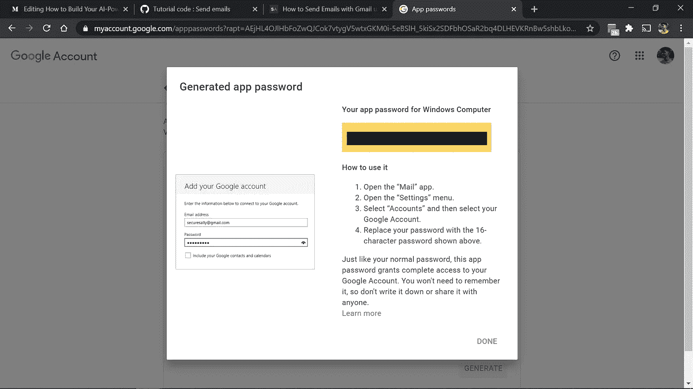
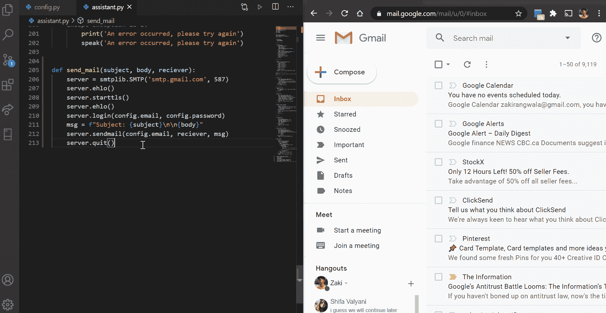

# 如何构建你的人工智能虚拟助手🎙

> 原文：<https://medium.datadriveninvestor.com/how-to-build-your-ai-powered-virtual-assistant-8ce474ab200e?source=collection_archive---------0----------------------->

## 你有没有想过如何模仿流行的虚拟助手，如谷歌、Siri、Alexa 甚至更好的钢铁侠的 J.A.R.V.I.S？

今年早些时候，我无意中打开了这篇有趣的文章，内容是脸书的联合创始人兼首席执行官马克·扎克伯格如何打造了一个像贾维斯一样的人工智能助手，以实现家庭自动化，并向现实生活中的钢铁侠迈进了一步。

如果您想了解更多信息，请查看 Mark 的这篇文章:

[](https://www.facebook.com/notes/mark-zuckerberg/building-jarvis/10154361492931634) [## 脸谱网

### 我 2016 年的个人挑战是建立一个简单的人工智能来管理我的家——就像钢铁侠中的贾维斯一样。我的目标是学习…

www.facebook.com](https://www.facebook.com/notes/mark-zuckerberg/building-jarvis/10154361492931634) 

所以，这真的激励我做同样的事情，虽然我一直在拖延，但我最终开始了，让我告诉你，这太不可思议了！！

看，制作你的虚拟助手的好处是你可以根据你的喜好定制和个性化它，使它适合你的爱好和兴趣，从而产生一个像 J.A.R.V.I.S .一样的坏蛋人工智能。


Next Step: Make the suit 🚀 (Source: Giphy)

# 什么是虚拟助理？🤔

如果你还不知道，虚拟助理本质上是一个软件代理，能够根据个人的查询、命令或问题执行任务或服务。它是一组程序，可以执行用户通常会做的功能。但是，如果它能做人类通常会做的事情，难道它不是人工智能吗？*不完全是*

虽然**人工智能**指的是**对人类智能**的模拟，并被编程为模仿我们的行为和像我们一样思考，但我们将制造的东西可以被认为是一个 **AI，**但许多人会不同意。所以，让我们不要太超前，因为我们将在文章快结束时回到这个话题。

不同行业有不同种类的助理，如社交媒体、营销等。像**谷歌助手、Alexa、Siri 或者 Cortona** 一样思考。这不是一个新东西，因为这些助手已经在市场上存在多年了，但最近几年的快速创新已经令人震惊。



Apple’s HomePod, Amazon Echo and Google Home are some of the virtual assistant equipped speakers you might be used to be seeing (Source: New York Times)

这是因为我们正在学习如何利用**机器学习算法，**虽然使这些机器更容易犯错误，但随着时间的推移，允许机器理解和改进，因为机器不断训练自己，以最终实现成为**人工智能**的目标。

更简单地说，**机器学习算法有助于减少代码**，而不是**显式地对用户说的每个关键词进行编程**，这可能会触发一个动作，因为它只是随着时间的推移而学习。

读完所有这些，你可能会想**哇！**太棒了，我可能会去订购一个智能音箱。但是尽管使用这些助手会带来固有的**因素，你会发现这些助手**并不能迎合你的特定需求。****

**那么，怎样才能让它们更具可定制性和个性化呢？**

**好吧，你很幸运，因为学习如何构建自己的程序相对容易，我将带你一路走来。所以事不宜迟:**

# **构建虚拟助手🔨**

**对于这个项目，我们将使用 Python，因此您需要安装一个最新版本(**我推荐 3.7 或更高版本**)。如果没有，你可以[从这里](https://www.python.org/)下载。**

****

**When installing, make sure to add Python to PATH.**

**在安装任何包之前，我建议在我们将要编写助手的文件夹中创建一个 python 环境。**

**为此，在终端中键入命令`py -m venv env`并等待它创建虚拟环境。这是推荐的，这样你安装的任何包都不会篡改你机器上全局使用的 python 解释器，而只是项目。**

****

**To activate the virtual environment, type **‘env\Scripts\activate.bat’** and your screen should look like this.**

**完成后，在您的终端中使用**‘pip install’**命令安装以下软件包:**

```
pip install pyttsx3 
pip install pypiwin32
pip install speechRecognition
pip install PyAudio
```

**这些库通过将文本转换为语音并识别用户所说的话来帮助您和机器相互通信。如果您在安装最后一个库时遇到问题，[从这里获取](https://www.lfd.uci.edu/~gohlke/pythonlibs/#pyaudio)。**

****

**PyAudio Module**

**确保获得。为您安装在计算机上的 python 版本构建的 whl 文件，您可以通过在终端中键入**‘python’**进行检查。**

****

**Mine, for example, is Python 3.8.5 32 bit, so I would get the ‘PyAudio‑0.2.11‑cp38‑cp38‑win32.whl’ file.**

**然后您将导航到。在文件的绝对位置使用**‘pip install’**命令安装 whl，因为它将从源文件构建。例如:'**pip install C:\ Users \ USER \ Downloads \ py audio-0 . 2 . 11-cp38-cp38-win32 . whl '****

**一旦安装了所有这些包，我们将使**‘speak’**像这样工作**

**We are using the Speech API (‘sapi5’) from Microsoft, which will help the machine speak.**

**在这个代码片段中，我们正在初始化我们的文本到语音转换引擎，并调用“speak”函数来说出解析的任何音频。VoiceID 帮助我们决定我们希望我们的助手拥有什么样的声音，`voices[0].id`指的是男性，而`voices[1].id`指的是女性。**

**您可以通过调用类似`speak('Hello World')`的函数并运行代码来测试它，这应该会导致机器说“Hello World”**

**如果这不起作用，那么你需要使用不同的模块。通过使用终端中的命令`pip install gtts`和`pip install playsound`来执行此操作，并创建新的语音功能。**

**We are using the Google Speech API to convert text-to-speech, test by calling **speak(“Hello World”)****

**一旦**语音**功能准备就绪，我们将引入**收听**功能，它允许机器通过使用**谷歌语音 API** 来识别你在说什么。**

**使用`pip install speechRecognition`安装该模块，并创建一个对象来接收用户的麦克风输入。根据环境声音进行调整，并给用户足够的时间说话，最后将机器识别的结果文本保存到一个变量中。**

**Feel free to change the language by utilizing the two-letter code corresponding to your country**

**现在我们有了基础，可能性是无限的；你可以加入任何你喜欢的 API，制作一个迷你程序，甚至控制你的智能家居。我将带您浏览其中的一些，比如检索游戏分数、获取天气预报、获取电影评级甚至股票价格。**

**[](https://www.datadriveninvestor.com/2020/09/15/a-college-student-used-a-language-generating-ai-tool-to-create-a-viral-blog-post/) [## 一名大学生使用语言生成人工智能工具创建了一个病毒式博客帖子|数据驱动…

### 作为作家，我们喜欢告诉自己，我们处在一个无法自动化的职业中，至少短期内不会。但是…

www.datadriveninvestor.com](https://www.datadriveninvestor.com/2020/09/15/a-college-student-used-a-language-generating-ai-tool-to-create-a-viral-blog-post/) 

## 问候功能⌚

我们将创建一个问候功能，程序将根据时间问候你:早上->“早上好”；下午->“下午好”，如下图所示。

The Assistant will greet the user depending on the hour of the day

这个函数相对简单，因为我们需要利用内置的 DateTime 模块来创建一些条件，该模块告诉我们一天中的某个小时

## 实时股票价格函数💲💲

我们将创建一个函数，告诉我们在任何股票交易所上市的任何股票的实时股价。我们可以通过搜索雅虎财经的股价更新来完成这项壮举。用户所要做的就是指定他们想要检索的股票价格。首先，我们需要安装这些模块，让我们能够抓取网页`pip install beautifulsoup4`和`pip install requests`，从网页中提取任何信息，这是一个强大的工具。

This function uses the CSS elements to find the price, title and currency of the stock. Your web headers might be different. Find out here: [https://www.whatismybrowser.com/detect/what-is-my-user-agent](https://www.whatismybrowser.com/detect/what-is-my-user-agent)

如果您运行这段代码，您应该会得到一个错误，因为 **URL** 变量为空；因此，你什么也没刮到。现在，如果我解析如下的 URL，这个函数就可以工作了:[https://finance.yahoo.com/quote/MSFT?p=MSFT](https://finance.yahoo.com/quote/MSFT?p=MSFT)

但是我们希望能够找到世界各地各种股票交易所中任何股票的价格，我们不想硬编码每只股票的 URL，因为这可能有 50 多万个变量，效率非常低，更不用说非常耗时。

解决这个问题的一个方法是制作一个**搜索查询**函数，该函数将返回与我们可以从中抓取的股票相对应的**雅虎财经 URL** 。首先，使用命令:`pip install google`安装 google 模块，然后创建相对简单的函数。

We will heavily be relying upon **Google’s PageRank algorithm** for this function at we will only be using the 1st URL out of the list of 10 to scrape the stock price from

然后你可以测试一下，先把类似*‘特斯拉股价雅虎财经’*的东西代入 google_query 函数，用函数返回的第一个链接替换 **URL** 。之后，当您执行 **check_price** 函数时，您应该会得到合法公司名称、股票价格和股票货币的输出。

`URL = google_query('Tesla stock price yahoo finance')[0]`

如果不行，也不用担心。我将把我们今天讨论过的所有代码嵌入到文章的结尾。同时，让我们来看看:

## 天气功能🌤

为了创建天气函数，我们需要用户的位置。现在你可以提示用户说出他们居住在哪个城市，但是我希望程序是无缝的，所以我通过使用用户的 IP 地址找到用户的区域。

> 请记住，如果用户正在使用 VPN，这将不起作用，因为它将获得 VPN 服务器的 IP 地址。

由于可能会有这样的情况，我们也可以找到世界上任何一个城市的天气读数，只需使用它的名字，如“卡拉巴萨斯的天气”

首先，为了使用用户的 IP 地址获取位置，我们将使用函数 **get_location，**，它抓取来自[iplocation.com](http://iplocation.com)的输出。我们应该已经有了之前的网页抓取功能所需的库，但是如果你没有，那么`pip install beautifulsoup`和`pip install requests`

Returns the city and country the user resides in as well as the latitude and longitude

现在，为了获取天气信息，我们将使用 [OpenWeatherMap API](https://openweathermap.org/api) ，您需要注册才能获得 API 密钥。我用的是免费计划，你一个月可以接到一百万个电话，这已经足够了。


You should generate an API Key for the Virtual Assistant and make sure to keep it safe.

之后，你将创建一个名为 **config.py** 的新的 python 文件，并将你的 API 密匙存储在那里，如下所示:



Make a config.py file that will hold all API keys, passwords and secrets to prevent it from getting exposed and exploited by anyone if you plan on uploading your code. (P.S: Make sure to add config.py in the .gitignore file)

最后，我们需要做的就是编写一个简单的方法来调用 OpenWeatherMap API 并接收天气信息。

Import config to get access to API Key and then make a request for the weather data by accessing the endpoint URL

测试您的代码，首先获取纬度和经度，然后在天气函数中解析它，如下所示:

```
city,country,latitude, longitude = get_location()
print(weather(latitude, longitude))
```

您应该收到类似字典的东西，其中包含各种值，如坐标、天气、时区等。

## 电影分级功能🎬

这是迄今为止我的虚拟助手中使用最多的功能，也是最有益的功能，我总是倾向于在承诺之前需要一个电视节目或电影的评论。要使用这个函数，我们需要一个重要的模块，你可以这样得到:`pip install IMDbPY`

这个包有助于检索 IMDB 数据库中的任何电影或电视节目。

然后，我们创建一个方法，对您想要搜索的电影进行 google 查询，查看它是否存在于 IMDB 数据库中。然后我们返回正确的 URL，从那里我们可以抓取电影的标题和年份，以供以后参考。

Retrieve the title and year of the movie

然后，我们还想刮烂番茄评分，这是一个有用的指标，以确定评论家和人们对一部电影的看法。

Retrieve the rotten tomato score

最后，我们需要添加几行代码来搜索 IMDB 数据库中关于这部电影的所有信息，并获取烂番茄的分数。对于这个例子，我将使用电影:**《空手道小子》(1984)**

Test by substituting any movie in the query variable and execute the program. It should take a minute…

## 运动功能🏀

对于这个功能，我们将使用 **sports.py，**一个提供几项运动的最新比分的包。要安装:`pip install sports.py`

我们现在需要做的就是创建一个简单的方法来获取游戏分数，如下所示。

This method will return the game score if you specify a team name, i.e., parse in **lakers** into the function, and it should produce the score provided they played the most recent game in the NBA.

## 最终:发送电子邮件功能✉

这个功能可能是这个列表中最有用的功能，因为它可以方便地说出电子邮件并让你的助理发送出去。此外，据我所知，这是这个列表中仅有的几个助手支持的功能。为了发送电子邮件，python 有一个内置模块，名为 **smtplib** ，就像 Gmail 使用的服务器一样。 **SMTP 或(简单邮件传输协议)**是用于与外部邮件服务器通信的协议。这是一个发送协议，意味着你不能用它接收电子邮件，只能发送。对于接收，您可以在您的助手脚本中自己实现 **IMAP 或(Internet Message Access Protocol)**，因为在本文中我不会详细介绍。

In this script, we are opening a secure connection to the SMTP server.

> 如果你尝试运行这种方法，你会遇到一个错误，因为 Gmail 像这样对 SMTP 连接施加限制，所以你必须验证你自己。注意上面的脚本是如何拥有像 **config.email** 和 **config.password** 这样的字段的，我们现在就要制作这些字段

有两个步骤:**允许访问不太安全的应用**(不推荐)和**创建应用密码**(推荐)**。**

我更喜欢后者。要创建应用程序密码，请为您的 Google 帐户启用**两步验证**:


Enable 2-Step Verification to use App passwords

然后，点击**应用程序密码**并选择您需要密码的应用程序以及该密码将在什么设备上使用。在我们的例子中，应用程序是**邮件、**，设备取决于你使用的是 Mac 还是 Windows 笔记本电脑，在我的例子中是 **Windows** 。然后点击生成，你应该得到一个应用程序密码。请把它记下来。



Please copy this password and paste it into config.py under a variable **password.**

```
#Then Assign the email and password in config.py
email - 'your_email_for_which_you_made_the_password@gmail.com'
password - 'App_Password_that_you_copied'
```

现在要测试，调用方法并解析主题、正文和你想发送电子邮件的人，先试试你自己。然后，您应该会收到一封包含相同信息的电子邮件。



Demo for how the mail function should work

# 把所有的放在一起💻

现在我们有了所有的方法，我们需要把它们放在一起。首先，让我们创建 main 方法，并添加关键字，每个流程将基于这些关键字运行。然后确定一个关键字来打破循环，结束程序。

Add a keyword for each function that can be called inside each condition and if the user says, **stop** or **bye,** then end the program.

所有方法的条件如上所述。在需求中随意添加调用函数所需的任何逻辑。

上面的要点包含了该程序的主要方法，一旦运行，它应该与 Alexa、Siri 和 Google Assistant 没有什么区别。这是因为我们已经正式创建了我们自己的虚拟助手，你也可以继续添加功能和不断迭代。

> 如果您想获得本文中概述的所有方法和函数的源代码，[您可以在这里获得](https://drive.google.com/drive/folders/1h9xWbN0JMfFd_rleudwUWLkB8vZbsI6z?usp=sharing)

有许多功能，比如**网速测试**和 **Spotify 集成**，我没有包括在内，但话说回来，我们会永远在这里。因此，如果你想查看包含所有源代码的主程序，请查看下面的链接:

[](https://github.com/ZakiRangwala/Virtual_Assistant) [## ZakiRangwala/虚拟助理

### 利用各种开源 API 和库为您带来一个智能人工智能助手，能够满足您的需求

github.com](https://github.com/ZakiRangwala/Virtual_Assistant) 

# 这能算 AI 吗？🧠

当我们结束时，我想谈谈这个虚拟助手是否可以被归类为人工智能，因为许多人会认为它不是人工智能，因为机器在自我学习时远远没有遵循我们所做的显式编码的 if-else 语句。但是如果我们从基础层面来看，人工智能的唯一目的是和一些甚至更重要的人类一起执行人道的任务。因此，我会说我们的虚拟助手是人工智能的，因此是一个人工智能，但不是人工智能的一个很好的例子。没有学习发生，而是只是做它被告知的事情，让它变得“聪明”

# 后续步骤👣

我目前正在致力于实现**自然语言处理(NLP)** 让我的助手更聪明，随着时间的推移理解和学习。**语音识别**和**自然语言处理没什么区别。**我们在这个程序中使用的只是一种使计算机能够识别和解释单词或短语的技术，是一个叫做**计算语言学的领域的一部分。**

然而， **NLP** 是纯人工智能的一个分支，它试图理解用户的意思，而不仅仅是将用户说的话转换成文本。这将使语音识别耗时更少，并将成倍减少程序中 if-else 语句的数量。它会从大量的训练例子中理解用户的意思。

毕竟，你可能有十亿个 if-else 语句，但是利用这项技术更有效，并且打开了通向无限机会的大门。你认为谷歌助手是如何开始的？🧐

如果你喜欢这篇文章，并且它帮助了你，请留下掌声，如果你有任何问题，你可以在下面留下评论，或者更好，发电子邮件到 zakirangwala@gmail.com 给我。

如果你想更多地了解我和我的工作，请访问我在 zakirangwala.com 的网站

**访问专家视图—** [**订阅 DDI 英特尔**](https://datadriveninvestor.com/ddi-intel)**