# 如何从头开始构建一个马赛克图像生成器

> 原文：<https://medium.datadriveninvestor.com/how-to-build-your-mosaic-image-from-scratch-using-python-123e1934e977?source=collection_archive---------1----------------------->

## 使用 Python 从头开始构建自己的镶嵌图像的分步教程

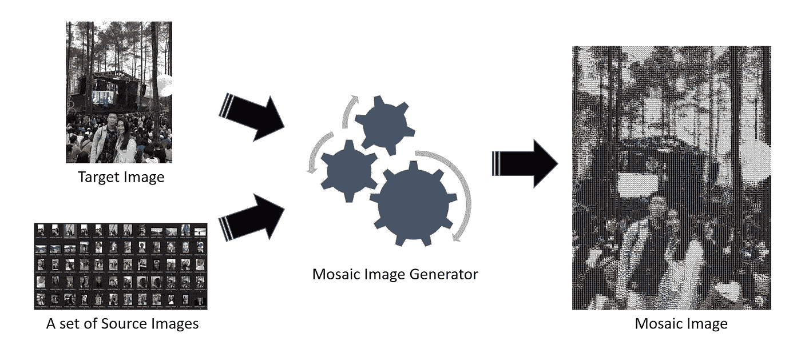

Mosaic Image Generator I/O

你现在的情况是…

> …你保存了几十张与心爱的人的难忘照片，想送给他/她一件自己亲手制作的难忘的东西？
> 
> …你既是艺术爱好者，也是技术爱好者，想要创作一些不仅艺术而且技术的东西？
> 
> …你只是出于好奇，想做一个马赛克图像生成器，挑战自己的极限？
> 
> **如果是这样，那么这篇文章就是给你的！！**

对我来说，这一切都始于我在印度尼西亚一家专注于计算机视觉的初创公司实习期间。第一次学习如何处理图像数据对我来说非常令人兴奋。在那里做了几天人工智能工程师实习生后，在我的兴奋、好奇和我总是乐于接受挑战的一部分的激励下，我决定用我最喜欢的编程语言 Python，自己从头开始建立一个与图像数据相关的项目。

> 几个月后，我也陷入了第一种情况；)

# 什么是马赛克图像生成器？

Mosaic Image Generator I/O. [Image by Author]

请将马赛克图像生成器视为一个引擎，它接受目标图像和一组源图像的输入，并输出马赛克图像。该引擎的目的是通过为每个像素使用一个源图像来生成与目标图像相似的图像。

> 太神奇了！但是…我怎么才能造一个呢？

不用担心，在这篇文章中，我将解释我的方法来生成你自己的马赛克图像！

> 我知道有一些开源库也制作了这种类型的生成器，但是如果我们只使用一个库，那有什么意思呢？:)

# 图像表示

在我们能够构建一个马赛克图像生成器之前，我们必须了解图像是如何表示的。对于那些已经熟悉这个主题的人，可以跳过这一部分:)

在这里，我假设你已经知道什么是向量和矩阵。

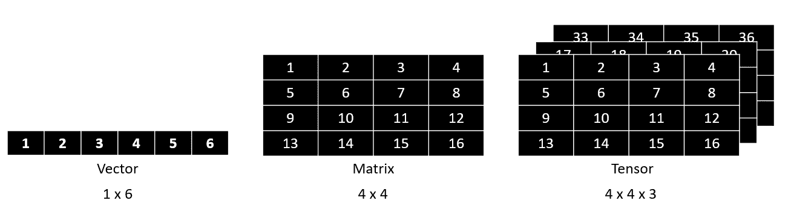

Vector vs Matrix vs Tensor. [Image by Author]

除了向量和矩阵，还有另一种表示法叫做张量。基本上，它只是一个更高维的向量或矩阵。因此，张量不是只有二维的，而是有三维的。

> 那么，向量或矩阵也是张量吗？

是啊！向量或矩阵也是张量。

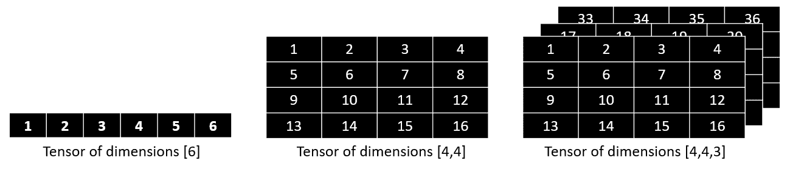

A Vector or Matrix is also a Tensor. [Image by Author]

> 好的，那么图像是如何表现的呢？

有许多方法来表现一幅图像，但最流行的方法是使用 RGB ( *红、绿、蓝*)配色方案。在这种颜色方案中，图像基本上被表示为维度为[ *m，n，* 3]的张量，其中 *m* 是图像的高度， *n* 是宽度，3 是指 RGB。每个张量单元中的值范围从 0(关闭)到 255(最亮)。

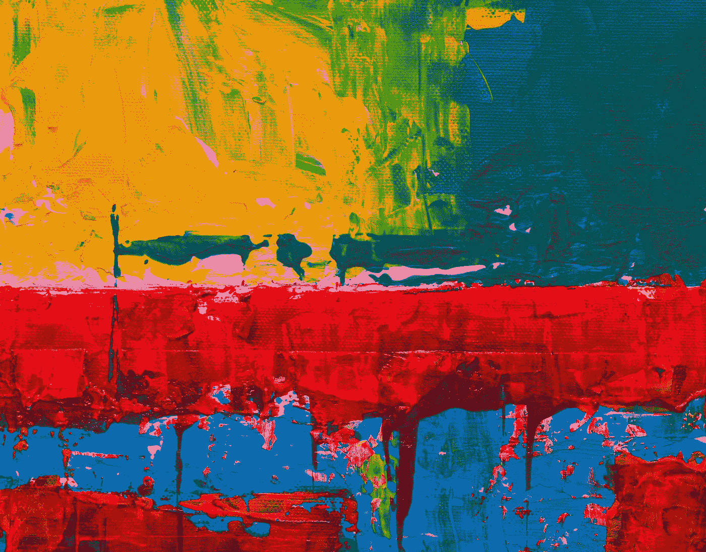

Photo by [Steve Johnson](https://unsplash.com/@steve_j?utm_source=medium&utm_medium=referral) on [Unsplash](https://unsplash.com?utm_source=medium&utm_medium=referral)

# 建立平均 RGB 数据库

创建镶嵌图像生成器的第一步是建立一个数据库，其中包含每个源图像的平均 RGB 值。

因此，对于每个源图像，我们计算每个 RGB 层的平均值，然后将其存储在数据库中，或者在这种情况下，存储在 CSV 文件中。

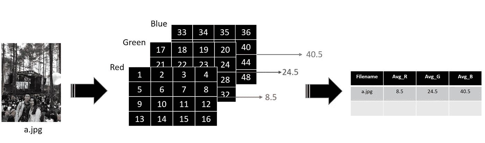

Calculate Average RGB Values for each Source Images. [Image by Author]

然而，如果我们仅仅依靠原始的源图像，我们不能得到许多颜色变化。解决这个问题的一个方法是对我们的原始源图像进行一些预处理。通过这样做，我们可以为每个源图像获得几个额外的数据点。

 [## 一瞬间学会数据科学！？数据驱动的投资者

### 在我之前的职业生涯中，我是一名训练有素的古典钢琴家。还记得那些声称你可以…

www.datadriveninvestor.com](https://www.datadriveninvestor.com/2020/07/23/learn-data-science-in-a-flash/) 

在我的实现中，我做了 3 个预处理:将 RGB 反转为 BGR，增强图像对比度，将彩色图像转换为灰度图像。因此，每个源图像有 4 个数据点。

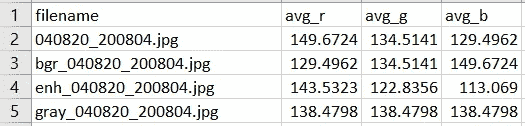

A snippet of the Database. [Image by Author]

下面是构建数据库代码的主要部分。本文末尾附有我的完整代码实现的链接。

# 生成镶嵌图像

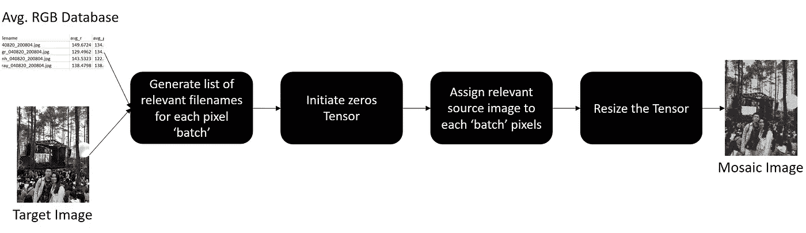

Flow to Generate the Mosaic Image. [Image by Author]

## 1.为每个像素“批次”生成一个相关文件名列表

给定平均 RGB 数据集和目标图像，我们要做的第一件事是为目标图像的每个像素生成相关源图像文件名的列表。

> 我们如何知道哪个图像是“相关”的？

我们可以简单地测量每个目标图像像素的 RGB 向量与我们数据库中的 RGB 向量之间的 RMSE ( *均方根误差*)。然后，选择 RMSE 值最低的一个。

如果你意识到，这是一个非常暴力的方法。幸运的是，我们有办法。

> 不是为每个像素找到相关的源图像，而是我们可以尝试为每个“批”像素找到相关的源图像。

我将这种方法命名为“像素批处理”方法。您可以看到下图，以便更好地理解这种方法是如何工作的。请注意，当 batch_size=1 时，“像素批处理”方法与强力方法相同。

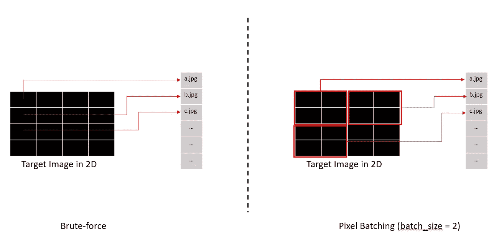

Illustration of pixel ‘batch’. [Image by Author]

在测量源图像和像素“批次”的相关性时，还有一种方法可以优化我们的方法。我们可以过滤掉平均 RGB 数据库中的数据点，这些数据点的 RGB 值与像素“批次”平均 RGB 值“相差太大”。

下面是使用 RMSE 检查“相关性”的主要代码部分。本文末尾附有我的完整代码实现的链接。

## 2.初始化零张量

在相关文件名列表生成之后，现在我们必须初始化一个零张量，它将被用作我们的马赛克图像的“容器”。

这里需要强调的一点是零张量的**大小。我们可以简单地将张量初始化为与目标图像相同的大小。然后，我们将选定的源图像中的每个像素调整为 1×1×3 张量。**

但这不是明智的做法！如果我们把源图像的大小调整成非常小的张量，那么会有很多信息丢失。

> 别担心！作为人类，我们被赋予了创造力！

解决这个问题的一种方法是用更大的尺寸初始化零张量( *k* 倍大)。所以，问题是“有多大？”。这真的取决于你。我自己决定初始化大小为 50x50 ( *k* )的零张量，比目标图像的大小大。

因此，如果目标图像的大小为 300x100，则零张量的大小为(300x50)x(100x50)。

## 3.将相关源图像分配给每个像素'批'

这一步很简单。对应像素“批次”的所选源图像被调整大小为大小为 *k* 的张量。然后赋给零张量。

下面是分配相关源图像的代码的主要部分。本文末尾附有我的完整代码实现的链接。

## 4.调整张量的大小

现在，我们的零张量已经被相关的源图像“填充”在每个像素“批”中。我们要做的最后一件事是将这个张量调整到它预期的原始大小，也就是目标图像的大小。或者我们也可以把它调整到我们想要的大小。

## 5.瞧啊。

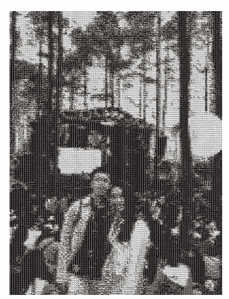

Generated Mosaic Image. [Image by Author]

> 你可以在这里看到完整的代码实现。

# 最后的话

Photo by [Tincho Franco](https://unsplash.com/@tinchofranco?utm_source=medium&utm_medium=referral) on [Unsplash](https://unsplash.com?utm_source=medium&utm_medium=referral)

恭喜你坚持到了这一步！如果你喜欢我的内容，请关注我的媒体账户，以获得我未来其他帖子的通知。

在接下来的 3 个月里，我还会做一个关于强化学习的系列文章。可以查看第一篇[这里](https://towardsdatascience.com/invitation-to-all-aspiring-reinforcement-learning-practitioner-5f87384cee67)。再一次，请随意关注我的媒体账号，并请给:D 鼓掌支持

# 其他生成的镶嵌图像

在这里，您可以看到使用我的代码实现生成的其他马赛克图像的示例。我在这里使用视觉基因组数据集作为源图像集。

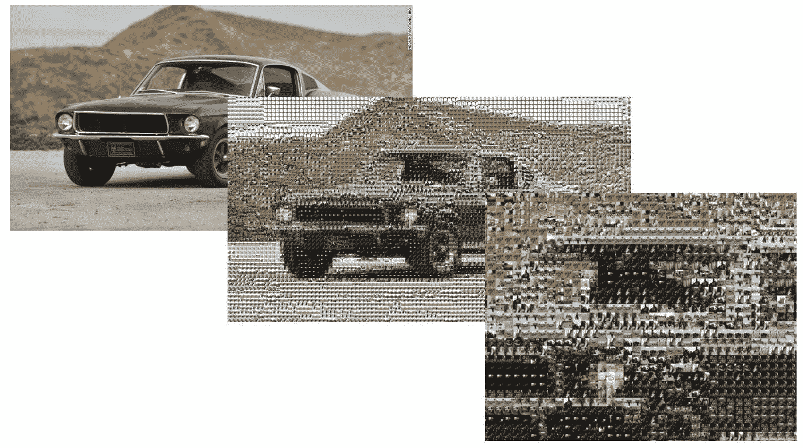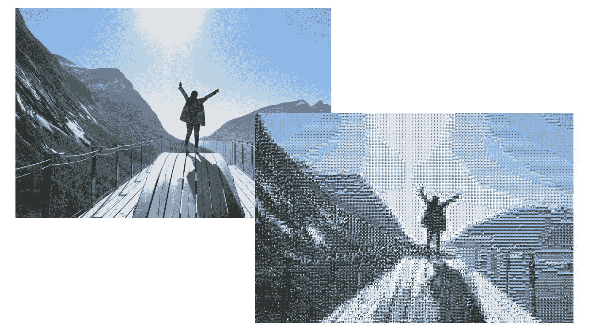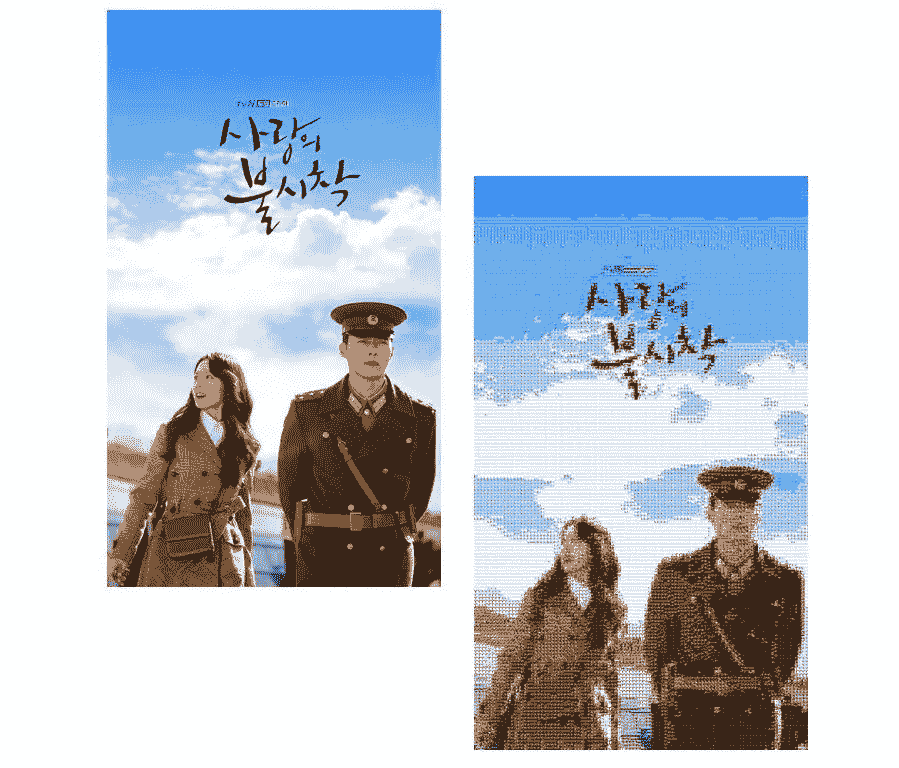

# 关于作者

Louis Owen 是一名数据科学爱好者，他总是渴望获得新知识。他在印度尼西亚顶尖大学 [*万隆技术学院*](https://www.itb.ac.id/) 攻读数学专业，并获得了最后一年的全额奖学金。最近，2020 年 7 月，他刚刚以优异的成绩从他的研究中毕业。

Louis 曾在多个行业领域担任分析/机器学习实习生，包括 OTA(*)、电子商务( [*Tokopedia*](https://www.linkedin.com/company/pt--tokopedia/) )、FinTech ( [*Do-it*](https://www.linkedin.com/company/doitglotech/) )、智慧城市 App ( [*Qlue 智慧城市*](https://www.linkedin.com/company/qluesmartcity/) )，目前在 [*世界银行*](https://www.linkedin.com/company/the-world-bank/) 担任数据科学顾问。*

*去路易斯的网站了解更多关于他的信息吧！最后，如果您有任何疑问或需要讨论的话题，请通过 LinkedIn 联系 Louis。*

## *访问专家视图— [订阅 DDI 英特尔](https://datadriveninvestor.com/ddi-intel)*