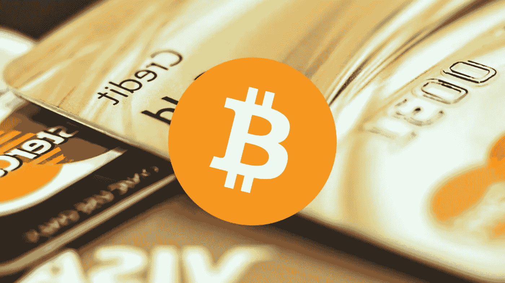

# 如何用信用卡购买比特币？

> 原文：<https://medium.datadriveninvestor.com/how-to-buy-bitcoin-using-credit-card-b90f35decb9a?source=collection_archive---------17----------------------->

itcoin 在加密冬天之后再次出现，这意味着大量的人再次在它暴涨之前争先恐后地购买硬币。对于新手来说，有很多方法可以让比特币到手，比如 PayPal、银行转账、借记卡、信用卡、WebMoney、微信等等。然而，在本研究指南中，我们与比特币客户支持部门的技术专家一起。那么，让我们来看看:

# 在交易所用信用卡获得比特币

在反欺诈公司的帮助下，退款问题得到了缓解，并且逐渐有更多的组织接受信用卡作为支付方式。使用信用卡购买 BTC 的一个缺点是，它比其他选择方式更昂贵，而且不允许电汇或现金之类的退款。

马上，下面是几个可以通过信用卡购买比特币的平台。

**比特币基地**——全球规模最大的密码交易。这个平台号称在全球拥有 2000 多万客户，在 32 个国家都有业务。此外，这是允许客户利用信用卡购买比特币的交易之一。尽管如此，它对所有信用卡交易收取 3.79%的费用，与不同阶段相比，这是非常合理的。此外，在任何时候，客户购买价值超过 100 美元的 BTC，他们可以获得 10 美元的奖励。

 [## 总部位于瑞士的 ETP 进入加密交易市场|数据驱动的投资者

### 虽然金融市场几乎没有沉闷的时刻，特别是在引入…

www.datadriveninvestor.com](https://www.datadriveninvestor.com/2019/03/10/swiss-based-etp-enters-the-crypto-trading-market/) 

# 要遵循的步骤:

*   转到比特币基地的官方网站，创建一个您自己的帐户。
*   点击“设置”页面，进入支付方式，然后选择“添加支付方式”
*   在那里，用户必须选择信用卡/借记卡选项，并输入所需的详细信息。
*   一旦你完成，继续购买/出售和购买你的比特币。
*   最后，比特币会被发送到你的比特币基地钱包里。

# 比特熊猫

Bitpanda 是一种位于奥地利的加密交易所，主要服务于欧洲市场。该交易所允许客户使用信用卡购买 BTC，现在它已经将其每日购买限额从€2500 扩大到€10000。

如果你是新手，你会发现 Bitpanda 提供了一尘不染的用户界面，而且与其他交易所相比，收费普遍较低。然而，该交易所主要服务于欧洲国家，这使得位于世界其他城市的客户没有机会充分利用其管理。

# 步骤:

*   注册并登录 Bitpanda 官方网站。
*   现在，您需要通过您的身份来验证您的帐户。
*   然后，点击主页上的“购买”选项。
*   在支付选项中选择比特币购买和信用卡选项。
*   喂你有兴趣买的量。

所以，这是两个最受欢迎的平台 [**使用信用卡**](https://cryptohubbox.com/how-to-buy-bitcoin-with-a-credit-card-on-binance/) 购买比特币。想了解更多关于 [**如何使用信用卡**](https://cryptocustomercare.com/how-to-buy-bitcoin-with-a-credit-card-on-binance/) 购买比特币？联系正在为您积极工作的客户支持部门。

*最初发表于*[*https://www.ifixus.com*](https://www.ifixus.com/2020/03/how-to-buy-bitcoin-using-credit-card.html)*。*