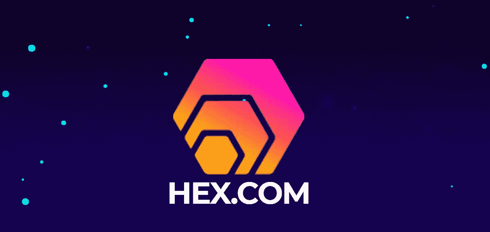
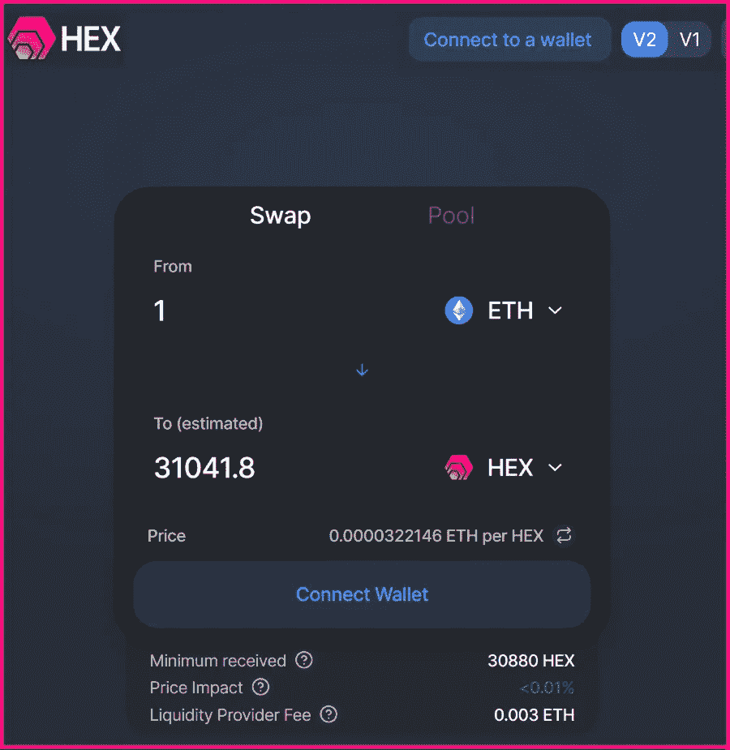
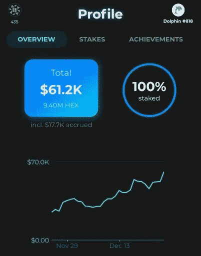
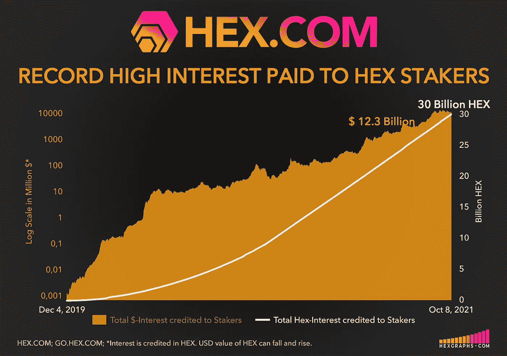
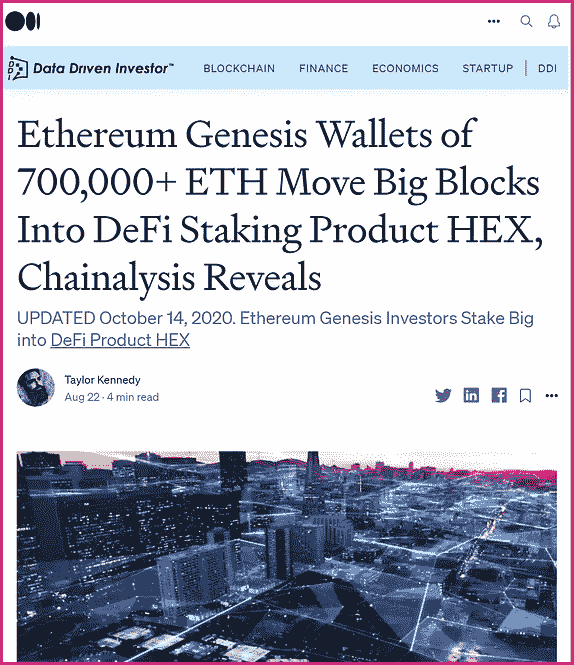
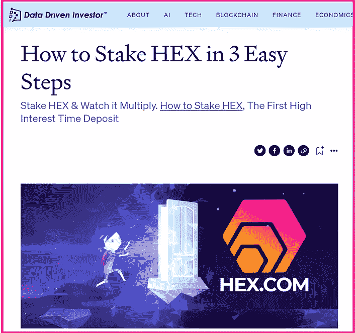

# 如何通过 3 个简单的步骤购买 HEX

> 原文：<https://medium.datadriveninvestor.com/how-to-buy-hex-in-3-easy-steps-d839204c850e?source=collection_archive---------0----------------------->

## 给大家一个简单的指南:[如何购买 HEX](https://hex.com/) ，第一笔高息定期存款

## 这本简单易懂的指南将带你了解如何购买第一笔高息定期存款[HEX](https://hex.com/)。

## **当你在你选择的时间段下注时，看着你的魔法倍增。在写这篇文章的时候，平均长度的赌注赚了 40%的 APY。赌注越大，回报越多。**

# 在下面展开:

## 第一步:设置你的元面具钱包
第二步:获得一些以太坊
第三步:在 Uniswap 上交换十六进制(安全&无需注册)

# 步骤 1:设置元掩码钱包

设置您的私有元掩码钱包只需不到 2 分钟的时间，如以下简单演练所示:

2 Minute Walkthrough Video

# 第二步:买一些以太坊

获得以太坊(ETH)的最简单方法之一是使用新 MetaMask 钱包中的*存款*或*购买*功能，如下一个 1 分钟的短片所示。

*其他选项可能包括使用 Bitstamp、比特币基地、北海巨妖或 Gemini 购买 ETH 并将其发送到您的 MetaMask 钱包地址。*

1 Minute Walkthrough Video

*   另外，按照[HEX.COM](https://hex.com/)的指示，**比特币(BTC)可以变成十六进制**；点击*购买*按钮*；*点击*查看更多详细说明*；向下滚动到*使用加密货币购买十六进制；*选项 *#2。*

 [## 规划和建立您的房地产业务|数据驱动的投资者

### 房地产行业是有史以来最受欢迎的五大职业之一。原因很简单。它确实…

www.datadriveninvestor.com](https://www.datadriveninvestor.com/2020/12/14/plan-and-build-your-real-estate-business/) 

# 步骤 3:在 Uniswap 上交换十六进制

HEX 在 ethHEX.com 的 Uniswap 上有自己的安全前端，无需注册即可轻松安全地将 ETH 换成 HEX:

HEX has its own secure frontend on Uniswap: ethHEX.com

*   转到[ethHEX.com](https://ethhex.com/)
*   点击*连接到钱包*
*   连接您的 MetaMask 钱包
*   输入您想要交换为十六进制的 ETH 数量

*(交易费用需要象征性的 ETH 金额。*

大多数人至少会在钱包里留一小部分 ETH 来支付交易。)

*   点击*交换；确认交换*
*   等待完成后，您的十六进制代币将出现在您的 MetaMask 钱包余额中。

## 就这么简单。现在你拥有了妖术。

如果你有任何问题或想要额外的帮助，你会发现一个非常热情和迷人的团体渴望在官方的 HEX 电报中提供帮助:[https://t.me/HEXcrypto](https://t.me/HEXcrypto)

## 请注意:*永远不要*分享您的元掩码种子短语。

# 赌上你的魔法，看着它成倍增长！

## [如何在 3 个简单的步骤中下注 HEX](https://tldrtaylor.medium.com/how-to-stake-hex-in-3-easy-steps-93bb03281213)

Staker.App on iOS and Android makes staking HEX easy.

想象一下，如果比特币支付给持有人更多比特币，让他们承诺持有自己选择的时间段:定期存款。现在想象一下，如果承诺更长的时间会得到更好的回报，当其他人违反他们的时间承诺时，那些遵守承诺的人会得到更多的比特币——这是一个奖励诚实的在线真相引擎。整体净买卖活动会是什么样的？HEX 做了所有这些，还做了更多。

Check out HEXGRAPHS.com for current metrics.

# 赌注十六进制&看它倍增

[押桩者。App](https://staker.app/invite/PQn8) 让您安全可靠地在链上积累 100%的财富，并实时观察其增长:

更多信息:[HEX.COM](https://hex.com/)

⬣ **的新闻和更新在推特上跟进** : [HEXcrypto](https://twitter.com/HEXcrypto) ， [Richard Heart](https://twitter.com/RichardHeartWin)

https://t.me/HEXcrypto

⬣ [**在 YouTube 上观看话语联盟直播**](https://www.youtube.com/c/DiscourseSyndicate) **M/W/F @晚上 7 点(太平洋标准时间)** ( **话语联盟仅供成熟观众使用)**

# 相关文章:

