# 如何计算股票的内在价值(AAPL 案例研究)

> 原文：<https://medium.datadriveninvestor.com/how-to-calculate-intrinsic-value-of-a-stock-aapl-case-study-935fb062004b?source=collection_archive---------0----------------------->

## 获取公司数据和计算股票内在价值的详细分步指南，包括网络应用程序

股票估值方法对于那些想判断是折价还是溢价购买股票的投资者来说很重要。本文以**苹果**股票为案例，解释了如何使用**贴现现金流(DCF)模型**对一只股票进行估值(即计算其**内在价值**)。让我们进一步了解一下 DCF 模型。

**免责声明:** *我不是理财顾问，本文也不代表任何形式的理财建议。使用这些计算方法进行的任何投资都会带来风险，所以在这样做之前，一定要记得做好尽职调查和研究。*

# 一台提款机值多少钱？

Photo by [albert renn](https://unsplash.com/@albertrenn?utm_source=medium&utm_medium=referral) on [Unsplash](https://unsplash.com?utm_source=medium&utm_medium=referral)

> 你愿意花多少钱买一台一年能生产 100 美元的机器？

想象一下，有一台机器将在一年后产生 100 美元。你会为它支付 100 美元吗？100 美元是盈亏平衡价格吗？

不要！因为你必须等一年才能拿到 100 美元。你会亏本的！因为如果你以 4%的无风险利率投资 100 美元，一年后你会得到 100 美元 x 1.04 美元，20 美元= 104 美元 T21。因此，在这种情况下，100 美元明年就值 104 美元。

那么，你愿意为它支付的最大金额是多少？换句话说，明年收到的*100 美元值多少今年的*？为了在一年内以 4%的无风险利率获得 100 美元，你只需要在今年进行 100 美元/1.04 = 96.15 美元的无风险投资。所以你应该为这样一台机器支付最高 96.15 美元的*。在本例中，**一年的 100 美元相当于今天的 96.15 美元**。*

> *未来收到的钱在今天会贬值。*

> *如果一台机器在下一年**生产 100 美元，在下一年**生产 100 美元，会怎么样？*

*我们已经知道，明年的 100 美元相当于今天的 96.15 美元。*

*两年后的 100 美元相当于今天的 100 美元除以 1.04 的两倍。*(例如，以 4%的利率投资 92.46 美元，两年后你将获得 200 美元。)**

*因此，对于这台机器，你将支付最高**$ 96.15+92.46 = $ 188.61 今天**，这当然低于$200。*

> *一台在接下来的 5 年里每年能产生 100 美元的机器怎么样？*

*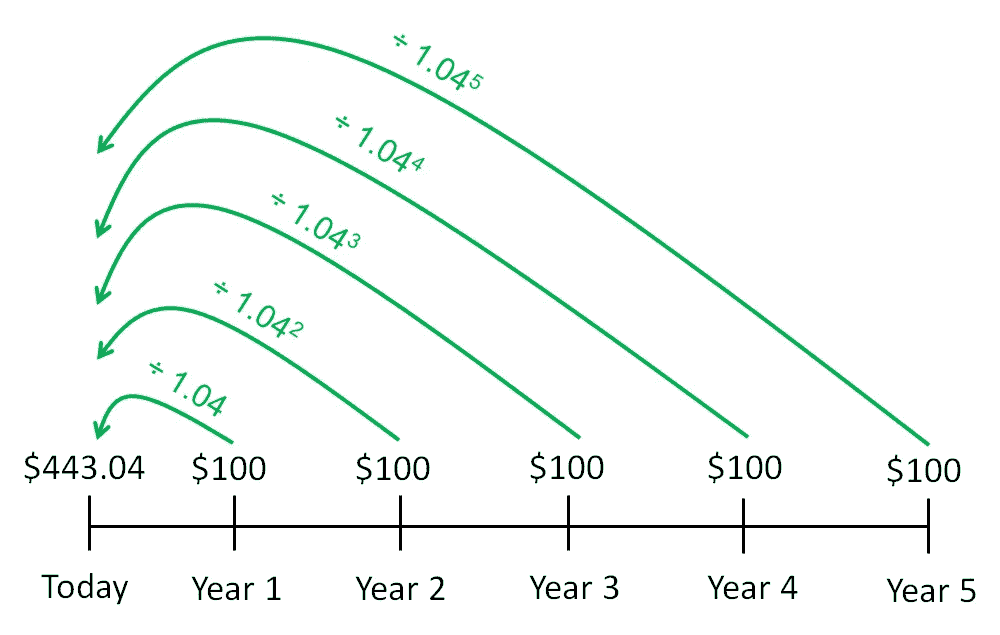*

*Future Cash Flows Discounted to Present Value*

*   *第一年收到的 100 美元相当于今天的 100/1.04 美元*
*   *第 2 年收到的 100 美元相当于今天的 100 美元/1.04 = 92.46 美元*
*   *第 3 年收到的 100 美元相当于今天的 100 美元/1.04 = 88.90 美元*
*   *第 4 年收到的 100 美元相当于今天的$100/1.04⁴= 85.48 美元*
*   *第 5 年收到的 100 美元相当于今天的$100/1.04⁵= 82.19 美元*

*这样你就明白了，只要把每年收到的所有现金流加起来，然后把每个现金流的***贴现到它们今天的*****，就能算出这台机器今天的价值。***

******

***因此，**计算产生第 1 年*****cf₁*、第 2 年***cf₂****n*年**现金流量的机器的现值**的一般公式是这样的，假设**折现率为 *r* :*******

**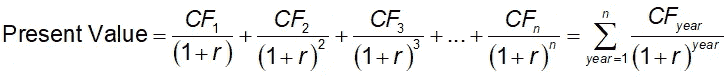**

**在前面的机器示例中，我们使用了一个**贴现率 *r*** 等于**无风险投资率，我们假设该无风险投资率为 4%(即 0.04)** 。这是**而不是**不一定是这种情况，我们将在后面探讨贴现率时看到这一点。**

**请注意，如果公司在成长，未来的现金流会增加。还要注意的是， ***未来*现金流中的每一个都被*贴现*到*当前*价值**，然后所有这些被加起来形成总现值。**

# **评估一家公司**

> **一个公司或企业只是一台“机器”,每年从其业务中产生现金流。**

**但是一个公司目前也可以**持有一些*现金*以及*短期投资*** (可以迅速变现)。它也可能有一些债务，这些债务最终必须偿还。**

**因此，在所有未来现金流的现值之上，我们需要**

*   ****添加现金和短期投资**和**
*   ****减去总债务****

**评估一家公司时。因此，如果一家公司能够产生未来 *n* 年的现金流，则其**当前内在价值将会是这样的:****

**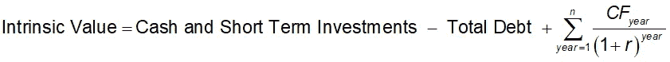**

**我们也可以把它写成:**

**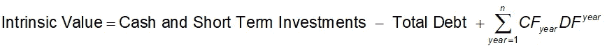****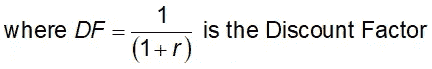**

# ****贴现现金流模型****

**由于一家公司可以发行许多股票，那么一家公司每股*的当前**内在价值应该是:*****

**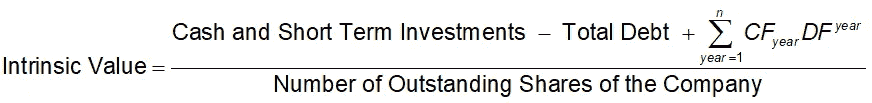**

**这就是所谓的**贴现现金流模型**。**

# ****苹果公司(股票代码:AAPL)案例研究****

**在本案例研究中，我们将应用 DCF 模型来计算苹果股票的内在价值。我们还将讨论如何获得所需的相关公司数据，以及我如何对 DCF 模型中所需的数量进行各种估计。**

****

**Photo by [Medhat Dawoud](https://unsplash.com/@medhatdawoud?utm_source=medium&utm_medium=referral) on [Unsplash](https://unsplash.com?utm_source=medium&utm_medium=referral)**

# **第一步。获得苹果公司的自由现金流**

## ****从哪里获得苹果的现金流****

**以苹果公司(股票代码:AAPL)为例。我们可以从[雅虎财经](http://finance.yahoo.com)获得 AAPL 的财务数据(搜索‘AAPL’，然后进入**财务标签**，然后进入**现金流标签**)。这显示了 APPL 的现金流量表。你也可以对任何公司股票这样做。*如果你不确定现金流量表是什么，它是公司的财务报表之一，在这里* *阅读更多关于它们的* [*。*](https://www.investopedia.com/terms/f/financial-statements.asp)**

** [## 苹果公司(AAPL)现金流-雅虎财经-雅虎财经

### 理解苹果公司(AAPL)的现金流量表，了解钱从哪里来，公司如何花费…

finance.yahoo.com](https://finance.yahoo.com/quote/AAPL/cash-flow?p=AAPL) 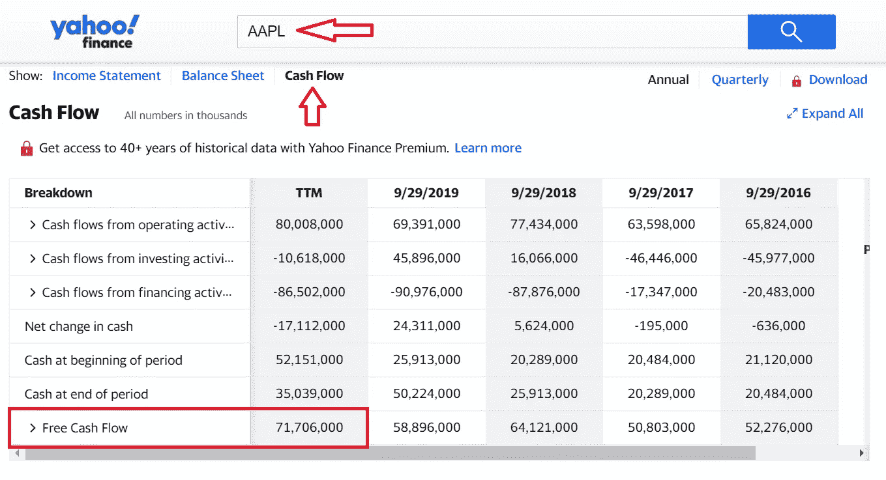

**自由现金流**代表公司在对现金流出进行会计处理后产生的现金，用于支持运营和维持其[资本资产](https://www.investopedia.com/terms/c/capitalasset.asp)。AAPL 为 TTM 创造的自由现金流(过去 12 个月，或最近 4 个季度，即一年)为**717.06 亿美元。** *注意，上表数值以千为单位，其他网站的财务数据可能以百万为单位。*

 [## 收盘，但没有雪茄-股票市场目标在停滞的 COVID 救济中创新高|数据驱动…

### 专家聊天程序:一个协作市场，在这里人们可以和能够解决他们问题的专家聊天。是……

www.datadriveninvestor.com](https://www.datadriveninvestor.com/2020/08/18/close-but-no-cigar-stock-market-targets-record-highs-amidst-stalled-covid-relief/) 

# **第二步。预测未来现金流并将其折现为现值**

苹果的现金流多年来一直呈总体上升趋势(几次下降是可以的，因为我们只是想要一个平均上升趋势)。(虽然苹果的增长速度不再像最初几天那么大了。)

让我们通过检查其未来 5 年的**预测增长率来预测其未来现金流。我喜欢去参观**看看这个。事实上，如果你感兴趣的话，我写了一篇文章使用 Python 来解析 Finviz 公司的基本数据:****

** [## 使用 Python 获得股票的最新财务比率(市盈率、市净率等)

### 大多数 API 给出过时的年度/季度财务比率。下面是一个从 FinViz 获取实时数据的指南。

towardsdatascience.com](https://towardsdatascience.com/get-up-to-date-financial-ratios-p-e-p-b-and-more-of-stocks-using-python-4b53dd82908f) 

只需在 Finviz 中搜索“AAPL”或访问以下链接:

 [## AAPL 苹果公司股票报价

### 苹果公司设计、制造和销售智能手机、个人电脑、平板电脑、可穿戴设备和配件…

finviz.com](https://finviz.com/quote.ashx?t=AAPL) 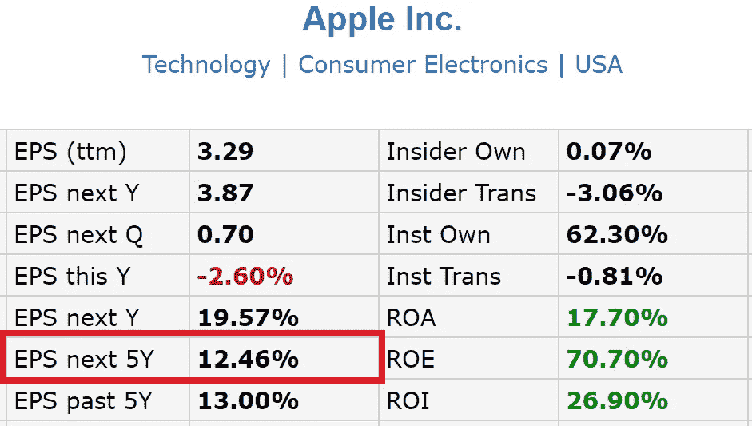

Table of Fundamental Data of Apple in Finviz

从网页中的表格来看， ***EPS 下 5Y*** 就是我们想要的，本例中 **12.46%** 。让我们估计在接下来的 5 年里**自由现金流将以这个速度**增长。

## **第一年至第五年:**

由于本年度自由现金流量为 **71，706，000，000，**前 5 年的未来现金流量，之后

*   **核算增长(乘以增长系数 1+0.1246)**
*   **贴现至现值(乘以贴现因子)**

将 **:**

*   *贴现 cf₁*= 71706000000(1+0.1246)*df*
*   *贴现 cf₂*= 71706000000(1+0.1246)*df*
*   …
*   *打折的 cf₅*=71706000000(1+0.1246)⁵*东风⁵*

## 6 至 10 岁:

我更喜欢对我的公司进行更保守的评估。假设公司会永远这样发展下去是不现实的。因此，对于第 6 年到第 10 年，我假设**增长率减半(6.23%)** 。

第 6 年至第 10 年的未来自由现金流折现为现值，将为:

*   *贴现 cf*₆=*cf₅*(1+0.0623)*df⁶*
*   *打折 cf*₇=*cf₅*(1+0.0623)*东风⁷*
*   等等
*   *打折 cf₁₀*=*cf₅*(1+0.0623)⁵*东风⁰*

请注意，增长系数(1+0.0623)的幂从 1 开始，因为这种增长是建立在第 5 年的现金流**、*、*、**的基础上的，但是贴现系数的幂从 6 开始，因为现金流必须贴现到现在，即第 0 年。

## 11 至 20 岁:

虽然假设苹果在 20 年内仍然存在是合理的，但让我们更加保守地假设苹果的增长率仅略高于 T2 的平均长期通货膨胀率，因此大约为 4%。

**第 11 年到第 20 年的未来自由现金流，贴现到现值，将是:**

*   *贴现 cf₁₁*=*cf₁₀*(1+0.04)*df*
*   *贴现 cf₁₂*=*cf₁₀*(1+0.04)*df*
*   等等
*   *贴现 cf₂₀*=*cf₁₀*(1+0.04)⁰*东风⁰*

# 第三步。获取苹果公司的其他相关公司数据

让我们回忆一下这个公司估值公式。

我们已经将所有的未来现金流折现为现值。

我们仍然缺少

*   **现金和短期投资**
*   **债务总额**
*   **贴现因子，*DF***

## 现金和短期投资

为了得到这个，让我们回到 AAPL 的[雅虎财经](https://sg.finance.yahoo.com/quote/AAPL/balance-sheet?p=AAPL)页面，选择**“财务”**，然后选择**“资产负债表”**，确保选择**“季度”**。

资产负债表仅仅是一个公司到目前为止拥有的资产和负债的清单**而不是*在一段时间内收到了多少现金流量或收入*。因此我们想要这个的**最新快照**(最近的**季度**)。**

**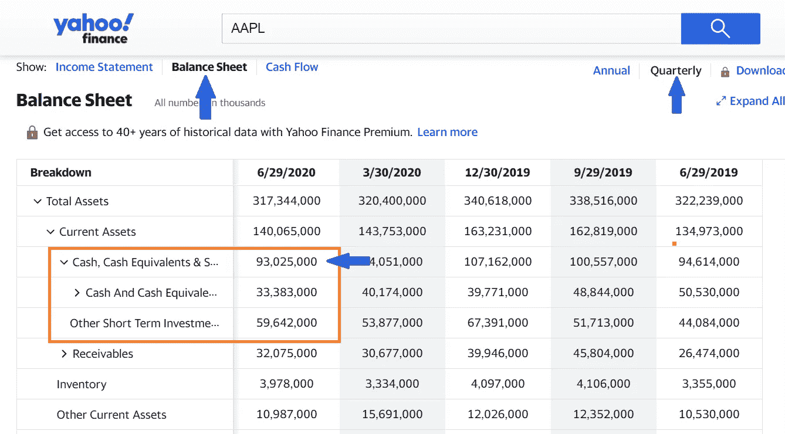**

**上面的**现金和短期投资**已被记录为**93，025，000，000 美元**(记住数值以千为单位)。**

## **债务总额**

**在上表中，向下滚动以读出**总债务**。**

**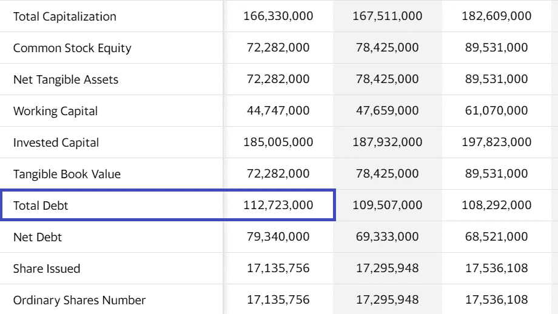**

**总债务为 1127.23 亿美元。有时你可能在表格中找不到这一行，在这种情况下，你必须手动查找并合计当前债务和长期债务。**

## **已发行股票数量**

**为此，我们回到之前访问过的 Apple 的 [Finviz 页面，并从表中读取。](https://finviz.com/quote.ashx?t=AAPL)**

**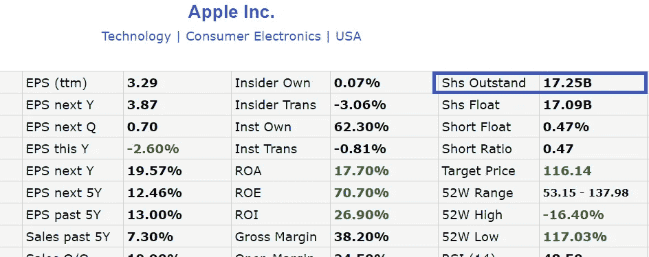**

**因此**发行在外的股票数量为 17，250，000，000 股**(上面的‘B’表示十亿)。**

# **第四步。确定贴现率**

## **贴现率和贴现因子， *DF***

**确定贴现率的第一种方法(我选择*而不是*更喜欢)是，它可以被视为**无风险利率**，就像前面的现金产出机的例子一样。如今，无风险利率(被视为美国国债的收益率)不到 2%。**

**然而**我们希望对贴现率**更高**的公司的估值更加保守**。请注意，如果折现率较高，则**会低于**(因此更保守)当前估值**，因为公司将获得更大程度的折现。低估公司的价值总比高估公司价值并购买实际价值低于其价值的东西要好。****

**让我们来看看估算贴现率的更好方法， *r* 。**

## **只有当预期回报更高时，才承担更高的风险**

**如果投资一家公司**会带来更大的风险**(如果该公司股票**更不稳定，**即相对于市场而言涨跌幅度更大)，我们要求**风险溢价**，即承担更大风险的回报。因此，我们预计这项投资会有更高的回报率，因此贴现率应该比无风险利率高。为了衡量波动性，我们需要利用股票的β， *β* 。**

## ****β的作用****

**在理论上的[资本资产定价模型](https://www.investopedia.com/terms/c/capm.asp)中，一项*投资*相对于无风险利率的预期收益是β乘以*市场*相对于无风险利率的预期收益，公式如下:**

**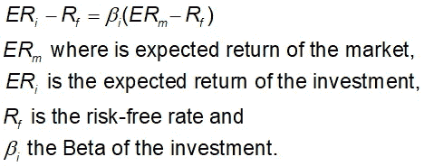**

**我们可以看到，一只股票的**贝塔系数**越高，市场回报就被“放大”得越多(因为它们被放大了一个更大的系数)，相对于任何市场波动，股价的波动也就越大。**

*   *****β <* 1.0** 表示股价理论上比市场波动小。将这支股票纳入投资组合会使其比没有这支股票的投资组合风险更低。**
*   *****β>*1.0***表示股票价格理论上比市场波动更大。例如，如果一只股票的贝塔系数是 1.15，它被认为比市场波动大 15%。科技股往往比市场有更高的贝塔系数，将这些股票加入投资组合会增加投资组合的风险，但也可能会增加预期回报。***
*   ******β=*1.0***表示股票价格和市场一样波动。****
*   ******β <* 0** 表示股票与市场负相关。在本文中，我不会深入探讨这一点。***

**因此，从理论上讲，股票的**贝塔**越高→股票的**波动越大**→风险**越高→** 我们要求的风险溢价(因此回报率)越高→我们将使用的**贴现率越高**。**

**我使用下表作为一个粗略的指南来估算基于 Beta 的贴现率。没有硬性规定。**

**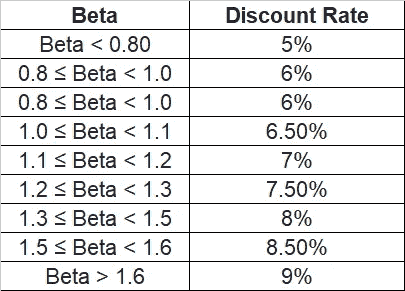**

**当 Beta 为 1.0 时，贴现率被设定为对市场收益率的非常保守的估计，在 6 — 6.5%左右，当 Beta 更高或更低时，其他贴现率分别更高或更低。**

## **让我们从…你猜对了..芬维兹！**

**再次，我们可以从前面提到的 Finviz 中的[同一个表中获得股票的 Beta。](https://finviz.com/quote.ashx?t=AAPL)**

**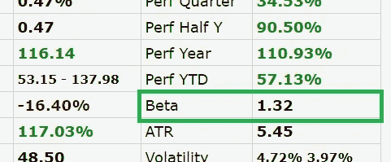**

**苹果的 **Beta 是 1.32** ，因此根据我之前的表格，**贴现率应该是 8.0%，或者 0.08** 。**

**贴现因子 ***DF* 因此为 1/(1+0.08) = 0.9259** 。**

# **第五步。把所有的放在一起**

**我们终于有了计算苹果股票内在价值所需的一切！**

****

**请记住，到目前为止，我们已经获得了以下数量，其中一些将在后面的部分为您替换:**

*   ****呈现自由现金流，*cf₀*:71706000000***(来自* [*雅虎财经*](https://finance.yahoo.com/quote/AAPL/cash-flow?p=AAPL) *)***
*   ****现金和短期投资:93025000000** *(来自* [*雅虎财经*](https://finance.yahoo.com/quote/AAPL/balance-sheet?p=AAPL) *)***
*   ****债务总额:112723000000** *(来自* [*雅虎财经*](https://finance.yahoo.com/quote/AAPL/balance-sheet?p=AAPL) *)***
*   ****增长率(1 至 5 年):** **12.46%或 0.1246** *(来自* [*芬维兹*](https://finviz.com/quote.ashx?t=AAPL) *)***
*   ****增长率(6 至 10 年):6.23%或 0.0623** *(前期增长÷ 2)***
*   ****增长率(1 至 5 年):4%或 0.04** *(略高于通货膨胀率)***
*   ****折现率， *r* : 8%或 0.08** *(从*[*fin viz*](https://finviz.com/quote.ashx?t=AAPL)*)***
*   ****贴现因子*，DF:* 0.9259** *【按 1/(1+r)】*计算**
*   ****流通股数量:17250000000** *(来自* [*芬维兹*](https://finviz.com/quote.ashx?t=AAPL) *)***

## **总结这些**

*   **现金和短期投资= 93025000000**
*   *****贴现 cf₁***= 71706000000(1+0.1246)(0.9259)**
*   *****【cf₂】****= 71706000000(1+0.1246)(0.9259)***
*   ***…***
*   ******贴现 cf₅***=71706000000(1+0.1246)⁵【0.9259】*⁵****
*   *****贴现 cf*₆**=*cf₅*(1+0.0623)0.9259*⁶(cf₅来自之前的计算)***
*   *****打折 cf*₇**=*cf₅*(1+0.0623)(0.9259*)⁷***
*   **…**
*   *****贴现 cf₁₀***=*cf₅*(1+0.0623)⁵(0.9259)*⁰***
*   *****贴现 cf₁₁***=*cf₁₀*(1+0.04)(0.9259)**
*   ******贴现 cf₁₂***=*cf₁₀*(1+0.04)(0.9259)***
*   ***…***
*   ******贴现 cf₂₀***=*cf₁₀*(1+0.04)⁰(0.9259)*⁰****

## **从上面减去这个**

*   ****债务总额** = 112723000000**

## **用这个除上面的**

*   ****流通股数量** = 17250000000**

**现在如果你已经在计算器中完成了上述所有操作(哇！)你最终会得到每股苹果股票的内在价值 84.88 美元。**

# **使用此 Web 应用程序！**

**幸运的是，你不需要计算器来完成所有这些。我已经在我的 [Github 网站](https://damianboh.github.io/stock_value_calculator)上写了一个**的网络应用**(链接如下)。**

 **[## 股票内在价值计算器

### 以下基本数据(包括已发行股票数量)可在 Finviz 中找到。每股收益增长率(年…

damianboh.github.io](https://damianboh.github.io/stock_value_calculator)** 

**你所需要做的就是**将相关数据**输入这个网络应用程序，它会向你显示所有的预计现金流和内在价值。在下面的截图中，我已经为苹果做到了这一点。**

**[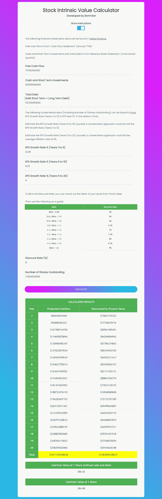](https://bck1990.github.io/)

[Stock Intrinsic Value Calculator Web App](https://damianboh.github.io/stock_value_calculator) that I Wrote** 

**一些模型计算每股的内在价值时没有使用“现金和短期投资”和“总债务”，所以我也加入了这个值。对于我们的例子，我们将得到 86.02 美元的价值，如上所示。**

**这略高于考虑现金和债务时的价值(84.88 美元)(因为债务高于现金持有量，而你没有包括这一事实)。对于其他股票来说，这两个值也可能有更大的差异，但我个人更倾向于考虑现金和债务。所以我们用 84.88 美元的**内在价值**。**

# **假设和其他考虑**

**首先，重要的是，这个模型只能合理地应用于现金流稳定且相当可预测的公司。我使用过去的现金流作为一个很好的衡量标准(多年来的总体上升趋势，几次下降是可以的)。举个例子，脸书的自由现金流看起来也很容易预测。**

**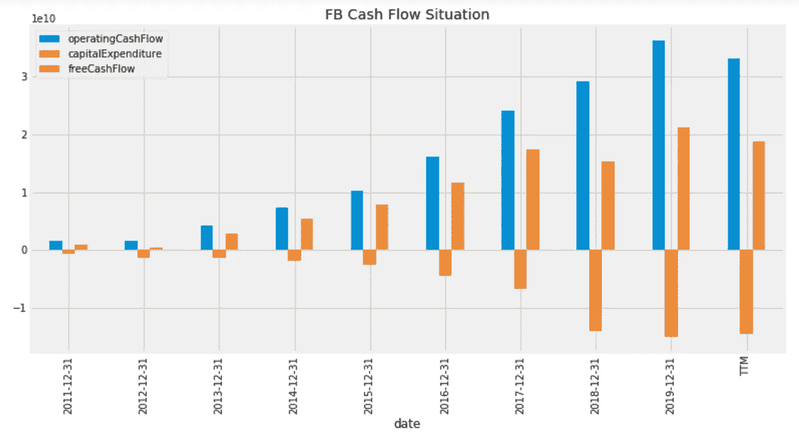**

**Cash Flows for FB**

## **AAPL 股票是被高估了还是被低估了？**

**截至本文撰写时，AAPL 的股价略高于 110 美元，而根据计算(截至本文撰写时)，其内在价值为 84.88 美元。因此，根据这个模型， **AAPL 股票被高估了**。当然，这并不意味着你应该立即卖掉你所有的 AAPL 股票。重要的是要记住，这个内在价值最终只是来自*单一*保守模型的**估计**。这也是 DCF 模型的最简单的形式之一，还有其他的利用不同的参数(预测股息、收益等)。而不是自由现金流)。增长率和贴现率也是估计值。**

**然而，我不会再买 AAPL 的股票了，因为我认为，在过去几个月的大幅上涨之后，截至目前(2020 年 9 月)，整个科技行业的股票(T1)都(T2)有点过度了。(因此，对苹果的估值是合理的。根据这个模型，FB 也有点高估了。)这可能就是为什么我们正处于**市场调整**的原因，在经济数据改善的经济复苏背景下，这一调整主要受到科技行业的拖累。当然，你是否购买苹果股票取决于你的风险偏好，以及你是否相信苹果是一家基本面良好的可靠公司，是否愿意为该股票支付溢价。**

**最终没有一种最准确的股票估值方法，我们不应该仅仅因为某个特定估值模型计算出的数字显示该股票被高估，或者因为下面给出的其他原因而回避股票。**

*   ****被高估的股票可能会继续被高估，甚至变得更被高估。**某些被公众认为具有巨大潜力的“热门股票”将*一直以相对于其“内在价值”的溢价*进行交易，因为股价将一直受到受欢迎程度和*高需求*的推动。如果我们袖手旁观，等待股票被低估的那一天，我们可能会意识到这一天永远不会到来，我们会错过一个巨大的机会。**
*   ****即使股价持续上涨，高估的股票也可能变得低估。**一只股票的估值，就像股票价格一样，*随时间变化*。如果公司突然能够产生更多的现金流，也许是因为它能够创新，吸引更多的客户，增长超过预期，当我们在下个季度使用新的财务数据计算时，它的估值可能会飙升，其幅度远远超过价格上涨。如果我们等到那时，我们就会错过股票价格的上涨。**
*   ****这种贴现现金流估值的方法** **对于自由现金流刚刚转为正值的高增长公司**或者更糟糕的是，现金流仍为负值的公司没有意义。**

## **敬请期待！**

**在我以后的文章中，我会分享并给出上述观点的量化例子。我也在用 Python 写代码，把这个模型应用到股票上，我会分享它，所以**请继续关注**。**

**我希望这篇文章是有用的。你也可以看看我下面的其他文章！**

** [## 使用 Python 对股票进行自动估值

### 苹果股票是否被高估？只需输入 Ticker，让 Python 自动决定！

medium.com](https://medium.com/datadriveninvestor/use-python-to-value-a-stock-automatically-3b520422ab6)  [## 基于 Python 的金融新闻股票情感分析

### 使用 Python 从 FinViz 网站的财经新闻标题中提取股票情绪

towardsdatascience.com](https://towardsdatascience.com/sentiment-analysis-of-stocks-from-financial-news-using-python-82ebdcefb638)  [## 使用 Python 获得股票的最新财务比率(市盈率、市净率等)

### 大多数 API 给出过时的年度/季度财务比率。下面是一个从 FinViz 获取实时数据的指南。

towardsdatascience.com](https://towardsdatascience.com/get-up-to-date-financial-ratios-p-e-p-b-and-more-of-stocks-using-python-4b53dd82908f) 

## 访问专家视图— [订阅 DDI 英特尔](https://datadriveninvestor.com/ddi-intel)******