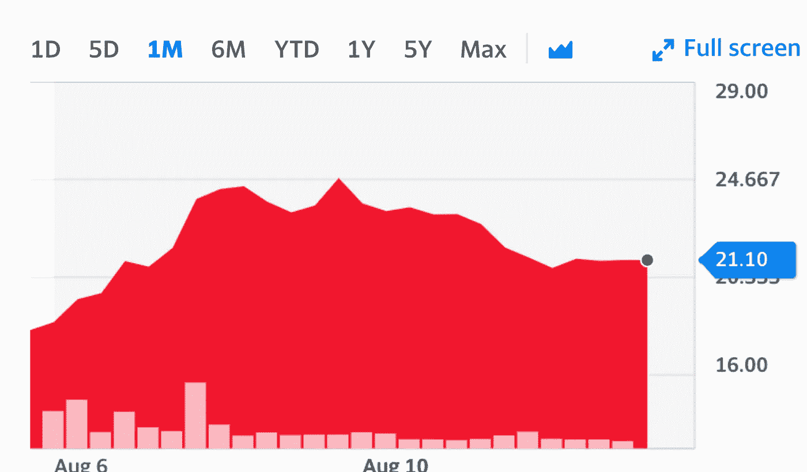

# 如何利用股票市场的炒作和波动

> 原文：<https://medium.datadriveninvestor.com/how-to-capitalize-on-hype-and-volatility-in-the-stock-market-f948af98c23b?source=collection_archive---------8----------------------->

## IPO、新闻和收益报告

Photo by [Pixabay](https://www.pexels.com/search/rocket/) on [Pexels](https://www.pexels.com/search/rocket/)

你可能听说了上周火箭抵押贷款股票(RKT)背后的炒作。

该公司宣布其首次公开募股，也称为首次公开募股，以每股 18 美元的价格出售股票。

有了这样一个快速赚钱的好机会，我确保在股票上市时下单，然后就坐在那里看着它上涨。

一旦我看到一个不错的数字，我很高兴从中获利，我就卖出并退出。在市场上积累资本是在你更熟悉的其他领域增加投资组合的一个很好的策略。

 [## 利用股市相关性的最佳方式|数据驱动的投资者

### 当阿尔弗雷德·温斯洛·琼斯开创了世界上第一个“对冲”基金(后来“d”被去掉了)时，他让其他投资者大吃一惊…

www.datadriveninvestor.com](https://www.datadriveninvestor.com/2020/02/02/the-best-way-to-use-stock-market-correlations/) 

股价攀升至 26 美元，这时候一些投资者特别是罗宾汉加入了炒作。现在，他们正在遭受损失，因为所有的炒作和 T2 波动都消失了。

从长期来看，Rocket Mortage 是一家很棒的公司，但我很确定大多数投资者都买入了，因为他们相信它会在第一周内登上月球。

这仅仅是投资者和交易者如何成为包包持有者的例子之一。

# 什么是包夹？

根据 [Investopedia](https://www.investopedia.com/terms/b/bag-holder.asp) 的说法，袋持有人是一个非正式的术语，用来描述持有证券头寸的投资者，这种证券会贬值，直到变得一文不值。在大多数情况下，袋持有人顽固地保留他们的股份一段时间，在此期间，投资的价值变为零。

我想到的一些公司是 Genius Brands(GNUS)和 TOPS Ships(TOPS)。

有很多人很快就赚到了钱。但是现在有很多人持有这只股票，直到它恢复到至少盈亏平衡。

# 怎么靠炒作赚钱？

我最近的一个策略是参与 IPO，因为每个关注股票的人背后都有一种乐观的心态。

## 什么是 IPO？

IPO 是首次公开募股，股票以公司同意的固定价格上市，根据公众的反应，价格不断变化。

然后，一旦人们抓住炒作，跳上火车，这将推动价格上涨。当我最终对我卖出的利润感到满意时，我就退出，给我更多的资本去做下一件大事。

作为一个相当新的投资者，我持有大量长期股票，同时也有资金用于积极的增长。

## 什么消息推动价格变化？

新闻是让你了解最新投资的好方法，但它并不能保证给你带来成功。

根据 Investopedia 的说法，“追逐新闻对于个人投资者来说不是一个好的选股策略。在大多数情况下，职业交易者是在对事件的预期中做出反应，而不是在事件被报道时做出反应。

## 收益报告如何影响价格？

收益报告通常按季度说明一家公司的收益，要么满足要么不满足投资者的预期。

在疫情这样的不确定时期，收益报告并不能作为股票价格上涨还是下跌的明确指标。仍有不确定性，但这是衡量价格可能会发生什么的一种方式。

根据 [Investopedia](https://www.investopedia.com/ask/answers/06/stockdeclinegoodnews.asp) 的说法，“如果好消息的发布与你的投资主题保持一致，并且出现抛售，这可能代表着你的买入机会，以及以相对较低的价格增加你的多头头寸的机会，而不是随大流。”

只要你做好研究，关注你的投资组合，你就可以用你投资组合的一小部分成功地进行交易。

# 你什么时候卖炒作？

就像生活中的所有事情一样，所有美好的事情都有结束的时候。

因此，请注意图表，并意识到火箭何时返回。重要的是不要太贪你的利润。进去然后出来。

RKT Stock — [Yahoo Finance](https://finance.yahoo.com/quote/RKT?ltr=1)

如果你看一下这个图表，棍子在 18 美元释放，攀升到 24.60 美元左右，然后有一个下降趋势。

你现在看到的是抛售点。人们抬高价格，然后抛售以获取利润。

如果太晚了，就不要上火车。很多投资者就是这样被烧伤的。

进去然后出来。

# 利用波动性

有很多方法可以利用股票市场的行为和模式。

只要你找到适合自己的策略，你就有很大的机会利用我们面临的持续波动。

有些人会成为赢家，有些人会成为输家，但这就是交易。

始终确保做好你的 DD(尽职调查),始终坚持你最了解的。

> “你不必在每一个**音高**上**摆动**。投资的诀窍就是坐在那里，看着**推销**一次又一次**推销**过去，然后等待一个适合你的最佳时机。”

**访问专家视图—** [**订阅 DDI 英特尔**](https://datadriveninvestor.com/ddi-intel)