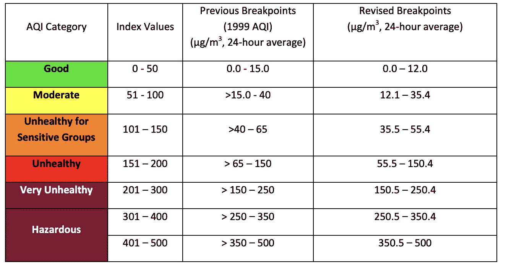
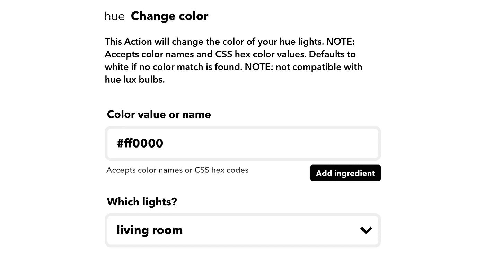
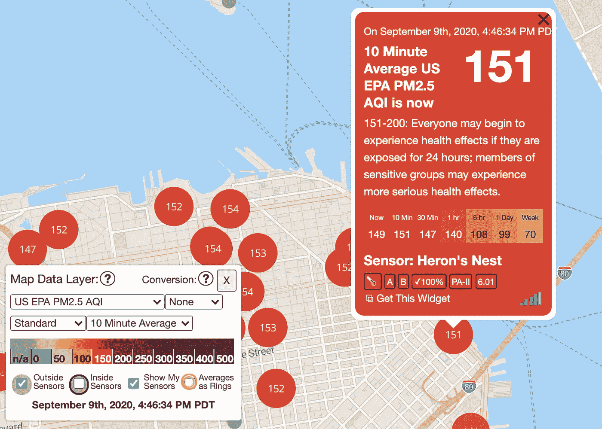

# 如何让你的飞利浦色调灯对空气污染做出反应

> 原文：<https://medium.datadriveninvestor.com/how-to-change-philips-hue-lights-color-depending-on-air-pollution-c92f0af0754e?source=collection_archive---------9----------------------->


A photo I took from Dolores Park on Sep 9, 12 pm

> 注意:我不是空气质量专家，我只是使用了来自 [EPA](https://www.epa.gov/) 的共享知识，根据他们的颜色代码创建了一个脚本。

W 随着[湾区火灾的加剧](https://www.nytimes.com/2020/09/09/climate/nyt-climate-newsletter-california-wildfires.html)和空气污染的加剧，根据美国环保署的规定，当空气质量达到非良好(0-50 空气质量指数)[时，我们被要求避免开窗并打开空气净化器。](https://www.epa.gov/indoor-air-quality-iaq/wildfires-and-indoor-air-quality-iaq)



The color coding from [EPA website](https://www.epa.gov/sites/production/files/2016-04/documents/2012_aqi_factsheet.pdf)

由于空调在旧金山并不常见，而且热浪达到+100 华氏度(37 摄氏度)，很难一直关着窗户，每次我想看看打开窗户是否安全时，检查污染水平都很麻烦。

我根本不是一个开发人员，但是当我在避难所期间自学如何编码时，我决定试着把一些东西放在一起。我抬起头来:

1.  空气质量传感器的开放 API 因为我没有传感器；
2.  一种通过代码与我的飞利浦色调连接的方式，并代表空气质量的 EPA 颜色编码。我通过使用 IFTTT Webhooks 和 PurpleAir API 找到了解决方案，我将在这里进行描述。

要完成这项工作，您需要:

*   至少一个[飞利浦色相灯](https://www.philips-hue.com/)；
*   我不是开发人员，但是你需要一些知识来安装 Python 和一些库。

# 设置 IFTTT Webhook

首先，确保你有一个 [IFTTT 账户](https://ifttt.com/)，并将其与你的[飞利浦 Hue 账户](https://ifttt.com/hue)相连接。

> 注意:我注意到 IFTTT 现在限制了运行的小程序的数量，所以你可能需要删除一些来实现这个功能。


*   点击[创建](https://ifttt.com/create/)，开始一个新的程序；
*   点击" If this "并选择" Webhooks "添加一个事件名称，并添加一个名为" red "的事件；


*   为您想要在飞利浦色调灯上显示的颜色添加十六进制值，并显示您想要更改的灯。在我的情况下，我只改变了客厅，这是靠近主窗口的灯；



*   对所有想要表现的颜色重复此过程。就我而言，我有:绿色(好)、黄色(中等)、橙色(对敏感人群不健康)和红色(不健康+)；
*   你创建的每个 webhook 都有一个 URL，我们很快就会用到它们；

好了，这部分做完了。您可以通过访问 webhook URL 来检查它是否工作，并观察它的灯光颜色变化。

[](https://www.datadriveninvestor.com/2020/05/12/speeding-up-the-digitalization-of-the-tech-banking-cloud-and-ai-as-the-pandemic-winners/) [## 加速科技银行的数字化:云和人工智能成为疫情赢家|数据驱动的投资者

### 疫情新型冠状病毒的经济效应正在把斗争推向每个国家的主要产业…

www.datadriveninvestor.com](https://www.datadriveninvestor.com/2020/05/12/speeding-up-the-digitalization-of-the-tech-banking-cloud-and-ai-as-the-pandemic-winners/) 

# 利用紫色空气获取传感器数据

紫色空气是一家销售空气质量传感器的公司，并在他们的网站上分享他们的数据，所以由于我没有传感器，我使用他们的数据来通知我的灯状态。



*   [进入紫色数据图](https://www.purpleair.com/map)，取消“外部传感器”标记，选择离您最近的传感器；
*   点击“获取此小部件”,您将看到如下所示的 HTML 代码:

```
<div id='PurpleAirWidget_60019_module_AQI_conversion_C0_average_10_layer_standard'>
```

*   显示的第一行(如下)将为您提供传感器 ID，在本例中为“60019”。


This red light means I cannot open the windows now 😢

# 让一切都与 Python 协同工作

*   [克隆 GitHub](https://github.com/ReagentX/purple_air_api) 的紫色空气 API
*   将下面的脚本复制到他们的脚本文件夹中——由于我不是开发人员，我的朋友[蒂亚戈·罗梅罗·加西亚](https://medium.com/u/a9cf8b3432bf?source=post_page-----c92f0af0754e--------------------------------)在这里帮助了我；
*   确保您将“60019”替换为您想要的紫色空气传感器；
*   用你的 webhook 链接替换 webUrl 变量，每种颜色一个；
*   🎉就这样，现在就运行它！

> 注意:这个脚本每 16 分钟运行一次，所以从技术上来说你必须保持它运行来更新你的灯光颜色。你可以让它在网络服务中运行，但请记住，Purple Air 对请求有一个限制，尽管他们没有说明限制是什么。

📺让我们建立联系吧！我每周二下午 5 点在 Instagram 主持关于产品和 UX 的讲座
👉在 Instagram 上关注[细胞和像素](http://www.instagram.com/cells.and.pixels)并在所有[播客平台上收听](http://www.cellsandpixels.com/)

**访问专家视图—** [**订阅 DDI 英特尔**](https://datadriveninvestor.com/ddi-intel)