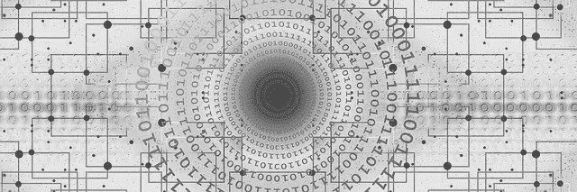

# 如何根据贵公司的需求选择聊天机器人

> 原文：<https://medium.datadriveninvestor.com/how-to-choose-a-chatbot-for-your-companys-needs-3f66e902cb6e?source=collection_archive---------27----------------------->

聊天机器人本质上是一种计算机程序，可以通过互联网以一种感觉像自然对话的方式与人类互动。在您的企业中使用它们可以提供出色的客户服务，同时节省时间和金钱。聊天机器人在各种行业中越来越受欢迎。事实上，在过去的一年里，全球 67%的消费者使用聊天机器人来获得客户支持。

# 如何选择聊天机器人的 5 个技巧

如果你想知道如何选择聊天机器人，请记住，并不是所有的聊天机器人都是平等的。所以，在为你的企业选择聊天机器人时，要记住以下几点。

**1。弄清楚你想解决什么问题**

选择聊天机器人并不是一个一刀切的任务。每个企业都会带来各种各样的问题和行业特有的担忧。花时间去了解你的顾客和他们的购买之旅。多花些时间与其他业务部门会面，确定聊天机器人可以满足哪些需求。为你的机器人定义一个用例。

**2。确定您的聊天机器人是否需要支持多个频道**

您的客户可以使用多种平台来访问您的聊天机器人。当你选择聊天机器人时，你可能希望它能整合不同的社交媒体和在线应用。在项目开始时了解您的平台将确保为所有客户提供平稳一致的服务。

**3。构建你的聊天机器人，让它知道何时与顾客互动**

智能聊天机器人准确地知道何时开始与客户互动。没有人喜欢一开始浏览网站就被纠缠。但你也不希望客户在搜索“帮助我”按钮时变得越来越沮丧。花些时间和你的团队一起为你的机器人的第一次亮相建立正确的平衡。

**4。构建你的聊天机器人，这样成功就会被自动测量**

您需要访问一个图形用户界面(GUI ),让您衡量您的聊天机器人工作得如何。作为一个额外的提示，确保你知道你用什么 KPI 来决定成功。否则，很难判断聊天机器人是否增加了价值，是否符合你的期望。

**5。与训练有素的专业人员一起创建您的聊天机器人**

设计一个有用的聊天机器人不是一件容易的事情。与拥有构建各种聊天机器人解决方案经验的聊天机器人顾问合作。它们不仅可以确保资源的有效利用，还可以帮助您浏览不同类型的聊天机器人，以及哪种最适合您公司的使用案例。

> [**首席战略官、高级营销人员、销售主管中 80%的受访者已经在使用聊天机器人，或计划在 2020 年底使用聊天机器人。**](https://hbr.org/cover-story/2017/07/the-business-of-artificial-intelligence)

# 从低到高的复杂性:3 种聊天机器人

# 小型 DIY 聊天机器人

为你的生意 DIY 一个聊天机器人是可能的，并且它确实呈现一些储蓄。

这些简单的聊天机器人也被称为发现或基本聊天机器人。虽然 DIY 聊天机器人通常是免费的，但它们也存在一些缺点，比如能力有限和失败风险较高。众所周知，预算聊天机器人会失败，因为通过最少的编程，它们只能响应简单的命令。

这些公司可以帮助构建低价的 DIY 聊天机器人:

*   [费里克斯](https://fayrix.com/?utm_source=clutch) ($5000+)
*   Unibot ($5000+)

# 中—交易型聊天机器人

交易机器人与客户互动，帮助他们进行交易，如购物、支付账单或预订航班。这些聊天机器人的价格通常在 1 万至 3 万美元之间。这个级别的聊天机器人通常是基于规则的。有一组预先确定的问题/答案。如果没有明确的答案，规则机器人就无法回答这个问题。他们与客户的对话类型有限。

这些公司可以帮助构建中等预算的聊天机器人:

*   [OTR](https://otr.eu/?utm_source=clutch.co&utm_medium=referral&utm_campaign=developers-artificial-intelligence-chatbots)(10，000 美元以上)
*   聊天机器人工作室(1 万美元以上)
*   [代码大师](https://masterofcode.com/?utm_source=clutch.co&utm_medium=referral&utm_campaign=directory)(2.5 万美元以上)

# 大型预测聊天机器人

预测聊天机器人，或称[对话人工智能](https://chatc.ai/top-5-exciting-tech-trends-for-2021/)聊天机器人，是用来预测客户意图并提供具体帮助或建议的。将预测分析构建到人工智能代理中，允许它在客户要求之前为他们推荐产品和服务。对于人工智能聊天机器人，它们被设置了一系列规则，但被编程为从每次互动中学习。这意味着他们在不断提高答案的质量。这类聊天机器人的价格从 4 万美元到 10 万美元不等。

这些公司可以帮助构建高端预算的聊天机器人:

*   螺丝起子(10，000 美元以上)
*   [Intellias](https://www.intellias.com/?utm_source=clutch.co&utm_medium=referral&utm_campaign=Clutch)(5 万多美元)
*   [塔莱蒂卡](https://www.talentica.com/?utm_source=clutch.co&utm_medium=referral)(5 万多美元)

# 如果你对所有的选择感到不知所措，请继续读下去！

好消息是——你不必孤军奋战。聊天机器人顾问可以帮忙。从一开始，聊天机器人顾问就在那里管理项目，为您的项目与合适的开发人员联系，并提供所有需要的培训和维护。

聊天机器人顾问甚至可以在以下方面提供帮助:

*   关于聊天机器人的教育
*   确定特定的用例
*   构建你的机器人的对话风格
*   为你的聊天机器人写对话
*   使用 KPI 衡量聊天机器人的成功

***您有兴趣使用聊天机器人改变您的客户服务吗？*** [***进入***](https://chatc.ai/) ***今天就联系聊天机器人顾问，让您的问题得到解答！***

*原载于*[*https://chatc . ai*](https://chatc.ai/how-to-choose-a-chatbot/)*。*