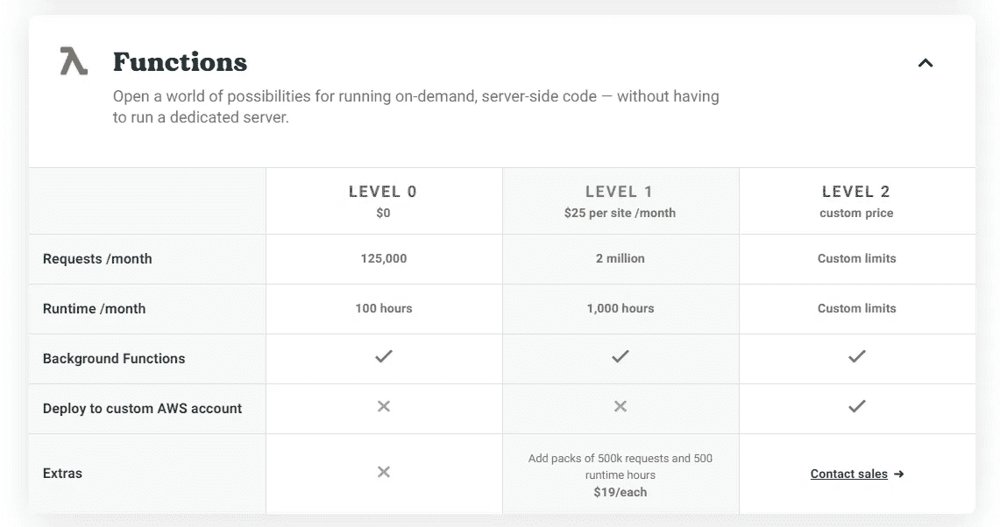

# 如何选择您的第一个技术堆栈

> 原文：<https://medium.datadriveninvestor.com/how-to-choose-your-first-techstack-95b50f6a6c28?source=collection_archive---------10----------------------->

## 这么多框架，时间这么少。省得麻烦自己选！

Photo by [AZGAN MjESHTRI](https://unsplash.com/@azganmjeshtri?utm_source=medium&utm_medium=referral) on [Unsplash](https://unsplash.com?utm_source=medium&utm_medium=referral)

在科技行业这么多年。我向你保证，我已经得到了我应得的技术。大量不同的框架旨在以各自不同的方式实现相同的目标。偏好不同技术组合的团队。你学什么并不重要，重要的是你能多快适应。

在这篇文章中，我可能不会给你确切的答案。因为我相信，你应该找到适合自己的东西。我会解释我选择筹码时的想法。

# 作业堆栈

当你刚开始作为一名软件工程师工作时，你会意识到你不能决定你的公司最初会使用什么样的技术。你需要更多的声誉和权力来做这些决定。

所以，你被困在一个使用 [VB 6.0](https://winworldpc.com/product/microsoft-visual-bas/60) 的遗留系统中。或许那不应该是你的选择。如果你曾经使用过 [VB 6.0](https://winworldpc.com/product/microsoft-visual-bas/60) 该死的，这些年来编程是如何改进的。不，这不是为 [VB 6.0](https://winworldpc.com/product/microsoft-visual-bas/60) 背书。

在我公司，我们主要用 C#和 PHP。当我刚开始的时候，我被指导使用 C#和 ASP.NET MVC，然后在我的第二年继续使用 PHP 和 CodeIgniter。所以选择在这两者之间。

我选择了 C#。为什么？主观的部分来了。PHP 对我来说不是一门语言。它太灵活了，有太多的语法做同样的事情。我的经验是 PHP5，现在是 PHP7，情况有所改善，但我已经在 C#上投入了更多的时间。

这里的要点是，你可以选择用当前雇主使用的现代语言来深化你的技能。这会更容易，你可以用你雇主选择的语言来建议一些很酷的东西的实现。

例如，最近当被赋予创建多线程后台服务的任务时。使用 C#和[。NET Core](https://dotnet.microsoft.com/download) 真的帮我为我的雇主精心设计了一个完美的解决方案。

最好的部分不是解决方案，最好的部分是团队中的任何人都可以维护您的应用程序。协作将会很容易，因为所使用的语言被你公司的工程师普遍理解。

唯一的缺点是缺乏自由。你不能把你的意愿强加给你的雇主，如果你试图掌握一门不同的语言，你最终会同时学到两件事。这取决于你个人，但我宁愿避免这种情况。

# 瑞士军队

哦，瑞士军队！听起来很酷，不是吗？

这个特殊的堆栈主要由一种语言和针对不同情况的多种不同框架组成。Javascript/ [NodeJS](https://nodejs.org/en/) 生态系统就是一个很好的例子。

## java 描述语言

这里谁不知道 NodeJS？查一下。

使用像 [React](https://reactjs.org/) 、 [Vue](https://vuejs.org/) 或 [Angular](https://angularjs.org/) 这样的前端框架已经成为常态。都是用 Javascript/ [Typescript](https://www.typescriptlang.org/) 。那么，除了 Javascript 之外，为什么还要费心去学习一门不同的语言呢？只需使用 [Express](https://expressjs.com/) 进行后端和所有设置。全栈 Javascript 开始了。

> 嘿，你知道 Javascript 也能做 AI 吗？可以，有个库叫 [Tensorflow.js](https://www.tensorflow.org/js) 。别告诉我这不神奇。！

需要澄清的是，我并不支持 Javascript。它只是拥有大量功能的语言之一。另一个例子是 Python，可能还有 [Dart](https://dart.dev/) 。

## 计算机编程语言

我不知道你怎么想，但是 Python 现在仍然很流行。它仍然没有失去它容易使用的吸引力。你可以用 Python、web 应用、API、AI 应用、后台服务等做很多事情。

据我所知，Javascript 生态系统的 AI 库还没有 Python 成熟。Python 是人工智能的主要首选语言。Youtube 人工智能编程教程通常是使用 Python 完成的。有些例外是使用 Javascript，但我的论点仍然成立。

> 但是 Python 确实不擅长前端编程。Javascript 在 GUI 构建方面遥遥领先于 Python。

## 镖

老实说，这应该是一个荣誉奖。但是因为这个环境相当有趣并且有一些潜力，我想我应该把它公之于众。

所以， [Dart](https://dart.dev/) 背后的主要动力是谷歌的 [Flutter](https://flutter.dev/) 。至少可以说，面向桌面、移动和 Web 的多平台前端框架的前景非常光明。

> 当然，Javascript 有一个多平台框架。还有[反应原生](https://reactnative.dev/)。但这只对[反应过来的](https://reactjs.org/)。所以，移动和网络。 [Electron.js](https://www.electronjs.org/) 怎么样？当然，它适用于台式机。但是[单刀赴会](https://flutter.dev/)圆规全部三个。

虽然是后端。前景并不乐观。我所知道的唯一使用 Dart 的后端框架大概就是 [Aqueduct](https://aqueduct.io/) 。虽然说实话，我还没有时间去研究。所以我不知道它是否已经可以生产了。

在这三种语言中，我认为 Dart 是最不成熟的技术。一个不成熟的技术栈可以为新开发者带来为开源生态系统做贡献的机会，但是不利的一面是生态系统非常不稳定。

# 成熟的堆栈

什么定义的成熟？这些技术已经存在一段时间了。已经过实战测试，许多应用程序都在使用它们。

例如，就 web 框架而言，一个成熟的框架应该是 C#的 ASP.NET、Java 的 Spring、Python 的 Django、PHP 的 CodeIgniter、Symfony 和 Ruby on Rails。这些是一些最古老的技术堆栈，开发于 2002 年至 2006 年。许多公司应用程序使用这些框架。

如果你想加入大公司，了解这些技术是有好处的。新的创业公司有非常不同的技术堆栈，不是因为这些框架不好。而是因为现在有更多的生产就绪选项。

我个人已经尝试了前面提到的 3 个框架。ASP.NET、姜戈和路比。我最喜欢的是 Ruby on Rails。Django 对我来说总是太复杂，我更喜欢使用 Flask 进行 Python web 开发。在 Linux 上运行 ASP.NET 应用程序很难，所以我也放弃了。

# 那么，我该选哪个呢？

这就是它固执己见的地方。

> 对此不能全信，你自己试试吧。除了我在这里所写的之外，还有很多技术可以利用。

如果你不喜欢你的工作堆栈，那么你可以只将它用于专业目的，并尝试用你喜欢的技术堆栈找到另一份工作。你对此无能为力。

> 我的简单指导是掌握一种面向对象的语言和一种脚本语言，如果你幸运的话，这两种语言都是多平台的。

另一方面，我喜欢 C#和。NET Core，所以这对我来说不是问题。比起 Java，我更喜欢它，因为 C#库很有帮助，而且对我来说已经太熟悉了。。NET Core 也是多平台的，与以前的 ASP.NET 版本不同，它可以在 Linux 上无缝运行。

我选择的脚本语言是 Python。用 Python 写东西非常简单。我对这种语言给我的灵活性感到非常满意。这些库也很成熟，因为我痴迷于人工智能，所以在 web 应用程序中实现人工智能模型是无缝的。

看到我的选择，你可能会疑惑。“嗯，所以 C#和 Python。不都是后端语言吗？”，你是对的。除了 C# Blazor。但是我不怎么用 Blazor，所以我会对此视而不见。

对于前端，我使用 Javascript 框架。这将我的能力限制在纯 web 应用程序上，因为 Javascript 框架大多以其前端 web 框架而闻名。但学习 Javascript 的另一个好处是，它是一项热门技能。Javascript 可以为前端和后端提供生产就绪的环境，大多数公司都利用了这一点。

此外，Javascript 还有另外一个好处，那就是它是一个免费的技术栈。我的意思是。有一种服务叫做 [Netlify](https://www.netlify.com/) 。Netlify 托管 JAM Stack 应用程序，如果您的流量相当小，Netlify 会免费支付费用。JAM 代表 Javascript、API、标记。此外，Netlify 还有一项名为[的服务。](https://www.netlify.com/products/functions/)

Netlify JAM Stack hosting pricing as of November 2020, Image from [Netlify](https://www.netlify.com/pricing/#features).

Netlify 函数利用无服务器技术，使用 Javascript 制作简单的 API，以 AWS Lambda 为基础。你只有在 125k~左右的请求后才被收费。

Netlify Functions pricing as of November 2020, Image from [Netlify](https://www.netlify.com/pricing/#features).

我的下一句话可能听起来有争议，但在我看来，将 Javascript 添加到知识库中可以帮助你找到工作。它非常受欢迎，非常灵活。由于是多平台的，它具有成本效益，是许多现代创业公司的选择。一些公司也计划迁移到 Javascript 环境。

# 结论

那又怎样？找到你的职业了吗？不要着急。挺好的。做你认为正确的事。如果你想全部学会，请便。我已经处于想要掌握概念而不是框架的阶段，所以我可以说我理解这种感觉。慢一点，但要确定，你不会在一夜之间掌握全部。

> "大师失败的次数比初学者尝试的次数还要多."斯蒂芬·麦克拉尼

不要害怕尝试。失败只是一步。谢谢你，祝你愉快！

*原载于 2020 年 11 月 18 日*[*【https://www.datadriveninvestor.com】*](https://www.datadriveninvestor.com/2020/11/18/how-to-choose-your-first-techstack/)*。*