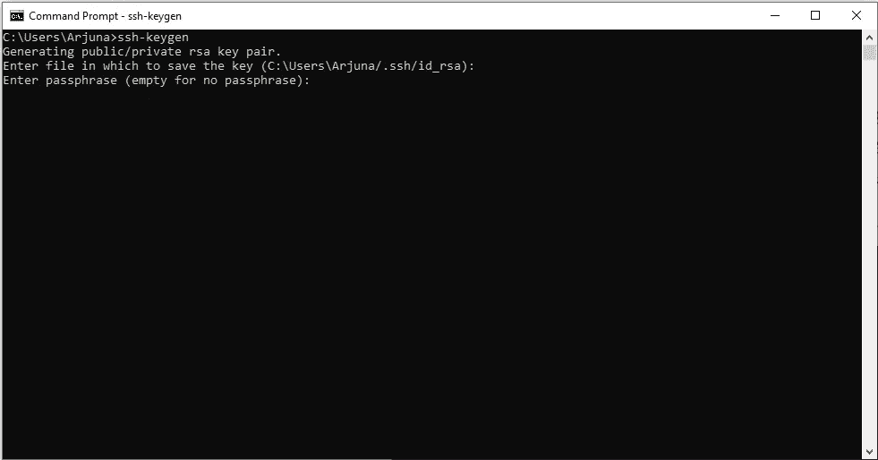
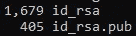
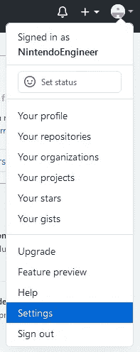
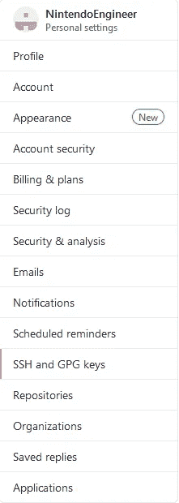
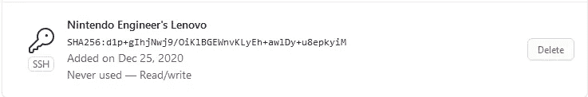
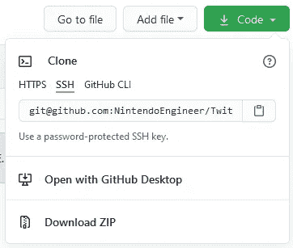
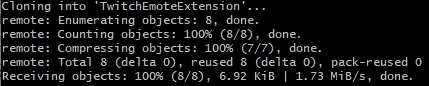

# 如何使用 SSH 为 Windows、Linux 和 MacOS 克隆 GitHub 存储库

> 原文：<https://medium.datadriveninvestor.com/how-to-clone-a-github-repository-using-ssh-for-windows-linux-macos-78ad9a3959e?source=collection_archive---------0----------------------->


Photo by [Yancy Min](https://unsplash.com/@yancymin?utm_source=medium&utm_medium=referral) on [Unsplash](https://unsplash.com?utm_source=medium&utm_medium=referral)

有些人，比如我，更喜欢使用 SSH 而不是 HTTP(S)来使用 Git，在 HTTP(S)中，您必须输入您的 Git 凭证，您可能已经忘记了，或者它可能只是一个不友好类型的安全密码。

不管是什么原因，如果你刚开始接触源代码控制、GitHub 或两者的奇妙世界，并想立即开始使用 SSH，那么如何着手会很困惑。所以这是我试图让它更容易理解；我们开始吧！

## 生成 SSH 密钥

这比听起来简单多了。在 home 文件夹中弹出一个命令提示符(在 Windows 上)或一个终端(在 Linux/MacOS 上)，这应该是它的默认位置。在那里，输入以下命令并按回车键(在 Linux/MacOS 上，您可能需要在它前面加上 **sudo** ):

```
ssh-keygen
```

当你这样做时，你会看到你的操作系统问你一些问题，从哪里存储生成的公钥和私钥对开始。我保留默认设置，只需按回车键。这将把密钥存储在*你的个人文件夹* /中。ssh/ folder。


接下来，您将被要求输入可选的密码。该密码用于加密您的私钥，因此即使潜在的攻击者得到了它，他们也无法使用它。我通常将此留空，但是如果您决定选择一个密码，请确保它是安全的并且您会记住(最好将其存储在安全的地方)。如果您在键入时看不到任何内容，也没关系，这也是为了掩盖密码的长度。



接下来，您将被要求重复密码(或者如果您愿意，再次留空)，您将获得一个漂亮的 randomart 图像。此时，您的密钥已经创建完毕。我们去看看他们。如果您仍在个人文件夹中，则很容易进入。ssh 文件夹，你要做的就是

```
cd .ssh
```

然后回车。在这里，输入**目录** (Windows)或 **ls** (Linux/MacOS)，你会看到两个新文件:



我们感兴趣的用于 GitHub 的是 **id_rsa.pub** 。

永远不要与任何人或任何事分享你的私人钥匙，那只属于你。如果您认为您的私钥可能被泄露，请再次执行这些步骤来覆盖您的密钥。

现在，我们把这个文件的内容复制到你的剪贴板上，这样我们就可以在 GitHub 上使用它了。

对于**窗口**，键入以下命令并按回车键:

```
type id_rsa.pub | clip
```

对于 **MacOS** ，命令为:

```
pbcopy < id_rsa.pub
```

对于 **Linux** ，我建议安装 xclip:

```
sudo apt install xclip
```

然后运行:

```
xclip -sel c < id_rsa.pub
```

很好！现在，我们已经将密钥放在了剪贴板上，可以继续下一部分了。

[](https://www.datadriveninvestor.com/2020/10/12/4-key-habits-i-learned-as-a-software-engineer/) [## 我作为软件工程师学会的 4 个关键习惯|数据驱动的投资者

### 我从事软件工程已经快 3 年了。老实说，我不认为我擅长这个(我不知道我会不会…

www.datadriveninvestor.com](https://www.datadriveninvestor.com/2020/10/12/4-key-habits-i-learned-as-a-software-engineer/) 

## 向 GitHub 添加您的 SSH 密钥

登录你的 GitHub 账户，点击右上角的图标，点击**设置:**，进入账户设置



在左边，选择**宋承宪和 GPG 键**，点击右上角的**新宋承宪键**按钮



您将看到一些要填写的字段。为您的机器输入一个配件名称，并将您复制的内容粘贴到**键**字段:


点击 **Add SSH key** ，你应该会看到它已经添加到你的列表中了。



从现在起，您可以使用 SSH 克隆您的帐户的存储库了！

## 克隆存储库

最简单的部分。只需转到您可以克隆的任何存储库，点击 **Code** 按钮，选择 **SSH** 并将该 URL 复制到您的剪贴板，旁边有一个方便的按钮。



现在打开命令提示符(以管理员身份)或终端(对于 Windows 用户，我强烈建议使用 [Git for Windows](https://git-scm.com/download/win) )来克隆这个库，并运行下面的命令:

```
git clone THE_URL_YOU_JUST_COPIED
```

然后回车。



对于您克隆的存储库，您应该会看到类似的东西(我使用了我的 [Twitch Emote 扩展 repo](https://github.com/NintendoEngineer/TwitchEmoteExtension) )。

就是这样！您已经使用 SSH 成功克隆了一个 GitHub 存储库。现在，您可以随意克隆更多，因为 SSH 密钥已经注册到您的帐户中。快乐编码！

## 访问专家视图— [订阅 DDI 英特尔](https://datadriveninvestor.com/ddi-intel)