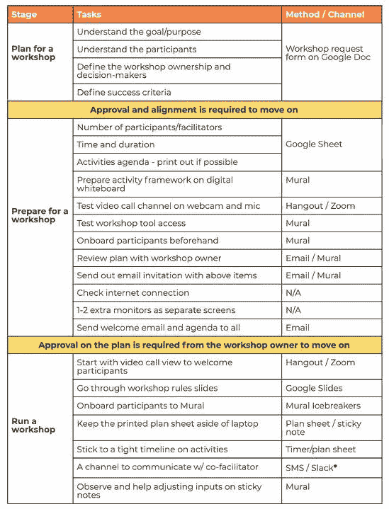
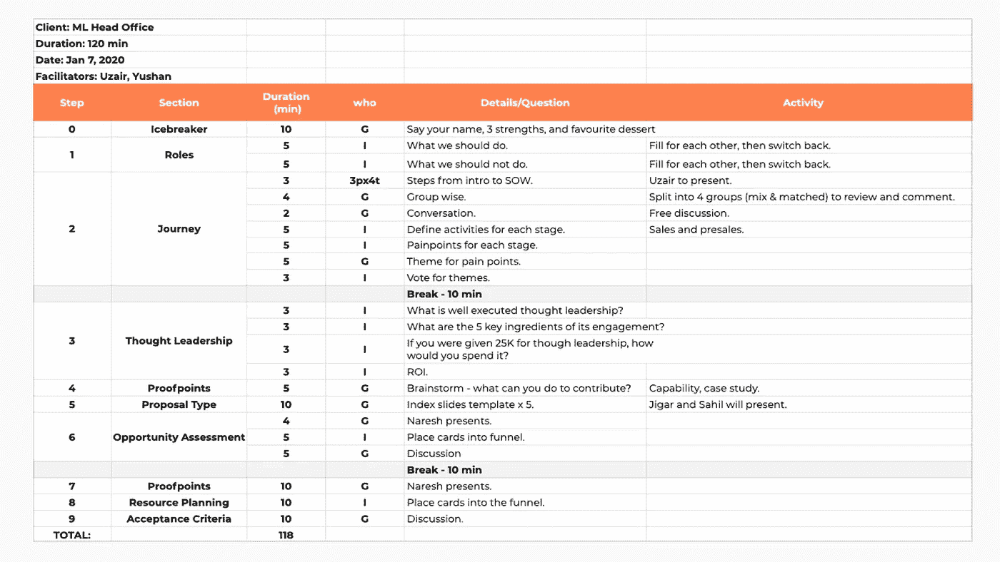
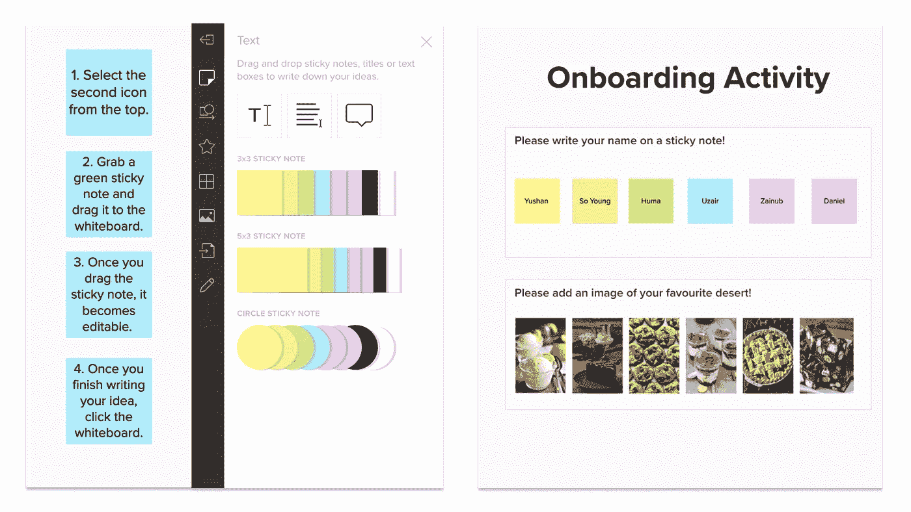
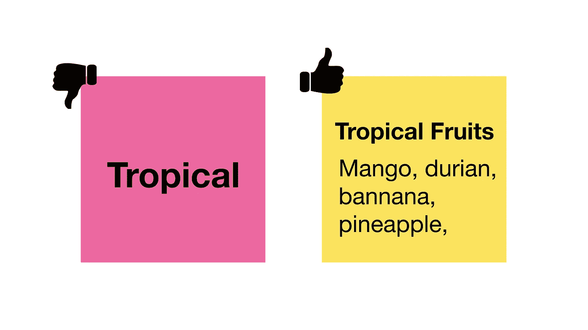
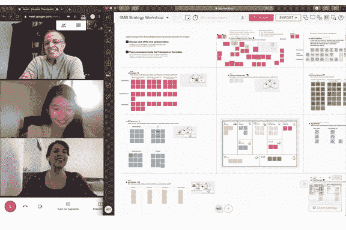
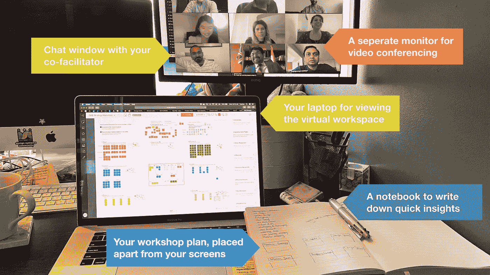
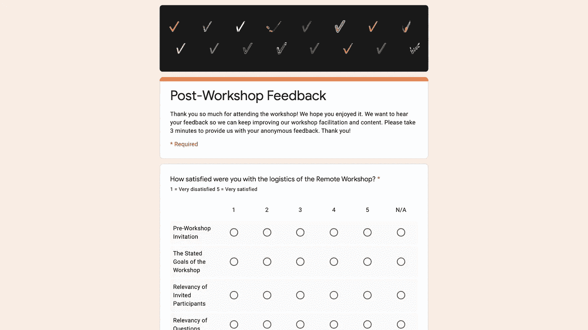

# 如何开展远程研讨会

> 原文：<https://medium.datadriveninvestor.com/how-to-conduct-your-remote-workshop-1b566e6d3a64?source=collection_archive---------13----------------------->

如今，“在家工作”听起来不再那么迷人和吸引人了，这在几个月前还是不可想象的。这可能是因为我们很少有人在这个问题上有选择的余地。

*根据 Gartner***的数据，截至 3 月 17 日，近 90%的组织鼓励/要求员工在家工作。**

*然而，尽管我们面临新的现实，这项工作必须继续下去。这促使我们想出创新的新方法、合作的新方法和完成工作的新方法。也许我们的武器库中最强大的工具就是远程车间。*

*事实上，早在疫情会议之前，我们就已经开展了远程研讨会，以更好地与我们的全球办事处和客户合作。然而，随着这成为新的常态，我们正在利用这个机会，将我们的会议变成远程研讨会，以实现更有效的合作(和更多的乐趣)。*

*利用虚拟研讨会白板工具[壁画](https://app.mural.co/t/mobilelive1901)和各种视频会议应用程序，我们成功打破了现实和虚拟世界之间的界限，克服了我们之间的距离，专注于手头的项目。这就是为什么我们决定与你们分享我们的经验，希望你们也能在你们新的遥远现实中找到成功。*

***为什么选择远程车间？***

**

*远程研讨会是研讨会主持人和参与者从物理空间到在线体验的桥梁，已经成为一种事实上的工作方式。我们大多数人都淹没在无数的电子邮件、电话和视频会议中，增加了压力和疲劳。远程研讨会可以用一些有趣的活动来充实你的一天，同时通过协作集思广益会议的可见成果带来成就感。*

*在远程研讨会中，数字白板用于容纳所有类型的媒体，例如图像、模型、演示幻灯片、gif 甚至视频，您可以轻松地拖放这些媒体以与参与者共享。作为主持人，您还可以通过预设每个场景的帧和观众的观看顺序来定义观众的视区。*

*多亏了键盘，你不会面临无法识别某人笔迹的尴尬。此外，每次会议结束后，您无需在白板上撕下或撕下草图，这样您就有足够的时间和材料来完成分组和分层研讨会成果。*

* [## 关于数字化转型的 8 个问题投资者应该从每位首席执行官那里得到答案|数据…

### 几乎没有什么比做生意更令人兴奋的了。最吸引人的方面之一当然是投资于年轻的…

www.datadriveninvestor.com](https://www.datadriveninvestor.com/2020/07/06/8-questions-about-the-digital-transformation-investors-should-get-answers-from-every-ceo/) 

此外，数字平台使您能够为不同的研讨会类型和/或活动创建和发布可重用的框架。坦率地说，我们很喜欢这个功能，因为我们不再需要在每次研讨会之前在白纸上绘制移情或优先顺序图。节省下来的时间让我们可以将更多精力放在研讨会的规划和准备上。

**远程车间的挑战**

尽管原因很多，但为什么举办远程研讨会会带来一些挑战。这可能源于我们在从线下到线上的过渡中集体缺乏经验；然而，这些挑战都不是克服不了的。

**设施的限制:**在大多数实体工作室中，我们通常把自己锁在一个房间里，里面有一个巨大的屏幕来运行议程和支持幻灯片，还有许多白板和无限的便利贴，用于思想的碰撞和融合。然而在网络环境中，你可能只有一台笔记本电脑和一杯咖啡。就是这样！虽然无边界虚拟白板听起来很酷，但你仍然受到屏幕大小的限制。虽然身体上的互动和活动确实与创造力有直接的关联，但它可以通过在虚拟工作室中加入更多的创造性活动来克服。

如果家里的网络质量波动或无法支持您、您的同事和/或客户之间的持续通信，您也可能会发现自己处于噩梦之中。幸运的是，壁画给了你跟随的能力，这有助于很好地解决这个问题。

缺乏面对面的接触:人类天生就是社会性的。但是，社交距离正在阻止我们所依赖的许多重要的非语言交流，也许不超过眼神交流。我们通过自己的眼睛说话，通过看别人的眼睛，我们可以读到很多东西。遗憾的是，在最近的视频通话中，你可能已经注意到几乎没有任何直接的眼神交流，这可能会让你感到不确定或缺乏信心。

你可能也注意到了最近在虚拟会议中令人尴尬的沉默。这听起来是不是很熟悉:你试图将你的怀疑和焦虑保持在最低限度，想知道观众是否在跟着你，同时尽量不要听起来紧张。如果是这样，不要担心，你并不孤单。

**由于可见性有限，控制更少:**在物理研讨会中，主持人很容易仔细观察参与者的反应，而在远程研讨会中，主持人主要通过电话会议与人互动(视频质量同样令人沮丧)。

很多时候，一个有经验的培训师可以通过判断参与者的反应来巧妙安排活动日程和时间。这曾经是辅导员的“杀手锏”——识别参与者的需求并快速做出决定。然而，这些小信号通过屏幕变得更加微妙。你可能最终难以推动对话或控制时间线。

保持专注的压力:体能训练可以持续一整天，期间有午休和一些短暂的休息。最重要的是，参与者通常有机会在座位和白板之间穿梭。这些活动，虽然平淡无奇，却能让参与者活动身体，伸长脖子。

现在，事实是一切都集中在一个远程会议中，你和你的参与者粘在你的椅子上，沉浸在你的笔记本电脑屏幕上长达 2 个小时。长时间专注于电脑会很有压力，更不用说偶尔被孩子或四条腿的朋友分散注意力了。更不用说一有机会就查看邮件和信息了。

[专家们一致认为，我们在这种偏远的工作环境中呆得越久，就越能适应。因此，让我们加快这种适应，并向您展示如何通过举办一个富有成效的远程研讨会来克服这些挑战。](https://globalworkplaceanalytics.com/work-at-home-after-covid-19-our-forecast)

**如何开展远程研讨会？**

我们的研讨会流程可分为四个阶段——研讨会计划、研讨会准备、研讨会运行和研讨会结束后。

以下是我们遵循的清单，以确保我们有一个成功的研讨会，并取得富有成效和可操作的成果:

***** 通信工具的选择取决于您在车间使用的屏幕数量。请参阅“运行远程研讨会”一节中的详细信息。

现在，让我们一步一步地向您介绍这一过程:

**计划研讨会:**通常，我们会收到来自销售团队成员或客户的通知，请求召开协作会议来解决特定问题。我们将他们视为研讨会的负责人，他们是我们澄清主题、期望结果或重要参与者的联系人。车间计划必须由所有者签署。

在车间里，知道你在和谁说话是必要的。你需要对你的参与者、决策者以及他们在业务中的角色有相当多的了解。您还需要全面了解研讨会的目的，以计划相关活动。请所有者简要描述目标、预期结果和成功标准，以及关于研讨会的任何具体要求。

为了帮助规划，我们根据 [NN 小组模板](https://www.nngroup.com/articles/workshops-vs-meetings/)创建了[研讨会简介](https://docs.google.com/document/d/1HUFCuxZOlbey-Vyssd0U0B4Zv-sPfRvCDQGlbh52FsI/edit)。最佳做法是在研讨会负责人的日程表上安排一个 1 小时的电话会议，并为此投入时间。我们鼓励您与所有者一起起草简报，使会议意图和预期结果保持一致。或者，如果所有者更喜欢自己工作，并回来与您达成共识，这也是可以接受的。

**准备研讨会:**参加人数是你在这个阶段需要和研讨会负责人确认的。这可能会对您计划的活动类型产生重大影响，请记住，数量越少，远程研讨会的效果越好。

下一步是选择您将使用的视频会议工具。在跨公司协作的情况下，确保 it 部门遵守公司 IT 政策和/或团队成员的任何限制。

像物理研讨会一样，使用电子表格来概述活动。我们通常使用谷歌工作表模板。您的计划应涵盖这些领域——步骤、部分、持续时间、小组/个人、活动和细节。与物理车间相反，我们不需要道具/材料栏。

当您最终打开虚拟白板，为您刚刚计划好的活动创建可视化框架时，真正的乐趣就开始了。如果这是大多数参与者的第一次远程研讨会，我们强烈建议您创建一个包含说明和工具提示的入职培训活动。在预定的研讨会前 3 天将它发给您的参与者，并要求他们练习和熟悉该工具。

这不仅会节省您的入职时间，而且您还可以在实际研讨会之前从参与者的角度测试访问权限并排除故障。

如果无法进行此研讨会前入职培训活动，我们强烈建议在研讨会开始时就为破冰入职培训活动安排时间。壁画有几个模板你可以使用。

既然您的活动已经计划好了，一切看起来都很棒，我们建议您再预约一个小时，向研讨会负责人介绍您的计划。这是为了交叉检查您的车间设计是否符合所有者心中的目标。不要害怕被质疑:通过倾听他/她的观点来建立信任，并解释你设计它背后的思维过程。

您的最终研讨会议程必须在研讨会之前由所有者签署。

最后但并非最不重要的一点是，我们建议您向所有参与者发送一封欢迎电子邮件，在邮件中介绍自己是主持人，可能是您的共同主持人，解释会议的目的和议程。您还可以包括您为远程工具创建的入职培训活动链接和研讨会简介(最好有研讨会负责人的签名)。

**开工作坊:**今天是工作坊日！提前 10 分钟开始视频通话，这样你就有足够的时间做好准备，迎接提前到来的参与者。

首先是与所有参与者共享虚拟白板链接。我们通常将链接复制粘贴到聊天窗口中，要求每个人在另一个选项卡中打开链接，将窗口放在手边，然后返回到通话窗口。

尽可能清晰地说话，并在说话时看着网络摄像头。这有助于与你的参与者建立眼神交流，让他们感觉像是在与你面对面交谈。这会让你看起来更专业，听起来更自信，看起来准备充分。

在研讨会开始时，在视频会议视图中停留几分钟。这使得参与者可以看到彼此，并在等待其他人加入桥接时快速聚集在一起。开始与你的参与者热烈交谈，询问他们是否有机会看一遍简报。如果您发现大多数参与者都已阅读了简介并明确了目标，您可以减少解释研讨会目的和目标所花费的时间。

开场不应超过 5 分钟。介绍研讨会的规则，例如遵循主持人的指示，尊重时间表，不评判他人。远程研讨会必须避免自由交谈或呼叫，因为我们都知道当两个以上的人同时交谈时听起来是什么样的。指导参与者当他们觉得需要交谈时如何向你发出信号。

在我们的[研讨会规则](https://docs.google.com/presentation/d/1ZL-6FdPghaB41s7jMbYTI_DfdHJQ9UIw00wzeSaBALY/edit?usp=sharing)中，我们有一个名为“数字便利贴最佳实践”的小节，它与现实生活中的便利贴要求略有不同。例如，我们不需要全大写的文字在数字格式中更容易识别。我们鼓励参与者输入更详细的信息，而不是过于笼统(参见下面的例子)。

你都准备好了！现在是时候邀请参与者移动到虚拟工作区窗口并开始活动了。您应该建议您的参与者同时打开视频通话和工作区窗口，以便在白板上工作时可以看到彼此。对于单屏用户，我们的体验是将左侧的 1/4 用于视频通话视图，其余部分用于右侧的工作区(参见下面的示例)。如果你是左撇子，就把这两扇窗户互换一下。

我们建议为经常练习远程研讨会的主持人升级设置。这是一种双屏布置，您也可以向家中有备用显示器的参与者推荐。一个额外的屏幕可以缓解超负荷的浏览器窗口，帮助你观察参与者并及时理解他们的信号。

当你需要与你的共同主持人就计划的一些快速解决方案进行沟通，但不想让参与者知道时，第二个屏幕也很有帮助。如果您没有使用单独的屏幕，请在即时消息平台上与共同主持人建立一个移动渠道。不要忘记把你的手机调成静音或者振动。

根据我们的经验，你应该允许每 1 或 1.5 小时有一个短暂的休息。5 分钟的休息时间用来喝一杯饮料或处理电子邮件，另外 5 分钟用来快速锻炼颈部/背部/眼部，你可以在 YouTube 上找到大量视频。

相信我，远程会议时间过得很快。与共同主持人密切合作，严格把握每项活动的时间表，宣布剩余时间，分别为 1 分钟、30 秒，并在只剩 10 秒时询问是否需要更多时间。

始终关注您的车间剩余的时间。你可能最终会调整几项活动所花费的时间，所以如果还有一些任务只剩下 10 分钟，这是正常的。此时，提醒你的共同主持人加快当前活动，并在 2 分钟内完成。您可以再花 2 分钟解释剩余的时间不允许进行其余的活动，并询问学员是否想预订另一个课程或在研讨会结束后单独完成这些课程。让他们知道，只要参与者有链接，就可以访问虚拟工作区。

最后 5 分钟将留给研讨会负责人，以总结会议的关键要点和后续步骤。感谢参与者的宝贵意见，结束研讨会，并通过视频电话结束会议。

**经过一个工作坊:**恭喜！您刚刚完成了远程研讨会。休息一会儿，然后与你的共同主持人安排一个接触点，回顾调查结果并分享新鲜的见解。您可以在报告中组织见解和聚类结果(我们通常使用 Google Slides 来实现这一点)。不要忘记将整个工作空间导出为 PDF 文件，并将其附加在报告的末尾。

将报告和研讨会后调查一起发送给所有参与者，以收集反馈。理想情况下，这些报告应该在一周内发出，以确保参与者不会等待太久，并且您可以在他们对研讨会仍有清晰印象的同时获得高质量的反馈。

**拿走**

今天的现实是，当谈到在家工作时，我们大多数人都没有选择；然而，这并不意味着我们不能充分利用它。随着 organizations Square 和 Twitter 宣布他们将[永久允许他们的员工在家工作](https://www.cnbc.com/2020/05/18/square-lets-employees-work-from-home-permanently.html)，远程工作很可能会继续存在并成为新的规范。我们需要重新考虑将远程研讨会作为一种常规的工作方式，本指南有望让您做好更充分的准备，成为早期采用者，并最好地应对这种转变。* 

**像我们说的那样？你会喜欢我们的工作的。* [***见***](https://www.mobilelive.ca/) ***。****

***访问专家视图—** [**订阅 DDI 英特尔**](https://datadriveninvestor.com/ddi-intel)*