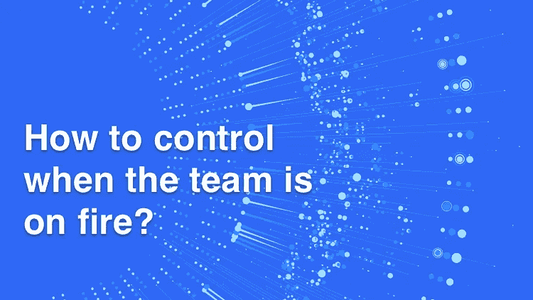

# 团队火了怎么控制？

> 原文：<https://medium.datadriveninvestor.com/how-to-control-when-the-team-is-on-fire-94f504935614?source=collection_archive---------38----------------------->

这个世界是高度不可预测的。无论一个事件或过程管理和组织得有多好，仍然有可能发生不可预见的问题。在软件开发的世界里，这些不可预见的事件和问题被描述为“着火了”。

例如，如果一个 C 级经理引用“他的团队着火了”，这意味着发生了一个无法预见的问题，可能会给他和他的团队带来一些严重的后果。类似地，为了解决这些不可预见的问题而分配资源的过程被称为救火。在软件开发世界中，fire 一词专门用来描述这种情况，因为 fire 反映了这些问题事件的不可预测性。

一个软件开发团队着火显然是作为一个 C 级经理最不愿意面对的情况。在最坏的情况下，着火不仅会导致项目失败，还会损害公司的声誉。这种紧急情况可能以不同的形式出现，取决于项目和环境。

例如，你是一家公司的首席运营官，你已经到了一个非常重要的软件开发项目的发布日期。你和你的团队在这个项目上投入了大量的资源，突然你发现你的团队着火了。您发现您的一个新加入的团队成员忽略了项目模块中的一个小错误，这个小错误现在对项目输出的最终结果产生了负面影响。

交货的任何延误都可能使你取消上个月一直在做的这个项目。作为一个首席运营官人，这肯定是你不希望遇到的情况。如果你是一个非编码首席运营官，情况会变得更加复杂。虽然这并不强制你必须成为一名程序员才能成为一个软件开发公司更好的 C 级经理，但在这样的救火情况下，这可能会使事情变得更糟。

在现代商业世界中，尤其是在预算固定、期限紧迫的软件开发范例中，误差幅度太小了。最好采取积极主动的方法，而不是对这种火灾蔓延情况做出反应。

> 在预算固定、期限紧迫的软件开发范例中，误差幅度太小

# 当一个团队火了，Duecode 如何帮助 C 级管理者？

凭借其高度精确和多维度的分析能力，Duecode 可以帮助 C 级管理人员。即使对于没有编码背景的 C 级经理来说，它也可以作为一个技术镜头。使用 [Duecode](https://duecode.io/) 的代码跟踪工具，您可以在软件开发过程中的任何时候获得关于代码和产品发生了什么的清晰而准确的见解。

凭借其技术洞察力，Duecode 可以在消防条件下帮助 C 级管理人员，并提供强大的控制。例如，让我们以前面讨论过的相同的场景为例，当团队在一个非常重要的软件开发项目的发布日期临近时正处于紧张状态。在这种紧急情况下， [Duecode](https://duecode.io/) 如何帮助 C 级管理人员救火？

[Duecode](https://duecode.io/) 为首席运营官提供关于活动、里程碑和个人表现的准确分析见解，这些活动、里程碑和个人表现基于多个代码质量排名因素进行排名。

> Duecode 为首席运营官提供了关于活动、里程碑和个人表现的准确分析见解，这些活动、里程碑和个人表现是基于多个代码质量排名因素进行排名的

在这种紧急情况下，任何 C 级经理的主要关注之一是立即诊断并找出问题的实际原因。诊断问题的根本原因在消防中极其重要，因为这可以节省大量时间、精力和资源。

使用 [Duecode](https://duecode.io/) 首席运营官可以轻松诊断并确定问题的实际原因，并且无需浪费任何时间，他就可以分配所有需要的资源来解决问题的根本原因。首席运营官可以很容易地跟踪团队和项目中的滞后因素，通过使用个人任务级别的活动度量和质量度量，可以很容易地发现错误的发起者。

# 代码质量等级

[质量评级](https://duecode.io/blog/what-is-code-quality-rank/)和风险报告可以很容易地指向项目最薄弱和可疑的环节。在对错误进行及时准确的诊断后，首席运营官现在可以进入灭火计划的下一步，即寻找解决方案。

在 [Duecode](https://duecode.io/) 的代码质量分析[工具](https://duecode.io/blog/code-quality-tools/)的帮助下，首席运营官还可以预测解决问题所需的工作量和能力。在火势蔓延的情况下，立即做出正确的决定以防止任何进一步的损失是极其重要的。

借助于 [Duecode](https://duecode.io/) 的分析和来自 activity metrics 的报告，公司的首席运营官或任何其他 C 级经理可以立即将紧急和崩溃任务分配给具有适当能力的开发人员。在最坏的情况下，首席运营官也可以将有问题的活动或模块外包给公司外部的开发人员。

有了 [Duecode](https://duecode.io/) 的代码审查服务提供的清晰准确的见解，当一个团队陷入困境时，事情就更容易控制了。在项目的任何时刻或阶段，c 级管理人员都更能控制和了解代码发生了什么。由 [Duecode](https://duecode.io/) 的代码质量分析器提供的这种控制和意识被证明在团队陷入困境时甚至是至关重要的。

使用 [Duecode](https://duecode.io/) ，C 级经理也可以采取主动，也可以使用 [Duecode](https://duecode.io/) 作为灾难管理计划。 [Duecode](https://duecode.io/) 可以帮助 C 级管理人员完全访问和控制他们的个人、团队和基于模块的活动。

[Duecode](https://duecode.io/) 提供特殊模块，确保你的开发团队正在编写的代码符合国际开发标准。这个模块使用一些特别设计的代码质量保证方法，比如代码质量分析和代码质量保证。

[Duecode](https://duecode.io/) 提供特定活动的[代码质量评级](https://duecode.io/blog/what-is-code-quality-rank/)以及基于您偏好的里程碑。在将许多代码质量因素与国际标准进行比较之后，使用代码质量分析器生成这些代码质量评级。代码质量评级甚至让非开发人员的管理人员对产品质量有一个清晰的概念。除了整体代码质量评级，作为经理，您还可以查看单独的代码质量因素。

*原载于 2020 年 10 月 15 日*[*https://due code . io*](https://duecode.io/blog/how-to-control-when-the-team-is-on-fire/)*。*