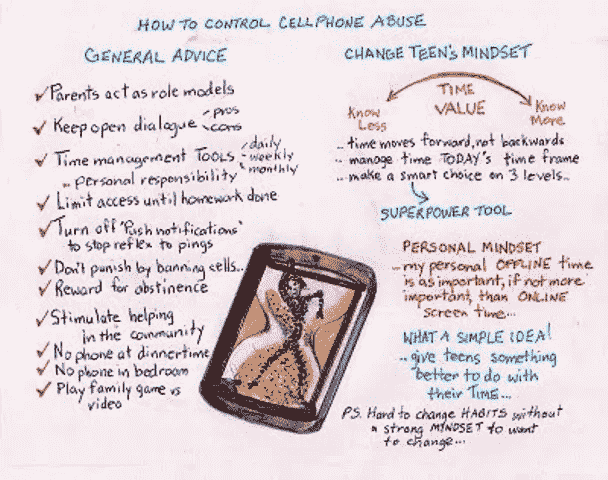

# 如何应对青少年手机成瘾...10 步建议还是 1 步个人心态？

> 原文：<https://medium.datadriveninvestor.com/how-to-counter-teen-cell-phone-addiction-10-steps-advice-or-1-step-personal-mindset-41e939966e2c?source=collection_archive---------24----------------------->

Photo by [Jonathan Borba](https://unsplash.com/@jonathanborba?utm_source=medium&utm_medium=referral) on [Unsplash](https://unsplash.com?utm_source=medium&utm_medium=referral)

## “危险的不仅仅是孩子们如何度过青春期，智能手机的持续存在很可能会影响他们到成年。”让·特温，心理学家。

*你知道在过去的 10 到 15 年里，社交媒体心理学的一个新领域已经形成了吗？关于社交媒体依赖的后果将如何影响我们孩子的未来，这项早期研究仍有许多空白。*

你可能听说过习语*号穿越卢比孔河*号，它历史上是指朱利叶斯·凯撒的军队穿越了被禁止的卢比孔河，导致了高卢(古法兰西)和罗马之间的内战。在十字路口，凯撒说了一句著名的话“木已成舟”，意思是他知道前进的必然结果。

如果，这个习语可以应用于现代现实；但是，不是为了赢得风景，而是为了保护心灵风景，尤其是青少年？大多数人都会同意，对于许多青少年，尤其是女孩来说，社交媒体是一个不可否认的战场。有些人比其他人更好地经受住了这种冲击，但许多人在追求流行的超级自我以适应这种在线文化的过程中受害了一辈子。你能想象这个媒体巨头是如何控制许多人，让他们在它的目标范围内为所欲为吗？

自从互联网革命开始永远改变我们的心理和社会以来，这种情况仅仅发生了二十年。手机已经像呱呱草一样普及；杂草丛生，有些地方是沼泽，还有非凡的成功之花。头脑年轻的年轻人不得不学会适应、调整和生存；在这个数字化的虚拟世界中沉浮，奇观或扰动触手可及，现实或虚拟存在，真实或谎言。

选择的武器是手机。越来越多的报道揭示了一些战斗:短信或电话欺凌，对抗，与父母的问题，对上学感到紧张，目睹许多人参与骚扰的残酷行为。

**美国广播公司新闻** **s** 和常识媒体(2019 年 10 月 29 日 **)** 显示**A**平均每天 **7 小时 22 分钟**用于娱乐，而不是听音乐或看书，如果加上这两项，数字将跃升至 **9 小时 49 分钟******

****我们是否同意，一直看视频和电视节目、玩游戏和使用社交媒体会让年轻人上瘾？****

## ****什么是手机成瘾？****

****心理学家概述了几种**熟悉的症状**:****

*   ****每隔几分钟就冲动地检查手机。。即时刺激和反应****
*   ****退出家庭或共享活动，使用智能手机****
*   ****与检查 pings 和消息相关的睡眠障碍****
*   ****对学校、家庭、社会或情绪功能的负面影响，如悲伤或抑郁****
*   ****如果电话不可用，焦虑或易怒情绪会增加****

****心理学家也意识到这种行为在很大程度上与大脑自身神经化学物质的产生有关。初步研究发现,“社交媒体的使用会对大脑产生深远的影响，就像吸毒成瘾一样……在网上接受喜欢会释放大脑中的多巴胺。”。这会产生一种愉悦感……类似的触发因素包括吃巧克力或赢钱。”****

## ****什么是诺莫恐惧症？****

****然而，另一方面，有一种非官方的情况叫做**无手机恐惧症，**是**无手机**的缩写，它会导致戒断症状，并释放一种叫做*皮质醇*的应激激素。因此，不管有没有电话，大脑都会支付自己的神经化学递质的费用。条件作用开始出现，动机增强，上瘾开始轻易地编程大脑，一次又一次地寻找更令人愉快的奖励，而不顾后果。****

****我们是否同意，单靠意志力很难改变一个习惯，更不用说上瘾了？****

****首先，你需要承认你有一个*问题*并且有理由改变。第二，现在要做出*的改变*，你必须找到没有手机的新活动。
第三，青少年能在数字流的中间做这些吗，做其他人都在做的被*接受的事情吗*？****

****每个战场都需要一个战胜敌人的策略；即成瘾问题。这里有两个策略:****

## ****一: **10 步计划，建议少用手机:******

1.  ****卧室里没有电话…没有干扰…没有争论。****
2.  ****家庭聚餐或家庭出游时不要打电话……不要争论。也要像成年人一样设定限制，以树立健康的行为模式。****
3.  ****限制访问社交媒体、游戏等。作业完成后..双方协议****
4.  ****父母被允许在晚上和早上的特定时间检查设备…双方同意。****
5.  ****将你的手机设置为“飞行模式”以减少持续不断的噪音。以及关闭*推送通知*，如文本、消息等。停止反射检查每一次 ping。****
6.  ****用时间管理工具设定目标(每月、每周、每天),由青少年监控……没有父母的唠叨****
7.  ****保持开放的对话，讨论流行歌星现实的利弊，许多是不现实的。****
8.  ****限制发短信……给朋友打电话，和你的朋友进行一次真正的对话****
9.  ****激发其他帮助社区的积极兴趣****
10.  ****不要用拿走手机来惩罚——社会截肢。取而代之的是在特定的时间内提供限制使用的奖励。****

****底线是，毫无疑问，过多的屏幕时间会影响青少年的身体行为、情感体验和社会关系。谁会不同意现在是谈论屏幕时间的*好处*和*缺陷*以及如何负责任地使用智能手机的恰当时机呢？浪费的时间和有用的时间对每个人都很重要。****

****除了这些可行的建议，我相信每个十几岁的女孩还必须建立一种内在的心态，即她的个人时间是宝贵的，她会谨慎明智地选择如何度过。****

## ****第二:一步个人心态****

******是时候建立一种个人心态了，将时间视为你最有价值的资产，并作为一种超能力工具做出正确的选择。******

****以一个简短的普通叙事开始，讲述一个十几岁的小女孩在网上犯了严重的错误，发现了时间的价值，并在最后证明这不是她的错。****

****这个故事讨论了时间的因素，并回答了这样一个问题:如果我可以选择，我今天会做出同样的选择吗？ 她了解到**做出明智选择的问题**不是“抛硬币”,而是使用一个简单的脚本，考虑三个层次的经验和其他因素。她明白在不同情况下使用超级力量工具做出明智的选择是有道理的。****

****在考验和磨难结束时，她看着自己握着时间线的手，知道这是她的责任。读者可以选择是否接受她的心态，这是一个所有女孩都可以回应并选择照顾自己个人质量时间的公分母；但至少，他们对环境和后果的看法有所扩大。****

****一些**后续练习**也有助于强化这些目标:****

****…爱上我的大脑，正常的成年仪式，练习做出明智的选择，选择、决定和习惯之间的区别，自尊和道德，庆祝我的时间艺术作品等等。****

******这似乎是一个简单自然的解决方案，庆祝一个时间线花费的时间越多，它就变得越重要。如果有可能形成一种强烈的、不可否认的心态，认为我的离线个人时间与我在社交媒体上滚动和移动的在线时间一样重要，如果不是更重要的话，会怎么样？有可能相信这种个人心态可能是帮助对抗青少年手机成瘾的正确解决方案或解毒剂吗？******

****这当然是一个值得研究的想法。****

****这里有一个战场路线图可以考虑:****

********

******Crossing the Digital Rubicon******

****欢迎提问和评论。你对抑制青少年使用手机有什么想法？或者你认为这是一个大问题吗？****

****安娜玛丽·贝鲁科夫****

****amarie10@gmail.com****

****1 833 471 4661****

****节选自[少女在沙滩上面对时间](https://helpfulmindstreamforchanges.com/)****

*****我抬起眼睛，看着大范围的河水向南流淌传递着小心前方更强更深的水流的讯息。*****

****如果我能传达这样直接的目的来表达我真正相信的东西，那会怎么样？****

*****我知道河里有力量。有一次，一个小男孩游得离岸边太远，被水流冲走了。*****

*****互联网有力量。事实上，它与我们的社会紧密相连。选择是保持联系还是断开联系，获得更多的信息还是更少的信息，拥有更多的信心还是更多的恐惧，保持头脑开放还是保持头脑封闭。*****

****不一定是一个怪物在吞食拴在笼子里的自拍后代。但是现在我有了不同，我也有了超能力，可以尊重我的海岸线。这是一个选择余地很大的世界。让它成为一个充满明智选择的世界。****

****[**青少年每天花在屏幕上娱乐的时间超过 7 个小时:报道**](https://abcnews.go.com/US/teens-spend-hours-screens-entertainment-day-report/story?id=66607555#:~:text=Teens%20spend%20an%20average%20of,technology%20and%20media%20for%20children.)****

****[**检查指标**](https://annemarie3steps.medium.com/index-for-timely-tale-for-teen-girls-struggles-regrets-and-survival-on-social-media-with-a-7032215a4c31)****