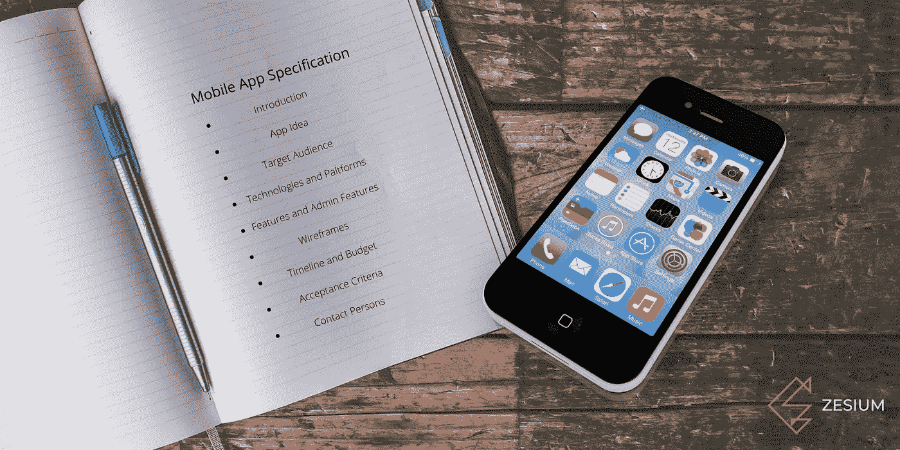
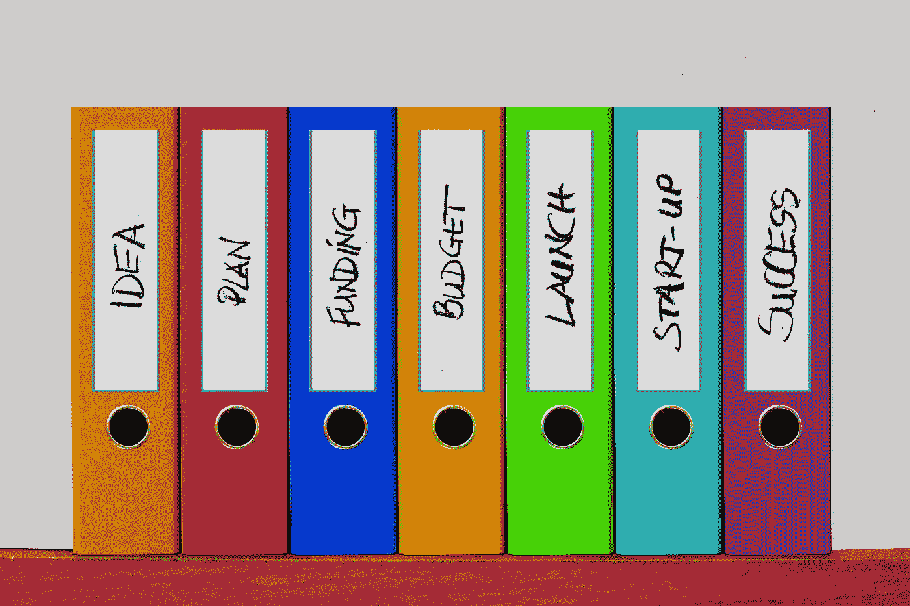
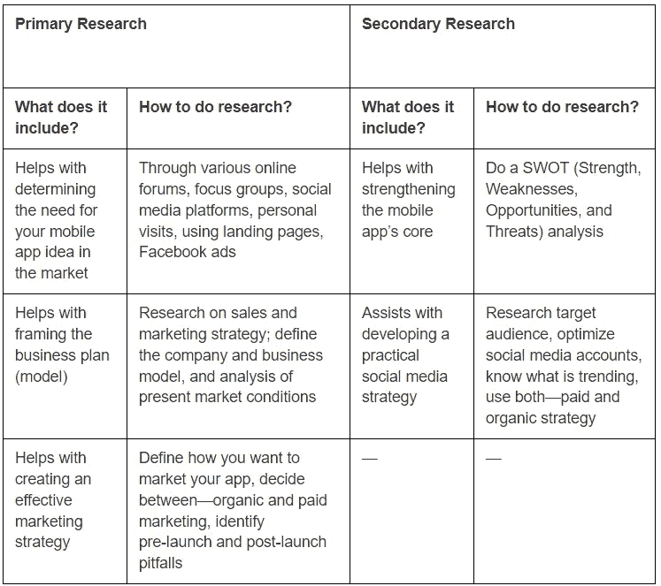
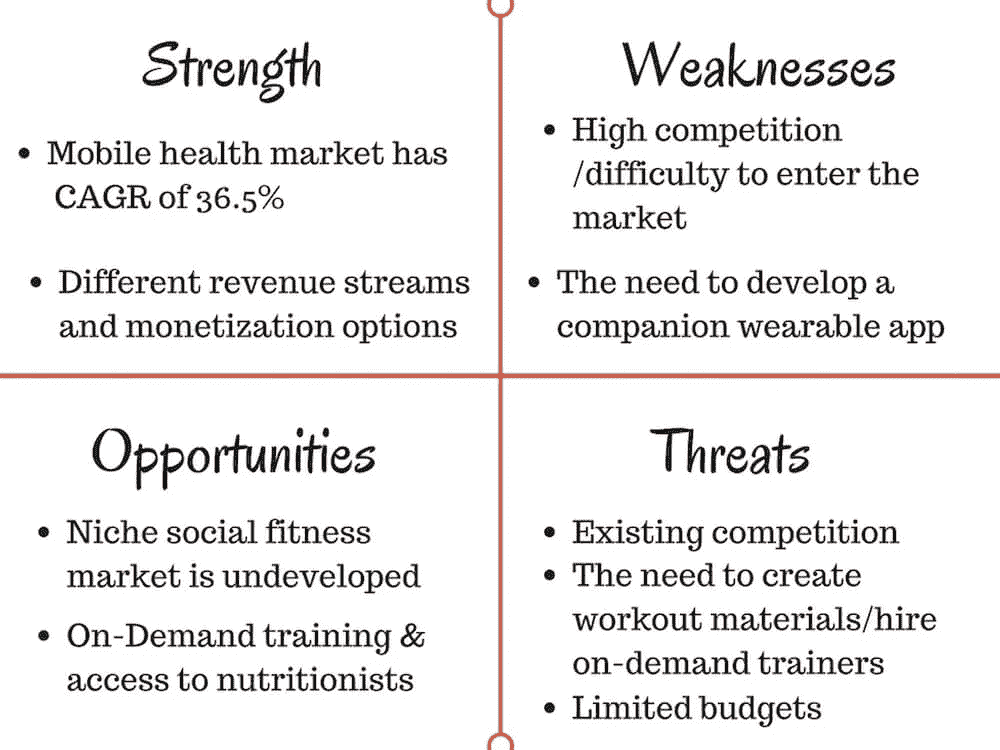
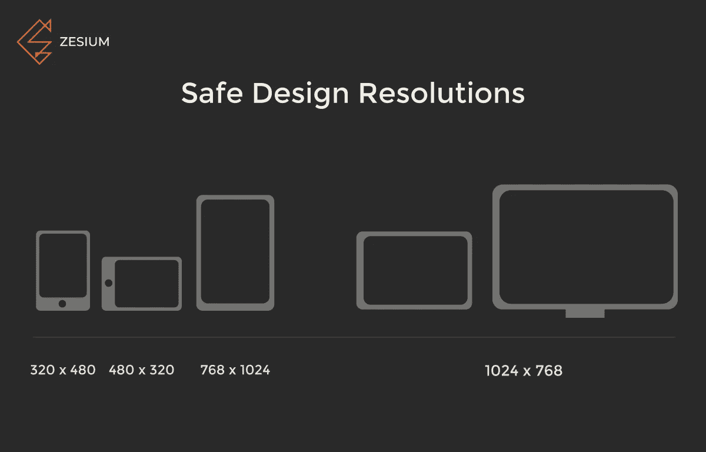
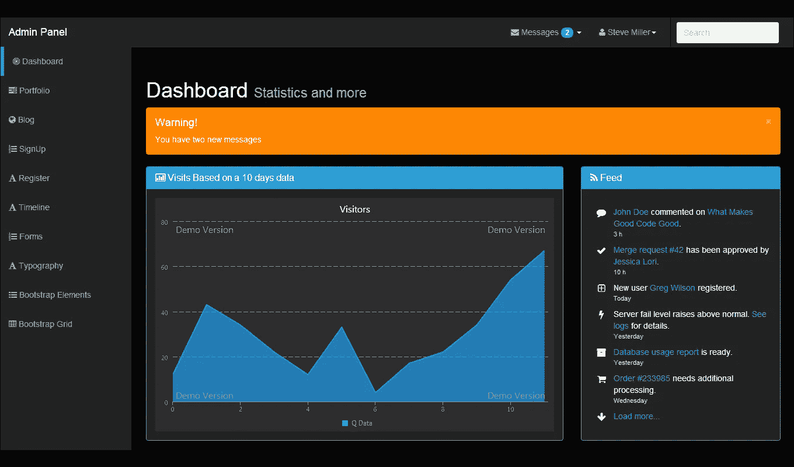
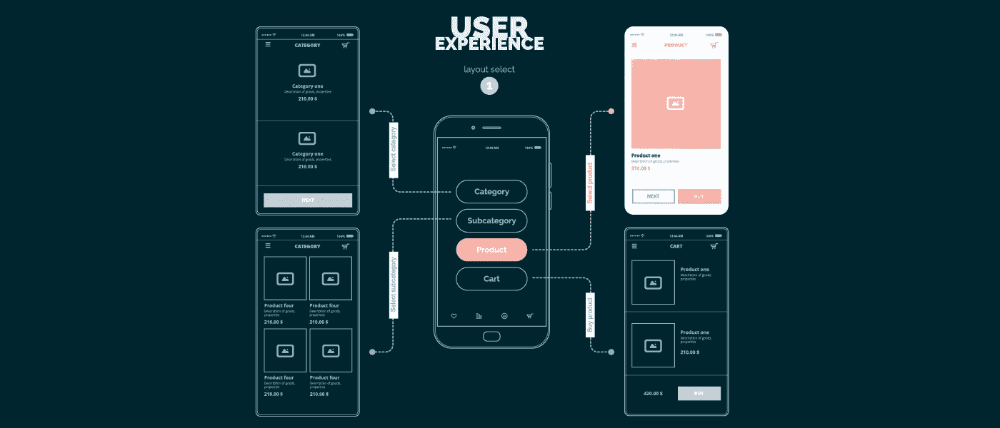
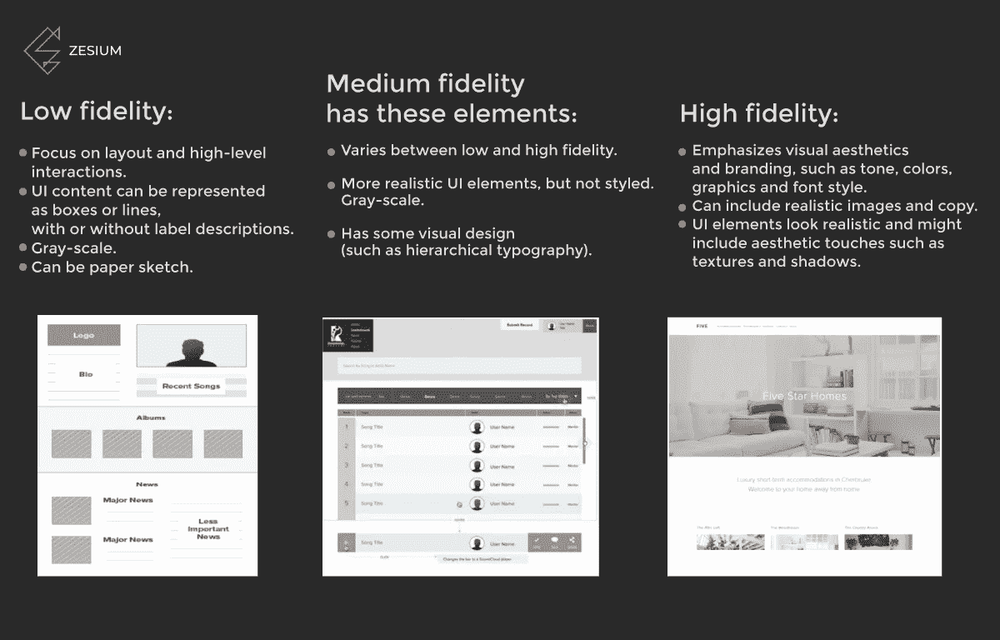
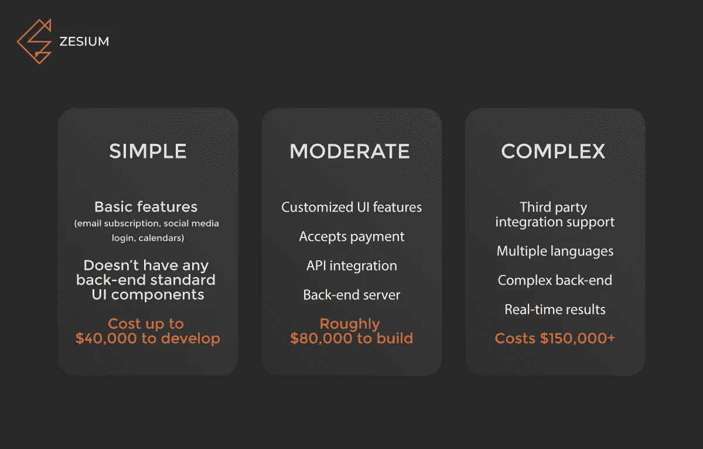

# 如何为你的移动应用创建一个规范？

> 原文：<https://medium.datadriveninvestor.com/how-to-create-a-mobile-app-specification-a10275cafb5e?source=collection_archive---------10----------------------->

Source: zesium.com

App specification 是一份关于 App 需求的详细且一致的文档，它将使您的开发团队和所有者的愿景保持一致——它有助于清楚地了解需要做什么。

如果你做得恰当，你将在开发过程中避免任何不愉快的意外。

请记住，您可以随时根据您的具体需求修改需求。

# 如何创建手机 APP 规范？

当编写移动应用规范时，你必须确保它清晰、详细而不含糊——它**必须**易于理解且直截了当。

让我们一步一步地了解如何创建移动应用规范以及它应该包含的内容:

## **简介**

这一部分应包括对贵公司的简短描述——您的愿景、业务性质、运营时间以及您是否拥有(或发布)任何先前的软件解决方案或应用程序。

虽然你会认为这些细节不重要，但实际上它们很重要。

这些信息提供了关于你的公司、你希望你的解决方案基于的原则(*以防你有任何以前的解决方案*)以及你的业务流程的性质的图片。

然后，发展合作伙伴可以更深入地了解您的经营方式和您追求的愿景，并将理想的解决方案与您的实际业务战略相匹配。

## **App 创意**

你对你的应用程序有了一个想法，所以你需要把它写下来——基本目的和它应该解决什么类型的问题。

在开始任何工作之前，你应该进行一次[市场调查](https://medium.com/@ChromeInfotech/save-85-of-your-time-know-how-to-do-market-research-to-create-a-hit-mobile-app-5a582f31754e)。它应该评估你目前的客户，审查你的竞争对手，确定目标受众等等。

问问你自己:你的应用想要实现什么？它需要解决什么核心难题？

下表可以帮助您组织您的研究:

***表 1*** *:* *一次调研和二次调研*

Source: [medium.com/ChromeInfotech](https://medium.com/@ChromeInfotech)

二级研究建议使用 [SWOT 分析](https://en.wikipedia.org/wiki/SWOT_analysis)，这里有一个健康应用的例子:

另一种分析产品开发的方法是设定 [SMART 目标](https://blog.hubspot.com/blog/tabid/6307/bid/33898/How-to-Set-SMART-Marketing-Goals-for-2013-TEMPLATE.aspx):

**S**specific——设定实数，例如“我想在 App Store 发布后的一周内获得 1000 次以上的下载量”

可衡量——确保你的目标可追踪。例如，“*我希望新用户每天至少登录我的应用一次*。”

**一个**可实现的目标——给自己一个具有挑战性但并非不可能的目标。例如:'*我想在一年内达到一百万的下载量*

**R** 现实主义——对自己诚实，不要忘记你需要克服的障碍，例如:‘*我希望我的 MVP 在两个月内完成*’

尽快——给自己一个期限，不要设定不明确的目标，比如“我将在明年的某一天完成我的应用程序”。

由于您的开发合作伙伴将使用该文档来创建更多的技术记录，因此请尽量具体。

尝试包括市场调查结果，任何你可能有的计算和分析，用户反馈等。因为这只会有助于你的产品完全按照你的意愿发展。

## **目标受众**

另一个重要的细分市场是你的目标受众——你应该确定谁需要你的应用，谁最有可能购买它——最终用户还是企业。考虑以下因素:*年龄、地点、性别、教育程度、收入、职业等*。

了解你的目标受众将有助于你和你的开发者更好地了解需要交付的应用程序的功能需求。

目标受众在很大程度上定义了用户体验和功能集。例如，一个社交应用程序将分享选项作为针对青少年的应用程序的核心功能，而一个针对儿童的应用程序将更简单，具有大屏幕元素。

最好是勾勒出一个大概的描述或者一个“ [***用户角色***](https://careerfoundry.com/en/blog/ux-design/how-to-define-a-user-persona/) ”尽可能详细地描述——年龄、职业、应用体验、爱好等等。一旦你做到了这一点，概述应用程序的功能就容易多了。

例如，如果你想开发一个面向游客的应用程序，你肯定需要一个[地理定位功能](https://en.wikipedia.org/wiki/Geolocation)。

考虑到这一点，你现在可以根据人们将如何使用它来开发一个应用程序。

## **技术堆栈和平台**

这是技术文档的一部分——你应该决定你是要瞄准 Android、iOS 用户还是两个平台，因为它会极大地影响两者、预算范围和交付时间。

如果你决定继续使用原生应用，这立刻意味着开发两个应用。这种方法需要更多的时间和成本，但请记住，从长远来看，[原生应用可以为您省钱](http://zesium.com/warning-you-can-save-money-with-native-apps-in-b2b/)。

然而，如果你想要更低的成本和更短的交付时间，你可以选择用一些[流行工具](https://hackernoon.com/9-popular-cross-platform-tools-for-app-development-in-2019-53765004761b)(例如，React Native，PhoneGap 等)构建一个跨平台的应用。).

如果您需要指定应用程序将支持哪种设备——它是响应式的还是跨平台的等等。，我将提供一个参考器件列表:

- *桌面浏览器*

*-手机网站(浏览器)*

*-原生移动应用:安卓、iOS、Windows*

*-数位板*

*-智能电视:安卓电视、Tizen 操作系统(三星)、火狐操作系统(松下)、WebOS (LG)*

*-脸书应用*

*-虚拟现实:HTC Vive、Oculus Rift、三星 Gear VR、Playstation VR*

*-售货亭*

始终注意屏幕方向——对于移动设备和平板电脑，纵向和横向模式下的设计可能会有所不同。如果你对此有任何疑问，进行可用性测试。

Source: zesium.com

当考虑用于开发移动应用程序的技术时，请记住这可能是一项复杂的任务。如果您对要使用的工具有任何偏好，您应该与您的开发公司分享，这样他们可以安排必要的软件容量。

如果你想升级一个现有的产品，这部分是非常重要的——在这种情况下，必须通知你的开发者，因为他们需要使用相同的技术来确保顺利集成。

如果你对想要使用的技术没有任何想法，请咨询你的开发伙伴，他们肯定会给你建议最佳的解决方案，让你的应用程序完美运行，并提供你想要构建的功能。

## **特性**

本节介绍了您希望应用程序具备的功能。最好的方法是想象用户将如何使用你的应用程序，并把它分成单独的屏幕或步骤。

例如，一些基本特征可以是:

*   **登录**——大多数应用程序中最常用的功能——它可以通过用户的电子邮件登录，或者你可以通过社交网络选择一个[社交登录，这是非常受欢迎的，因为它可以帮助用户没有太多麻烦地登录。](https://en.wikipedia.org/wiki/Social_login)
*   **支付系统**——如果你正在构建一个提供任何类型付费服务的应用，你将需要一个安全的支付网关，如 [Stripe](https://stripe.com/) 、 [Braintree](https://www.braintreepayments.com/) 或[其他流行的](https://www.buzinga.com.au/buzz/mobile-payment-gateways/)。
*   **地理定位** —该功能使用您的位置，对于出租车或汽车共享应用程序、租赁平台、社交应用程序等来说至关重要。如果你的应用需要地理定位才能正常工作，你需要实现它。
*   **推送通知** —如果你想在你的应用中使用这个功能，你需要让你的开发者知道— [推送通知](https://buildfire.com/what-is-a-push-notification/)必须符合应用的目标，所以要小心这个功能。
*   **聊天** —这个功能非常有用，但只在社交应用、约会应用等需要聊天的应用中有用。根据应用程序要求，您可以进行实时聊天或基于评论的聊天。
*   **货币化**——如果你计划加入某种付费内容或[应用内广告](https://www.smaato.com/guide-to-in-app-advertising/)，你会需要这个功能。

Source: vectorstock.com

您还可以对功能进行优先级排序，并使用 [MoSCoW method](https://www.agilebusiness.org/page/ProjectFramework_10_MoSCoWPrioritisation) 根据优先级用 **M** ust、**S**should、 **C** ould 和 **W** 标记出哪些功能比其他功能更重要。

以上只是你可能希望在应用中实现的功能的简短列表——提供尽可能多的信息至关重要，这将有助于你的开发团队保持在正确的轨道上。

有了特性列表，他们可以确定需要哪些集成、API 和其他第三方元素。

## **管理功能**

大多数应用程序通常有一个管理页面来管理应用程序——你应该概述如何控制它:哪些选项和权限应该是可用的。

Source: pininterest.com/prebootstrap

基于这个大纲，开发团队将创建一个管理面板，具有指定的选项，如:

*   管理所有用户
*   多级接入系统
*   远程支持和维护
*   访问各种应用分析

## **线框**

> *形象胜过千言万语*

无论你如何描述你对应用程序屏幕的想法，一个图像总是要好得多。一个简单的轮廓会让你更好地理解风格、布局、用户流和元素在屏幕上的位置。

一个好的开发团队会创建线框，但要确保你给他们足够的细节。

当你创建一个线框，你可以更好地看到特征之间的关系，并概述实施所需的功能。

Source: fingent.com

如果你想让你的开发者不误解 UI 的要点，你必须清楚你的[对保真度](https://mentormate.com/blog/low-fidelity-wireframes-vs-high-fidelity-wireframes/)的定义，因为它对不同的人代表不同的东西。

下表列出了最常见的线框保真度:

Source: zesium.com

## **时间表和预算**

构建一个移动应用程序所需的时间表以及成本，有点难以估计。但是，它有一些参考点—例如，您可能与产品负责人有一个预定的会议，您需要在会上展示一个 MVP 或原型。

在金钱方面，基本上是一样的——如果你的预算有限，这意味着你必须首先构建一个 MVP，然后用它作为升级或构建完整产品的基础。

根据应用程序的复杂性，有一些粗略的计算，请参见下表:

Source: zesium.com

## **验收标准**

[验收标准](https://www.altexsoft.com/blog/business/acceptance-criteria-purposes-formats-and-best-practices/)是手机 app 要被用户或所有者接受必须满足的条件。您应该概述您希望在最终版本中看到的应用程序性能的强制性要求。

验收标准将确保您的开发团队定义用户故事的界限。

Source: facebook.com/musthave

例如，您可以将“*手机应用程序页面应在 3 秒内加载*”等。

您应该创建一些测试案例，在这些案例中可以衡量验收标准，因为您将能够看到应用程序的使用条件以及应该达到的性能水平。

## **联系人及详细信息**

虽然联系方式看似琐碎，但客户和开发团队之间的有效沟通是成功合作的关键。

在项目开始时拥有所有的联系方式可以确保一段关系的健康开始。

Source: techwell.com

如果您能确定除首席执行官或首席技术官之外负责项目的关键人员，例如:

*   **团队领导**——以防你只外包项目的一部分
*   **产品所有者**——开发过程的协调者，以使产品交付预期的商业价值
*   营销经理——负责产品或 MVP 的推广

# 最后的

编写移动应用规范有很多方法，所有的方法都是正确的。您可以在线使用几十个模板中的一个，也可以为自己的项目创建自己的规范模板。

最重要的是提供尽可能多的项目细节。规范越全面，项目的开始就越顺利。

请记住，没有两个项目是相同的，因此每个规范在整个过程中都会有一些不同，但核心是相同的——彻底解释这个想法。

希望这篇指南能给你一些关于如何创建你自己的移动应用规范文档的想法。

通过以下链接安排与[**Maja Dakic**](https://app.ddichat.com/experts/maja-dakic)**的 DDIChat 会话。**

** [## 马贾达基奇-迪迪恰特

### 技术行业(软件、移动应用、物联网、人工智能等)的资深作家。)以及在…

app.ddichat.com](https://app.ddichat.com/experts/maja-dakic)**