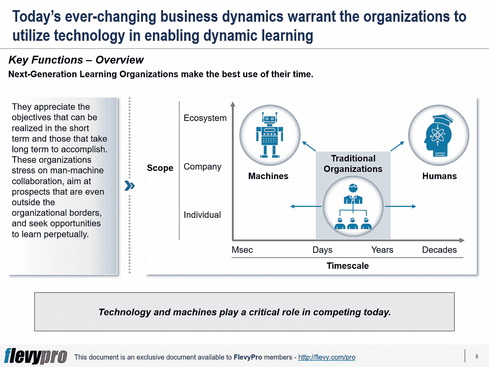

# 如何创建下一代学习型组织以实现数字化转型？

> 原文：<https://medium.datadriveninvestor.com/how-to-create-a-next-generation-learning-organization-to-enable-digital-transformation-d94fff8edc7?source=collection_archive---------22----------------------->

在这个数字时代，企业的生存很大程度上取决于其及时接受数字化转型的能力。[数字化转型](https://flevy.com/digital-transformation)需要使用数字技术来简化业务流程、文化和客户体验。

为了在今天和未来竞争，并实现数字化转型，组织应该努力培养持续学习的文化，因为数字化转型取决于学习和创新。全面拥抱这种文化的组织被称为“[下一代学习型组织](https://flevy.com/browse/flevypro/digital-transformation-next-generation-learning-organization-5158)

下一代[学习型组织](https://flevy.com/business-toolkit/learning-organization)利用以下关键变量:人、机器、时间表和范围。这些组织将技术融入到动态学习中。创建下一代学习型组织需要重组整个企业，以完成以下关键职能，从而赢得未来:

1.  **在多个时间尺度上学习**
2.  **人机一体化**
3.  **扩大生态系统**
4.  **持续学习**

# 多时间尺度的学习

下一代学习型组织充分利用他们的时间。他们欣赏可以在短期内实现的目标和需要长期才能实现的目标。许多组织已经在快速、短期地学习，例如，通过使用人工智能、算法或动态定价。逐渐影响组织的其他学习变量也很关键，例如，改变社会态度。

# 人机一体化

下一代学习型组织采用智能机器进行学习和相应调整，而不是让人们来设计和控制流程。人在这种组织中的角色不断演变，以补充智能机器。

# 扩大生态系统

下一代学习型组织将经济活动超越了他们的界限。这些组织就像平台企业一样，通过利用和创建大型用户网络和按需提供的资源来促进消费者和生产者之间的交流。这些生态系统是增强学习机会、快速实验、访问更大的数据池和广泛的供应商网络的宝贵资源。

# 持续学习

下一代学习型组织将学习作为企业中每个功能和流程的重要组成部分。他们根据不断变化的外部环境、竞争和市场来调整自己的愿景和战略；并将学习延伸到他们所做的一切。

随着技术的不断发展，组织将需要不同的能力和结构来维持未来的发展。如今，大多数组织只能在稳定的业务环境中运营。将这些组织转变为下一代学习型组织——能够有效应对多变的经济环境、竞争环境和不可预测的未来——需要他们实施以下五大学习支柱:

1.  **数字转换**
2.  **人类认知能力提升**
3.  **人机关系**
4.  **扩展的生态系统**
5.  **管理创新**

## **1。数字转换**

传统组织依赖于结构和决策过程中的人的参与，使用技术简单地重复执行预先设计的流程，或者在现有流程中获得增量改进。相比之下，[下一代学习型组织(NLOs)](https://flevy.com/browse/flevypro/digital-transformation-next-generation-learning-organization-5158) 受其通过利用技术不断寻求知识的愿望的支配。NLO 在其业务中实施自动化和自主决策，以更快的时间尺度进行学习。他们通过整合多种技术和学习循环来设计自主系统。

## **2。人类认知改善**

NLOs 了解人工智能在快速分析复杂数据集中的相关性方面的优势，并意识到人工智能和机器在推理能力方面的不足。他们专注于人类认知的独特优势，并为人们分配增加价值的角色，例如，理解因果关系、得出因果推论、反事实思维和创造力。设计是这些组织关注的中心，他们利用人类的想象力和创造力来产生新的想法和生产新颖的产品。

## **3。人机关系**

下一代学习型组织(NLOs)充分利用人类和机器的结合。他们利用机器来识别复杂数据中的模式，并部署人员来破译因果关系，激发创新思维。NLOs 使人类和机器以创新的方式合作，并根据其可行性不断地重新审视资源、人员和技术在任务中的部署。

有兴趣了解学习的其他支柱吗？你可以在[Flevy documents market place](https://flevy.com/browse)上下载[一个关于**数字化转型:下一代学习型组织**的可编辑幻灯片](https://flevy.com/browse/flevypro/digital-transformation-next-generation-learning-organization-5158)。

## 你在这个框架中找到价值了吗？

您可以从 [FlevyPro 库](https://flevy.com/pro/library)下载关于这个和数百个类似业务框架的深入介绍。FlevyPro 得到了数千名管理顾问和企业高管的信任和使用。有些人不得不说:

> “我的 FlevyPro 订阅为我提供了当今市场上最受欢迎的框架和平台。它们不仅增加了我现有的咨询和辅导产品和服务，还让我跟上了最新的趋势，为我的实践激发了新产品和服务，并以其他解决方案的一小部分时间和金钱教育了我。我强烈推荐 FlevyPro 给任何认真对待成功的顾问。”

–比尔·布兰森，战略商业建筑师事务所创始人

> “作为一家利基战略咨询公司，Flevy 和 FlevyPro 框架和文件是一个持续的参考，有助于我们为客户构建我们的调查结果和建议，并提高他们的清晰度、力度和视觉效果。对我们来说，这是增加我们影响力和价值的宝贵资源。”

–Cynertia Consulting 的咨询区域经理 David Coloma

> “作为一个小企业主，FlevyPro 提供的资源材料已被证明是非常宝贵的。根据我们的项目事件和客户要求按需搜索材料的能力对我来说很棒，并证明对我的客户非常有益。重要的是，能够针对特定目的轻松编辑和定制材料有助于我们进行演示、知识共享和工具包开发，这是整个计划宣传材料的一部分。虽然 FlevyPro 包含任何咨询、项目或交付公司都必须拥有的资源材料，但它是小公司或独立顾问工具箱中必不可少的一部分。”

–变革战略(英国)董事总经理迈克尔·达夫

> “作为一名独立的成长顾问，FlevyPro 对我来说是一个很好的资源，可以访问大量的演示知识库来支持我与客户的合作。就投资回报而言，我从下载的第一个演示文稿中获得的价值是我订阅费用的好几倍！这些资料的质量让我能够打出超出自己体重的水平，这就像是用很小一部分开销就能获得四大咨询公司的资源一样。”

–Roderick Cameron，SGFE 有限公司的创始合伙人

> “我每个月都会浏览几次 FlevyPro，寻找与我面临的工作挑战相关的演示文稿(我是一名顾问)。当主题需要时，我会进一步探索，并从 Flevy 市场购买。在所有场合，我都阅读它们，分析它们。我采纳与我的工作最相关和最适用的想法；当然，所有这些都转化为我和我的客户的利益。"

量子 SFE 公司首席执行官奥马尔·埃尔南·蒙特斯·帕拉

在 [**管理和企业咨询**](https://app.ddichat.com/category/management-and-corporate-consulting) **:** 中安排一个 DDIChat 会话

 [## 专家-管理和企业咨询- DDIChat

### DDIChat 允许个人和企业直接与主题专家交流。它使咨询变得快速…

app.ddichat.com](https://app.ddichat.com/category/management-and-corporate-consulting) 

在这里申请成为 DDIChat 专家[。
与 DDI 合作:](https://app.ddichat.com/expertsignup)[https://datadriveninvestor.com/collaborate](https://datadriveninvestor.com/collaborate)
点击此处订阅 DDIntel [。](https://ddintel.datadriveninvestor.com/)