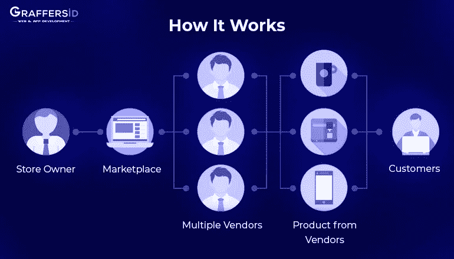
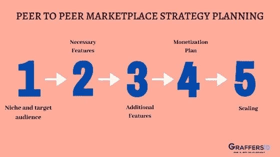
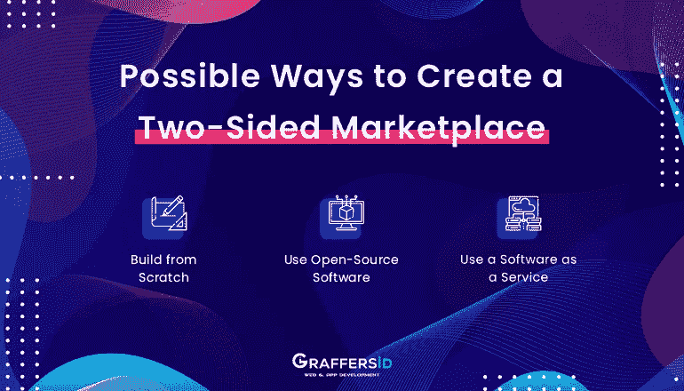

# 如何创建一个可扩展的点对点市场网站？

> 原文：<https://medium.datadriveninvestor.com/how-to-create-a-scalable-peer-to-peer-marketplace-website-a4351e21288b?source=collection_archive---------20----------------------->

电子商务市场正以每年 17-18%的平均速度增长。人们选择网上购物，而不是堵在车流中亲自去商店，这使得电子商务成为一种有利可图的投资和有效的商业工具。然而，传统的网上商店现在正在向点对点市场转变，这种市场如今越来越受欢迎。根据普华永道最近的预测，到 2025 年，共享经济有望增长到 3550 亿美元。

目前亚马逊、Etsy、Airbnb 和易贝等市场取得的巨大成功告诉我们，有了正确的想法和完美的实施，你也可以跻身其中。这是一个全面的指导，让你了解点对点市场，以及如何建立一个成功的商业模式。

博客内容包括:

*   **什么是在线 P2P 市场？P2P marketplace 与在线商店有何不同？**
*   **建立双边市场的好处**
*   **P2P 电子商务领域的著名玩家**
*   **构建点对点市场的基本构件**
*   **如何建立市场**
*   **在线 P2P 市场的典型特征**

**什么是在线 P2P 市场？**

点对点市场是一种在线商业模式，包括买卖双方共享产品和服务。例如，亚马逊为各种卖家提供了一个让他们的产品到达消费者手中的机会。优步让你预订一辆车去任何地方。P2P 模式也允许买卖双方互换角色。你可以预订一辆优步，你甚至可以成为该公司的司机。两个用户群都可以在一个对等的市场平台上自由地交换服务和商品。

Peer to Peer Marketplace

# P2P marketplace 与在线商店有何不同？

P2P 市场是一个双边市场，每个用户都可以拥有自己的店面来销售产品或服务。更具体地说，用户成为你的市场上的供应商，他们创建产品列表，从他们的帐户交换产品，获得评级等等，这是不可能通过在线商店实现的。

 [## 2019 年最值得学习的编码语言|数据驱动的投资者

### 在我读大学的那几年，我跳过了很多次夜游去学习 Java，希望有一天它能帮助我在…

www.datadriveninvestor.com](https://www.datadriveninvestor.com/2019/02/21/best-coding-languages-to-learn-in-2019/) 

说到技术方面，可以用 Magento、Spree Commerce 等这类电商平台搭建点对点的 marketplace 软件。你只需要在在线商店的顶部添加市场功能，让用户分享他们的产品。

How it Works

# 建立双边市场的好处:

**1。网络效果:**

你只需要给你的网站第一次推送就可以了，剩下的就由用户来做了。他们将完成推广你的服务的任务。

**2。财务效益:**

在线 P2P 市场涉及到用最少的努力赚钱。你不需要找供应商或者买家；买家和卖家都会光顾你的市场。所以，在这里你可以毫不费力地赚取丰厚的利润。

**3。地域自由度:**

当谈到在线双边市场时，用户的数量不限于你的位置。好发货的问题不是你能决定的，你只需要提供一个平台，买卖双方可以在这个平台上互动。所以，你网站上的潜在用户可能来自多个地方。

**4。简单:**

通过将项目外包给[离岸开发团队](https://graffersid.com/blogs/here-is-all-you-need-to-know-about-offshore-development-centre/)，你可以使开发点对点市场的整个过程变得更加容易。开发团队不仅会为你提供正确的帮助，而且还可以开发一个 MVP。

**5。金融无障碍:**

推出电子交易平台比投资发展成熟的电子商务或网上商店更经济。

# 点对点电子商务业务的著名参与者:

**Airbnb:**

Airbnb 的故事挺有意思的。Airbnb 成立于 2007 年，最初名为 AirBed&Breakast。当创始人 Brian Chesky、Nathan Blecharczyk 和 Joe Gebbia 发现参加 2007 年美国工业设计协会(IDSA)会议的旅客没有酒店房间时，这款应用程序便应运而生了。三个人在客厅里放上床垫，并创建了一个网站，为这个周末的房间做广告。他们通过网站找到了三个付钱让他们在他们家过夜的客人。

Airbnb 在 10 年里有超过 3 亿名客人入住，在该应用程序上注册的主机已经创造了超过 410 亿美元的业务。

[以下是 Airbnb 的工作方式，以及如何创建一个类似 Airbnb 的应用](https://graffersid.com/blogs/detailed-guide-to-create-an-app-like-airbnb/)。

BlaBlaCar:

BlaBlaCar 是一家总部位于法国的拼车初创公司，提供市场应用程序，为人们节省金钱和时间。该应用程序允许司机与前往该国同一个地方的人联系。BlaBlaCar 吸引了游客和买家。

汽油价格昂贵，该应用程序允许司机与前往同一地点的其他人分担长途旅行的费用。旅行者也发现与不介意同伴的司机一起旅行更方便，这也是一个比购买昂贵门票更实惠的选择。

**Etsy:**

喜欢复古，独特，手工制作的工艺品？如果是这样的话，Etsy 是找到你最喜欢的古董的最好地方。克里斯·马奎尔、罗布·卡琳和海姆·斯科皮克创建了 Etsy 来帮助人们出售他们制作的商品。Etsy 允许成千上万的手工艺者在一个网上商店出售他们的商品。

Etsy 允许供应商创建个性化的在线空间来推广手工产品，并作为回报向购物者提供古董产品。该公司通过列出每笔销售的费用和百分比来创收。

以下是在线市场被普遍使用的行业的更多例子，以及行业中的主要参与者:

# 构建对等市场的基本构件:

Peer to Peer Marketplace Strategy Planning

以下是推动点对点市场发展的概念:

**点对点商业模式:**

我们都在不断寻找最佳的商业交易。就像我们在物流、房地产和出租车中分别需要经纪人、代理人和司机这样的中介一样，在预订其他服务或购买商品的同时，我们也需要一个中介。当涉及到在线解决方案时，平台本身就成为了一个中介，让买家和卖家联系起来。

市场应用是共享经济的完美开端，因为它们终结了中介在这一过程中的角色。人们来到这个平台，它向他们收取一定比例的费用。这个费用或百分比比你传统购买商品时支付的要少得多。

**专注小生:**

当开始一个在线市场时，首先，重要的是了解问题在哪里，以及如何通过你的平台用技术解决它。Airbnb 和 BlaBlaCar 发现了他们周围的人面临的问题，并瞄准了一个利基市场。

如果你计划开发一个市场，你应该发现一个问题并使用市场商业模式解决它。建立一个共享经济平台可以归结为帮助两个市场连接起来，并消除对中介的需求。

**方便灵活**

在开发点对点市场平台时，记住平台应该为用户提供便利和灵活性。例如，Airbnb 允许人们很容易地从图片上提供的住宿选项列表中找到可供出租的房产。您还可以在应用程序中找到各种过滤器，如住宿类型、价格、客人数量、旅行类型等，这有助于您轻松找到合适的酒店。

类似地，TaskRabbit 是一个合作的 P2P 市场，它可以帮助你找到经过验证的任务执行者，他们可以到你家帮你修理断链或堵塞的管道。

**信任**

最后，但同样重要的是，信任也是点对点市场平台的重要组成部分。如果你设法在你的平台上建立信任，你将能够越来越快地扩张。

建立信任意味着您应该:

**1。关注供应:**

为了确保你计划创建的平台不会持续几天，为供应商创造一个简单且有指导意义的体验是很重要的。虽然许多人发现在网上购物或寻找东西很方便，但只有少数人习惯于运送产品或出租空间。

您可以为供应商提供一些免费服务，并为供应商建立论坛，让他们讨论挑战。

**2。人情味:**

考虑建立一个客户服务策略，以确保买家收到订单，期望得到满足，卖家得到报酬。最好通过电话和个人交流来增加人情味。

**3。验证策略:**

验证策略使用户在选择您的服务时更加自信。更好的方法是验证提供者和销售者在更高的水平上提供服务。验证可以自动执行，或者管理员可以手动检查服务提供商的合法性。

**4。应用可操作的评级系统:**

大多数服务使用星级评定系统，帮助在交易的两端评定用户。这些评级使公司能够过滤掉不良用户和服务提供商，从而提高每次交互的可交付性。

实施可操作的评级和审查系统还可以通过禁止用户来帮助您阻止欺诈行为。

**如何建立市场**

Possible Ways to Create a Two-Sided Marketplace

现在，我们已经解释了双面平台工作的所有要点，让我们看看如何构建一个平台。

你可以从头开始建立一个市场，也可以使用现有的解决方案。这完全取决于你的项目的预算和要求。

万磁王、Spree Commerce、Drupal 和 Sharetribe 是一些现成解决方案的常见平台，但是它们为定制实现增加了独特的功能需求。其中一些平台不能满足市场平台的需求，因为它们是为电子商务目的而创建的，而对于其他解决方案，如 Magneto 或 Drupal 您需要购买 marketplace 扩展来管理您平台上的内容。

在 Graffersid，我们从零开始建立我们的共享经济项目。这使我们能够创建具有独特架构和设计的解决方案。

**在线 P2P 市场的典型特征**

当构建一个点对点的市场平台时，你必须为用户提供一套基本的功能。通过这种方式，您可以让参与者轻松浏览您的平台。

简介:一个市场有两个用户角色:买家和卖家。需要为每个角色创建不同的用户界面。

**列表:**列表将涵盖您在平台上提供的服务或产品。对于卖家和消费者来说，列表也有不同的作用。对于供应商来说，他们应该能够添加、修改、发布、取消发布和删除列表。而另一方面，客户应该能够搜索，过滤和查看这些详细描述的清单。

**支付:**客户应该能够为使用你的在线平台付费。为用户提供借记卡、信用卡和 Paypal 等多种支付方式。

**评论和评级:**为用户提供离开评论和评级服务提供商的可能性。这将使客户在购买服务和产品时做出明智的决定。评级和反馈也创造了一种信任感和责任感。

**通知:**通知使用户能够及时了解他们的订单和报价的当前状态。例如，通过通知，一个应用程序可以通知用户他们的订单何时被处理、运送和交付。

**结论**

点对点市场开发仅限于两种解决方案:从头构建或购买现成的解决方案。根据您的项目需求、可用时间和预算，选择最适合您业务的方案。如果你有一个想法和想法如何开始，[给我们写封信](https://graffersid.com/contact/)寻求专业咨询。

*原载于 2020 年 3 月 3 日 https://graffersid.com***。**