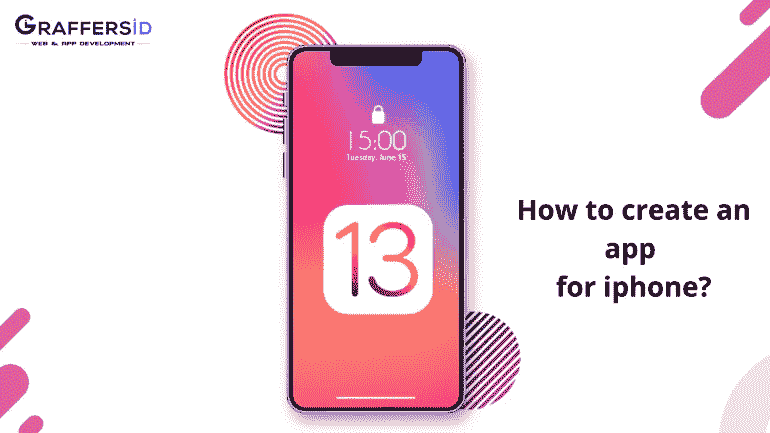
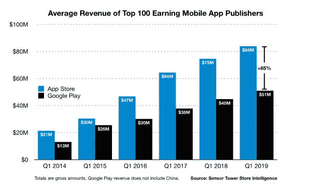

# 如何为 iPhone 创建一个 app？

> 原文：<https://medium.datadriveninvestor.com/how-to-create-an-app-for-iphone-ff64a8ac1ad0?source=collection_archive---------23----------------------->

起初，你会认为这是一个愚蠢的问题。有大量的在线教程和操作指南为您提供应用程序开发的见解。那么，另一个博客的要求是什么呢？这并不像看起来那么简单。

为 iPhone 开发一个应用程序就像是一个很难拖动的行。你对每一步都感到困惑，甚至可能会发现自己陷入诸如“我需要一台 mac 吗？什么是迅捷客观-c？问题还在继续。你知道吗，开发人员通常只遵循一组命令，而不知道其中有漏洞？好吧，在这个博客中，我们将告诉你要注意的漏洞和成功的方法。有太多的 [**离岸应用开发者**](https://graffersid.com/) 可以帮你做同样的事情。

**但是 iOS 和 Android 哪个更好呢？关于应用程序开发应该选择 iOS 还是 Android，一直存在激烈的争论。根据研究，一项研究计算了 AppStore 中应用的总数。当你读到这个数字时，你一定会大吃一惊。今天，AppStore 上有超过 170 万个应用程序。**

而且，如果最近的研究是可信的，那么 app store 产生了大约 150 亿美元的销售额，比 play store 大约多一半。因此，为 app store 或 iOS 创建一个应用程序是有利可图的。为了创造一个成功的，我们需要遵循一些建议和指南。

 [## 自然语言处理的五种金融应用|数据驱动的投资者

### 过去的五年对于自然语言处理领域来说是革命性的。我们从荣耀的 ctrl-f…

www.datadriveninvestor.com](https://www.datadriveninvestor.com/2020/09/17/five-financial-applications-of-natural-language-processing/) 

但是，我们需要问自己的首要问题是雇佣开发人员的正确流程？四种方法可以帮助你开发应用-

- DIY 还是自己动手

-雇用按小时计算的开发人员

-雇用内部开发人员

-远程专用开发人员

如果你预算紧张，这是开发一个应用程序最常见的流程。你可以为自己创建一个应用程序，但为此，你应该对所使用的技术堆栈有深刻的理解。

你首先需要的是 iOS 编程语言的扎实信息，比如 Swift、编码逻辑以及应用的架构。而且，在此之前，你也应该搞清楚用户界面/UX 的设计。

**基于小时的开发人员-**

你可以雇佣一个开发者，仅仅是为了项目的完成。他将一直致力于这个项目，直到它完成为止。此外，你需要保持沟通，并设置正确的截止日期。这是因为某些事情，如项目的截止日期和沟通，应适当强调。

**创建并雇佣你的内部团队:**

你可以雇佣你的开发人员，甚至训练他们完成某些任务。最好的部分是零沟通障碍，以及你可以随时关注他们。

如今，管理内部团队也遇到了很多困难。这是因为即使是内部团队也变成了远程团队。

**远程开发者** -
有时，你可能会因为身体上的限制而失去一名优秀的员工。但是有了远程团队的概念，你就可以雇佣与生俱来的人才，打造你的梦之队。

我们已经见证了外包领域，并且已经将我们的希望注入其中。已知的因外包概念而出名的例子如下-

*   阿里巴巴——他们选择了网站外包发展
*   whatsapp——他们通过外包团队开发了 messenger 的 iOS 版本
*   GitHub——外包了他们网站的后端。
*   Slack-该公司外包了他们网站的整个设计布局。

此外，如果你是一家初创公司，想要创造一个最低限度的可行产品，那么你可以选择外包。如果你担心如何找到合适的人才，不要担心，因为有发展良好的外包团队已经准备好了内部人才。

**#了解你的目标市场-**

嗯，往往是整个 app 开发过程中最容易被忽视的过程。如果你对谁是你的目标市场一无所知，你就无法创建一个成功的应用程序。因此，花时间研究目标市场。此外，收集到的信息将为您提供一些提示，帮助您更好地理解应用程序的创建过程。

**竞争对手分析-**

请找出一些有效的方法来做竞争对手分析，如下-

1.  **探索应用商店-** 彻底搜索应用，分析具有相似模式的应用并检查漏洞，这有助于它们吸引目标受众。
2.  **阅读 Apple store/play store 上的评论**——这些评论可以让你对一款应用有正确的认识。
3.  **最后，记下笔记和产品**——记下重要的部分或增值服务，它们可以帮助你获得创建一个成功应用的想法。

**勾画完美的 app 创意-**

本节包括理解和创建特定类型的应用程序的需求。确定你的应用程序将专注于什么？你的应用程序提供什么？你的主要市场是哪里？

一旦你理解并最终确定了这一点，剩下的过程就变得非常容易了。而且，无论发生什么都不要烦恼。你的应用类型或想法不一定要很大或具有开创性。保持你的想法切实可行。

**确定你的目标受众** -

这是决定你整个 app 开发流程的另一个重要步骤。让我们从一些重要的要点开始-

1.年龄——这是一个重要的标准，假设你想提供学术指导，那么一个从事机械工作的成年人不会有什么好处。

2.位置——语言、赞助广告的时间表和优惠可能在很大程度上取决于你的应用程序的位置。

3.兴趣——如果你的应用程序在某个特定的地方提供食物的优惠和折扣以及最佳推荐，那么你应该寻找并锁定喜欢尝试新地方的受众。而且，这可以在你的应用用户通过脸书登录时完成。它会读取他们的数据，并向你推荐同样的人。

货币化-

货币化是当今最困难的过程之一。为了达到同样的目的，我们可以记住以下几点-

1.  应用内广告——这意味着尽管你的应用是免费的，但它附带了一些附加功能。
2.  免费增值模式——这款应用是免费的，但其中一些内容是免费的。
3.  订阅模式-应用程序的主要部分只有在您订阅后才可用。
4.  付费模式——一次性购买后，该应用即可使用。
5.  付费增值模式——这是两种不同模式的结合。这样下载的应用程序是在付费后，但附加内容可能有购买或不购买的选项。

**为 iPhone 创建应用程序所需的技术堆栈-**

1.编程语言- Objective-C，Swift

为什么选择 swift？

众所周知，Swift 功能强大，被认为拥有动态库，因此提供了防错代码。而且，这是由于其强大的内联支持。

另一方面，Objective-C 是一种基于 C 的高级编程语言，它提供了面向项目的能力以及动态的例程环境。

2.集成开发执行程序- Xcode

3.软件开发工具包(SDK)- IOS SDK

4.可用的流行工具——Xcode、App code、Atom

**结束:**

最后，如果你想向专家咨询应用程序的开发过程，那就别再看了，联系 Graffersid.com**。这是一个屡获殊荣的名称，为其初创客户提供无可挑剔的创新 It 解决方案。如果您需要了解更多信息，我们只需一条 skype 短信！**

***原载于 2020 年 9 月 16 日 https://graffersid.com***。****

*****访问专家视图—** [**订阅 DDI 英特尔**](https://datadriveninvestor.com/ddi-intel)***