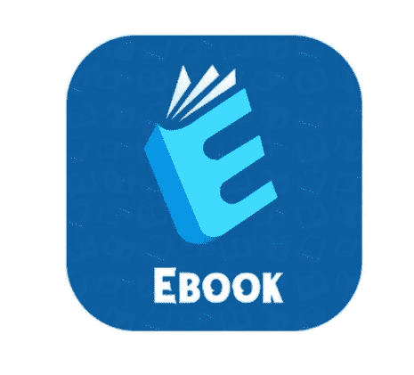
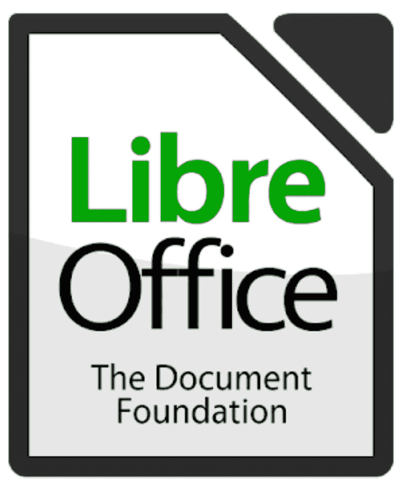

# 如何制作电子书(带音频)

> 原文：<https://medium.datadriveninvestor.com/how-to-create-an-ebook-81ae581212df?source=collection_archive---------11----------------------->

***电子书是以数字格式出版的书籍，可以在电脑、手机、电话等设备上阅读和显示。***

**使用的免费软件:**

***1)自由办公室***

*   这就像微软办公软件
*   它是自由软件
*   它包含所有的幻灯片，文档等。在一个地方
*   非常容易使用

***2)语法上***

*   用于检查语法和错误
*   自由软件
*   Play store 上提供的语法键盘应用程序
*   它的专业会员有一些额外津贴

**格式:**

*   epub
*   可移植文档格式文件的扩展名（portable document format 的缩写）
*   文件

**提高写作水平的技巧:**

*   使用较短的句子
*   减少行话、首字母缩略词和内部词汇
*   使用主动语态
*   待在原地
*   化繁为简
*   可读性应该是容易的

**出版:**

1.  ***亚马逊 Kindle***

在智能手机上阅读数百万本电子书，包括教科书和漫画。

2. ***苹果书籍***

Apple Books 的前身是 iBooks，是苹果公司为其 iOS 和 macOS 操作系统和设备开发的电子书阅读和商店应用程序。

希望你喜欢。

希望得到肯定的答复。

请关注我的@Medium 简介 [Yash Kamal Chaturvedi](https://yashkamalchaturvedi.medium.com/)