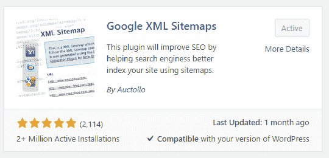
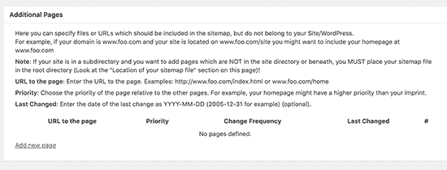
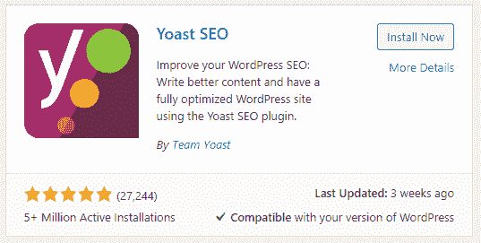
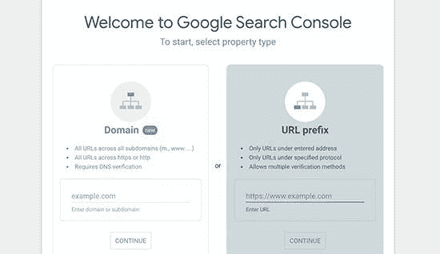

# 如何在 WordPress 中创建 XML 站点地图

> 原文：<https://medium.datadriveninvestor.com/how-to-create-an-xml-sitemap-in-wordpress-ccbbcdd00bc6?source=collection_archive---------28----------------------->

如果你想知道什么是 XML 站点地图，以及如何将它添加到你的运行在 WordPress 上的网站中，那么你来对地方了。我将详细解释什么是 XML 站点地图，它对你的网站有什么作用。拥有它的好处，以及如何使用 WordPress 为自己轻松创建一个。下面开始文章吧！

Photo by [Hal Gatewood](https://unsplash.com/@halacious?utm_source=medium&utm_medium=referral) on [Unsplash](https://unsplash.com?utm_source=medium&utm_medium=referral)

# 什么是 XML 站点地图？

XML 站点地图是一个包含网站所有内容的文件。它使得像 Google、Yahoo 或 Bing 这样的搜索引擎更容易索引内容并在其中导航。基本上，把你网站上的内容翻译成机器可读的代码。

起初，大多数网站在首页都有一个网站地图，目的是帮助人们在网站上导航和找到他们想要的东西。现在，这已经改变了 XML 网站地图，正如我们上面所说的，这只是为了机器和引擎来检测。

拥有一个网站地图不会提高你的搜索引擎优化排名，但它肯定会帮助搜索引擎更容易和更有效地抓取你的网站。这意味着内容会更多地出现在搜索结果中，这意味着你有时会获得更高的排名。

# WordPress 网站需要 XML 网站地图吗？

这个问题的简短答案是肯定的；从 SEO 的角度来看，网站地图对你的网站非常重要。正如我们上面简单提到的，添加一个站点地图并不会影响你的网站的搜索排名，但是它还是有帮助的。在你的网站上有一个没有被索引的页面，这不是一件好事，因为它不会出现在搜索结果中。这就是站点地图发挥作用的地方，因为它告诉搜索引擎在哪里可以找到这个页面。

当你第一次在网上建立网站或博客时，你的名字很难出现在搜索结果的顶端。即使你输入了网站的名称，有时它也不会出现在第一页，因为你没有任何可靠的反向链接来支持你。这就是为什么它很难出现在顶部，所以你的网站必须有一个 XML 站点地图。这样，即使没有大量的反向链接，引擎浏览器也知道在哪里可以找到页面和网站的整体结构。

不仅是新网站，甚至是最受欢迎的网站都需要 XML 站点地图，因为它告诉引擎重要的信息。例如，哪个页面更新最频繁，哪些突出显示的页面吸引了更多的查看者，等等。

# 如何为 WordPress 创建一个 XML 站点地图

为你的 WordPress 网站或博客创建一个 XML 站点地图并没有听起来那么难。你可以用许多不同的方法来实现这一点，我们将在下面一步一步地告诉你如何去做。你可以选择对你来说最简单的方法，然后按照说明去做。你将在几分钟内完成它，那是多么容易。

## **用谷歌 XML 站点地图插件在 WordPress 中创建 XML 站点地图**

这个插件是一个强大的工具，可以为你的 WordPress 网站创建最好的站点地图。你需要做的第一件事是从你的仪表板上的插件商店找到它并安装它。

安装后，您还需要激活插件，以便它提供的功能变得可用。如果您访问站点地图页面，您可以检查该过程是否顺利，如下所示。https://www.example.com/sitemap.xml
T3

这会打开你整个网站的 sitemap 索引页，这就是搜索引擎看到的。这些链接都是按时间顺序显示的，你可以看到它们最后被编辑的位置。如果你能看到这些东西，那么插件工作正常，而且它被配置为在大多数网站上工作。但是，如果你想确定你做得对，或者有什么地方出错了，请确保遵循下一部分，因为我们将显示它的最佳设置。

要开始调整设置，您需要进入**“设置”->“XML-网站地图”**

你会在顶部看到插件的状态信息。从那里，您还将看到从您的站点的 pingbacks 是否有任何问题。每个人都应该看到的基本选项是 PHP 内存限制、压缩选项等等。通常，默认设置适用于大多数站点。

继续，您将找到附加页面部分，从那里，您可以手动将页面添加到您的 XML 站点地图中。如果你的网站有不是由 WordPress CMS 构建的静态页面，这真的很有用。

下一部分是关于让插件知道哪些页面应该包含在站点地图中，哪些页面不应该包含在网站地图中。这非常重要，因为不同类型的网站需要向 XML 站点地图添加不同的内容。改变设置就像勾选或取消勾选一个框一样简单，根据你的网站类型，你必须自己找出这些设置。

## **用 Yoast SEO 在 WordPress 中创建 XML 站点地图**

这是为你的网站创建 XML 站点地图的另一个好方法。这里的好处是大多数人已经使用这个插件，因为它是最好的搜索引擎优化之一。

这里的第一步也是找到并安装插件。别忘了之后马上激活它。

完成所有操作后，进入**“SEO”->“General”**，然后选择**“Features”**选项卡。向下滚动到**‘XML Sitemap’**选项，打开它，如果已经打开，就保持原样。确保在离开页面前按下**“保存更改”**按钮。

打开后，您可以通过悬停在 XML 站点地图右侧的问号处并按下**“查看 XML 站点地图”**链接句子来检查站点地图是否创建无误。这样做后，你会看到网站地图，它有任何问题，你可以清楚地指出来。默认设置也适用于这里的大多数用户，除非你有一个电子商务，那么你也需要将你的产品添加到站点地图。

# 如何告诉搜索引擎你的 XML 站点地图

当你刚刚为你的网站创建了站点地图，也许手动发送站点地图到搜索引擎是可以的。但是他们通常真的很聪明，几乎能立刻察觉到它或它的任何变化。你可以在[谷歌搜索控制台手动添加 XML 站点地图。](https://search.google.com/search-console/about)注册后，您将被要求选择一种酒店类型。我们建议您选择 URL 前缀，因为它更容易设置。

输入您网站的网址，然后按下**‘继续’**按钮。接下来的部分有点棘手，因为你必须验证你的网站的所有权。如果你不精通技术，这个任务会显得有点复杂。然而，有多种方法可以验证它，所以选择一个对你来说更容易的方法。

现在，当你完成最后一步后，你会在你的仪表板上看到 sitemaps 标签，点击它。在那里，你可以通过点击**‘添加新站点地图’**按钮来添加你的站点地图，然后点击提交按钮。这个过程将花费谷歌一些时间，但不要担心它最终会完成。

# 关闭思路。

为你的网站创建一个 XML 站点地图，不管它是一个全新的网站还是一个现有的网站，都是一件很棒的事情。这将让你在网上更受关注，并有助于提升你的排名。

站点地图很重要，原因有很多，实现它们没有任何缺点。整个过程并不需要很多时间，结果可能比你最初想象的要多。如果这件事只会给你的网站带来好处，为什么不去做呢？问问你自己这个问题，然后花几分钟去解决它，你最终不会失望的。