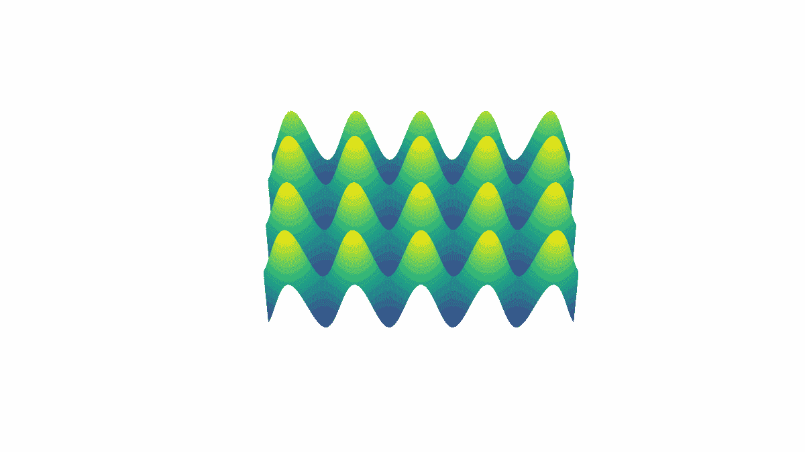
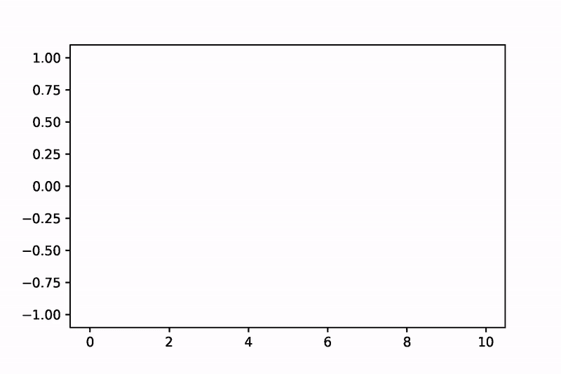
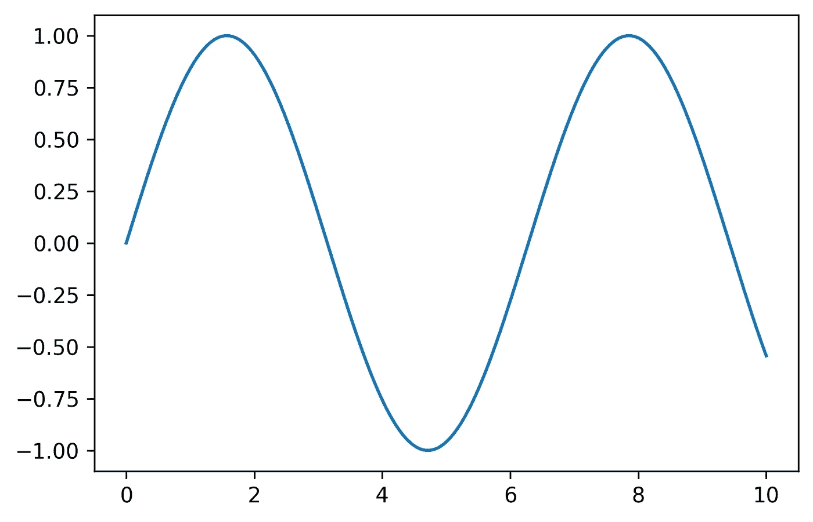

# 如何使用 Matplotlib 和赛璐珞创建动画

> 原文：<https://medium.datadriveninvestor.com/how-to-create-animation-using-matplotlib-and-celluloid-70533ba013e8?source=collection_archive---------0----------------------->

## Python 可视化

## Matplotlib 动画理解指南


Photo by [Hans Eiskonen](https://unsplash.com/@eiskonen?utm_source=medium&utm_medium=referral) on [Unsplash](https://unsplash.com?utm_source=medium&utm_medium=referral)

一张图胜过千言万语意味着图形比许多文字更能有效地传达思想。动画或者视频怎么样？[动画](https://en.wikipedia.org/wiki/Animation)或视频由许多画面组成。当然，动画可以更有效地传递思想。下一个层次是模拟。动画和模拟的区别在于，无论我们是否播放和重放一个动画，我们都会得到相同的结果(就像看电影一样)，但它不同于模拟。当我们改变参数时，模拟可以产生不同的结果。在这个故事中，我只是覆盖动画和简单地创建动画，使用 [Matplotlib](https://matplotlib.org/) 和[赛璐珞](https://pypi.org/project/celluloid/)。

在 Matplotlib 中创建动画可能需要复杂的代码。但是，结合 Matplotlib 和赛璐珞会给你一个令人兴奋的体验来创建动画。对我来说，这个程序不能应用于 3D 动画(仅 2D 动画)，因为我的笔记本被低估了(我的笔记本于 2013 年在:D 发布)。如果你的笔记本足够好，你可以用它。如果你想用 Matplotlib 制作和我条件一样的 3D 动画，可以执行[一个半手工的方法](https://medium.com/swlh/creating-3d-video-visualization-with-matplotlib-python-data-visualization-series-d8f5dfe1c460)。让我给你看我用 Matplotlib 创建的 3D 动画的例子。



3D animation with Matplotlib (*Image by Author* / Rizky MN).

这是我们在这个故事中想要创作的 2D 动画



2D animation with Matplotlib and Celluloid (*Image by Author* / Rizky MN).

您需要安装 Matplotlib 和赛璐珞，使用以下语法

```
pip install matplotlib
pip install celluloid
```

之后，导入一些模块，如下面的代码所示

```
import numpy as np
import matplotlib.pyplot as plt
from celluloid import Camera
from IPython.display import HTML
```

我们希望将正弦函数做成动画，所以用下面的代码创建模拟数据

```
x = np.linspace(0, 10, 500)
y = np.sin(x)
```

我们创建 500 个从 0 到 10 的数字作为 ***x*** 变量和 ***y*** 作为每个 sin 的值(x)。这里是 ***x*** 和 ***y*** 的线条图，如图 1 所示。



Figure 1\. Line plot of ***y*** as a function of ***x*** (*Image by Author* / Rizky MN).

我们要为每个 ***x*** 数据点创建 500 张图片，并按一定时间顺序展示，比如每张图片 10 毫秒。为了捕捉每一张照片，我们需要一台赛璐珞相机。你可以用这个代码。

```
fig = plt.figure(dpi = 300)
camera = Camera(fig)for i in range(len(x)):
    plt.plot(x[:i], y[:i], c = 'royalblue')
    camera.snap()
```

上面的代码会捕捉到 ***x*** 和 ***y*** 的每一个线条图，并保存在名为 ***camera*** 的变量中。如果您运行 Jupyter 笔记本代码，您将只得到一张图片，与图 1 相同。

要在 ***相机*** 中采集每张图片，可以使用下面的代码

```
animation = camera.animate(blit=False, interval=10)
```

代码将生成一个变量 ***camera*** 的动画，两个图片之间的间隔为 10 毫秒，并且没有用于过渡的 blit。你可以尝试不同的习惯，比如打开 blit 并设置不同的时间间隔。

如果你想在 Jupyter Notebook 中观看你创建的动画，你可以使用这个代码来显示它。

```
HTML(animation.to_html5_video())
```

如果你不使用 Jupyter 也没关系。您可以使用这段代码保存动画，而不用在 Jupyter 中观看它。

```
animation.save('animation_sin.mp4',
               dpi=300,
               savefig_kwargs={
                   'frameon': False,
                   'pad_inches': 'tight'
               }
              )
```

我们保存动画的名称为***animation _ sin . MP4***，每英寸 300 点(dpi)，没有帧，并设置垫为“紧”。让我展示一下保存动画的结果。

如果你想把它转换成。gif，你可以使用在线转换器或使用 ffmpeg。

```
ffmpeg -i animation_sin.mp4 -filter:v fps=fps=30 animation_sin.gif
```

代码会将***animation _ sin . MP4***转换为***animation _ sin . gif***，每秒帧数设置为 30。如果你没有安装 ffmpeg，你可以通过终端用这个代码安装。

```
sudo apt update
sudo apt install ffmpeg
```

## 结论

使用 Matplotlib 和赛璐珞，我们可以轻松地创建动画。但是它需要一件合适的设备来进行 3D 创作。使用的概念是将许多图片堆叠成一张。希望这个故事对你有用，遇到一些问题可以留下回应。谢了。

[](https://www.datadriveninvestor.com/2020/12/01/how-to-build-a-twitter-scraping-app-with-python/) [## 如何用 Python |数据驱动投资者构建 Twitter 抓取应用

### 每秒发出约 6000 条推文，每天发布 5 亿条推文，普通人甚至不能…

www.datadriveninvestor.com](https://www.datadriveninvestor.com/2020/12/01/how-to-build-a-twitter-scraping-app-with-python/) 

**访问专家视图—** [**订阅 DDI 英特尔**](https://datadriveninvestor.com/ddi-intel)