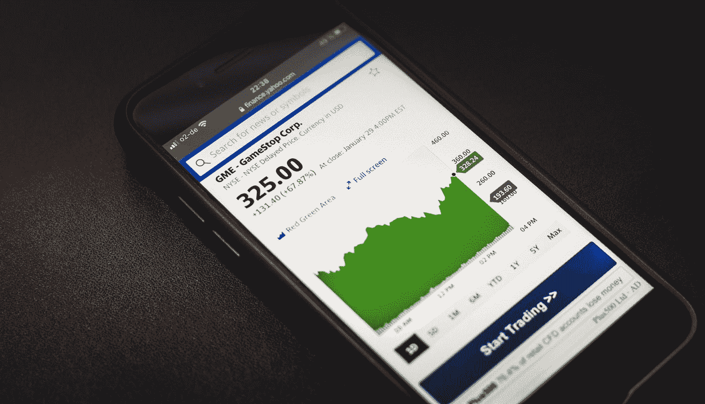

# 如何在不投资一分钱的情况下创造被动收入

> 原文：<https://medium.datadriveninvestor.com/how-to-create-passive-income-without-investing-a-single-dollar-fd2423014197?source=collection_archive---------32----------------------->

## 被动收入=财务自由

Photo by [Marvin Meyer](https://unsplash.com/@marvelous?utm_source=medium&utm_medium=referral) on [Unsplash](https://unsplash.com?utm_source=medium&utm_medium=referral)

无论你的雇主付你多少钱，你都不会满足于你朝九晚五的工作。这种工作糟透了。你不可能一直让你的老板满意。

创造性的被动收入至少可以支付你的房租或生活费用，这会让你放松。不管你从朝九晚五的工作中挣了多少钱，它都会给你带来财务稳定。

如果你真的想要生活中的财务稳定，拥有两份或更多的被动收入来源以及一份 12 小时的工作总是一个不错的选择。金融稳定和拥有大量负债资产是有区别的。

尽管我们有 6 位数的收入，但我们每月仍要支付信用卡账单和抵押贷款。一个工作收入有限、有更多被动收入来源的男人，总是比一个时不时吃点降压药、收入达到 6 位数的男人感到满足，而且身体健康。

## 开始创造人们会消费的内容

从早到晚，每个人都在消费内容。美国人平均花费 8 小时处理数据。内容行业正处于冠状病毒时期的繁荣期。

在互联网上，每个人都在消费，你建立了市场。尝试创造内容。举个例子，

1.  创建 Youtube 视频
2.  开始在线教学
3.  开始在社交媒体上写文章
4.  学习付费推广
5.  学习联盟营销

外面有很多选择，挑一个开始做吧。永远记住复利效应。你以后会感谢我的。

## 投资股票市场

Photo by [Michael Förtsch](https://unsplash.com/@michael_f?utm_source=medium&utm_medium=referral) on [Unsplash](https://unsplash.com?utm_source=medium&utm_medium=referral)

当你获得被动收入时，你可以支付账单或投资购买股票。这在两方面都有帮助。我将被动收入的 20%投资于内容创作工具，50%用于购买我想要的东西，其余 30%投资于股票。

投资你的被动收入比投资工作收入让你更放松。它以零风险创造财富。

我们永远不会满足于我们的收入，但我们可以享受生活，并通过开始被动收入流为自己赢得时间和平静。这有助于你在个人和经济上成长。