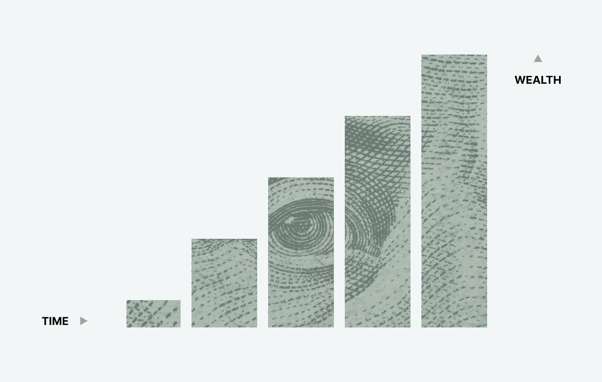
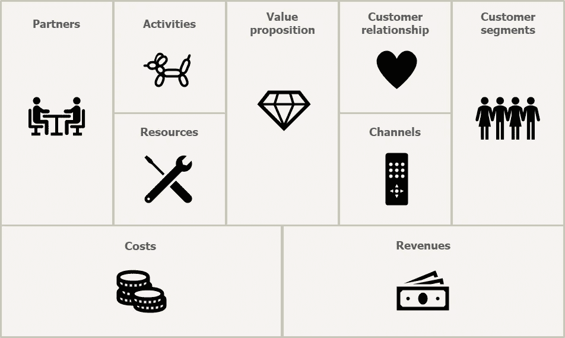
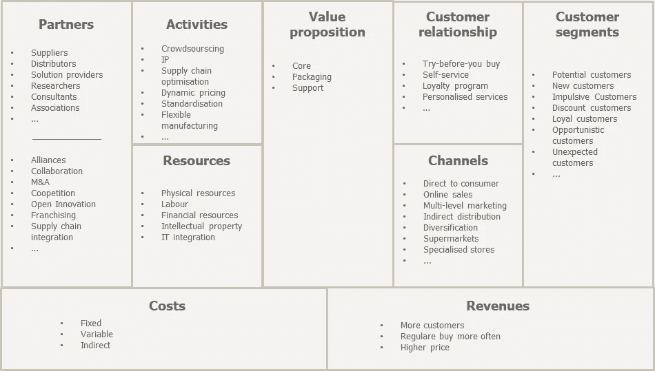

# 如何创建你最好的商业模式画布

> 原文：<https://medium.datadriveninvestor.com/how-to-create-your-best-business-model-canvas-yet-f3a51c53bc0c?source=collection_archive---------16----------------------->

Photo by [Morgan Housel](https://unsplash.com/@morganhousel?utm_source=unsplash&utm_medium=referral&utm_content=creditCopyText)

在阅读这篇文章之前，我强烈建议先浏览一下[商业模式创新的原则](https://www.thepourquoipas.com/business-model-innovation)。事实上，商业模式画布是一个漫长而富有成效的过程的**结论**，它将最终告知公司的整个战略。就像生活中的许多事情一样，旅程比目的地更重要；颠覆性商业模式也是如此。

也就是说，业务模型画布是一个非常强大的工具，因为它汇集了许多元素，可以在特定时刻提供公司业务模型的快照(稍后将详细介绍该过程的重现)。你可以想象，这个练习比仅仅在 15 分钟的头脑风暴研讨会上填写表格要复杂得多……一张**典型的**(空)**商业画布**看起来是这样的:

BMC example from [The Pourquoi Pas](https://www.thepourquoipas.com/how-to-business-model-canvas)

在进入我最喜欢的部分之前，让我们浏览一下每个子类别(拆开这个模型) :

# 伙伴

让我们从一个曲线球开始:**什么是合作伙伴**？继续，花一分钟考虑一下。

我通常喜欢提供以下列表来进行头脑风暴:

*   供应商
*   经销商
*   解决方案提供商
*   研究人员
*   顾问
*   联合

填写“合作伙伴”框意味着深入挖掘，不仅要回答问题“*谁是我们最重要的合作伙伴？*"，也是为了找到"*的答案，他们与我们的业务有什么关系，他们给我们带来了什么？*”。除了这个思考过程，还有另一个层次的反思:“*关键合作伙伴具备哪些基本能力？*“如果这些能力可以在内部培养，**供应链整合**可能是个好主意。其他值得考虑的行动:**开放创新**， **M & A** ，**特许经营**，**协作**，**竞合**……每个合作伙伴都需要一个具体的战略。

这个盒子端端正正(*明白了吗？*)符合[商业模式象限](https://www.thepourquoipas.com/business-model-innovation)的“**世卫组织**”部分。

# 活动

在商业模型画布的典型例子中，activities 只有这么一个小盒子，这一直困扰着我。因为它回答了所有问题中的“如何”问题，所以尽可能多的花时间在它上面似乎总是最重要的。简而言之，所有活动的总和构成了一个公司的价值链，可以通过改变价值链向客户提供强有力的价值主张。这可能意味着许多不同的事情(数百万！)，但以下是一些精选的示例:

*   众包
*   知识产权垄断
*   供应链优化
*   动态定价
*   标准化
*   柔性制造
*   …

记住要考虑到业务的各个方面。**亚马逊非常成功，不是因为它的平台很棒，而是因为它极其复杂的供应链和会计流程**。

# 资源

我们现在有什么可以支配的？近期可以收购什么？例如，知识产权就是一种巨大的资源。作为我们的忠实顾客。如果你看不出这两者之间有什么明显的联系，那也一样。商业模式是不完美的，你的怀疑是健康的。下面是需要了解的资源的简短列表:

*   物力
*   劳动
*   财政资源
*   知识产权
*   信息技术集成
*   …

这里需要记住两件非常重要的事情:公司的资源速度(**利润机制**)是多少，以及哪些资源对价值主张至关重要？改善前者并保护/优化后者是公司成功的关键。就拿 **Airbnb** 来说，他们的关键资源就是别人家。通过在他们和这些资产之间建立粘性，他们能够创建一个很少有竞争对手能够跨越的护城河。

# 价值主张

这是任何模式/公司的核心:**我们卖的是什么**？如果我把理论过于简化，一个公司有 4 项工作:**创造价值**、**沟通价值**、**传递价值**、**提取价值**。如果这四条中有一条不行，公司本身也不行(除了少数例外)。前 3 个是不言自明的，但后者需要一个解释。

当我们谈论提取价值时，我们强调**客户不一定会买你认为你在卖的东西**。一个简单的例子:工具公司可能出售钻头，但他们的客户购买孔。价值有三个维度:

*   **核心**:产品或服务本身的价值。是不是安全，好用，环保，时尚，质量上乘…？
*   **包装**:包括品牌等有形和无形的包装。
*   **支持**:交付、保修、维修、安装、附加服务、捆绑包…

为了优化目标客户的价值主张，必须准确了解他们购买的这三个组件的组合。记住价值主张**需要不同于竞争对手**也很重要(也很明显)。

# 客户关系

一旦客户被很好地理解(**)(见下文)，我们明白他们买什么(**什么**)(见上文)，这就相当简单了。致力于建立关系是一个轻松区别于竞争对手的机会，即使产品相似。为了优化商业模式的这一部分，重要的是要记住客户期望什么样的关系以及如何维持这些关系:不同的细分市场需要不同的关系！**

**客户关系可以通过多种方式建立:**

*   **先试后买**
*   **自助服务**
*   **忠诚度计划**
*   **个性化服务**
*   **…**

**这样的例子不胜枚举。**

# **频道**

****你如何与不同的客户群沟通和销售？他们的期望是什么？这些渠道是否整合到公司的其他活动中？这些都是需要尽快回答的关键问题，因为我们看到数字渠道的兴起增加了销售和信息传递的可能性。****

****下面是通道盒的几个订书钉:****

*   **直接面向消费者**
*   **在线销售**
*   **多层次营销**
*   **间接分配**
*   **多样化**
*   **超市模式**
*   **专业商店**
*   **…**

**你可能拥有世界上最棒的产品。你可能拥有世界上最棒的顾客。如果你不能将两者联系起来，这一切都将毫无价值。**

# **客户群**

****世卫组织？**这就是我们通过这个钥匙盒询问的内容。我们的目标是谁？哪个群体/细分市场？哪一组对业务最重要？我们怎样才能最好地理解这些人？他们背后是谁在幕后操纵？10 年后，他们还会在这里吗？人物角色是这里的关键:每个团队的痛点是什么？产品如何回答这个问题？**

**顾客(显然)以非常不同的形式出现:**

*   **潜在客户**
*   **新客户**
*   **冲动的顾客**
*   **折扣客户**
*   **忠诚的顾客**
*   **投机顾客**
*   **意外的顾客**
*   **…**

**对每一项进行规划是成功的关键。重要的是要记住，我们在这里讨论的是真实的人:经验、品质、自主性、社区、认可都是需要牢记的关键词。**

# **成本和收入(盈利模式)**

**商业模式画布的一个关键问题是它对成本和收入的痴迷，而忽略了利润。先说清楚一件事:**公司目前的理念是，它的存在是为了用利润回报股东** ( [我知道，我也讨厌](https://www.thepourquoipas.com/post/tech-monopolies-killing-the-world))。**

**在野外几乎没有成本(固定成本、可变成本和间接成本)，只有 3 种增加收入的方法(更多的客户、更高的价格、客户更频繁地购买)。我们对此无能为力:提醒一下:**从数学上讲，优化收入和利润是不可能的**(更高的利润=更少的可变成本=更低的产量=更低的收入)。只有找到正确的利润公式(**为什么**一家公司以特定的方式做生意)，成功才会发生。​**

**这里要说的足以写一整本书，所以最好的办法是[看一看所有的商业模式](https://www.thepourquoipas.com/business-model-archetypes)，了解每一种模式是如何创造独特的盈利机制的。**

**在练习结束时，业务模型应该填充了上面提供的所有信息，如下所示。这不是一个简单的练习。这是一个不完善的框架。这就是为什么寻求具有业务转型经验的专家的支持很重要，以确保公司战略的任何方面都不会被遗漏。**

****

**From [The Pourquoi Pas](https://www.thepourquoipas.com/how-to-business-model-canvas)**

**但是等等，还有更多。阅读下一章: [**商业模式画布的一切毛病**](https://www.thepourquoipas.com/post/problems-with-the-business-model-canvas) 。**

**[**本文**](https://www.thepourquoipas.com/how-to-business-model-canvas) 最初发布在我的博客上，[**的 Pourquoi Pas**](http://thepourquoipas.com/) 。来打个招呼吧！**