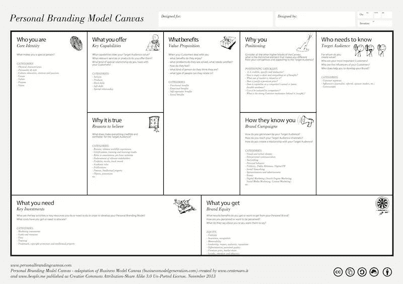
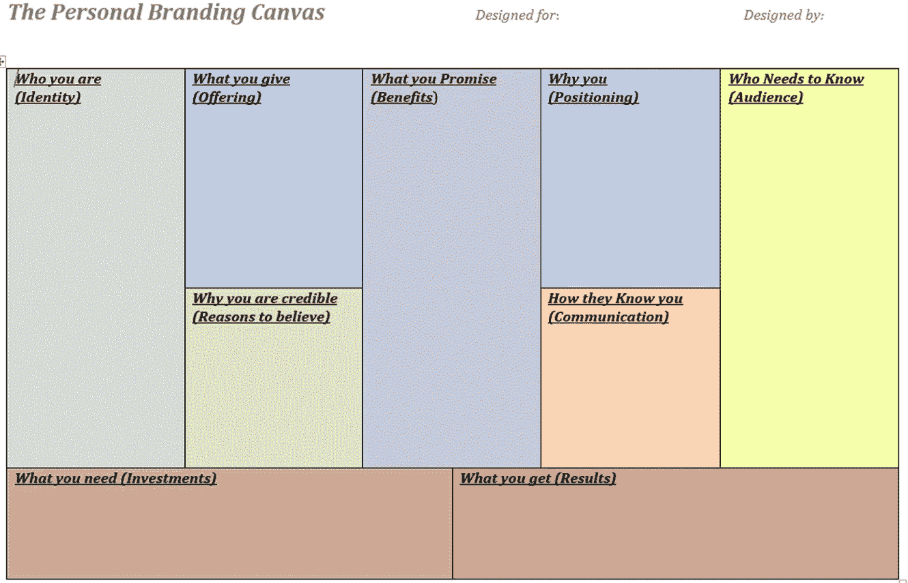
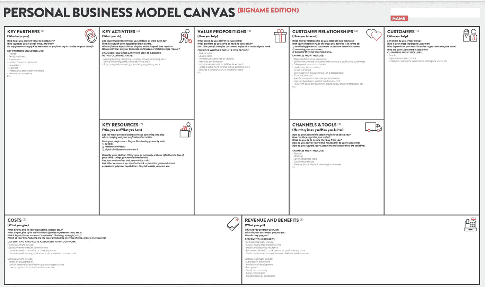
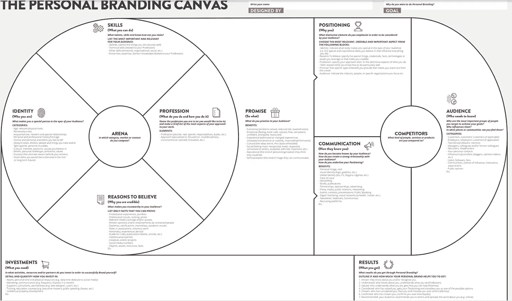

# 如何创建你的个人品牌画布

> 原文：<https://medium.datadriveninvestor.com/how-to-create-your-personal-branding-canvas-b1ffa5252e59?source=collection_archive---------0----------------------->

## 以及为什么它很重要

Photo by [Danielle MacInnes](https://unsplash.com/@dsmacinnes?utm_source=medium&utm_medium=referral) on [Unsplash](https://unsplash.com?utm_source=medium&utm_medium=referral)

当我在东安格利亚大学教授名为“就业能力、创造力和个人发展”模块的课程时，我希望我的学生完成的一个研讨会练习是个人品牌画布。我相信个人品牌已经成为年轻人进入就业市场的关键要求和优势之一。

当你谷歌自己的时候会出现什么？这是你的[谷歌商数](https://www.wsj.com/articles/BL-ISB-145)，它已经成为你个人品牌的关键部分。每当你有一个工作面试，你的招聘人员会谷歌你，检查你的社交媒体档案。因此，你的 LinkedIn 页面是你在线职业形象的另一个标志。你的工作是设计和建立你的在线个人形象，使它最好地反映你的个人品牌。例如，比尔·盖茨是这样介绍他的网页的:

“我很幸运能和优秀的人一起工作，并专注于世界面临的一些最棘手的问题。比如开发低碳廉价的能源，改善全球最贫困人口的健康状况，努力寻找改善我们教育体系的最佳途径。我将在脸书上分享关于帮助我们取得进步的伟大组织、理念和事件的笔记。加入我们，了解更多信息，或者添加您的想法和观点。谢谢你的来访。”

如您所见，该陈述简短、重点突出、清晰且具有对话性。它欢迎读者，强调邪恶的问题，并与他们建立个人联系。这很好地反映了比尔·盖茨的个人品牌。《比尔的大脑》是另一部深入探讨这位标志性企业家的生活、目标和激情的纪录片。这部纪录片也是一个强有力的声明——比尔·盖茨个人品牌的完美延伸:

当然，个人品牌不仅仅是在线展示。你的个人品牌也涉及到人们对你的看法，以及当你不在场时他们是如何谈论你的。是天赋、优势、技能、价值观和经历的独特组合造就了你。随着零工经济的持续增长，几乎占到了全部劳动力的一半，普通员工几乎每年都会换工作。这就是为什么你需要提供充分的证据来证明你能为你申请的组织做出贡献。是什么让你滴答作响？你主张什么？你为什么每天早上起床？你热衷于什么？什么带给你快乐？你将如何在你的领域变得更好？你对这些问题的回答将在很大程度上塑造你的个人品牌。

你的个人品牌应该反映你独特的优势、才能和真实性。想想理查德·布兰森的个人品牌:他是疯狂、疯狂实验、冒险、冒险和娱乐的典范。他的价值观和个性闪耀在维珍公司的各个角落。

要建立强大的个人品牌，你需要投资自己，建立长期战略，成为你所在领域的优秀实践者、思想领袖、专家。由于你在你的领域长期致力于学习、发展和实验，你将获得信任、认可和尊重。想想奥普拉——她激励了数百万人去发现他们自己的潜力。二十多年来，她一直坚持这样做，她总是为思想和灵魂提供积极的信息。

我们已经确定了个人品牌对你的生活和职业的重要性，现在让我们来介绍一下个人品牌画布。

Photo by [X.J Qian](https://unsplash.com/@the0utsider?utm_source=medium&utm_medium=referral) on [Unsplash](https://unsplash.com?utm_source=medium&utm_medium=referral)

# 个人品牌画布

[个人品牌画布](https://bigname.pro/personal-branding-canvas/)由 [Luigi Centenaro](https://centenaro.it/en/2015/personal-branding-canvas-wired-next-fest2/) 创作，旨在帮助个人系统地思考自己的个人品牌并加以改进。

Centenaro 的灵感来自 Tim Clark 和 Alex Osterwalder 在商业模式画布上的工作，他创建了个人品牌画布，以帮助个人更好地在市场中定位自己。

这个工具的好处是它非常全面和直观——你可以在一个页面上创建和绘制出你所有的个人品牌元素。它非常实用和用户友好，因为它给你一个战略概述，告诉你如何在就业市场上最好地定位你自己、你的技能和你的知识。

个人品牌画布由九块组成:

1.  你是谁(核心身份)
2.  你能提供什么(关键能力)
3.  为什么你是可信的(相信的理由)
4.  你能提供什么好处(价值主张)
5.  为什么是你(定位)
6.  他们如何认识你(沟通)
7.  谁需要知道(目标受众)
8.  您需要什么(关键投资)，以及
9.  你得到的(结果)。

当你规划和构建这九个模块时，你实际上是在构建和提升你的个人品牌。

Image [Source](https://bigname.pro/toolkit/politicians-visibility-difference/)

# 练习:创建您的个人品牌画布

完成这个练习大约需要半个小时。请立即创建您的品牌画布。让我们一个接一个地检查这九个方块，以便你能完成每个方块。

 [## 抓住智能营销，获得巨大成果|数据驱动的投资者

### 网上的人都看过。每当人们在谷歌上搜索某样东西，他们最终都会与类似的广告互动…

www.datadriveninvestor.com](https://www.datadriveninvestor.com/2020/08/19/grab-on-to-intelligent-marketing-for-great-results/) 

请随意将您的回答列成要点。不要想太多，尽量快速写下来。

Image Created by Author

我们首先从画布上关于你的观众(你的信息的接收者)的部分开始。

## 1.谁需要知道？(观众)

在这一部分，请思考谁是你的受众。在我的课堂上，我要求我的学生找出他们将要申请的公司。这些公司和部门将是这项活动的受众，因为学生们的目标是通过他们的个人品牌来提高他们的就业能力。如果你想增加你的就业能力，你可以把你的招聘人员放在这里。如果你想把你的个人品牌传达给你的客户，你可以想想你为之创造价值的客户和社区。

## 2.为什么是你:(定位)

在这个盒子里，想想为什么这些公司要雇佣你而不是其他人。是什么让你成为一个有吸引力的候选人(或商业伙伴)？是什么让你在竞争中脱颖而出？列出让你与众不同的独特元素。

## 3)您能提供哪些好处:(主要好处)

在这一部分，请列出你能为你工作的公司提供的所有好处。你如何增加价值？你会带来什么？你的客户能享受到什么好处？描述一下如果他们雇佣你，你能为公司做出的贡献。这是一个好主意，提出证据，说明你的就业技能和知识在这一部分。

## 4)他们如何认识你:(沟通)

你的客户或公司将如何联系你？他们如何了解你以及你能提供什么？在这个专栏里，我鼓励我的学生思考他们求职的所有阶段，以及他们如何才能最好地向雇主展示自己的优势。例如，你如何在简历中最好地展现你的相关技能和知识？你如何在求职信中展示与工作要求相匹配的职业经历？你如何在面试中讲述你最有说服力的故事和经历？

然后，我们继续个人品牌画布上描述你是谁的部分。

## 5)你是谁:(核心身份)

在这一部分，你将首先思考你的个人历史、家乡、背景、家庭、教育和城市。您从哪里来？你有什么独特之处？是什么让你成为一个特别的人？然后你将继续你的个性、价值观和激情。你主张什么？你想达到什么目的？你最大的目标和抱负是什么？你觉得自豪的是什么？你也可以在这里分享你的兴趣和爱好——但是要确保它们是集中的和具体的。

## 6)你所做的:(提供)

在这一部分，你可以向顾客展示你能提供什么。你的主要产品和服务是什么？你如何提供价值？你如何为你工作的公司创造价值？在这一部分，我鼓励学生思考他们能为雇佣他们的公司提供的所有资格、技能和特殊知识。这些可能包括拥有驾驶执照、能够旅行、会说特定的语言、编码、创建网站或使用软件。

## 7)为什么你是可信的:(相信的理由)

在这一部分，你可以回顾到目前为止你的成功记录和成就。你凭什么可信？你的观众怎么能信任你？到目前为止，你的成就和贡献是什么？有你已经完成的样本项目吗？你有任何证书或荣誉吗？请列出所有这些。

## 8) ROI(投资回报)部分

在这一部分，你可以想象如果你实现了所有目标，你将如何从你的个人品牌努力中获益。你会得到什么好处？你如何定义自己的成功？你会获得知名度、销售额、市场份额或新的网络吗？在这一部分，我鼓励我的学生列出如果他们被录用将会得到的所有好处和结果。工资、养老金、其他福利、工作保障、职业发展机会、学习、发展、支持网络、认可、晋升等。

## 9)你需要什么:(关键投资)

在这一部分，你需要列出所有你需要做的事情来投资你的个人品牌。你将如何投资自己？你将如何继续学习和阅读？你将发展哪些技能和知识？你将参加什么类型的课程？我建议我的学生列出他们需要完成的所有行动，以提高他们的就业能力，获得他们梦想的工作。

你可以看到我今天在研讨会教学中准备的个人品牌画布样本。我只是即兴发挥，打出这些要点，为我的学生提供一个基线和指导，让他们提出自己的版本。这里的重点是就业能力。

Image Created by Author

# 附加画布选项

如果你认为自己是一个企业家，你也可以完成这个画布的商业版本。这个版本被称为“个人商业模式画布”，它更类似于经典的商业模式画布。如果你的主要重点是发展你的企业家精神和业务，而不是发展你的就业能力，你可以完成这个版本。

Image [Source](https://bigname.pro/professional-innovation-toolkit/)

最近[更新了个人品牌画布工具](https://bigname.pro/toolkit/new-canvas-launched/)，使其更加全面和面向行动。你可以在下面找到这个最新版本。你可以在这个[链接](https://bigname.pro/personal-branding-canvas/)上下载这个新版本。

Image [Source](https://bigname.it/opt/pdf/PersonalBrandingCanvas-ENG.pdf)

## 法赫里·卡拉卡斯是[自制工作室](https://www.amazon.co.uk/Self-Making-Studio-Inspirational-Self-Discovery-Employability/dp/173077282X/)的作者。你可以在这里探索更多[。](https://selfmakingstudio.com/)

## 访问专家视图— [订阅 DDI 英特尔](https://datadriveninvestor.com/ddi-intel)