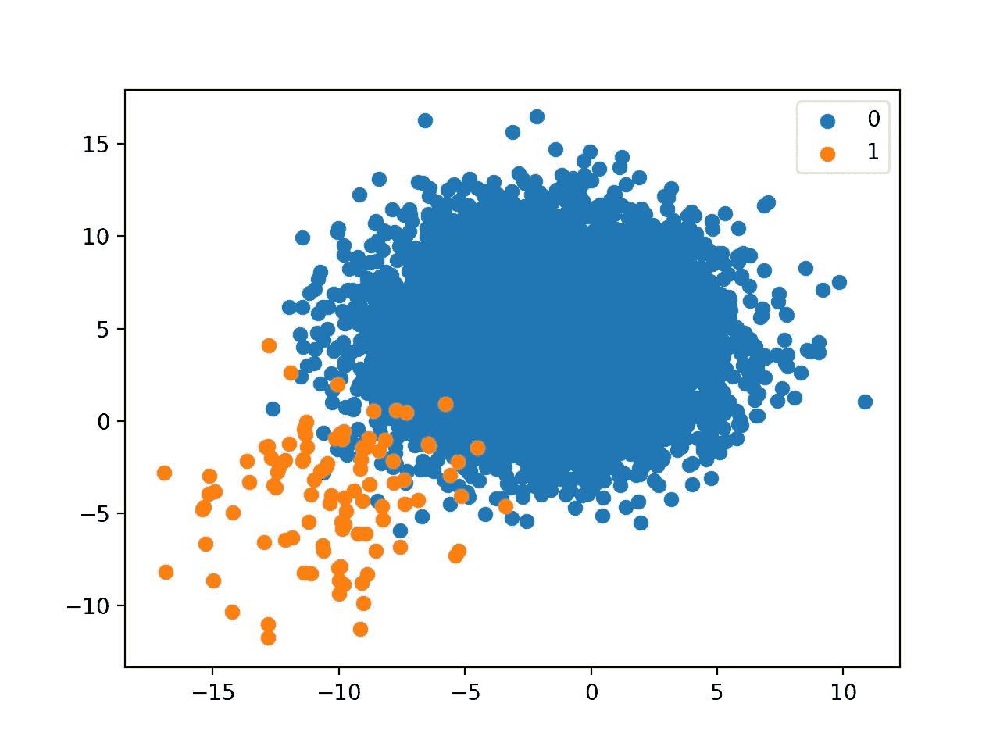
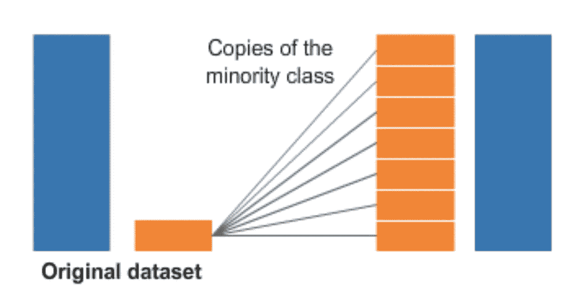
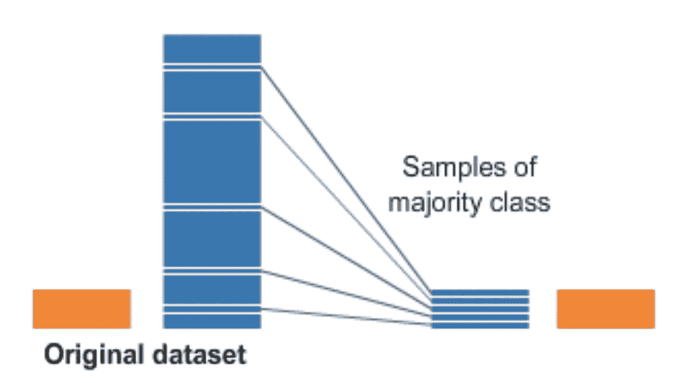
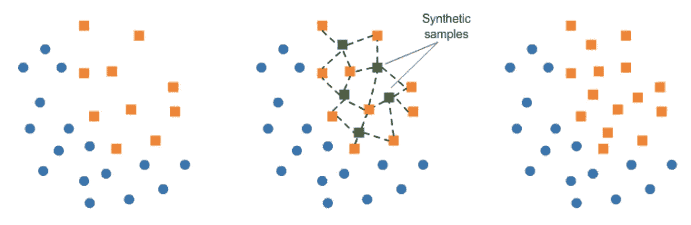

# 如何应对阶层失衡

> 原文：<https://medium.datadriveninvestor.com/how-to-deal-with-class-imbalance-b151b9b5659f?source=collection_archive---------6----------------------->



在处理分类问题(二进制或多进制)时，如果一类数据的总数远远小于另一类数据的总数，则称为类不平衡。例如，您可能有一个包含 100 个实例(行)的 2 类问题。共有 80 个实例被标记为类 1，其余 20 个实例被标记为类 2。

处理阶级不平衡的一些方法是:

## 上采样

上采样意味着复制少数类来处理类不平衡。如下图所示，橙色类占少数，通过创建橙色类的多个副本来处理类不平衡，直到橙色类等于蓝色类。



## 向下采样

下采样使用从多数类中随机选择的数据点来处理类不平衡。如下图所示，蓝色类别占大多数，只有随机选择的数据点与橙色类别的数量相同。



## 调整类别权重

处理类不平衡最简单的方法之一就是在算法中使用平衡类权重参数。默认情况下，sci-kit-learn 中逻辑回归的类权重是 None，这意味着这两个类在调整模型时具有同等的重要性。或者，您可以通过`'balanced'`来分配与该类的频率成反比的权重。

```
lr_weighted = LogisticRegression(class_weight = ‘balanced’)
```

## SMOTE [(合成少数过采样技术)](https://www.youtube.com/watch?v=U3X98xZ4_no&t=384s)

SMOTE 在少数类中创建更多的样本，不是通过复制现有的数据点，而是通过在可能性范围内创建新点。换句话说，它在现有数据周围创建新的数据点。

[](https://www.datadriveninvestor.com/2020/07/23/learn-data-science-in-a-flash/) [## 一瞬间学会数据科学！？数据驱动的投资者

### 在我之前的职业生涯中，我是一名训练有素的古典钢琴家。还记得那些声称你可以…

www.datadriveninvestor.com](https://www.datadriveninvestor.com/2020/07/23/learn-data-science-in-a-flash/) 

SMOTE 通常是处理类不平衡的一种强有力的方法，但由于维数灾难，当您拥有大量要素时，它会遇到计算问题。



## *来源:*

[](https://machinelearningmastery.com/tactics-to-combat-imbalanced-classes-in-your-machine-learning-dataset/) [## 应对机器学习数据集中不平衡班级的 8 个策略——机器学习掌握

### 2020 年 8 月 15 日最后更新，你遇到过这种情况吗？您正在处理数据集。你创建一个分类…

machinelearningmastery.com](https://machinelearningmastery.com/tactics-to-combat-imbalanced-classes-in-your-machine-learning-dataset/)  [## SMOTE 的观点:合成少数过采样技术

### 返回文章细节 SMOTE:合成少数过采样技术

jair.org](https://jair.org/index.php/jair/article/view/10302/24590) 

## 访问专家视图— [订阅 DDI 英特尔](https://datadriveninvestor.com/ddi-intel)