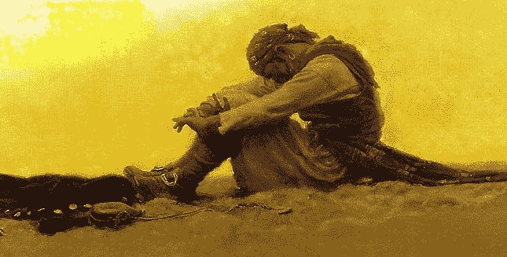

# 如何应对孤独

> 原文：<https://medium.datadriveninvestor.com/how-to-deal-with-loneliness-d3b36d3fc3f?source=collection_archive---------3----------------------->

Photo by [Jeremy Cai](https://unsplash.com/@j?utm_source=medium&utm_medium=referral) on [Unsplash](https://unsplash.com?utm_source=medium&utm_medium=referral)

孤独糟透了。亚里士多德甚至提出，任何不太担心孤独生活的人实际上不是人，而是动物或神。这主要是因为他相信社交和友谊是人类的基本组成部分。因此，他认为孤独是一种应该避免的状态。

这种对孤独的厌恶也反映在目前的研究中，这些研究表明，感到孤独会对福祉以及更多地使用医疗服务和负面经济影响产生负面影响，因为它能够降低员工的健康水平。关于最后一个问题，据估计，孤独每年给英国雇主造成 25 亿英镑的损失。

 [## 如何让人们真正倾听你|数据驱动的投资者

### 没有神奇的五步公式。这可能不是你现在想听到的，但相信我，从长远来看，这是…

www.datadriveninvestor.com](https://www.datadriveninvestor.com/2020/03/22/how-to-get-people-to-really-listen-to-you/) 

这项研究还发现，在年轻人群中，尤其是男性中，孤独感更为普遍。孤独老人的常见刻板印象并不成立，因为孤独感似乎实际上随着年龄的增长而减少！

我们当然是群居动物。毕竟，古代文化使用排斥和隔离作为酷刑和惩罚的主要形式是有原因的！

然而，应该注意的是，存在主义对孤独有着稍微不同的看法。他们不把它看作是一个独立的、有纪律的状态，而是把它看作是人类的一个基本组成部分。想想看…你独自来到这个世界，独自一人度过一生，除了短暂的真正的人类交往，然后孤独地死去。麦克亚当斯写道:“对于我们群居物种的任何成员来说，这是一个多么残酷的结局啊！”，他将群居定义为复杂的社会行为者。”*作为最后的侮辱，我们必须离开社交世界——这个群体——在那里我们首先表达了我们的心理个性。我们作为社会演员开始生活，在团体中表演。无情地社交直到最后一刻，我们孤独地死去。”*

Photo by [Jake Weirick](https://unsplash.com/@weirick?utm_source=medium&utm_medium=referral) on [Unsplash](https://unsplash.com?utm_source=medium&utm_medium=referral)

萨特相信认知孤独，这是由我们渴望意义的意识和我们所居住的世界的孤立和虚无之间的矛盾引起的。这反过来又导致我们与其他人接触，同样陷入孤独的形而上学的存在。当我们脱离这种关系时，那才是真正的孤独。从某种意义上说，我们一直都是孤独的，即使有其他人在场，我们也非常清楚，没有人比我们自己更了解我们。

很少有思想家像马丁·布伯那样对相互交往的问题给予如此多的思考。在《我与你》一书中，布伯认为，对我们来说，生存最基本的方式是人际交往。我们不是不受他人影响的孤独生物。相反，我们生活在一个充满变化的关系和互动的复杂世界中。他认为，生命本身就是由这种混乱的互动，主体间性的冲突来定义的。

通过这一点，布伯提出存在有两种类型:我-它和我-你。在前一种情况下，我们接近另一个人，就好像他们是一件物品或工具。我们把人看作达到目的的手段。从这个意义上来说，我们无法与这个人进行全面的交流。

在“我-你”的方法中，我们*遇到*对方，创造了一种相互的互动，在这种互动中，每个个体都认识到对方的主体性。在这里，我们开发了布伯所说的“中间空间”,一个同居、亲密和理解发生的空间。这就是生活。

Photo by [Kelsey Chance](https://unsplash.com/@kchance8?utm_source=medium&utm_medium=referral) on [Unsplash](https://unsplash.com?utm_source=medium&utm_medium=referral)

像亚里士多德一样，布伯认为一个只以“我-它”或“我”生活的人不是人。做人就是要被别人体验，也要去体验别人。布伯如何解决我们不能一辈子都生活在某种乌托邦式的“我-你”状态中的问题？有时，我们会不可避免地发现自己喝醉了，独自一人在公寓里，在笔记本电脑显示器的灯光下吃着一桶冰淇淋？

布伯认为，生活在“你”的规则下要比生活在“我”的规则下好得多。也就是说，对他人的首要关注和既得利益要比专注于自己的认知好得多。

这并不容易，尤其是对于那些已经经历了许多日日夜夜孤独痛苦的人来说。正如马克·金威尔在*中指出的那样，“人们觉得分手(更有甚者，濒临死亡)如此令人不安和沮丧的一个原因是，他们一下子失去了一个他们已经习惯于一起计划娱乐活动的人，不管这些娱乐活动是什么。失去了未来，也就失去了一种整体感或认同感，无论这种感觉多么脆弱和多变。”*

Photo by [Mike Labrum](https://unsplash.com/@labrum777?utm_source=medium&utm_medium=referral) on [Unsplash](https://unsplash.com?utm_source=medium&utm_medium=referral)

当没有人给他们机会的时候，一个人怎么能找到爱其他人的力量呢？或者更糟糕的是，谁曾一度感到孤独的避难所，却在一个悲惨的时刻被剥夺了这种救赎？Buber 并没有暗示这样的任务是完全可能的。但在尝试这样做的过程中，我们曾经短暂地逃离了天真的信念，即我们可以摆脱孤独。最后，孤独是我们一生的伴侣，所以我们不妨习惯它，并希望达到某种形式的接受。

金威尔后来写道:*你不可能独自快乐，也不可能一起快乐。哀悼是哀悼失去一个可能的未来，一个现在永远不会发生的未来。一切都会结束，包括你。爱情不是永恒的，它甚至不是耐寒的。接受这一点需要一种形式和足够的勇气，除了你自己没有人会看到或欣赏。这一切你都改变不了；你必须忍受它。这是好笑还是悲哀？你知道两者都是，又一次都不是——和往常一样——这才是重点……起来。开始吧。从床上走到淋浴间。*

*“记住，这是你一天中最难做的事情。”*

金威尔，M. (2005 年)。捕捉和释放:鳟鱼捕捞和生命的意义。纽约，纽约:企鹅图书公司。

曼海姆，W. (1974)。马丁·布伯。纽约:Twayne 出版社。

麦克亚当斯博士(2018 年)。个性发展的艺术与科学。纽约:吉尔福德出版社。

年轻与孤独:关于“孤独”的新全球研究。(2020 年 5 月 28 日)。检索自[https://www . latestresearch news . com/2020/05/28/young-people-most-lonely/](https://www.latestresearchnews.com/2020/05/28/young-people-most-lonely/)