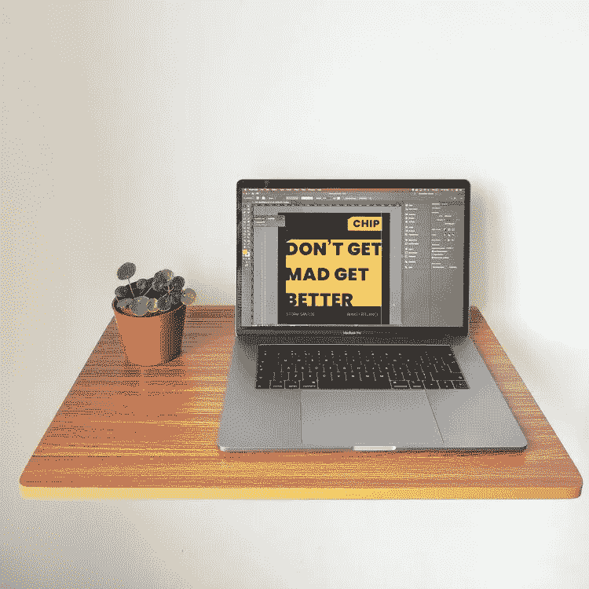
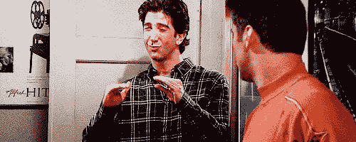
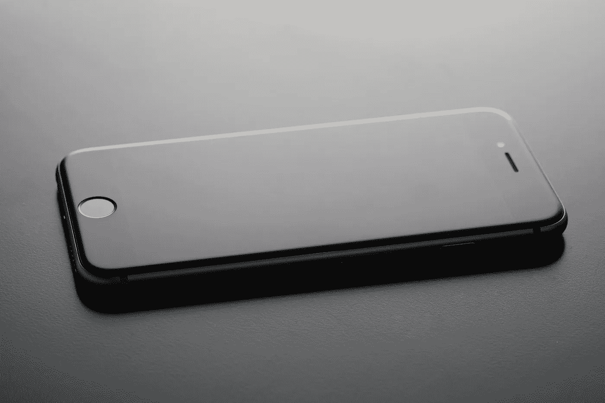

# 在家工作时如何提高工作效率

> 原文：<https://medium.datadriveninvestor.com/how-to-deal-with-working-from-home-e3b3ed25c78?source=collection_archive---------21----------------------->

鉴于当前的疫情，我们大多数人现在都在家工作，但并不是所有人都习惯远程工作，或者在被扔进深水区之前接受过任何提示或培训。

你怎样才能确保自己在不丧失理智的情况下高效地工作？

# **管理你的空间**

在目前的情况下，我们不缺乏的是时间，所以你可以借此机会准备和设计你的工作环境。

有一个指定的工作空间是很重要的，它不同于你用于其他活动的空间。划分空间有助于你区分工作时间和休息时间。

我知道不是每个人家里都有多个房间，相信我，我知道这种痛苦，我住在伦敦！也就是说，如果你愿意创造性地思考并进行小额投资，你仍然可以做很多事情:例如，你有空间设置一个可以工作的小浮动桌子吗？

理想情况下，你会希望保持你的空间相对空旷，以限制分心，在这种情况下，没有太多的空间实际上可能有助于你简化！

如果你有足够的空间来摆放一张真正的桌子，或许可以选择一些实用的或者你真正喜欢的物品，因为你可以在一个看起来不错、感觉属于你的地方找到工作的动力。

 [## 跑步摆脱疯狂:锻炼如何提高你的生产力|数据驱动的投资者

### 没有比锻炼更好的方式来开始一天的工作了。我试着一周至少做四天，在…

www.datadriveninvestor.com](https://www.datadriveninvestor.com/2018/10/23/running-to-get-rid-of-the-crazy-how-working-out-increases-your-productivity/) 

你需要管理的另一个方面是声音:与在办公室相比，你可能与更少的人分享你的空间，但没有关于噪音水平的规则。那么，你是那种在任何场合都有播放列表的人，还是需要让你的室友或伴侣保持安静？

同样，与更少的人分享你的空间可能意味着你在新的领域获得了自由:你可以点燃蜡烛或燃烧精油，如果你在咖啡馆或办公室工作，我怀疑你会这样做。

或者你可以选择哪种照明更适合帮助你聚焦:自然光、黄光、白光、漫射光、亮光？

现在让我们来解决房间里的大象。

# **分散注意力**

客户在[辅导课上最常提到的三个问题是:吃饭、家务和社交媒体。](https://www.curated-success.com/coaching)

## 点心

当你在家里呆了很长时间，想多享受一点美食也没什么不好。如果你在家工作，你可以重新利用通勤时间为自己做一顿美味的午餐。

但让我们面对现实吧，呆在家里也会变得有点无聊，这很容易导致对 M&M 花生的强烈渴望，或者任何其他选择的罪恶快感。只有一种方法可以让你戒掉吃零食的习惯:控制你的环境，在获取零食的过程中增加摩擦。

把你的饼干放在橱柜顶上就足够了，这样你就够不着了，除非你把梯子拿出来。或者你也需要把梯子埋在你储物空间的深处。如果这不起作用，不吃零食最简单的方法就是停止购买零食。

## 没完没了的家务活

你不得不为你的整个成年生活洗衣服、买食物、邮寄东西和收拾东西。

现在突然感觉你的杂务增加了，变成了一份全职工作。

发生这种情况是因为呆在家里的时间越长，你可能会注意到更多需要解决的事情，但也主要是因为你感到无聊，或者坚持做你正在做的事情，任何差事都比你正在做的事情好，而且你善于想出新的事情来做。

试着在周日花一点时间列出下周你想做的事情，然后把它们安排到你的日程表上。这将有助于你正确看待一周你想要和需要花多少时间来完成这类任务。通过计划和记录，你也就消除了负罪感。

## 卷动

浏览社交网站总是很有诱惑力，但是现在我们不被允许出去了，他们甚至可以成为一个我们目前无法进入的世界的窗口。

虽然获得可靠的信息并做好准备是件好事，但你真的关心影响者如何处理 Covid 紧急事件吗？难道你不想安排一次与你目前看不见的朋友或家人的通话吗？

如果你需要将社交距离应用到你的数字生活中，从注销所有社交媒体平台开始，卸载你手机上的应用程序，实际上只是将你的手机放在另一个房间，看看这是否会减少你的屏幕时间。

如果你为自己工作，另一个有趣的方法是重新定义你时间的价值:为了便于讨论，假设你每小时给自己支付 100 英镑，在工作时间之外，你花一个小时参加社交活动，完全没有与工作相关的原因。

这实际上花费了你 100 英镑，如果你不得不支付 100 英镑来访问你的手机并开始滚动，你还会这样做吗，尤其是在赢得新业务可能有点困难的时候？