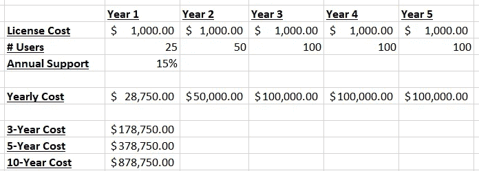

# 如何在定制软件和现成产品之间做出选择？

> 原文：<https://medium.datadriveninvestor.com/how-to-decide-between-custom-software-and-out-of-the-box-products-7cb189bec68?source=collection_archive---------4----------------------->

问一些简单的问题，可以帮助您避免为当前项目选择错误类型的解决方案所带来的代价高昂的错误。

Photo by [Shahadat Rahman](https://unsplash.com/@hishahadat?utm_source=medium&utm_medium=referral) on [Unsplash](https://unsplash.com?utm_source=medium&utm_medium=referral)

## 你经营企业的方式与同行业的大多数人不同吗？

这个问题是决定你是否应该使用定制软件的首要因素。

如果你的业务非常千篇一律(千篇一律)，而且你的大多数同行都在遵循同样的流程，那么很可能有现成的(OOTB)软件可供你使用，比定制软件花费更少，也更令人头疼。在这些情况下，很有可能你会在定制软件上浪费金钱。

但更多的时候，我发现企业，或者至少是那些具有良好领导力的企业，充满了微妙的差异，这些差异可以用来在他们的各种职能中获得现实世界的优势。事实上，在许多情况下，我的经验是，许多企业认为他们的过程是标准的唯一原因仅仅是他们没有足够有效地使用技术来利用它们。我见过十几次了

这些细微的差异应该是您的定制系统项目的目标。通过利用这些独特的流程，您可以将这些流程转化为直接影响底线的优势。

## 你是在一个相对小的利基市场吗？

底线是，专业业务有高回报的潜力，但与此同时，也有风险，你总是在未知的水域，包括技术。

 [## 数据科学和软件工程哪个更有前途？数据驱动的投资者

### 大约一个月前，当我坐在咖啡馆里为一个客户开发网站时，我发现了这个女人…

www.datadriveninvestor.com](https://www.datadriveninvestor.com/2019/01/23/which-is-more-promising-data-science-or-software-engineering/) 

如果你的业务是如此独特，几乎没有竞争对手，你真的别无选择，只能使用定制软件，因为市场领域不够大，没有任何 OOTB 球员担心。

如果你有一个高容量，低利润的业务，成功地实施一个定制系统，以取得小收益，可以变成一个巨大的投资回报，特别是因为今天的投资将在未来几年收回。

成像通过利用技术优化业务的特定部分，减少 1–2%的缺陷，或降低 3–5%的商品成本？这对你的生意会有什么影响？

## 你是想在顾客、员工或竞争中脱颖而出吗？

这是不言自明的，但企业主往往没有意识到不采取行动的后果。

如今的劳动力市场竞争异常激烈，无论是与客户的竞争，还是招聘和留住优秀员工的竞争。各种规模的公司都在高价从竞争对手那里挖走优秀员工，遵循着“谁有才能，谁就能赢得比赛”的格言。

此外，员工流动是一种隐性成本，会破坏企业的底线利润。除了招聘费用、背景调查和测试服务的有形成本，还有面试和筛选候选人带来的机会成本，通常来自你的领导团队成员。

提高员工和客户忠诚度的一个方法是通过技术让他们的生活更轻松。简单的项目，如减少手工劳动，或创建易于使用的仪表板，可以使员工在工作中感到快乐，或花一天时间浏览招聘信息。相比之下，如果你因为厌倦了浪费时间输入数据而失去了你的顶级销售人员，你通过不简化数据输入表单而节省的 25，000 美元就相形见绌了。

## 你讨厌支付持续的许可或订阅费用吗？

开箱即用的软件可能很便宜，但有一个很大的因素经常阻止它成为正确的解决方案，即持续的许可和支持成本。

如果你只有一个用户，这通常没什么大不了的，但是如果你希望增加你对软件的使用，通常会有很高的每用户费用，只要你使用它，你就必须支付。

在评估 TCO(总拥有成本)时，在 3 年或 5 年的时间内评估 OOTB 系统与定制系统非常重要。如果定制软件的 OOTB 解决方案的等效许可证少于 36 个月，那么选择定制软件是显而易见的。

这里有一个例子:

让我们想象一下，您正在考虑为一个字段捕获实用程序(100 个用户)使用的现成软件具有以下内容

*   1，000 美元/年/用户的许可成本。
*   15%的年度支持成本

**$878K！！** *(这个数字也是为什么这么多产品厂商都在追逐循环订阅)*

现在，10 年作为比较可能有点长，但如果同等的定制系统可以以 150，000 美元或更少的成本建造，您真的应该考虑这种方法。

*注意:对于 OOTB 成本评估，您需要确保包括实施、支持费用、集成成本、定制等成本。OOTB 营销团队非常善于掩盖这些长期成本，他们知道一旦他们获得了最初的销售，就很难脱身(也称为供应商锁定)。*