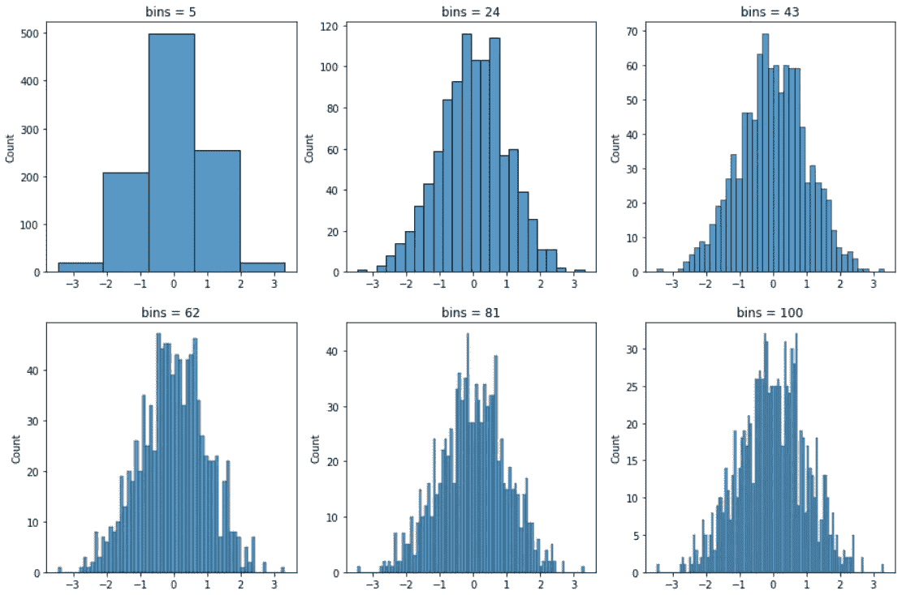
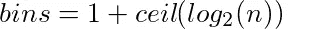
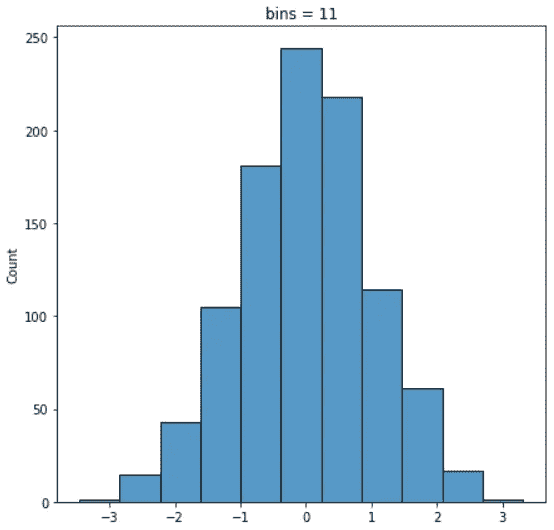
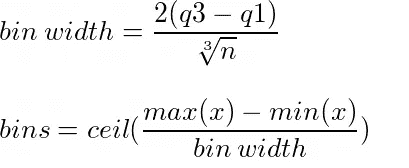
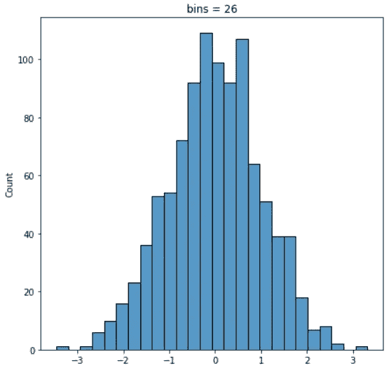

# 如何决定直方图的面元数？

> 原文：<https://medium.datadriveninvestor.com/how-to-decide-on-the-number-of-bins-of-a-histogram-3c36dc5b1cd8?source=collection_archive---------0----------------------->

## 这篇文章解释了两种常用的方法来计算直方图的箱数

Image by [Ibrahim Rifath](https://unsplash.com/@photoripey?utm_source=medium&utm_medium=referral) on [Unsplash](https://unsplash.com/?utm_source=medium&utm_medium=referral)

## 什么是直方图？

直方图通过将数字变量分成多个区间(间隔)来绘制其频率(计数)。直方图的 x 轴表示仓，y 轴表示这些仓中样本的频率。直方图的形状可能因仓的数量而异。因此，选择正确数量的条柱以正确查看数值变量的分布非常重要。下面的示例显示了直方图随条柱数量而变化的形状。

Image by author

因此，选择正确数量的柱状图箱对于可视化数值变量的实际分布是必要的。我们将讨论两种常用的计算容器正确数量的方法。

## 方法一:斯特奇法则

Sturges 规则考虑数据的大小来决定箱的数量。计算箱子数量的公式如下所示。

Image by author

上式中***【n】***是样本量。样本越大，箱的数量就越大。对数的结果的上限确保结果是一个整数。让我们用 Python 实现斯特奇规则。

Image by author

斯特奇法则计算出的箱子数量为 11 个。上面的直方图看起来更像高斯分布。

## 方法 2:弗里德曼-迪阿康尼斯规则

弗里德曼-迪阿康尼斯规则不仅考虑了样本大小，还考虑了样本的分布。

Image by author

上式中***【Q3】***代表第三个四分位数，***【Q1】***代表第一个四分位数，***【n】***代表样本量。随着样本大小的增加，仓宽度减小，这反过来增加了仓的数量。让我们用 Python 实现 Freedman-Diaconis 规则。

Image by author

弗里德曼-迪康尼斯规则计算出的仓位数量为 26。上面的直方图看起来更像高斯分布。

这些是计算柱状图箱数的常用方法。使用这两种方法将有助于以更好的方式可视化数值变量的分布。