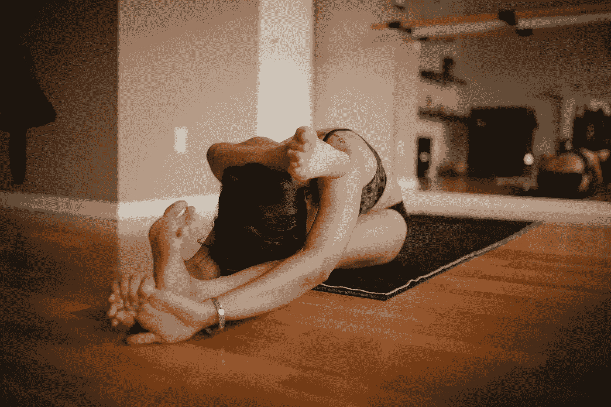
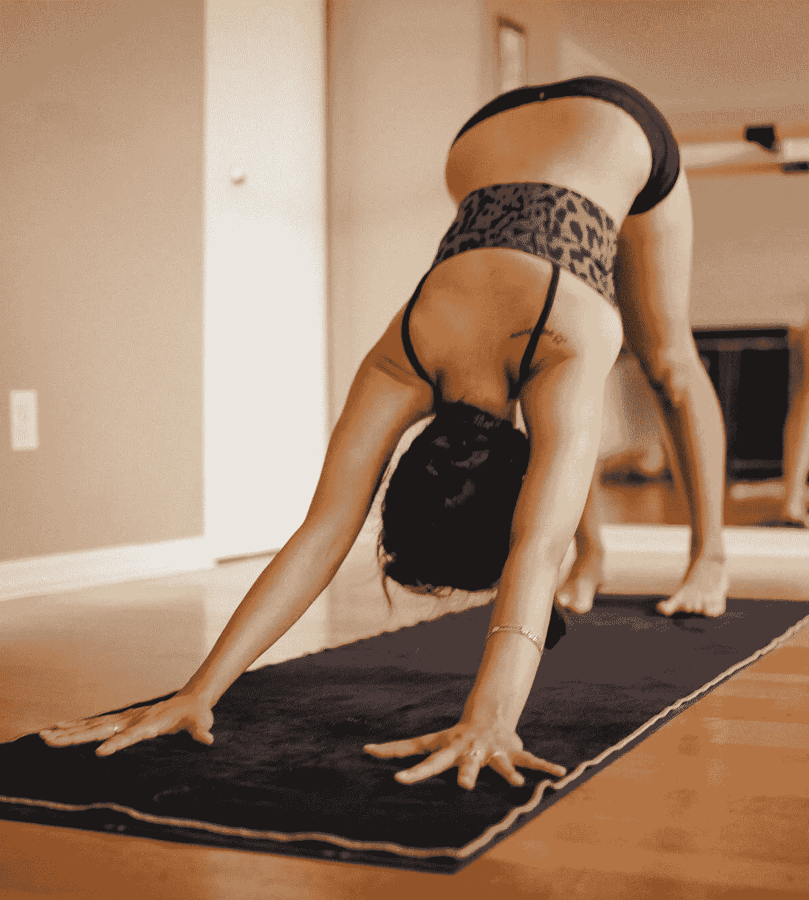
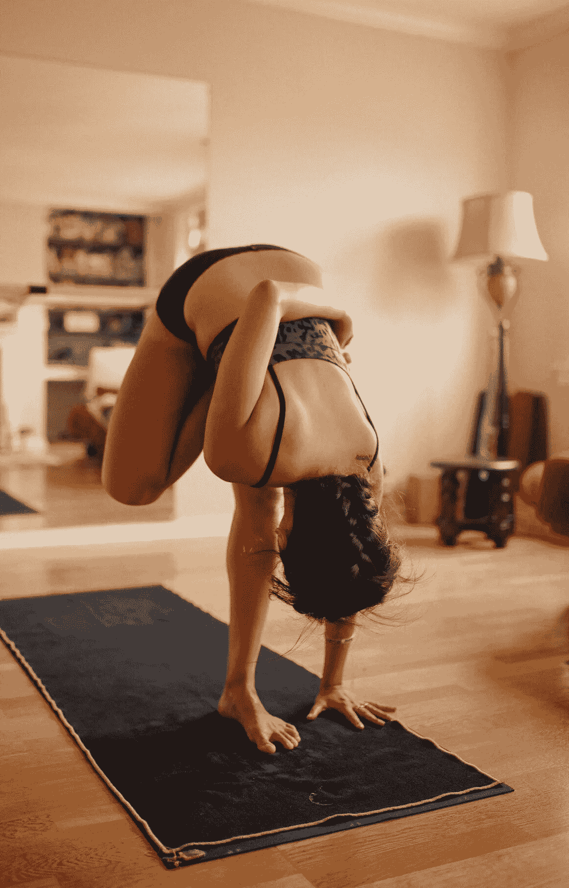
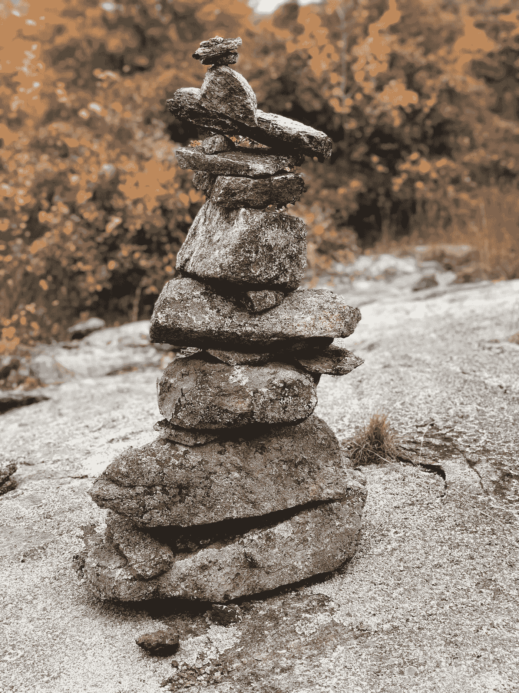

# 如何加深你对当下的体验

> 原文：<https://medium.datadriveninvestor.com/how-to-deepen-your-experience-of-the-present-moment-a0177ac14e27?source=collection_archive---------14----------------------->

## 通过 Pratyahara 的瑜伽练习和你的视觉，来看得更清楚

me practicing Ashtanga; photo by Carly Arnwine

我们环境中所有的无限能量，我们对生活的体验都是由我们选择感知的东西决定的。当我们把我们的感官从它们最喜欢的范围拉回来时，我们注意到了我们在自己生活经历中的角色。当我们看到我们与感官世界的特殊关系的本质时，我们不再背负着“为什么是我”或“这又发生了”的感觉。相反，我们有权探索我们是谁，并以艺术的方式塑造我们的生活。

H 人类是感性的:我们通过我们的感官生活，我们每个人都以不同的方式体验这个世界，这基于我们如何训练和享受我们的感官，我们对颜色、形状、光线和运动的细微差别的敏感性——这只是在我们的视觉中，我们可以选择削弱它，就像音乐家可能会闭上眼睛唱强有力的高音一样。

我们的感官之间有一种强烈的相互作用。我们可以把我们的感觉皮层想象成一个封闭的能量场——当一种感觉主导我们的感知过程时，其他感觉就会占据背景，变得虚弱，容易疲劳。就像一只拇指过度发达的手一样，过度强调一种感觉(如视觉)的大脑会很好地适应这种单一模式，使感知者对传入的声音、气味、味道和感觉不那么敏感。

当我们感受到世界提供的各种刺激时，生活会更丰富，当下的时刻会更有吸引力。但是紧张的环境会使我们的感觉迟钝，我们会因为对自然光和声音不敏感的技术而变得压抑。

H 人类是创新的:我们创造了一个屏幕世界，我们共同进化了眼睛，在近距离下，它强大、可靠、有弹性，并带有明亮的光线。当我们白天黑夜都开着屏幕时，我们的视觉往往会压倒其他感官。

为了弥补这一点，我们的音乐变得越来越响亮、越来越近，直接从耳塞传到耳膜，而且更加合成，消除了现场乐器的细微差别，有利于计算机生成完美的可预测性。随着我们的思想从对预期模式的细微变化的调谐中解放出来，我们可以将所有的注意力投入到我们所看到的和我们想要看到的——互联网的兔子洞在视觉上、精力充沛地吸引我们。我们经常使用我们的味觉、触觉和嗅觉作为视觉工作的“休息”,作为“自我保健”的元素或缓解我们过度劳累的眼睛。

我们感官愉悦的门槛变得更高，让我们更容易对我们过去喜欢的细微之处感到厌倦，让我们感到不满足，但不知道如何再次找到满足感。答案是重新变得敏感，注意此时此地生活的丰富多彩。

me practicing Ashtanga; photo by Carly Arnwine

无论是在瑜伽还是艺术中，进入一种中介状态都会精力充沛地恢复活力，因为我们花时间去注意我们所注意到的，进入一种对当下更深层次的体验。这种精力充沛的再生，重新敏感化是练习 Pratyahara 瑜伽概念的效果之一，将我们的视觉感官拉回我们的意识，这样我们就可以选择如何体验这个世界，无论是在垫子上还是在垫子下。

当你感到精神上而不是身体上的疲劳时最受赞赏，注意到你的视力变得固定、迟钝、停滞不前。有意识地唤醒你的其他感官——总有一些东西可以感觉到味道、听觉、嗅觉——回到此时此地可感知的事物。随着时间的推移和练习，你会变得更加敏感，用更少的努力，克服刺激的积极/消极、快乐/不快乐的联系，只是简单地意识到是什么。

—

到练习你的视觉能量，当我们在森林和平原狩猎和采集时，考虑我们的视觉在广阔的大自然中进化。我们有两种看待世界的方式:一种是猎人，同心协力关注眼前的事物；另一种是采集者，广泛关注周边事物，意识到各种可能性，对欲望和危险保持警惕。

还有一种看不见的方式:当头脑在不存在的想法中工作或徘徊时，睁着眼睛，但目光呆滞。注意力在时间和空间中漂移，耗尽此时此地的能量。

意识的魔力，有意识的生活，向当下的可能性敞开你自己，是选择你希望培养的视觉风格。如果你选择思考，那就思考吧，要知道你的感官注意力是向内的。但是，如果你正在与你周围的世界互动，那么确保你的眼睛是警觉的而不是迷失的，并选择如何保持警觉:专注、同心的视觉用于简单的任务，或者睁大眼睛的接受视觉用于流动状态。

瑜伽哲学对这些景象所对应的不同精神状态有不同的术语:当头脑处于稳定和不间断的专注时，dharana 是单一的专注；dhanya 是对周围和内在世界的开放意识。陷入沉思、目光呆滞、心/身、自我/环境脱节的状态，叫做无明、妄想、*摩耶*、*塔马斯*。通过冥想练习来认识和释放是一种心理习惯。

me practicing Ashtanga; photo by Carly Arnwine

在垫子上，我们练习我们的视觉去扩展和专注，警觉但不惊慌。注意，当你流动时，你看到了什么，以及你是如何看到它的。你的视野是一侧占优势吗？你可能意识到房间的某些部分，或者你身体的某些部分，但其他部分却不知道。你是否被你所看到的分散了注意力，感觉你的能量被向外拉？当你花一半的精力思考，另一半的精力关注你的实践时，你的视野被粘住了吗？或者当你目睹你周围的世界时，你意识到你的内在工作了吗？

在垫子之外，练习同心视觉对于在电脑上专注工作是非常好的，而扩展的周边视觉适合艺术家的非语言创造性工作。对于所有的存在状态，选择如何运用我们的感官就是选择有意识地参与生活。

an invitation for stillness at the summit