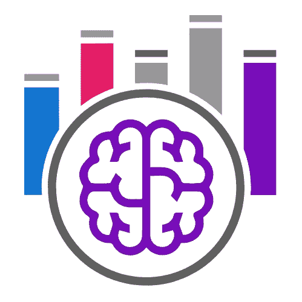
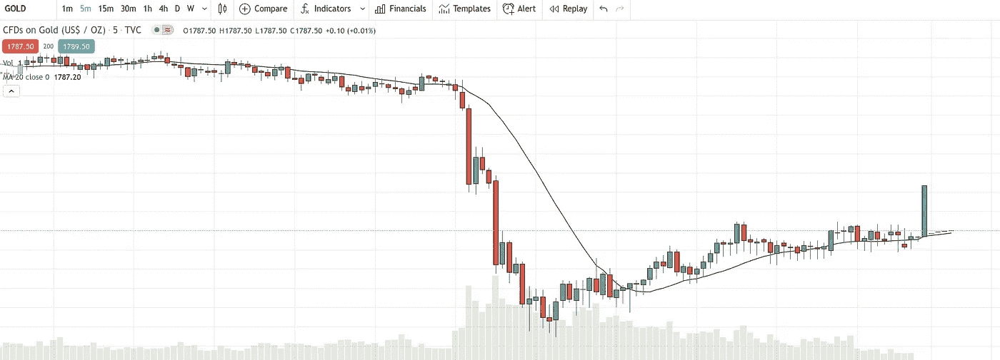

# 如何设计机器学习交易机器人——第三部分:模式识别

> 原文：<https://medium.datadriveninvestor.com/how-to-design-a-machine-learning-trading-bot-part3-pattern-recognition-e7736a5b558?source=collection_archive---------2----------------------->

*   通过阅读这篇文章，你将有机会节省至少 59 美元。

**《如何设计机器学习交易机器人》前情提要**

我们已经从[开始收集数据](https://25mordad.medium.com/how-to-design-a-machine-learning-trading-bot-part1-data-collection-b63e36a7e606):

我们发现了什么是 OHLCV 数据，我们了解了为什么我们需要历史数据和在线数据。
然后我们继续进行[数据分析](https://25mordad.medium.com/how-to-design-a-machine-learning-trading-bot-part2-data-analysis-f42a669dcd4c)

我们已经看到了清理包括特征工程在内的数据是多么重要。我们了解到，为了建立一个稳定的机器学习模型，我们需要以正确的方式准备数据，最后，我们发现了可视化数据如何帮助我们实现目标。

那么，考虑到我们手中已经有了有效的数据，我们开始第三步。
本文是题为“如何设计一个机器学习交易机器人”系列文章的第三集

**步骤 3:在分析数据中找到模式**

发现数据中的模式是一项非常基本的任务，这项任务一直由先进的机器学习方法和你的创造力来完成。
先说市场中的这个主要问题:
你相信吗，市场中的一些形态经常重复？如果是这样，我们就在同一轨道上。

Pattern Recognition

让我们从技术分析中一个最简单的模式开始，那就是“趋势”。所以，如果你不知道什么是趋势，就在这里暂停一分钟，在谷歌上搜索。
趋势上我们可以发现两种主要形态:看涨(上升趋势)和看跌(下降趋势)。(同样，如果你不知道，就暂停一下，在谷歌上搜索:)
那么，让我们回顾一下我们到目前为止所做的事情，因为看起来我们什么也没做，但实际上，我们做了我们一直在寻找的事情。
简而言之，我们将问题分解成一个更小的问题，即寻找趋势(模式)转化为寻找看涨/看跌趋势(模式)。这里的关键是我们不要盲目地在原始数字数据中寻找模式。

“Astrology” and “Horoscope”

在模式识别阶段，你应该非常小心和有意识。如果你只是寻找一些无意义的模式，那么寻找一个模式就像“占星术”和“占星术”一样。有大量的数据，你可以找到许多模式，甚至你可以在这些模式之间创造许多故事，相反，在另一边，我们有“天文学”。始终确保你像天文学家和科学家一样跟踪数据，而不是占星家或天文学家。

Astronomer & Scientist way

那好吧。让我们回到我们的样本。我们想找到“看涨趋势”模式，捕捉这种模式的一个最简单的策略是使用“移动平均线”。(暂停并谷歌一下)

**看涨和看跌形态:**

通过跟踪 SMA20(简单移动平均线 20)发现看涨趋势是市场中简单易行的方法之一，我称之为“你好，世界！”在交易课程中；)
在下图中，可以跟着黑色曲线的 SMA20 走。你可以简单的说:
看涨:如果收盘> SMA20
看跌:如果收盘< SMA20

(Gold/USD, 5m, 27 Nov 2020)

**机器学习**

那么，当机器学习出现时？
用机器学习解决一个问题，需要选择一种方法。例如，有些问题你可以用“无监督学习”方法找到解决方案，而有些问题正在用“回归”方法解决。再次和往常一样，我们从最简单的方法之一“二元分类法”开始。

Binary Classification

在二进制分类中，您的记录有一个标签[0，1]。另外，机器会为你的新记录预测 0 或 1。
现在，二元分类法如何帮助我们发现看涨趋势？实际上，我们将在下一季中开发它(如何开发一个机器学习交易机器人)，但这一集有了结论，我们假设:
要找到一个看涨模式，如果每条记录关闭> SMA20，我们将标签设置为 1，如果没有关闭，我们将标签设置为 0。最后，我们有一个 OHLCV 的数据集(查看第一集，数据收集)，包括一个指标 SMA20，加上一个目标列(标签)[0，1]。在用 ML 方法训练后，如果预测值为 1，这意味着我们有一个看涨的趋势，如果预测值为 0，这意味着我们没有处于看涨的模式。

> 如果你到目前为止已经注意到了，我总是从简单的概念开始，我相信如果你完全理解这个想法，那么你可以把它发展成一个更复杂的解决方案。

我们现在要做什么？

**关于 1DES**

1DES 是由机器学习驱动的交易解决方案。在 1DES，我们提供了一种利用机器学习技术进行交易的创新方法。
1 des 为所有用户提供“免费试用”计划。此外，如果你想更专业地交易，还有其他计划，目前他们都有 50%的折扣。
此外，作为对本文读者的特别优惠，如果您在 2021 年 7 月 20 日之前选择 Avion 或 Rocket 计划之一，1DES 将退还第一个月的订阅费。

 [## 机器学习驱动的交易解决方案

### 1 月 1 日免费注册…

1des.com](https://1des.com/?utm_source=medium&utm_medium=story&utm_campaign=how_design&utm_term=e_3&utm_content=pattern_recognition)