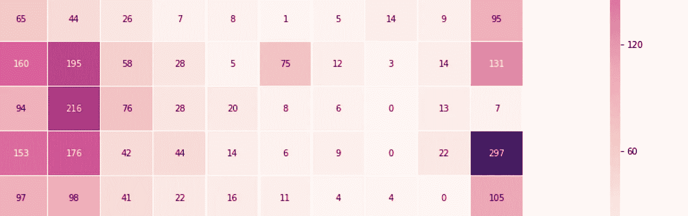
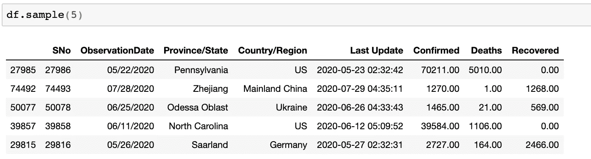
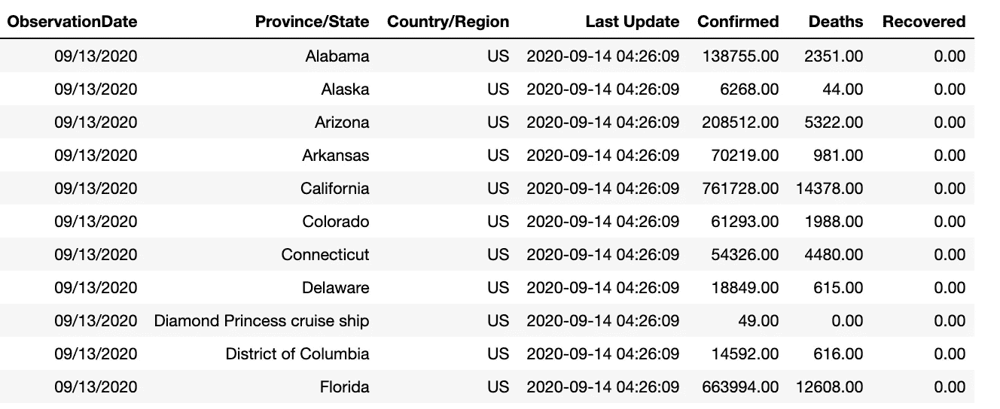
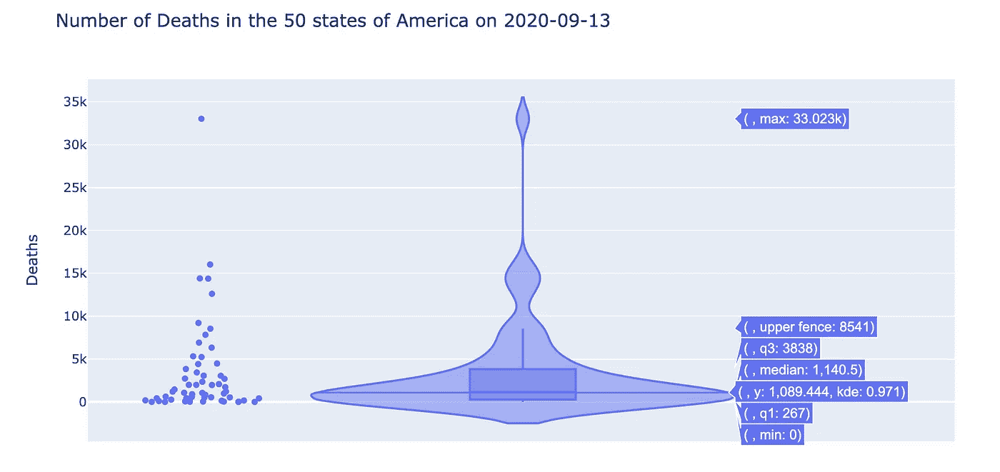
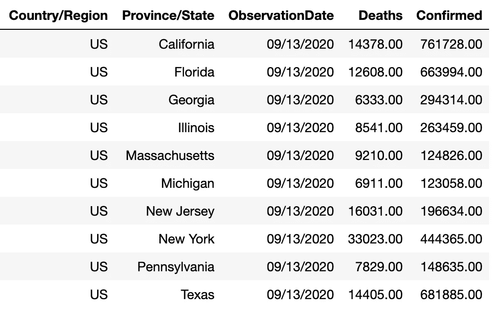
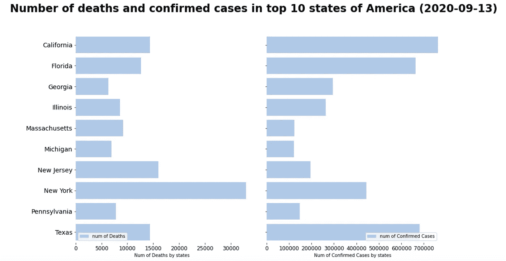
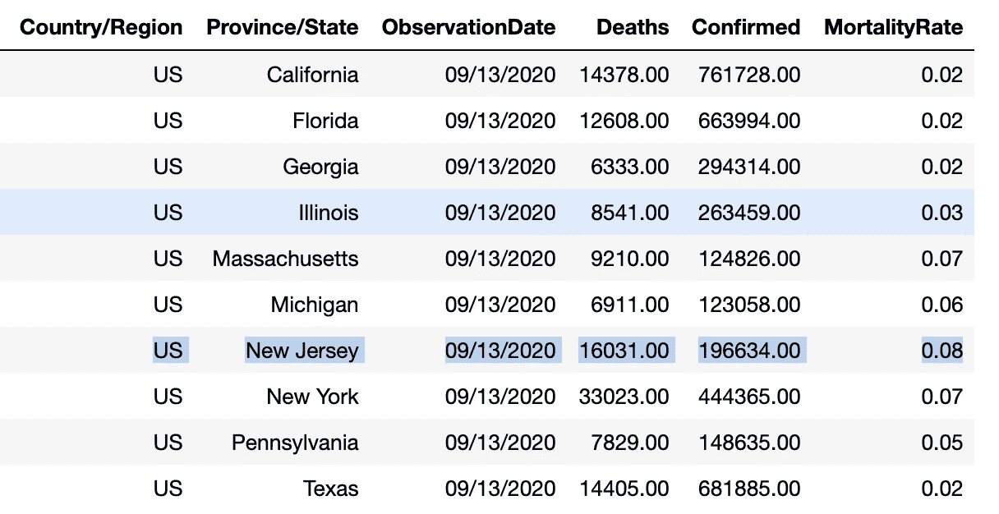
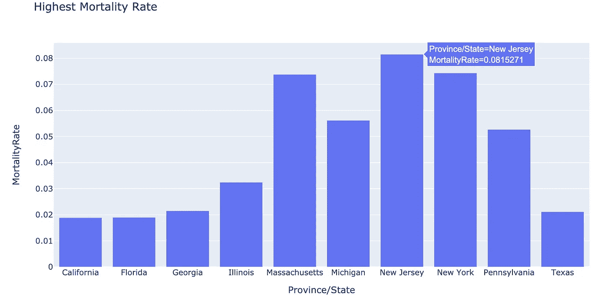
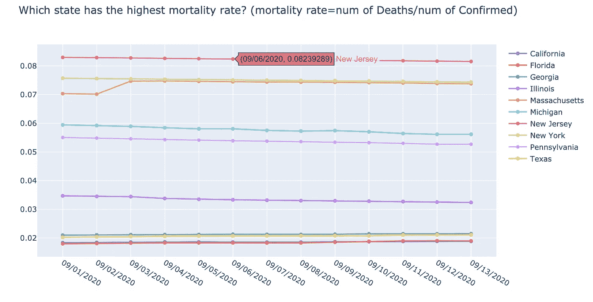
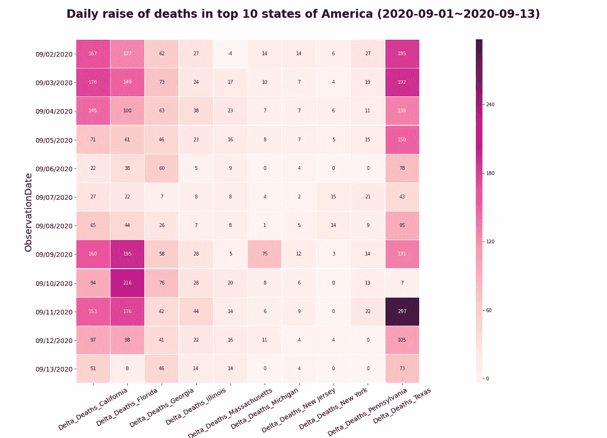

# 如何利用数据可视化检测数据集中的异常值

> 原文：<https://medium.datadriveninvestor.com/how-to-detect-outliers-in-dataset-with-data-visualization-fe74e5c8289c?source=collection_archive---------3----------------------->

## 使用 Plotly 和 Seaborn 绘制新冠肺炎数据以捕捉异常值



检测异常值是 EDA(探索性数据分析)中至关重要的一步，有时它本身就是机器学习项目的目标。世界上几乎任何数据集中都会有异常值。捕捉和理解异常值可以激发业务洞察力，并导致进一步的研究或可能的解决方案。

如何应用数据可视化来识别离群值？如何通过写几行 Python 代码用 Plotly 或 Seaborn 进行绘图？本文将以新冠肺炎数据集为例，演示如何捕捉美国 50 个州的异常。我们可以从异常值中得到的答案包括:

*   **哪个州的死亡率最高？**
*   **哪一天的日涨幅最大？**
*   哪个州的确诊病例最多？
*   **哪个州死亡人数最多？**

本项目使用的[**新型冠状病毒 2019 年数据集**](https://www.kaggle.com/sudalairajkumar/novel-corona-virus-2019-dataset?select=covid_19_data.csv)'*covid _ 19 _ data . CSV '*具有每日水平的新冠肺炎感染病例数、死亡数、康复数等信息。任意给定*【观察日】* 的病例数为累计数，为时间序列数据。

看一眼数据:



sample data

```
The shape of dataset:**df.info()**<class 'pandas.core.frame.DataFrame'>
RangeIndex: 109382 entries, 0 to 109381
Data columns (total 8 columns):
SNo                109382 non-null int64
ObservationDate    109382 non-null object
Province/State     75709 non-null object
Country/Region     109382 non-null object
Last Update        109382 non-null object
Confirmed          109382 non-null float64
Deaths             109382 non-null float64
Recovered          109382 non-null float64
dtypes: float64(3), int64(1), object(4)
memory usage: 6.7+ MB
```

*‘国家/地区’*数据集中收集:

```
**df['Country/Region'].value_counts()**US                                  11776
Russia                               8837
Mainland China                       7314
Japan                                5417
Mexico                               3827
Colombia                             3738
India                                3636
Brazil                               3263
Ukraine                              2925
Peru                                 2917
Canada                               2730
Italy                                2687
...
```

仅在*‘09/13/2020’*保留美国实体的子集数据集。

```
mask_date = df['ObservationDate']=='09/13/2020'
mask_country = df['Country/Region']=='US'df = pd.read_csv('covid_19_data.csv')
df[mask_date & mask_country]
```



the US data on 09/13/2020

用 Plotly 创建一个小提琴图，展示 2020 年 9 月 13 日美国 50 个州的死亡人数分布。

```
import plotly.express as pxfig = px.violin(df[mask_date & mask_country], y="Deaths", box=True, points='all', title="Number of Deaths in the 50 states of America on 2020-09-13")fig.show()
```

如图所示，死亡人数的最大值为 33，023，000 人，中位数约为 1，140 人。还有 3 个州 2020 年 9 月 13 日累计死亡人数在 1.5 万左右。从统计分布的角度来看，这些实体被视为异常值。



distribution of the number of deaths in the 50 states of America on September 13, 2020

# 哪个州的死亡人数最多或者确诊病例最多？

基于上面显示的分布，让我们跟踪*‘死亡’*大于或等于 6000 的州。

```
mask_deaths_2 = df['Deaths'] >= 6000
COL_TO_PLOT = ['Country/Region','Province/State','ObservationDate','Deaths','Confirmed']bar_plot_df = df[mask_date & mask_country & mask_deaths_2][COL_TO_PLOT]bar_plot_df
```



states with *‘Deaths’* larger than or equal 6000

使用 Seaborn barplot 比较*“美国前 10 个州的死亡和确诊病例数(2020-09-13)”*:



Number of deaths and confirmed cases in the top 10 states of America (2020–09–13)

该图中识别的异常值是什么？如上图所示，**截至 2020 年 9 月 13 日**，加州确诊病例最多，而纽约死亡人数最多。

# 哪个州的死亡率最高？

一件悲伤的事情引起了我的注意，新泽西州的死亡人数很高，而确诊病例的数量与其他州相比很低。这意味着新泽西州的死亡率远远高于其他州。让我们通过计算前 10 个州的*【死亡率】*来验证这一点:

```
bar_plot_df['MortalityRate'] = bar_plot_df['Deaths'] / bar_plot_df['Confirmed']fig = px.bar(bar_plot_df, x='Province/State', y='MortalityRate', title = 'Highest Mortality Rate')
fig.show()
```



为了更深入地挖掘，让我们收集一个数据集来保存来自*【2020 年 9 月 1 日】*的前 10 个州的记录。计算每个州每天的死亡率。然后，应用 Plotly 绘制死亡率趋势图。

```
COL_STATES = bar_plot_df['Province/State'].tolist()
mask_states = df['Province/State'].isin(COL_STATES)mask_date_2 = df['ObservationDate'] >= '09/01/2020'
COL_TO_PLOT = ['Province/State','ObservationDate','Deaths','Confirmed']scatter_plot_df = df[mask_date_2 & mask_states][COL_TO_PLOT]
scatter_plot_df['MortalityRate'] = scatter_plot_df['Deaths'] / scatter_plot_df['Confirmed']import plotly.graph_objects as go
fig3 = go.Figure()
# Add traces
for STATE in COL_STATES:
    mask_state = scatter_plot_df['Province/State']==STATE
    fig3.add_trace(go.Scatter(x=scatter_plot_df.loc[mask_state, 'ObservationDate'], y=scatter_plot_df.loc[mask_state, 'MortalityRate'],mode='lines+markers', name=str(STATE)))fig3.update_layout(title='Which state has the highest mortality rate? (mortality rate=num of Deaths/num of Confirmed) ',
                  yaxis_zeroline=False, xaxis_zeroline=False)fig3.show()
```



This scatter plot was inspired by data scientist [Manuel Belmadani](https://www.linkedin.com/in/manuel-belmadani-62780124/)

如散点图所示，**新泽西位于顶部。不幸的是，在新泽西州，每 100 名受影响的人中，就有 8 人会去世。**为什么？？？和新泽西的医疗系统有关吗？政府政策有问题吗？我没有答案。但这一令人惊讶的观察是在我们发现异常值之后提出的，这些异常值可以指导人们进一步研究该问题并确定可能的解决方案。

# 哪一天的日涨幅最大？

*   首先，在*【09/01/2020】*和*【09/13/2020】之间选择*【观察日期】*。*
*   第二，只保留美国前 10 个州中的实体，它们是 *['California '，' Florida '，' Georgia '，' Illinois '，' Massachusetts '，' Michigan '，' New Jersey '，' New York '，' Pennsylvania '，' Texas']*
*   第三，编写 Python 代码来计算美国前 10 个州的死亡人数在两个连续日期之间的差值。

我们计算的增量数据如下:


用每个单元格中的数值绘制一张热图，以直观显示美国前 10 个州(2020 年 9 月 1 日~2020 年 9 月 13 日)的每日死亡人数增长情况:

```
fig2, ax = plt.subplots(figsize=(18, 13))
fig2.subplots_adjust(top=.91)
plt.suptitle('Daily raise of deaths in top 10 states of America (2020-09-01~2020-09-13)', fontsize=24, fontweight='bold')cbar_kws = {'orientation':"vertical", 'pad':0.12, 'aspect':50}ax.set_ylabel("Y Label",fontsize=20)for tick in ax.xaxis.get_major_ticks():
    tick.label.set_fontsize(14)for tick in ax.yaxis.get_major_ticks():
    tick.label.set_fontsize(14)g = sns.heatmap(all_delta_df, annot=True, fmt='d', linewidths=.3, ax=ax, cmap='RdPu', cbar_kws=cbar_kws);
g.set_xticklabels(g.get_xticklabels(), rotation = 30, fontsize = 14);
```



daily raise of deaths in the top 10 states of America (2020–09–01~2020–09–13)

右下角的紫色单元格显示的是 9 月 11 日德克萨斯死亡人数的每日增长是 297 人，远远高于其他三角洲地区。让我们用原始数据集再次确认结果:


根据原始数据，我们验证了计算的增量数据是正确的:

```
the daily raise on Sep 11 = number of deaths on Sep 11 — the value on Sep 10 = 14227 — 13930 = 297
```

如热图所示，9 月 10 日，佛罗里达州的日涨幅第二高，9 月 9 日，佛罗里达州的日涨幅第三高。

在本文中，我们将讨论为什么识别异常值是至关重要的，为什么理解隐藏在这些值背后的信息是有价值的，以及如何使用 Plotly 和 Seaborn 通过数据可视化来检测异常值。

作为一个总是试图保持理性的数据科学家，在做这个副业项目的时候，我的心沉了下去。在死亡和感染病例的数字背后，是在新冠肺炎疫情遭受痛苦的数百万人。失去家人的悲伤、眼泪和破碎的心从这些热图、小提琴图和条形图中浮现出来。让我们分享一句关于希望的名言来结束这篇文章:

> “这是艰难的时刻。世界很痛。我们生活在恐惧中，忘记了与希望同行。但是希望没有忘记你。所以请它吃饭。它可能饿了，会感谢邀请。”—利巴·布雷

# 继续🤖:注册以从我的 Udemy 课程中了解如何构建和部署 Dialogflow 聊天机器人:

[](https://www.udemy.com/share/103BlY/) [## 构建和部署 Dialogflow 聊天机器人女服务员 Lilis

### 基于无监督学习解决方案的金融数据集异常检测。*精通建筑和培训…

www.udemy.com](https://www.udemy.com/share/103BlY/) 

## 访问专家视图— [订阅 DDI 英特尔](https://datadriveninvestor.com/ddi-intel)