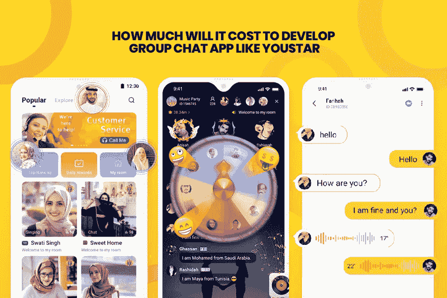

# 如何开发像 YouStar 这样的群聊应用:成本、功能和商业模式

> 原文：<https://medium.datadriveninvestor.com/how-to-develop-a-group-chat-app-like-youstar-cost-features-and-business-model-598257ded5a6?source=collection_archive---------21----------------------->

毫无疑问，通讯应用彻底改变了我们的沟通方式，并成为每个人生活中不可或缺的一部分。从群聊到将你的业务拓展到下一个层次，即时通讯应用正扮演着重要的角色。

因此，无论你是打算开发一个像 YouStar 这样的群聊应用程序，还是想成为下一个 Whatsapp 应用程序，或者对 telegram 这样的聊天应用程序印象深刻，你最关心的问题是“在 2020 年开发一个应用程序到底要花多少钱？”

开发一个消息应用程序的前期成本很难估计，但一个平台的金额可能在 10，000 美元到 240，000 美元以上之间。然而，构建该应用程序基础版本的前期成本可能在 5000 美元左右，其中包括即时聊天、个人资料生成等基本功能。但是一个简单的 app 版本的价格可以提高到 45000 美元+。

你一定很惊讶为什么应用程序开发成本会有这么大的差异？事实是，应用程序的前期成本受各种因素的影响，如应用程序类型、特性和功能的数量、设计复杂性、位置、应用程序开发团队的经验、营销和应用程序的质量保证。

一方面，对 Clutch 调查的研究证实，整个应用程序开发项目通常花费 5000 美元到 500，000 美元以上，预计时间为 1 到 9 个月以上。另一方面，good firm 2018 年的调查有一些不同的事实要告诉你，包括:

*   该应用程序的简单版本具有 Tinder 或 Periscope 等基本功能，价格在 4 万至 6 万美元之间。
*   像 Whatsapp 或 QuizUp 这样具有引人注目的功能的中等复杂程度的消息应用程序最有可能价格在 61，000 美元至 69，000 美元之间。
*   这款高度现代化的即时通讯应用拥有 Instagram 或 uber 等高级功能，理想价格在 7 万至 10 万美元之间。

总结:这些统计数据和数字是在对整个应用领域进行各种调查后得出的，但仍然只是一个粗略的估计。准确的开发成本主要取决于您的需求和您选择集成到应用程序中的功能集。

所以，如果你打算开发一个像 YouStar 或 Whatsapp 这样的群聊应用，你一定想知道在应用开发中应该考虑什么样的特性和功能？但在开始应用程序的基本功能之前，有必要了解这些群聊应用程序的作用，以及在开发高性能消息应用程序时需要记住的事情。

# 像 YouStar 这样的群聊应用的作用:它到底是做什么的？

与 Whatsapp、Instagram 或 telegram 等其他消息应用不同，YouStar 是一个非常独特但最令人耳目一新的视频聊天平台，让人们更容易扩大他们的社交联系。虽然认识新朋友总是令人兴奋的，但对一些人来说，这从来就不是一件容易的事情。如果你也是一个害羞、内向或矜持的人，仍然对交朋友犹豫不决，那么相信我，YouStar 是你应该尝试的应用程序。它不仅使人们与世界各地的人联系更加舒适和顺畅，而且还提供充满乐趣的互动活动以及视频聊天室，使与陌生人的会议和聊天更加愉快。

**让我们快速了解一下 YouStar 应用程序的重要角色和功能:**

*   创建视频聊天室
*   即时文本聊天
*   共享图像
*   动画贴纸的广泛选择
*   分享视频
*   将朋友添加到聊天室

这些是 YouStar 的几个显著特点，使它在人群中脱颖而出，并增加了聊天的便利性。今天，有几个聊天应用程序可以在多个操作系统上使用，如微信、Hike、YouStar，随着这些应用程序因各种原因开始使用，它们的受欢迎程度不断增加。这就是为什么你计划在 2020 年开发一个像 YouStar 这样的群聊应用程序是一个道德的决定。

现在的问题是，随着包括 Android 和 iOS 在内的领先操作系统上出现数百款消息应用，你将如何构建一款出色的应用，以便在竞争激烈、边界不断缩小的市场中生存下来？

# 2020 年开发 YouStar 这样的群聊 App 时要牢记什么？

无论你是初创公司还是企业家，开发移动应用从来都不是一件容易的事情。除了雇佣最好的**移动** [**app 开发公司**](https://www.xicom.ae/services/mobile-app-development/) ，还有很多东西要找。要开发一个完美的应用程序，能够完美地满足用户的要求，并帮助您在未来几十年内留在市场上，在开发移动应用程序时考虑这几点是至关重要的。

确定群聊应用的要点:推出聊天应用的理想方式是首先介绍它的 MVP(最小可行产品),这有助于引起用户的兴趣并抓住他们的注意力。
确定操作系统:确定是否需要启动原生或混合应用？最受欢迎的聊天应用程序，如 Whatsapp，已经为 iPhone 创建了他们的第一个应用程序，然后他们将应用程序扩展到其他平台，如 Android 和 Windows。

特性和功能:有时，带有基本功能的应用程序也能如此猛烈地冲击市场。而这方面最完美的例子就是 Whatsapp——从 2013 年的 2 亿用户跃升至 2020 年的 2 亿用户。原因很简单，就是经常不时地给应用程序添加一些特性和功能。这有助于让你的用户更长时间地使用你的应用。

了解目标受众:无论你设计的应用程序有多出色，如果没有用户，它最终都是一个废品。因此，了解您的受众并据此选择设计界面、功能、移动平台等是至关重要的。

提前决定预算: [**迪拜**](https://www.xicom.ae/services/mobile-app-development/) 的应用程序开发公司可以提供给你创建一个应用程序，起价为 5000 美元到 50000 美元，可以到任何高价。在创建应用程序时，请记住时间就是金钱，开发时间越长，开发成本就越高。

应用程序开发的技术堆栈:无论你为你的应用程序设置什么样的预算水平，迪拜的大多数 [**应用程序开发人员**](https://www.xicom.ae/services/mobile-app-development/) 更喜欢使用开源的跨平台应用程序框架，以将开发成本保持在最低水平。

**简而言之**:你可能会发现所有这些要点都是通用且独特的，但有时初创公司会忽略这些东西，并倾向于将他们的整个开发过程变成一个错误。现在的中心问题是如何开发一个像 YouStar 这样的群聊 app？

# 开发像 YouStar 这样的高功能群组聊天应用的基本步骤

应用商店充斥着社交媒体和娱乐应用，从视频聊天应用到群聊应用；有多个选项供用户选择。然而，随着市场竞争的加剧，你将如何通过你的应用程序在市场中保持领先地位。让我们讨论一下开发像 YouStar 这样的聊天应用程序的关键步骤。

*   研究和规划
*   选择最佳应用盈利模式
*   正确选择特性和功能
*   应用开发团队

为了更好地理解，让我们深入挖掘每一点的细节:

## 研究和规划

要想让你的项目成功，仅仅跟随 YouStar app 的应用克隆是不够的。事实上，不仅仅是复制应用程序结构，你还需要深入了解到底是什么让他们在市场上取得成功。他们用什么特点和技术来吸引顾客？他们多久升级一次应用程序？他们如何处理应用程序的高流量？是什么让他们的应用成为强大的群聊应用。

在应用程序开发的这个阶段，迪拜的[移动应用程序开发人员](https://www.appsted.com/hire-mobile-app-developers/)通常致力于以下几点:

深入分析应用程序的市场，以确定应用程序的状态以及它如何变成一个伟大的应用程序。

*   确定应用程序的范围和可行性。
*   牢记您的预算和业务需求，定义应用的路线图，包括 UI/UX 设计、应用结构、特性、功能、复杂性和操作系统的选择。
*   选择合适的技术栈来开发强大的群组聊天应用。

## 选择正确的货币化方法

无论你是创业公司还是企业，开发 app 的首要考虑是从你的项目中赚取利润。而 [**移动应用开发公司**](https://www.xicom.ae/services/mobile-app-development/) 最常选择的应用变现策略有:

## 应用内购买

这是一个从应用程序中赚钱的绝佳方式。免费订阅该应用程序通常会提供基本功能，通过允许用户将聊天游戏提升到另一个水平，您可以以额外的价格为他们提供优质功能。但要确保应用内购买的想法应该便宜，并提供多种选择，包括入口动画，客户入口曲调，自定义过滤器，自定义表情符号，动画贴纸等等。

## 捐款

提供订阅可能是一种巧妙而有创意的方式，可以吸引用户使用你的应用程序。有些应用程序为你提供免费使用功能的全部访问权限，而有些应用程序为你提供一组免费功能，其余的则与高级订阅一起提供。

但是如果你正在追随 YouStar 的脚步，那么你应该知道，它免费提供了所有必不可少的功能。用户必须切换到高级订阅才能访问高级功能，如加入聊天室。

## 应用内广告

大多数用户讨厌在应用程序中看到广告，但这是一个很大的收入来源。如果你选择这种从应用程序中赚钱的方法，那么你必须非常小心，尽量巧妙地展示广告，只保留相关的广告，以避免惹恼用户。

另外，请记住，像 YouStar 和 Whatsapp 这样的领先聊天应用程序不会在应用程序中包含广告。

## 应用程序的特性和功能

在你的聊天应用中使用特性是没有止境的，但是特性和功能的选择仍然取决于应用所有者的预算。预算越高，你的应用功能就越丰富。而且，说聊天 app 的特性是开发过程中最显著的成本影响因素也不会错。

## 让我们从开发像 YouStar 这样的应用程序的基本功能开始:

视频聊天室:任何订阅了高级服务的用户都可以创建一个视频聊天室，就像其他社交媒体应用程序一样，他们可以保持它的私密性或公开性。该应用程序的任何用户都可以加入聊天室，享受玩游戏的乐趣，并进行音频聊天，但要遵守主持人的规则。

赠送选项:为了让你的聊天应用程序不仅仅是一个聊天应用程序，你可以添加一个从应用程序赠送小元素的功能，如贴纸，钻石或入口动画或音乐。这是唯一一个让 YouStar 与众不同并让应用程序更具娱乐性的功能。

创建用户的唯一 ID:通过记住用户的真实性，该应用程序只允许那些拥有真实个人资料或购买了唯一 ID 号的用户加入视频聊天。最好的部分是，它将使您能够创建你想要的创造性的用户 ID，只要混合花哨的数字，字母的组合等等。

自定义个人资料徽章:为了让您的个人资料看起来更高级，YouStar 为您提供了不同的元素，帮助您修改个人资料徽章、个人资料环和聊天气泡。其中一些是免费的，而大多数是付费的。

入场音乐和动画:像 YouStar 这样的群聊应用程序可以让你从商店购买和设置入场动画或音乐。用户可以从商店购买 1 周、3 周或 1 个月的这些元素，并可以在到期后轻松续订。每当用户进入房间，入口音乐和动画就滚滚而来。

## 使 YouStar 成为卓越应用的附加功能和品质

简单的 UI: YouStar 易于访问和学习。用户可以通过三个步骤快速开始使用该应用程序，即创建个人资料、注册和通过社交媒体平台直接连接开始使用该应用程序。

无缝聊天:YouStar 拥有超过 100 万活跃用户，在 app store 上获得了 4.2 星的评级，显然它提供了一个高端的优质聊天平台。通过提供各种功能，如流畅的数据传输、无缝的视频聊天等，他们总是试图提供出色的聊天质量，以让他们的最终用户满意。

应用程序速度:无论你的应用程序设计得多么惊人，如果它运行缓慢或速度性能差，那么用户会自动卸载你的应用程序。但是 YouStar 应用程序不仅运行流畅，而且提供了出色的速度性能。

**手机应用开发团队**

要开发像 YouStar 这样的群聊应用，你需要一个精通最新技术的 IT 专家团队。您的 IT 团队应该包括:

*   商业分析员
*   项目管理人
*   后端开发人员
*   前端开发人员
*   UI/UX 设计器
*   质量保证

雇佣你的 IT 团队有两种方式:要么任命一个内部开发团队，要么在迪拜 寻找外包 [**移动应用开发公司。与内部团队一起开发应用程序可能会很昂贵，因为它会很快增加额外的费用，如工具、设备、办公室维护、电费等。相比之下，外包可以按小时进行，每小时从 18 美元到 35 美元不等。**](https://www.xicom.ae/services/mobile-app-development/)

# 开发一个 YouStar 这样的群聊 App 要多少钱？

无论你是在开发 YouStar 还是 Whatsapp，确定任何应用开发的最终前期成本似乎都是一项具有挑战性的任务。正如我们上面提到的，有几个因素影响着应用程序开发的价值。尽管如此，鉴于上述开发团队、功能、应用程序和技术堆栈的复杂性，**如果你选择在迪拜雇佣移动应用程序开发人员，应用程序开发成本可能从 10，000 美元到 50，000 美元+** 不等。

如果你想确定应用程序开发的确切成本，那么你可以使用这个简单的公式:

应用程序开发小时数 X 应用程序开发人员的每小时成本=最终应用程序开发成本

# 结论

毫无疑问，聊天应用改变了人们相互交流和互动的方式。从与朋友、家人联系到结交新朋友，像 YouStar 这样的群聊应用程序发挥着不可或缺的作用，使用户与周围的新人互动变得简单。

如果你也计划像 YouStar 一样推出你的群聊应用，那么你可以浏览这个博客，因为它概述了开发一个完美的聊天应用你需要知道的所有要点。如果您发现自己在任何一点上有疑问，那么建议与我们的专家取得联系。无论您想要原生还是混合群组聊天应用程序，我们的 [**移动应用程序开发人员团队**](https://www.xicom.ae/services/mobile-app-development/) 都可以帮助您在您的预算范围内开发强大且可扩展的解决方案。

*原载于 2020 年 8 月 10 日*[*https://www . xicom . AE*](https://www.xicom.ae/blog/how-to-develop-a-group-chat-app-like-youstar/)*。*