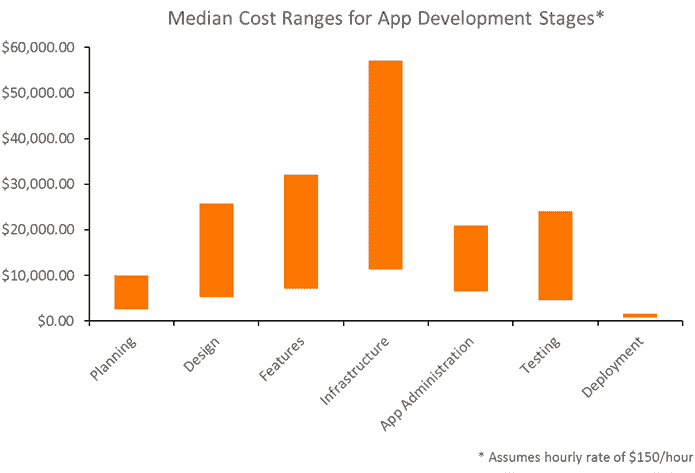
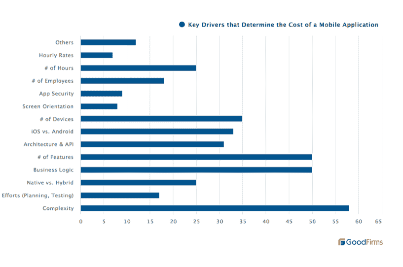
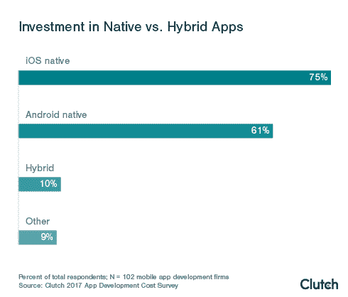

# 如何在预算紧张的情况下开发移动应用程序:5 个主要的节省成本技巧

> 原文：<https://medium.datadriveninvestor.com/how-to-develop-a-mobile-app-on-a-tight-budget-5-major-cost-saving-tips-d394fed7ac20?source=collection_archive---------6----------------------->

Photo by [William Hook](https://unsplash.com/@williamtm?utm_source=medium&utm_medium=referral) on [Unsplash](https://unsplash.com?utm_source=medium&utm_medium=referral)

所以你想出了一个有趣的主意来构建你的移动应用。现在是时候确定用户角色的痛点，进行广泛的市场研究，模拟可能的威胁，并为您的应用选择最佳平台。下一个十亿美元的想法，比如优步或者易贝，都不错，但是你应该先了解移动应用开发成本的构成。许多早期企业认为适当的研究没有必要，他们可以在没有研究的情况下完成探索项目。然而，这是一个常见的误解，因为根据 [Clutch 调查](https://clutch.co/app-developers/resources/cost-build-mobile-app-survey)，近 70%被调查的应用程序开发公司在推进项目之前需要一个*发现阶段*。

问题是，如今，对移动应用程序有着强烈胃口的初创公司在应用程序开发中投入了不合理的预算，而没有定义他们的目标和对每个开发阶段的估计。好吧，你可能会说，但是定制应用花了我多少钱，我如何才能降低移动应用的成本？下面的指南会给你提供一个要点。

# 基准测试:开发一个移动应用需要多少成本？

根据流行的调查，定制移动应用程序开发的平均价格从 10 万美元到 50 万美元不等。但我们有好消息:平均最小项目规模为 5000 美元至 10000 美元(2017 年离合器调查)。

根据 [GoodFirms](https://www.goodfirms.co/) 对 12 家顶级[移动应用开发公司](https://swagsoft.com.sg/)的采访，影响成本的主要驱动因素如下:

*   **特性和功能。**如上所述，发现阶段是一个核心阶段，因为它涉及确定目标、了解工作范围、需要什么功能、有价值的特性以及可以简化和增强业务流程的效用。
*   **平台。**您正在解决的问题会影响平台的选择，相应地需要不同的方法。确定应用程序的平台类型将预测开发时间。
*   **第三方应用集成。**根据您的应用将包含的功能，成本可能会大幅上升。使用 MVP 风格的精益应用程序开发，可以简化和优化功能的数量。为了公开数据，您需要与[移动应用程序 API](https://swagsoft.com.sg/blog/why-your-application-needs-a-mobile-app-api-benefits-and-examples/)集成，管理后端是一个昂贵的过程。
*   **App 安全。**要构建一个安全的 app，识别漏洞和 bug，需要特定的工具。由于企业数据和文档的敏感性，投资保护企业移动应用程序尤其明智。

# 开发移动应用程序的 5 个最佳成本节约策略

成本可能会有所不同，主要取决于某些应用程序的功能、平台和复杂性质。我们希望你不要坚持成为下一个脸书的想法，这样你就会发现这些技巧和提示在你的预算内开发定制移动应用程序时很有价值。

1.  **确定明确的目标**

研究，研究，再一次，研究。在开始开发之前，您必须确定项目的具体特性。进行市场调查，找出你的目标受众，他们的喜好和行为。了解你的价值主张有助于解决你的潜在客户的问题，并在未来的旅程中培养他们。

**2。简单功能**

因此，您分析了您的市场和竞争对手，定义了客户的需求和痛点，现在您已经准备好详细阐述移动应用程序的功能元素。在不必要的花费中，有没有给用户带来价值的功能？优先考虑那些促进客户流程的功能，在不影响功能质量的情况下改善他们的体验。

**3。先构建 MVP 版本**

在你在真实市场中测试你的产品之前，匆忙建立一个完全成熟的应用程序并不是一个好主意。为了减少成本浪费，建议开发一个最终产品的原型，该原型具有最少的功能特性集，能够通过大规模采用来验证您的想法。最小可行产品的目标是快速迭代，并通过客户体验检查其合规性。这是一种测试模式下的项目框架，用于检查其在市场上的适用性和消费者的接受度。

**4。选择合适的平台**

当你的预算增加时，你可能不会犹豫选择哪个平台——IOs 还是 Android——但当你的预算有限时，你需要选择最适合你需求的平台。根据所分析的市场和目标受众的数据，你将做出全面的决定，首先选择哪个平台。

与原生平台相反，还有一种选择——*混合平台*，它们以通用语言——HTML、CSS 或 Javascript——构建，并包装在原生框架中。它们可以在多种操作系统上工作，并减少您高达 40%的开支；但是，它们的加载速度慢，性能不佳。接受 Clutch 调查的大多数应用程序开发公司更喜欢本地平台，而不是混合平台。

与混合平台相比，本地平台的功能和特性更加可靠。你需要咨询[一个有经验的移动应用程序开发团队](https://swagsoft.com.sg/mobile-app-development/)来找出潜在的风险，以及哪一步对你来说是正确的。

**5。投资 App 维护**

你的应用程序可能会因为维护不善而失败。总预算的大约 20%必须分配给手机应用程序的维护。为了展示你在 app store 中对用户的响应能力和参与度，你需要整合你的应用下载。这包括:安全和代码维护、风格和设计增强、库更新、操作系统年度更新、性能监控、许可证更新等。