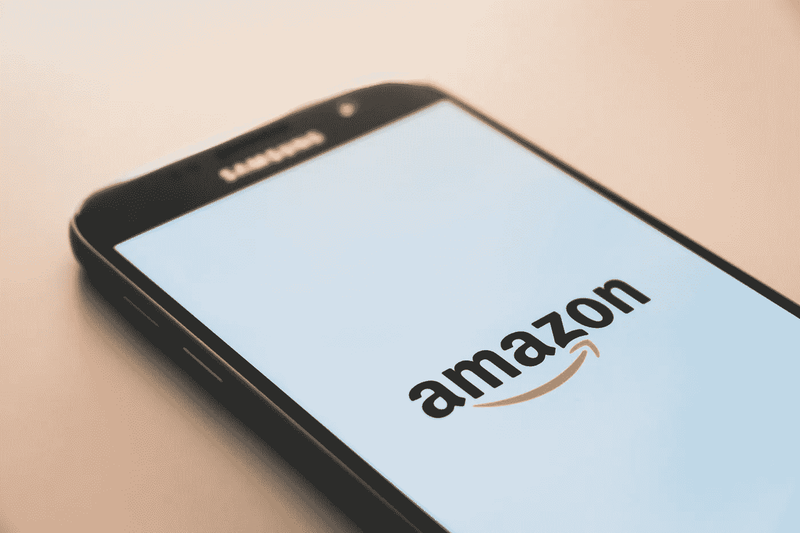

# 如何开发出像亚马逊或易贝那样超级成功的 iOS 应用

> 原文：<https://medium.datadriveninvestor.com/how-to-develop-a-super-successful-ios-app-like-amazon-or-ebay-3d6956aba58e?source=collection_archive---------13----------------------->

由于技术的快速进步，移动应用程序开发变得越来越容易。如果你想更接近你的客户，那么开发 iOS 应用正是你所需要的。

 [## 2019 年移动应用开发之路|数据驱动的投资者

### 任何在移动应用程序开发行业工作的人，无论他们是专注于在伦敦开发 iOS 应用程序还是…

www.datadriveninvestor.com](https://www.datadriveninvestor.com/2019/01/15/the-path-of-mobile-app-development-in-2019/) 

# 创建成功的 iOS 应用程序

[创建一个成功的移动应用](https://swagsoft.com.sg/mobile-app-development/)需要大量的前期工作。你可能有一个奇妙的想法和足够的资源，但这并不能保证成功。最聪明的想法如果执行不好，会使你的努力前功尽弃。所以，也许下面的建议会对你有用:

*   在不同领域互补的团队中创业:商业、开发、产品、营销、管理。
*   探索你想解决的问题。专注于问题，也许应用程序根本不是一个理想的解决方案。与潜在客户交谈，了解他们当前的问题和解决问题的替代方案。
*   在你与多种类型的顾客交谈后，选择一个利基市场。以后，你会有时间接触更多的群体。
*   定义一个商业模式，从第一天开始就想好自己怎么赚钱。
*   创建原型，并与您的潜在客户一起测试。
*   当你确信你开发的解决方案正是他们需要的时候，就开始编码吧。准备 MVP。
*   制作一个跨平台的应用程序来测试你的想法。它会让你明白第一年应该关注什么。
*   和用户一起再次测试你的第一个原型。让他们使用它并提出问题。根据回答进行迭代。
*   尽可能多地和你的用户交谈，理解他们的首要问题。添加或删除功能。
*   在你确定你有好的回报之前，不要在营销上花钱。

遵循这些开发原则将确保准确及时地识别问题区域。永远记住主要目标，关注应用程序第一个版本的主要功能。不要害怕放弃你没有 100%把握的机会。此外，您通常可以发布相对较小的更新。因此，用户会极大地影响你的应用程序。

# IOS 应用程序开发的主要阶段

iOS 应用程序的创建主要包括三个阶段:业务分析、设计和应用程序的实际开发。让我们深入了解其中的每个阶段。

**商业分析**

在回答如何开始 iOS 应用开发的问题时，我们需要说明的是，这一切都是从[商业分析](https://en.wikipedia.org/wiki/Business_analysis)和为未来应用设定目标开始的。市场情况(竞争对手、目标受众和趋势)经过仔细研究和分析，因此我们对需要做什么和需要实现什么业务目标有了清晰的了解。没有这个阶段，高质量的 iOS 应用程序开发是不可能的，因为仅仅为了向时尚致敬而创建应用程序是一个失败的想法。

**设计**

定制移动应用程序开发的一个重要步骤是架构的设计。立即开始绘制设计布局将是错误的一步，因为首先对移动用户来说重要的是界面的便利性而不是美观。现在，任务已经明确，并且有了前进的愿景，我们设计未来应用的架构，之后设计师创建移动界面的设计。

**发展**

现在开始流程中最技术性的阶段，包括 iOS 应用程序的开发。设计布局转移到布局，我们可以说敏感阶段开始了，这包括应用程序的创建。在对布局进行质量检查之后，移动应用程序开发人员进入业务，并被委托编写应用程序。开发人员沉浸在项目中，实现所有计划的功能。

# 关于移动应用程序开发的更多提示

每一个有自尊的移动应用开发公司都希望开发出拥有漂亮动画、设计良好的用户界面和最高性能的高质量应用。我们为您总结了更多技巧，因此您可以开发一个超级成功的应用程序。

1.  检查市场上的类似物。也许这是你想出一个主意后要做的第一件事。检查是否已经有完全重复你的功能的应用程序。你可以花很多时间去创造市场上已经有的东西。
2.  正确的名字。想出一个朗朗上口又好记的名字并不是那么简单。它不应该很复杂，但应该描述应用程序，对用户有意义，大小不应该超过三个字。你必须非常严肃地对待名字的创造，因为很多事情都取决于它。大多数应用商店的访问者会在几秒钟内决定是否下载该应用。你怎么能影响这个呢？朗朗上口的名字，漂亮的图标，有趣的截图。接下来是描述。
3.  一开始就处理商业模式。在你开始画一个图标，雇佣文案和编码之前，你需要明白你的应用程序将如何带来金钱。广告、应用内购买、最低价格、订阅——有很多选项，每一个都适合不同的策略。
4.  确保强有力的营销[提高您的移动应用下载量](https://swagsoft.com.sg/blog/growth-hacking-marketing-how-to-boost-mobile-app-downloads/)。你需要尽可能多的人知道这个应用程序。PR 有很多选择，有付费的，也有免费的。个人资料资源、社交网络上的群组、博客和广告——所有这些都将有助于你围绕该应用进行宣传。

所有这些建议都会在你创业初期对你有所帮助。然而，有一件事，但不是最不重要的事，留给你去做:研究成功的大故事。今天，亚马逊和易贝应用被认为是应用商店中最成功的应用之一。为什么？原因是两家公司都一直关注客户的需求。另一个原因是强大的营销。例如，亚马逊小心翼翼地开展营销活动，以适应不断变化的市场。该公司专注于互联网通信、密切的合作伙伴关系、关于其产品良好质量的持续声明以及一些附加服务。更重要的是，亚马逊正在努力走在市场的前面；该公司的大部分营销手段都被追随者借鉴了。

结果很明显:[亚马逊](https://www.cnbc.com/2019/04/25/amazon-earnings-q1-2019.html)在线零售商 2019 年第一季度的净利润比去年同期增长了 16.9%。至于易贝，该公司最近表示，活跃买家的数量已经增长到 1.8 亿，他们的股票甚至在盘后也在增长。他们对未来的计划令人鼓舞。