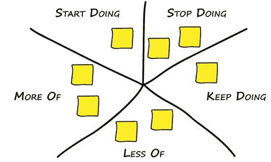
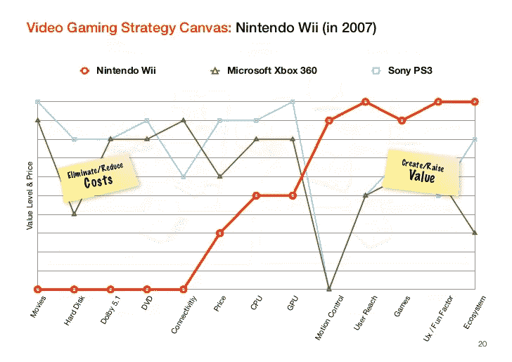
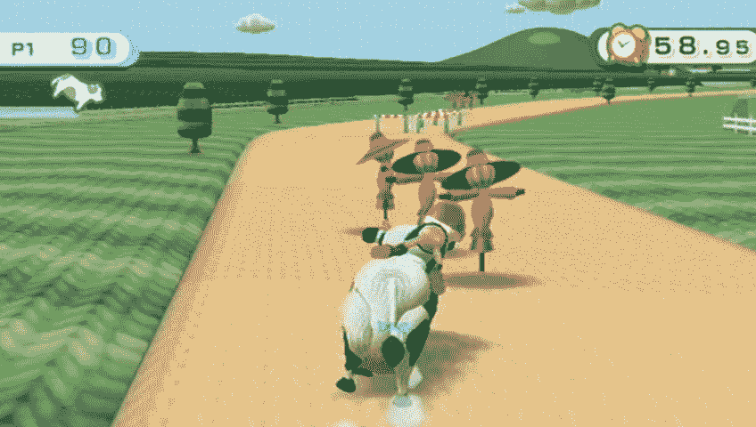
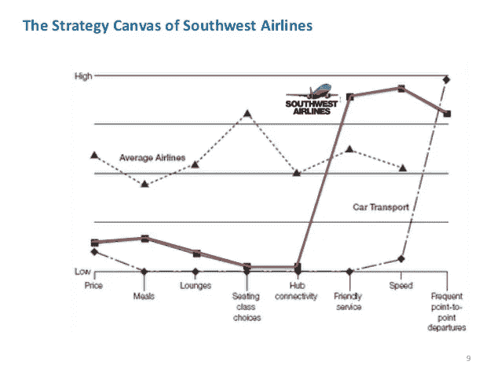
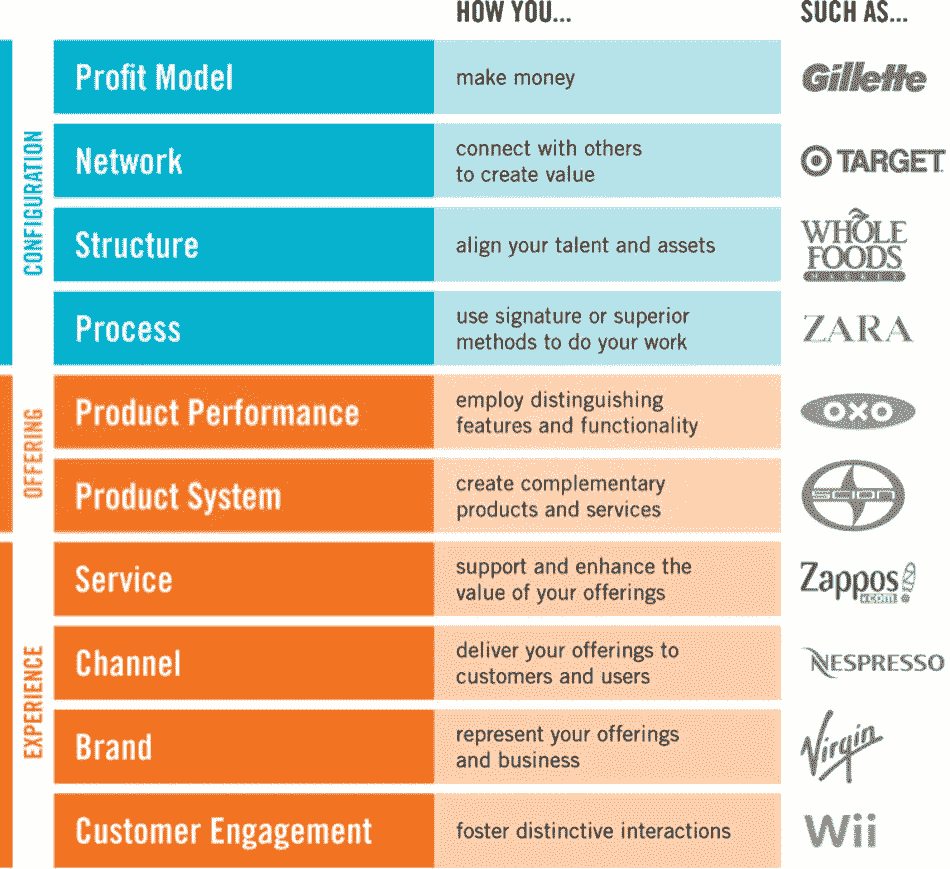
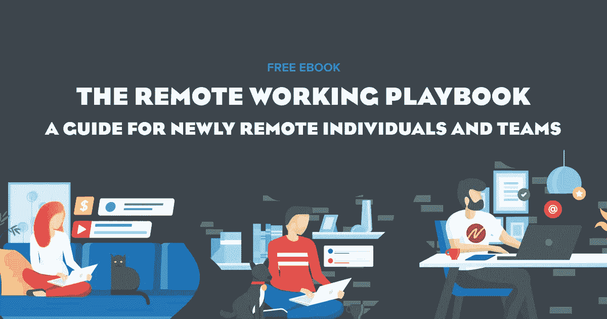

# 如何在饱和的市场中让你的业务与众不同

> 原文：<https://medium.datadriveninvestor.com/how-to-differentiate-your-business-in-a-saturated-market-80cfd5167ec3?source=collection_archive---------13----------------------->

在拥挤的市场中，你如何让自己的业务与众不同？

最近在[提升你的生物播客](http://nofilter.media/boostyourbiology)上有人问我这个问题，我不禁想起了蕾妮·莫博尔涅(Renee Maurborgne)和 w·陈·金(W. Chan Kim)颇具影响力的 ***蓝海战略*** 理论和著作。

在这篇文章中，作者提出了占领无竞争市场空间、创造新需求和让竞争变得无关紧要的理由。清澈的蓝色海洋是无竞争市场的明显隐喻，它不同于血红的海洋，在血红的海洋中，所有众所周知的海洋生物都在血战到底。

它呼应了一句古老的谚语:鱼多的地方应该捕鱼，但渔民少。

但是我们如何着手识别这些池塘或海洋呢？

莫伯尼和金提出了以下四个问题。

1.  哪些因素应该 ***提高*** 远高于行业标准？
2.  哪些因素应该是 ***创造的*** 行业从未提供的？
3.  哪些因素应该 ***降低*** 远低于行业标准？
4.  哪些行业长期竞争的因素应该被 ***淘汰*** ？

一种简单的思考方式是，我们应该开始做什么，停止做什么，继续做什么，多做什么，少做什么，如下图所示。

‍

‍

对于任何团队来说，这实际上是一个有用的练习，可以定期运行，不仅反映任务，还反映产品、营销渠道、目标客户、销售技巧等等。

事实上，随着时间的推移，你也可以把它应用到你自己的生活中，取得很大的效果。

蓝海战略的一个经典例子是任天堂 Wii。它在 2006 年进入了一个饱和的家用游戏机市场，由索尼的 Playstation 和微软的 XBox 主导。

下面是一张蓝海战略图，展示了任天堂如何从市场领导者中脱颖而出。

‍Rather 希望在存储、环绕声、DVD、互联网连接和处理器速度等因素上进行正面竞争，它改变了竞争因素，并凭借这些因素占领了新的市场。

任天堂 Wii 不是关于令人兴奋的图形，但其核心是关于任何人都可以玩的简单家庭乐趣，这有助于打开一个新的市场——妈妈。

 [## 商务沟通不畅是网络安全问题的 5 个原因|数据驱动型投资者

### 沟通是商业的命脉。没有协作就不会有想法，没有合作就不会有交易

www.datadriveninvestor.com](https://www.datadriveninvestor.com/2020/09/01/5-reasons-why-poor-business-communication-is-a-cybersecurity-issue/) 

Wii 不仅让游戏更容易被新的客户群接受或吸引，还通过在动作控制等因素上的竞争来实现这一点，这些因素是激活新市场的关键。Wii 的许多游戏的动作控制特性使得任何人都可以轻松地拿起控制器开始拳击、打网球或赛牛！

蓝海战略发挥作用的另一个标志性例子是廉价航空公司的激增，如瑞安航空公司、捷星航空公司和鼻祖 T2 西南航空公司。

西南航空没有在休息室、餐食和座位选择等因素上与优质航空公司竞争，而是采取了简单的方式——在座位上放上便便，让他们从 A 地到 b 地。

取消高级航空公司的标志意味着两件事:

*   它直接降低了成本基础
*   有限的餐食和所需的清洁意味着西南航空公司可以在一天内完成更多的航班

因此，**西南航空**能够以远低于现在优质航空公司的价格提供机票，这种模式不仅吸引了像**美国航空**这样的现有客户，还打开了一个新的旅客市场，这些旅客以前可能会乘坐公共汽车或火车穿越整个大陆。

为了帮助识别你的业务中的蓝海机会，首先思考你的行业中的竞争因素是什么，然后回答上述四个问题，以确定你如何才能与众不同。

有许多因素可以让你脱颖而出，下面的 ***多布林的 10 种创新*** 是帮助你决定可以利用哪些杠杆的便利起点。

也许是你的价格点，你的成本结构，优质的客户服务，你接触客户的分销渠道或者一个真正时髦的品牌。

除了这十个领域，你还可以看看你的客户群——你的目标客户群是谁？

你使用什么销售技巧？你是否在利用人工智能或基于客户的营销，让你比陌生来电的竞争对手更有优势？

你的价值主张如何与众不同？例如，与其在拥挤的 PT 市场上做一名私人教练，也许你会选择专注于 40 岁以上人群的运动训练？现在你有了一个利基市场，它不像那些核心价值主张是帮助你减肥和保持苗条的运动鞋那样备受争议。

或者你开发了一个更好的流程来完成工作，这给了你各种各样的优势。例如， [NoFilter media 的](http://nofilter.media/)业务建立在几个关键支柱之上——自动化、外包、众包和 80/20 思维。因此，该公司能够以典型媒体公司的一小部分成本制作成千上万的内容。这使得**诺菲尔**在以低于市场价格*的价格出售广告时有了优势，而*没有牺牲健康的利润率。

这在后 COVID19 时代尤为重要，在这个时代，广告市场有些不景气，并导致了众多媒体渠道的大屠杀。

**SpaceX** 其实也做了类似的事情。埃隆·马斯克在制造火箭时发现，零部件的价格高得离谱。但是，他没有从表面上看这个问题，而是问了一个别人没有的问题。"如果我们自己制造零件会怎么样？"因此，他能够将众多零部件的价格降低一个数量级以上，并将空间障碍降低约 45 倍。

当美国国家航空航天局的航天飞机运行时，每 27500 公斤的有效载荷花费了 15 亿美元。今天，SpaceX 公司的猎鹰 9 号火箭可以举起 63，800 公斤的重量并将其送入轨道，仅花费 9，000 万美元。

在[**Collective Campus**](http://www.collectivecampus.io/)中，我们使用内容(博客、播客、视频、书籍和电子书、网络研讨会)将自己与咨询领域的竞争对手区分开来，因此，我们的精品公司现在每月产生约 500 次入站下载并领先。

不管你的市场看起来有多饱和，今天的世界是一个快速变化的世界，如果你寻找机会让自己与众不同，占领现有的市场份额并打开新的市场，你很可能会找到它们。

但是，就像商业和生活中的所有事情一样，成功取决于执行力和运气。

## 获得专家观点— [订阅 DDI 英特尔](https://datadriveninvestor.com/ddi-intel)