# 新零售时代如何将顾客的行动和产品动向数字化

> 原文：<https://medium.datadriveninvestor.com/how-to-digitize-customers-actions-and-product-movements-in-the-new-retail-era-7ced50e284f9?source=collection_archive---------12----------------------->

人工智能(AI)技术在新零售场景中的应用通常会带来一些创新努力。围绕“客户、产品、场景”的数字化的主要焦点导致了许多新应用的出现，包括使用行人检测算法的商店客户流量统计、使用面部识别算法的商店入口和出口统计，以及基于图像分类算法的产品识别和自助服务销售柜台。本文探讨了人工智能技术在理解零售场景中消费者和产品之间的交互方面的应用，以进一步考察“客户、产品和场景”数字化的价值。它旨在找出消费者在什么时候、在什么情况下对什么样的产品感兴趣。

# 商情分析

为了寻求“消费者在什么时候、在什么场景下对什么样的产品感兴趣”这个问题的答案，精确地确定在商店的货架周围执行一个动作的时间。将操作与客户信息相关联，包括客户的年龄、性别和类型(回头客或新客户)。此外，准确确定从哪个库存单位(SKU)提取或取走产品。

 [## 为什么数据将改变投资管理|数据驱动的投资者

### 有人称之为“新石油”虽然它与黑金没有什么相似之处，但它的不断商品化…

www.datadriveninvestor.com](https://www.datadriveninvestor.com/2019/01/25/why-data-will-transform-investment-management/) 

与自助销售柜台和线下大屏不同，监控摄像头因为距离产品较远，没有清晰的图像。商场超市的摄像头因为产品排列过于密集，没有完整的图像，如图 1 所示。在这类场景下，视觉摄像头只确定客户是否进行任何取货动作，并不直接为“客户、产品、场景”提供产品信息。

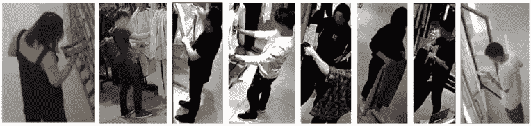

Figure 1 Snapshots of product pick-ups

为了在这种情况下获得清晰的图像，使用射频识别(RFID)标签来检测产品是否被客户取走。RFID 标签广泛应用于新零售场景。每个标签较低的价格使得零售行业采用无源 RFID 系统更经济。必须使用适当的算法来生成关于特定客户和产品之间交互的时间和场景的数据。图 2 显示了整个实现过程。

Figure 2 Technical diagram of customer-product action detection

在上图中，摄像头和 RFID 接收器部署在远程线下商店中，用于记录实时视频和接收来自 RFID 标签的时序信号。部署在商店中的远程服务器执行客户行为检测算法，从监控视频中捕捉行人图像，并将图像传输到后端。后端服务器基于接收的时间序列信号确定可能被拾取的 RFID 标签。商店服务员将 RFID 标签的电子产品代码(EPC)与产品的 SKU 号码相关联，并将信息记录在数据库中。服务器然后基于标签的 EPC 获得 SKU 信息。

同时，后端服务器将接收到的图像发送到 MobileNet 分类器，以检测具有潜在拾取动作的图像。后端服务器还将图像中客户的坐标转换为他们的物理位置。最后，后端服务器根据行动的时间和潜力将产品与提货行动相关联，以获得最佳匹配。这些匹配说明了关于特定客户和产品之间交互的时间和场景的信息。

本文描述了客户产品行为检测中使用的三种关键算法:

*   基于图像的顾客行为检测算法
*   基于射频信号的产品翻箱检测算法
*   基于图匹配的客户-产品关联算法

# 1 基于图像的客户行为检测算法

该算法在视频和连续的单帧图像中检测客户行为，以满足新的业务需求。

# 1.1 检测视频图像中的动作

## 1.1.1 问题分析

与行人检测和人脸检测不同，客户和产品之间的交互是一个时间序列过程。比如这个过程中拿起、翻找、试穿的动作持续一段时间。因此，为了精确地理解用户行为，通过基于整个视频的模型学习或预测来对视频动作进行分类是很重要的。在深度神经网络广泛应用的推动下，视频动作分类技术近年来有了很大的发展。

最著名的模型包括 2014 年开发的卷积神经网络(CNN)模型[1]，2015 年开发的长期递归卷积网络(LRCN)模型[2]，2017 年开发的 Inception-V1·C3D(I3D)模型[3]。LRCN 模型使用 2D 卷积从单帧图像中提取特征，并使用递归神经网络(RNN)来提取帧之间的时间序列关系。该模型在视频动作分类中工作良好，但是需要很长时间来训练。I3D 模型使用 3D 卷积从整个视频中提取特征，从而提高训练速度。

而 UCF101、HMDB51、Kinetics 等开源数据集在体育和音乐表演活动中只有少数有限类型的动作，而没有商场和超市中的数据。因此，购物中心和超市构建并提供动作视频给外包团队进行注释。在购物中心和超市场景中，客户和产品之间的交互持续时间非常短。只有 0.4%的日常视频包含这样的交互，导致正面样本稀疏。

为了尽可能多地挖掘正面样本，提高外包团队的标注效率，我们使用 Lucas-Kanade 光流算法对含有目标活动的视频进行预处理和过滤。经过这种处理后，阳性样本的比例增加到 5%。为了提高样本的置信度，我们还对阳性样本进行验证和注释，以确保其准确性。

## 1.1.2 动作检测模型及其优化

让我们深入探讨以下为检测视频中的动作所做的尝试。

使用姿态算法和跟踪算法自动裁剪视频，获得由顾客每个手的动作组成的实时短视频。使用 I3D 模型来训练手部动作的分类器，并优化 I3D 模型的裁剪逻辑。

裁剪由顾客每只手的动作组成的短视频有助于准确确定这些动作发生的位置。诸如拿起和翻找之类的客户产品动作通常由手来完成，因此可以过滤掉人体其他部分的动作，而不会对检测结果产生负面影响。手动聚焦裁剪减少了模型的计算工作量并加速了模型收敛。在该算法中，姿态模型基于开放姿态[4]，轨迹模型基于深度排序[5]。两种模式都比较成熟，可以直接使用。

本文主要描述了如何使用 I3D 模型来裁剪视频中的手部动作。基于图像的学习任务通常使用 2D 卷积核通过滑动和池化来提取特征。基于视频的学习任务将传统的 2D 卷积扩展到用于特征提取的 3D 卷积。如图 3 所示，3D 卷积包含了 2D 卷积无法提供的时间维度。

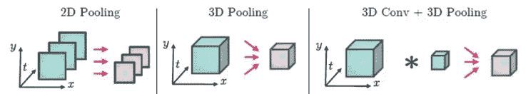

Figure 3 Diagrams of 2D convolution pooling and 3D convolution pooling

本文使用最近提出的 I3D 模型，它从传统的 2D 卷积扩展到三维卷积。该模型在 Kinetics、HMDB51 和 UCF101 数据集上具有最好的检测结果。图 4 显示了 I3D 模型框架。在此示意图中，所有卷积和汇集操作都是在 3D 级别执行的。混合模块是初始 V1 模型中的感知子模块，由四个分支组成，如右图所示。

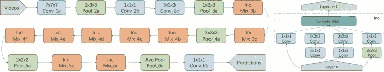

Figure 4 I3D model framework (left) and Inception sub-module structure

将 3D 卷积应用于购物中心或超市场景中的客户行为解释任务表明，该模型具有太多的参数，并且容易过拟合。同时，较深的网络层次导致模型泛化能力差，丢包功能弱。为了解决这些问题，让我们通过移除不必要的多层初始模块(Mix_4c、Mix_4d、Mix_4e、Mix_4f、Mix_5c)并获得每个初始模块中卷积核的深度来简化初始-V1 模型。图 5 显示了简化的模型。

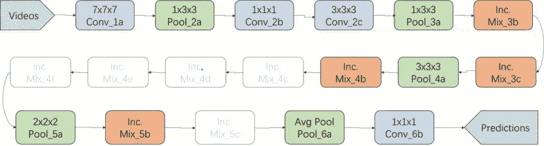

Figure 5 Cropping logic improved in the I3D model

经过运算简化后，模型的分类准确率从 80.5%提高到 87.0%。经过超参数的调整，准确率最终提高到 92%。

## 结论和分析

该算法将样本转换为 TFRecord 数据，并将数据上传至阿里巴巴集团的数据存储中心。此外，它采用[人工智能机器学习平台(PAI)](https://www.alibabacloud.com/product/machine-learning?spm=a2c41.13948313.0.0) 在分布式环境中训练模型(30 个 GPU)，并将训练好的模型应用于客户行为解释。video _ action _ recognition _ results . MP4 中列出了当前算法的实际预测结果，目前后端服务器实时检测单个视频中的客户动作。

然而，相对于传统的基于图像的检测，视频动作分类检测存在以下问题:

*   这个模型很复杂。卷积 3D (C3D)涉及时间和空间处理。
*   数据量巨大，训练难度大。与图像相比，视频中的数据量增加了几百倍到几万倍。
*   该模型在实际部署中极具挑战性。人们对时间预测的效率、时间序列样本的组织和滚动窗口预测有许多疑问。

# 1.2 检测单帧图像中的动作

## 1.2.1 问题分析

基于视频卷积的客户动作检测算法提供了高准确度(92%)并提供了精确的动作位置(精确到手腕)。然而，视频 C3D 模型和姿态模型具有太多的参数并且是复杂的。一台服务器只运行一种检测算法，导致计算性能低下。此外，C3D 算法要求视频在一个时间帧内包含连续的手部动作，这给跟踪算法带来了很大的挑战。为了将动作检测算法应用于具有多通道监控信号的多商店场景，我们进一步开发了基于单帧图像的动作检测。

该算法允许我们在单个图像中分类和检测潜在的动作。与基于视频的动作检测相比，基于单帧图像的动作检测提供较低的准确度，因为单个图像仅提供很少的信息。然而，通过整合 RFID 检测结果来补偿低精度。

## 1.2.2 模型及其优化

基于单幅图像的潜在动作检测是一种典型的二值分类算法。为了减少对计算能力的需求，让我们使用 MobileNet[6]作为分类模型。MobileNet 是一种高效、轻量级的网络模型，它基于深度卷积和点卷积优化了传统卷积层的计算能力。

与传统卷积网络相比，MobileNet 在保持精度几乎不变的同时，将计算数据量和参数数量减少到原来的 10–20%。本文使用 MobileNet_V1 模型，并将卷积通道数的深度乘数设置为 0.5，以进一步缩小模型比例。我们授权一个外包团队来注释图像动作数据集，并平衡样本，以确保在训练过程中保持一致的正负样本。

在需要尽可能多地捕捉动作瞬间的业务场景中，根据模型的 Logits 输出优化参数。参数优化将分类准确率保持在 89.0%左右的同时，将阳性样本召回率提高到 90%，以保证尽可能多的召回阳性样本。

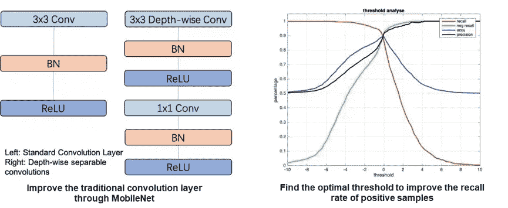

Figure 6 Optimized MobileNet model

## 结论和延伸

基于图像的动作检测算法，分类准确率高达 89%，召回率高达 90%。精度略低于基于视频的动作检测算法，检测到的位置不精确到手腕。图 7 显示了预测顾客是否挑选衣服的示例。如果图像底部有灰色条纹，则为阳性样本。如果图像底部有黑色条纹，则为阴性样本。

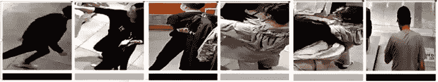

Figure 7 Sample result of image-based action classification

基于图像的动作检测算法采用轻量级的 MobileNet 模型，大大降低了计算复杂度。所以从一天开始搜索一个店铺上万个潜在的动作图像，只需要 10 分钟左右。这种算法只处理发送到后端服务器的图像，大大减少了现场设备和服务器的工作量。然而，基于图像的动作检测算法仅精确地预测行人位置，而不提供准确的动作位置。在具有相同动作的被检测图像之前和之后几秒钟的图像可能被检测为阳性样本，影响时间关联的准确性。

# 2 基于射频信号的产品翻箱检测算法

# 2.1 问题分析

当顾客翻找衣服时，贴在衣服上的 RFID 标签会轻微晃动。RFID 接收器记录特征值的变化，例如接收信号强度指标(RSSI)和接收信号的相位，并将信息传输到后端服务器。该算法分析每个天线回传的特征值，以确定产品是否被翻箱倒柜。基于 RFID 信号预测产品翻箱行为受多种因素影响，包括信号噪声、多径效应、意外电磁噪声和计数器的信号屏蔽。此外，RFID 反射信号的大小和接收器-标签距离之间存在非线性关系[7]。

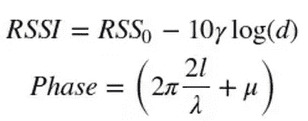

在这个公式中，d 表示 RFID 标签和接收器之间的距离。l = d 模λ。λ由多径效应和当前环境决定。μ表示各种静态器件误差引起的失调。根据公式，接收器安装位置和商店环境对 RFID 信号有很大影响。使产品翻找检测算法适用于安装在各个商店的不同位置的接收器对我们来说是一个挑战。

# 2.2 产品翻箱检测算法及其优化

前面几节显示了如何建立一个监督模型来检测产品搜查行动。从商场部署的两个 RFID 天线收集时间序列信号的 RSSI 和相位值，并将它们组合成以下特征:

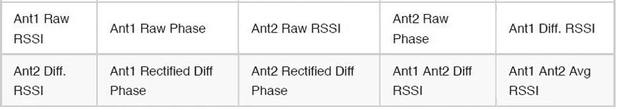

在该表中，Ant1 和 Ant2 表示由两个天线从同一 RFID 标签收集的信号。Diff 表示信号上的操作差异，Avg 表示信号上的平均操作。最后以每秒 50 帧的速度从每个样本中采集 8 秒的连续信号，形成 400 × 10 的二维特征。此外，我们使用以下模型基于自建数据集训练收集的特征。最终的分类准确率为 91.9%。

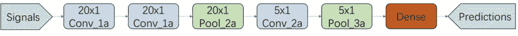

Figure 8 RFID CNN model

使用监督学习模型的产品翻找检测算法实现了高预测准确度。然而，该算法在实际应用中推广能力较差。当计数器或天线位置改变时，RFID 信号会发生显著变化。因此，基于原始数据集的训练模型很难适用于新的场景。为了解决这个问题，我们采用无监督模型来提高检测算法的泛化能力。

具体而言，必须注意相位信息与相对偏移而非空间位置相关。详细关系见相频分布图。频率信息与动作速度而不是空间位置相关。详细关系见领域频率分布图。

严格地说，振幅信息与空间位置相关。然而，我们认为频率信息与空间位置无关，因为我们只关注频率分布(不同频带的比例)。为了获得频率信息，对接收信号的 RSSI 和相位值执行离散傅立叶变换(DFT ),如下所示。

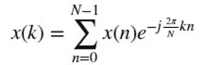

然后，得到频率信号和相位信号的分布图。根据生成的图表，计算詹森-香农(JS)散度，以从前一时刻的概率分布计算出当前的概率分布。JS 不同于 Kullback-Leibler (KL)散度，其中它扩展 KL 散度来计算一个概率分布与另一个概率分布的对称分数和距离度量。

该模型基于连续时刻两个样本之间的 JS 散度差来检测产品翻找行为。根据场景调整 JS 散度差的阈值，以实现与由监督学习模型获得的检测精度相似的检测精度。

# 2.3 结论和分析

监督学习模型和非监督学习模型用于检测产品翻找行为。该算法精确定位被翻找产品的 SKU。监督学习模型的检测准确率为 91.9%。无监督学习模型的检测准确率稍高，为 94%。JS 散度度量提高了算法的泛化能力。JS 散度差的阈值被调整以适合不同的场景。

# 3 基于图匹配的客户产品关联算法

# 3.1 问题分析

基于图像的客户行为检测和基于 RFID 的产品翻找检测是两个独立的过程。基于 RFID 的检测提供了被翻箱倒柜产品的信息，但无法定位执行该操作的客户。另一方面，基于图像的行为检测指出了有潜在产品翻箱倒柜行为的客户，但不能预测翻箱倒柜的产品。

在实际场景中，只有少数动作在同一时间同一地点发生。因此，在时间的基础上，可以将基于 RFID 的检测所确定的翻找的产品与基于图像的检测所预测的顾客相匹配。尽管客户和产品以这种方式联系在一起，但问题仍然存在。

检测到可能翻箱倒柜的顾客的时间和检测到翻箱倒柜的产品的时间之间的累积误差可能长达 5 秒到 15 秒。在下列任何情况下，都可能发生此错误:

*   向服务器发送 RFID 信号和视频监控信号所用的时间是不同的。
*   现场设备的时钟时间不同步。
*   这两种算法不能准确预测动作的时刻。

这些情况导致多个顾客在相邻的位置和时刻可能翻箱倒柜和多个看似翻箱倒柜的产品。

# 3.2 客户-产品关联算法及其优化

该算法将货架附近的 RFID 设备检测到的行为与基于图像的检测预测到的客户相关联。动作的瞬间一致性和潜在性都在关联中被考虑。这就保证了两个算法中的客户、产品、动作、时刻相互匹配。当多个客户在同一个区域有潜在动作，或者同一个区域的多个产品被貌似翻箱倒柜时，进行图匹配，寻找这些产品与客户的最佳匹配。在本文中，客户与产品的匹配度(边权重)定义如下:

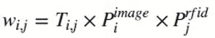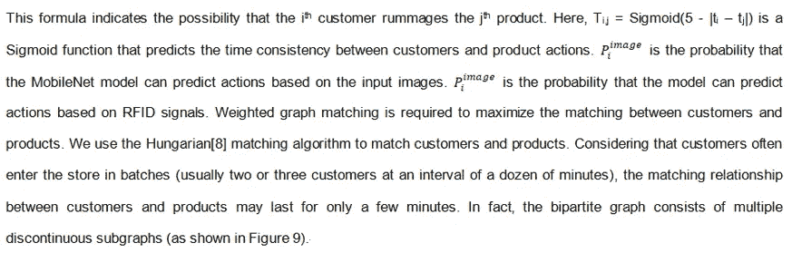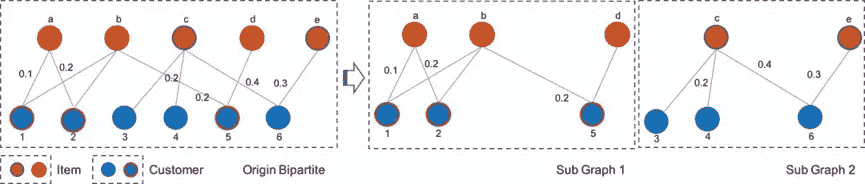

Figure 9 Bipartite graph and sub-graphs of customer-product graph matching

将原二分图分成若干个不连续的子图，对每个子图分别进行匹配，以降低计算和存储的复杂度。这样，边权重关系存储在邻接矩阵中，大大提高了算法效率。全天匹配数百甚至数千个客户和产品所需的时间从几个小时减少到几分钟。

# 3.3 结论和分析

基于图匹配的客户-产品关联算法获得全天客户和产品的最佳匹配。改进后，计算效率大大提高，所需时间从几个小时降低到几分钟。此外，客户-产品关联算法是整个客户-产品检测过程的最后一步。上游算法模型的准确性，包括客户发现的准确性和客户-产品匹配度的准确性，影响着关联的准确性。基于单帧图像的客户行为检测准确率为 89%，基于 RFID 的产品翻找检测准确率为 94%。

# 4 摘要

客户产品检测流程集成了以下三种算法，用于商店预测。

*   基于图像的顾客行为检测算法
*   基于射频信号的产品翻箱检测算法
*   基于图匹配的客户-产品关联算法

下表列出了这些算法的一些示例结果，以帮助他们更好地理解。该表描述了四个因素之间的相互作用——何时(时刻)、何地(图像中的坐标)、谁(行人 ID)和什么(产品 SKU)。

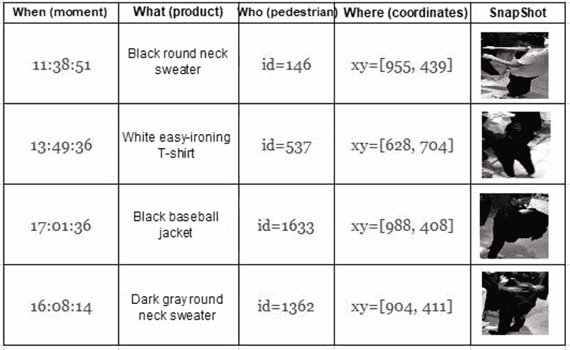

行人 ID 是顾客检测算法分配给进入商店的用户的号码。从图像中提取坐标，并在后续步骤中转换到商店中的物理位置。快照捕捉了产品翻箱倒柜的瞬间。

虽然基于单帧图像的动作检测准确率相对较低，但它显著提高了客户与产品关联的准确率。将两种动作检测算法得到的客户-产品数据进行比较，结果表明单帧图像的最终匹配准确率从 40.6%提高到 85.8%。

关联精度受上游算法模型精度的影响，因为客户-产品关联算法是整个客户-产品检测过程的最后一步。将二维因素、时间关联度和行动潜力添加到图形匹配中。最后，顾客和被翻找产品的匹配准确率提高到 85.8%。根据本文讨论的实践得出以下结论。

*   将产品 SKU 与在几秒钟内捕获的客户活动关联起来是可行的。
*   无监督学习模型支持基于 RFID 的产品翻箱倒柜检测，便于大规模部署。
*   基于单帧图像的行人动作检测算法是有效的，可以直接部署在大规模后端服务器上。

但是，这些算法还处于初级阶段，需要在以下几个方面进行进一步的扩展:

1)基于单帧图像的行人动作检测算法还有很大的优化空间。将数据集内的阳性样本数量从一千个增加到数万个，以显著提高性能。当服务器的计算能力提高时，尝试优化的分类模型，如 VGG、ResNet 和盗梦空间。
2)目前基于单帧图像的动作检测算法只对行人位置准确。尝试一种新的检测模型来准确预测动作位置。
3)目前，射频识别接收机只能在 1 ~ 3m 的距离内检测数十至数百个产品的信号，而且其容量和范围受到采集频率和天线轮询机制的高度限制。优化基于 RFID 的检测算法所使用的硬件，以降低成本并提高检测能力、范围和准确性。
4)基于 RFID 的检测需要使用无监督学习模型进行阈值调整。优化此方法，使其适用于不同的商店。
5)目前，客户-产品关联是根据时间和行动潜力来实现的。将产品位置与客户位置关联起来，以进一步提高关联的准确性。

参考文献:

[1] Karpathy，Andrej，等.用卷积神经网络进行大规模视频分类.IEEE 计算机视觉和模式识别会议录。2014.
[2] Donahue，Jeffrey，等.用于视觉识别和描述的长期递归卷积网络。IEEE 计算机视觉和模式识别会议录。2015.
[3]卡雷拉、若昂、安德鲁·齐塞曼。Quo Vadis，动作识别？一个新的模型和动力学数据集。计算机视觉和模式识别(CVPR)，2017 年 IEEE 会议。IEEE，2017。
[4]曹，哲，等.基于局部亲和场的实时多人二维姿态估计.arXiv 预印本 arXiv:1611.08050 (2016)。
[5]沃伊克、尼古拉、亚历克斯·比雷和迪特里希·保卢斯。具有深度关联度量的简单在线实时跟踪。图像处理(ICIP)，2017 年 IEEE 国际会议。IEEE，2017。
[6] Howard，Andrew G .等. MobileNets:用于移动视觉应用的高效卷积神经网络.arXiv 预印本 arXiv:1704.04861 (2017)。
【7】刘，天赐，等 tag booth:RFID 标签驱动的深度购物数据采集。2015 年 IEEE 计算机通信会议。IEEE，2015。
【8】库恩，哈罗德 w .指派问题的匈牙利方法。海军研究后勤季刊 2.1–2(1955):83–97。

# 原始来源:

 [## 新零售时代如何将顾客的行动和产品动向数字化

### 阿里巴巴云 2020 年 1 月 21 日 138 人工智能(AI)技术在新零售场景中的应用…

www.alibabacloud.com](https://www.alibabacloud.com/blog/how-to-digitize-customers-actions-and-product-movements-in-the-new-retail-era_595754?spm=a2c41.13948313.0.0)