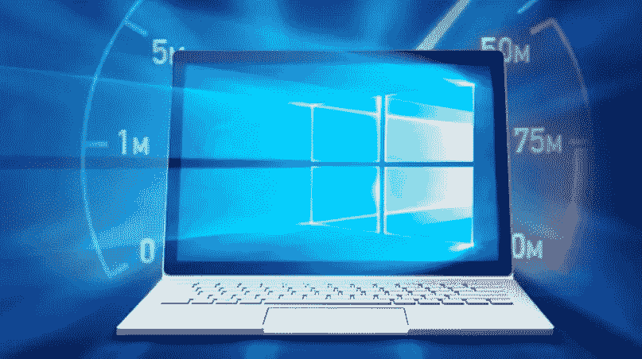
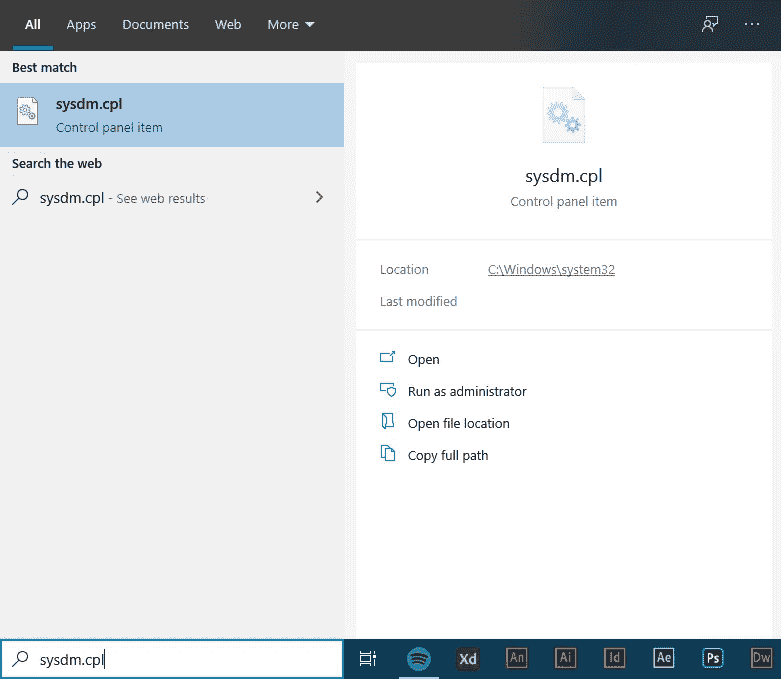
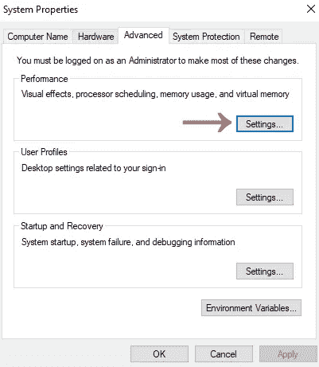
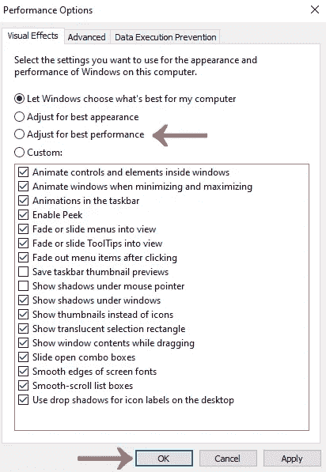

# 如何禁用 Windows 10 上的动画

> 原文：<https://medium.datadriveninvestor.com/how-to-disable-the-animations-on-windows-10-5adacba80771?source=collection_archive---------29----------------------->

在 Windows 10 上禁用动画肯定有助于提高你的电脑性能，特别是如果它不是高端电脑的话。用这个简单的技巧，你可以让你的电脑感觉快很多。

一些旧电脑的 GPU 和 CPU 可能会与 Windows 操作系统上的一些动画发生冲突。这些动画对现代电脑来说不是问题，但是如果你喜欢它提供的即时效果，我想你也可以这样做。

 [## 数据驱动的投资者|微软比 Chrome 有“优势”

### 简史我从来不是浏览器的粉丝，确切地说，我只是一个浏览器的粉丝，Chrome。这是我的…

www.datadriveninvestor.com](https://www.datadriveninvestor.com/2020/03/29/microsoft-having-an-edge-over-chrome/) 

# 如何禁用最小化和最大化动画。

点击**开始**并搜索 **sysdm.cpl** 。

接下来选择**高级选项卡**，如下图所示。

转到**性能**并点击**设置**按钮。

在那里你可以找到**视觉效果**。要获得最佳性能，请选择“调整以获得最佳性能”选项。但是，如果你只想禁用动画，请取消选中下图中的前三个选项。完成后，按下“**确定**按钮保存更改。

# 结束语

这是学习如何在 windows 中禁用动画的最短、最简单的方法。在某些情况下，这有助于提高性能，但对其他人来说，这只是一个审美问题。不管对你来说是什么，我希望这篇文章对你有所帮助。

## 访问专家视图— [订阅 DDI 英特尔](https://datadriveninvestor.com/ddi-intel)