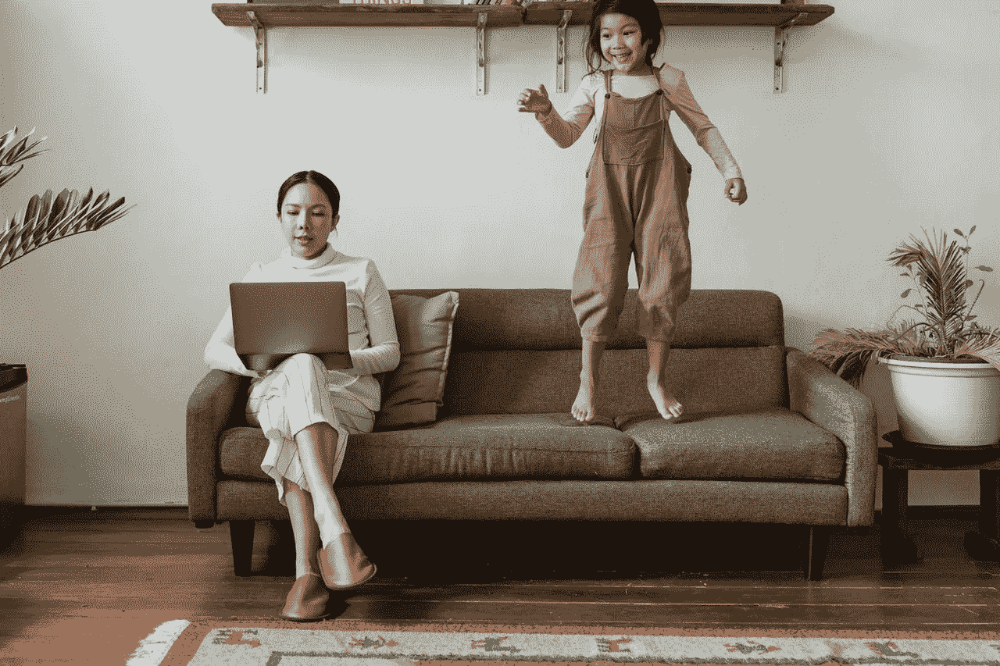

# 疫情期间如何给家里消毒

> 原文：<https://medium.datadriveninvestor.com/how-to-disinfect-your-home-during-pandemic-63049aaf7c89?source=collection_archive---------52----------------------->

疫情在 2019 年 12 月袭击了中国，世界在 3 月初被封锁。当每个人都期待恐怖结束时，病毒对人们生活的影响仍在继续。截至 2020 年 12 月，全球有超过 7000 万例病例，其中 65%痊愈，2.3%死亡。卫生系统崩溃，政府引入更严格的封锁，企业继续承受后果。

世界已经改变，许多人说这种改变将伴随我们很长时间，如果不是永远的话。人们开始随时洗手；现在，在大多数国家的公共场所，甚至在街上，口罩都是强制性的。现在，所有公共场所都用消毒溶液清洗，今年，人们打扫房屋的次数也增加了。

频繁的清洁和消毒现在是必须做的活动，就像美国的消毒隧道一样成为常规。让我们来看看疫情期间清洁房屋的消毒剂和方法。

# 什么是消毒剂？

消毒剂是杀灭表面微生物(孢子除外)的物质；它必须受到美国环境保护署(EPA)的监管，才能成为真正有用的产品。在您选择一种家用  消毒剂之前，您必须确保它获得了 EPA 的批准，因为这意味着该产品:

*   接受了适当的测试
*   对人体安全的[消毒液](https://sanipass.net/)
*   确实能杀死特定性质的微生物

***注:*** 一般来说，真正的消毒剂都会在标签上写有如下内容:“以标签上未注明的任何方式使用本产品都是违反联邦法律的。”

# 如何选择一种消毒剂？

你所需要做的就是从批准的[列表 N](https://www.epa.gov/pesticide-registration/list-n-disinfectants-coronavirus-covid-19) 中选择消毒液(批准的产品被证明对 SARs-CoV-2 有效)。只要阅读标签，选择正确的产品。确保你也买了防护手套和眼镜，在消毒过程中保持安全。请记住，不是所有的清洁产品都有助于对抗新冠肺炎病毒，所以阅读标签是非常重要的。

以下是环保署关于如何选择它们的提示。但是在你冲进商店之前，检查一下你的储物空间；也许你已经有了其中的一些:

*   验证标签或使用 [EPA 工具](https://www.epa.gov/pesticide-registration/list-n-advanced-search-page-disinfectants-coronavirus-covid-19)来验证您的家庭消毒溶液是否有效
*   检查消毒湿巾(Clorox 或 Lysol)
*   喷雾剂(Clorox、Lysol 或 Purell)
*   过氧化氢
*   稀释的漂白剂溶液(1/3 杯/5 茶匙 5.25–8.25%的次氯酸钠溶液，用于 1 加仑水)
*   70%以上的酒精溶液

# 消毒与清洁

虽然谈论这两个概念之间的区别似乎很愚蠢，但不幸的是，许多人仍然没有抓住每个过程的要点。例如，你可能见过餐馆里的人在你坐在他们面前之前用喷雾器清洗桌子，对吗？这通常是用一种清洁溶液来完成的，即**清洁**它们。现在餐馆也这么做——他们用消毒液喷桌子，擦干净，认为已经消毒了，在桌子上贴上特殊的标志以示确认。事实是，他们仍然清理了桌子，没有消毒，只是用了更贵的清洁剂。

清洁是指从表面清除污垢；这包括油脂、灰尘、污垢，甚至人类皮肤上的脂肪。清洁很快——你擦一下表面，就没事了。有了消毒，一切都长了一点。大多数消毒液需要表面保持湿润一段时间(5-10 分钟)才能发挥作用——杀死所有细菌。这意味着，如果消毒剂立即从表面抹去，这种伎俩不起作用，包括冠状病毒在内的有害微生物仍然存在。所以不要把清洁和消毒混为一谈。仔细阅读瓶子上的消毒建议，因为[消毒液公司](https://sanipass.net/)一般会说明消毒剂需要在表面停留多长时间，以保证表面无菌。

 [## 疫情期间临床试验的一线希望|数据驱动的投资者

### 没有书本而学医的人航行在未知的大海上，但是没有病人而学医的人不去…

www.datadriveninvestor.com](https://www.datadriveninvestor.com/2020/12/14/the-silver-lining-for-clinical-trials-during-the-pandemic/) 

# 家庭消毒指南

除非你只忙于清洁，否则每天对所有家居表面进行消毒几乎是不可能的。当然，“越多越好”是一个很好的观点，但事实是，你需要用一种聪明的方式来清洁，这样就不会占用你一整天的时间。

# 多久消毒一次？

*   *每次触摸后*——靠近入口的表面或你进屋后首先触摸的表面+电话、钥匙等。从街上带来的
*   *日常* —厨房柜台、马桶座、水槽等高流量表面
*   *每隔一天一次* —地板、沙发和扶手椅
*   *每周一次(至少一次)* —整个房子(所有的角落，家具下面等)。)

# 消毒什么，怎么消毒？

*   *坚硬表面*——用上述消毒液
*   *柔软的表面(家具)*—>用常规的清洁溶液进行真空清洁，只要有可能>清洗室内装潢>使用烟雾消毒剂
*   *洗衣* —根据制造商的建议进行洗涤，并完全干燥
*   *电子产品* —经常使用的(手机/平板电脑/笔记本电脑/手表)应定期用消毒湿巾或特定消毒液擦拭；剩下的可以一天擦一次
*   *HVAC* —考虑到新冠肺炎是一种呼吸道病毒，过滤器必须是最高质量的，并且每月更换一次

请记住，如果家里有病人，她/他接触的所有表面都必须立即消毒(按照上面的列表)。在一个完美的情况下，这个人应该被隔离在一个单独的房间里，有单独的浴室。然而，由于这通常是不可能的，所以请确保在清洁和消毒共享空间之前尽可能长时间地等待，以最大限度地降低病毒对您的影响。

# 额外的室内消毒溶液

除了清洁和消毒你的家，还有一些额外的方法让新冠肺炎远离你的家。

1.  *消毒通道。对于乡村别墅或独户住宅来说，它们可能显得有些极端；然而，消毒隧道的好处无疑证明了它们对于多层建筑的价值。如果在建筑物入口前设置一条隧道，可以显著减少租户和访客衣服上的传染因子进入建筑物。*
2.  *消毒喷雾器*。这些可以用在各种大小的家里，如果你不得不邀请别人来你家做客，这是一笔宝贵的财富。喷雾器可以消毒所有难以清洁的表面和家庭角落。他们的价格是可以接受的，尤其是因为这是对家庭健康的投资。
3.  *自动洗手液。对于一个拥有自动洗手液的家庭来说，这听起来可能有点奇怪。尽管如此，由于洗手可能不是每几分钟一次的选择，自动洗手液可以拯救一天，尤其是在入口处。*

# 结论

在新冠肺炎疫情期间，频繁的清洁和消毒已经成为惯例。随着疾病数量达到高峰，家庭消毒变得比以往任何时候都更加重要，尤其是对免疫系统较弱的人来说。记得选择环保局批准的消毒溶液，并尽可能在高流量区域工作。如果你对消毒溶液、其安全性或有效性有任何疑问，你可以随时向当地疾病控制和预防中心核实所有这些疑问。

**进入专家视角—** [**订阅 DDI 英特尔**](https://datadriveninvestor.com/ddi-intel)