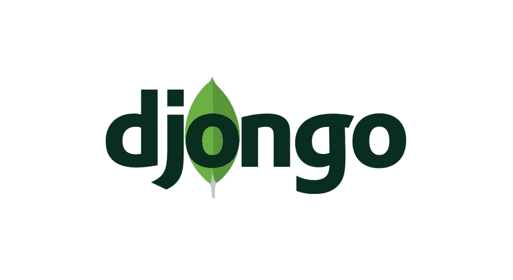

# 如何用 MongoDB 来 Django——Djongo 的力量

> 原文：<https://medium.datadriveninvestor.com/how-to-django-with-mongodb-the-power-of-djongo-df92317f8714?source=collection_archive---------0----------------------->



由于大数据时代的兴起，NoSQL 已经成为处理用于分析、实时应用和存储的数据的行业规范。NoSQL 数据库允许数据的非关系存储，通过它可以以不同的方式方便地检索和存储数据。

SQL 数据库有固体和酸的概念，而 NoSQL 没有这样的概念。

考虑到 NoSQL 的崛起，Django 应该有 MongoDB 这样的 NoSQL 支持，但可悲的是 MongoDB 没有官方支持。很少有开源项目提供带有 Django 的 MongoDB 连接器。一个这样的连接器是 djongo。

djongo 连接器不影响 Django ORM 框架的原始 ORM。djongo 连接器不仅将 SQL 查询翻译成 MongoDB 查询，还允许访问 pymongo API，这是 MongoDB 对 Python 的官方支持。

安装 Django

它可以通过以下方式访问

```
pip install djongo
```

将这些添加到 Django 项目的 settings.py 中

```
DATABASES = {
       'default': {
           'ENGINE': 'djongo',
           'NAME': 'your-db-name',
         # 'HOST':'mongodb+srv://<username>:      <password>[@](http://twitter.com/cluster0)mongodb_atlas',
         # 'USER': 'user',
         # 'PASSWORD': 'pass',       
}
   }
```

主机可以用来连接 Django 和 MongoDB 的云数据库，并提供该数据库的用户名和密码

运行以下命令来生成 MongoDB 数据库的模式

```
python manage.py makemigrations <app_name>python manage.py migrate
```

Djongo 主要支持三种类型的数据字段，分别是**嵌入字段**、**数组字段**、**数组引用字段**，以及其他一些。点击[这里](https://nesdis.github.io/djongo/using-django-with-mongodb-data-fields/)查看

此外，通过 Django 应用程序的管理页面访问元素，需要声明一个带有数据字段的表单，例如

```
from djongo import models
from django import forms

class Blog(models.Model):
    name = models.CharField(max_length=100)
    tagline = models.TextField()

    class Meta:
        abstract = True

class BlogForm(forms.ModelForm):
    class Meta:
        model = Blog
        fields = (
            'name', 'tagline'
        )

class Entry(models.Model):
    blog = models.EmbeddedField(
        model_container=Blog,
        model_form_class=BlogForm
    )

    headline = models.CharField(max_length=255)    
    objects = models.DjongoManager()
```

如果您想通过序列化器来序列化数据，那么您可以使用***rest _ meets _ djongo***序列化器来实现，比如

```
from djongo import models
from rest_meets_djongo import serializers
from project.models import Entryclass EntrySerializer(serializers.DjongoModelSerializer):
   class Meta:
        model = Entry
        fields = ['headline','blog']
```

要使用查询或子查询，需要以下语法:

```
inner_qs=Blog.objects.filter(name__contains='django').values('name')
entries = Entry.objects.filter(blog__name__in=inner_qs)
```

此外，一个重要的方面是序列化这些模型，尽管序列化不是使用 djongo 的必要步骤，因为它可以使用 pymongo 包装器直接访问 MongoDB 中的值，可以通过将 *mongo_* 添加到 pymongo 中的每个命令来访问该包装器。以下是使用此方法的聚集示例:

```
query=[
  {
    "$unwind": "$comments"
  },
  {
    "$group": {
      "_id": {
        "year": {
          "$year": {
            "$toDate": "$post_published"
          }
        },
        "month": {
          "$month": {
            "$toDate": "$post_published"
          }
        },
        "week": { "$week": { "$toDate": "$post_published" } },
        "post_sentiment": "$comments.sentiment",
      },
      "count": {
        "$sum": 1
      }
    }
  },
  {
    "$sort": {
      "_id": -1
    }
  }
]#this is used in view.py in Django
Posts.objects.mongo_aggregate(query)
```

虽然 Django 没有官方支持 MongoDB 作为 web 应用程序开发的框架，但是 djongo 和其他类似的项目有助于解决复杂的问题并加快开发周期。

**免责声明** : ***Djongo 不应用于生产级应用程序，除非对其进行完整的项目评估。***

**参考文献**:

[](https://nesdis.github.io/djongo/get-started/) [## Django 和 MongoDB 连接器

### Djongo 专门用于最初的 Django ORM 和 MongoDB。使用 Django 管理应用程序，您可以…

nesdis.github.io](https://nesdis.github.io/djongo/get-started/) [](https://github.com/nesdis/djongo) [## nesdis/djongo

### 使用 MongoDB 作为 Django 项目的后端数据库，不需要修改 Django ORM。使用 Django 管理 GUI 来…

github.com](https://github.com/nesdis/djongo)