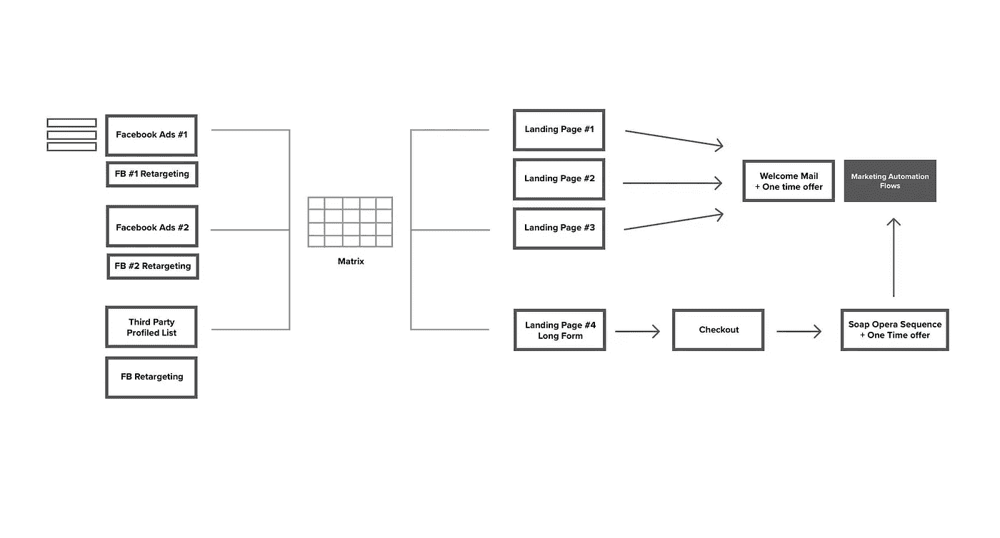
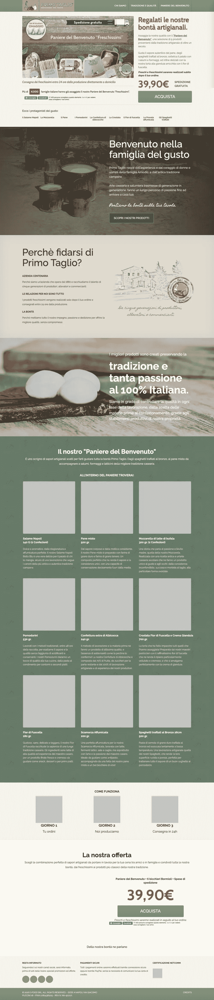
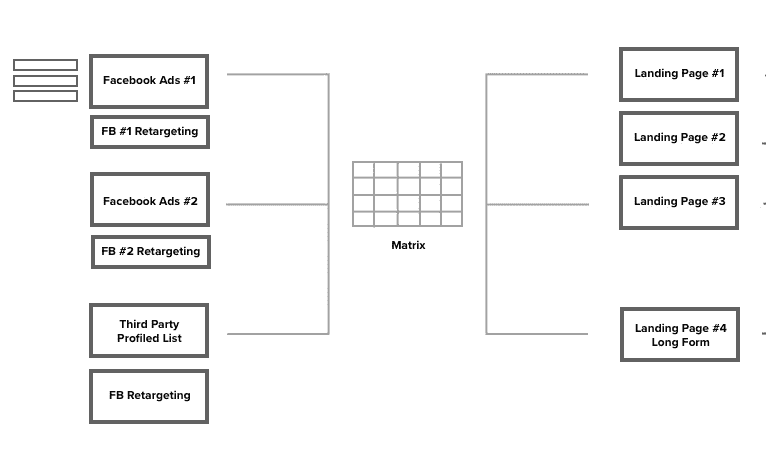
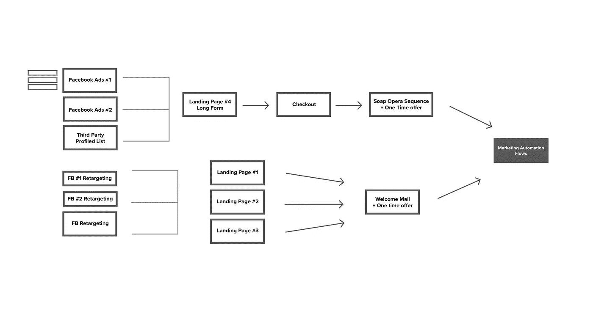

# 如何利用营销自动化和销售渠道推动电子商务销售额快速增长(x5)

> 原文：<https://medium.datadriveninvestor.com/how-to-drive-a-fast-growth-x5-e-commerces-sales-using-marketing-automation-and-sales-funnels-adfdae940e8e?source=collection_archive---------21----------------------->

*通过数据分析获取新客户并产生 x5 销售额*

# 问题是

我在 2014 年(从那以后似乎过了很长时间)研究了 Primo Taglio，它是 Amodio Group SpA 的一个分支。不幸的是，随着时间的推移，一些材料和自动化方案丢失了，但我记得很清楚，当时开展的活动:客户曾与专门从事电子商务和营销代理的大公司合作多年。

对我和要开展的活动的关注度很高！

由于对周期性简讯的错误管理，他们的客户群在很长一段时间内部分饱和，在价值方面几乎相同(我发现这是许多知名品牌的做法)。

**通过 weekley 时事通讯邮件发送的内容和报价是“一个尺寸适合所有人”**。自然的结果是高退订率，低点击率(*点击率*)和打开率。他们需要通过广告和第三方供应商周期性地购买新的潜在客户。

# 解决方案

在我创办的公司工作时，我很幸运地管理着一个团队，这个团队是我长期培养起来的，它帮助我推行了这一战略。

一旦我通过 RFM 分析分析了[客户群和他们的浏览行为，下一步就是一方面制定收购策略，另一方面增加终身价值(LTV)。](https://alexgenovese.it/it/come-generare-piu-vendite-con-la-segmentazione-dei-propri-clienti/)

此次收购是根据不同的客户群考虑和构建的，主要目标是获得他们的电子邮件，次要目标是将他们转化为付费客户，这可能会在很短的时间内实现。

**产品品尝允许周期性收购，因为它们产量高，所用牛奶质量好。**在他们消费之后(平均 3/7 天)，营销自动化流开始增加 LTV。

> *下面我只告诉* [***我分析操作的 11 个客户群***](https://alexgenovese.it/it/come-generare-piu-vendite-con-la-segmentazione-dei-propri-clienti/) *中的 1 个细分市场(常客)应用的方法。*

定量分析，尤其是在工作的第一阶段，确实是一个*很难带回家*的难点，因为它是被分割的，并且具有严格意义上的影响。如果推出的战略是错误的，所有的营销沟通和行动将不会很好地针对客户，**永久烧毁客户数据库。**

硬币的另一面是定性的一面，这一点通常没有被考虑到:记录的客户导航、对调查的回应、对客户关怀实时聊天中最常用关键词的分析(都是为了描述他们在购买前和购买后阶段的疑虑)。

这些数据对理解顾客在购买过程中的摩擦有很大的帮助。在与我的团队进行头脑风暴的过程中，我们设法提出了关于广告信息中使用的*语调*(以及不使用的**语调**)的重要数据驱动因素。

有了对客户群的分析，我创造了下面的策略，你可以在下面看到它的一部分。

基于数据库中始终存在的人口统计数据，我提取了与**常客细分市场**相关的电子邮件(以创建脸书广告#1——LAL 受众# 1)。

相反，我使用客人生成的数据，通过以下方式创造了一个新的受众，从而在脸书广告#2 上获得“更广泛”的信息:

*   我提取的数据如:消费范围、年龄、性别、地理位置等；
*   我在脸书的广告中创造了一个 LAL 观众群，并增加了额外的兴趣。

> ***专业提示:*** *如果 Google Analytics 允许的话，你可以创建自定义段，用于 Google Ad-Words。*

由于第三方供应商，它被发送到冷名单观众不同的邮件营销活动，提供促销优惠，定时折扣。

通过不同渠道(脸书和 DEM)传递的广告信息自然不同，因为它在不同的漏斗阶段涉及不同的人。

作为一个经常购买的观众，我知道购买最多的产品，我们推广(通过重新定位)3 种不同类型的定时折扣和促销。

 [## 简化电子商务网站|数据驱动的投资者

### 对于数据科学领域的新手来说，一个显而易见的问题是什么数据…

www.datadriveninvestor.com](https://www.datadriveninvestor.com/2020/04/15/scraping-an-e-commerce-website-made-simple/) 

新观众登上长表格，告诉他们**公司价值观和他们的乳制品有多好**，这些乳制品通过工业流程制作，但**尊重不同生产步骤中的传统。**

总结:

*   **脸书广告#1** —如上所述，通过从该细分市场导入电子邮件来吸引新的 LAL(长相相似的受众)受众。
*   **脸书广告#2** —拥有人口统计和购买信息及其兴趣的新受众。

> ***专业提示*** *:我倾向于省略一部分策略，但在* ***脸书广告#1*** *中创造的受众随后被次级价格细分，以传达更有针对性的报价与最后的 AOV。*

多亏了再营销活动和下面所示的类似方案，我能够最大化收购投资，CAC(每次收购成本)低于最初的 1/4。

单元格内的 X 是获胜的变体。实际上，矩阵应该为再销售提供不同的行，在每个单元格中，应该插入相对转换率(由于明显的 NDA 原因，没有公布)。

第三方供应商的观众被转移到长的形式，它有一个跳出率和平均时间，非常有趣。如果没有购买，那些达到特定阈值的人，通过重新定位，他们返回到另一个具有更高影响推广的登录页面。

在定性分析的过程中，我发现了对网上购买食品的某种不信任(可以理解)。看不到、摸不到、闻不到它们，这不是意大利人在日常购买食品过程中经常经历的事情。

我们的目标是增加这些行为指标，并把它们带到第一次购买中，**减少未表达出来的摩擦和恐惧**或者我们通过定性分析以某种方式绘制出来的。

在图表的第二部分，一旦通过登录页面 1、2、3 或通过长表单直接购买获得了联系人，他们就进入了一些营销自动化流程。

**长格式** —输入一个肥皂剧序列(SOS):它表示当他们第一次进入列表时，基于电子邮件序列的销售策略。这样称呼他们是因为每封邮件都以一个挂钩结尾，将他们与下一集联系起来，就像肥皂剧一样。

在每封邮件中，我都添加了一些与“插曲”相关的故事相关的产品。根据他们的行为，**我找到了特定的标签，以了解他们的偏好并采取未来的行动**。

> *SOS 是一个完美的策略，因为它让我们能够为新顾客创建一个入职培训，在一个虚拟的烹饪行程中发现坎帕尼亚美食和他们的传统。*

**登陆页面 1、2、3 —** 这里的目标是让他们的电子邮件充分利用产品的优点和促销品鉴。

在几次 A/B 测试中，我使用了 Cialdini 的 7 条规则中的一条来增加转化率，并尽可能地获得更多的用户。

**欢迎邮件+一次性报价:**这是一个简单的电子邮件营销自动化流程，基于距离 **2 次提醒**1 天(如果他没有从上次发送的邮件中购买)到**推动客户，在漏斗阶段，有一个定时报价**。该提议在 N 天内可用:一些实验在到期日部署，获胜的变体是 3 天。

在购买后，他们被置于不同的营销自动化流程中，这些流程根据他们的行为进行构建，并逐级计算不同的客户评分分配。

当你制定一个清晰的战略时，最好能够依靠资深和熟练的专业人士，并成为数据组织的狂热分子。如果某些信息丢失，可能会使正在进行的实验无效或得出错误的结论。

始终关注的一个方面是**客户群饱和度**，使用这些策略，自动化很容易重叠，随之而来的是**客户的“电子邮件泛滥”。**

> ***PRO 提示*** *—使用* [*等产品主动活动*](https://www.activecampaign.com/?_r=AF2432JB) *避免自动化碰撞和重叠。为不同的角色绘制客户旅程图，可以极大地促进问题的解决。*

取得的惊人成果被 NDA 掩盖了，但我希望能够很好地解释所用方法的一部分。

## 查看我的网站，阅读其他关于数据分析、营销自动化和机器学习的文章。

**访问专家视图—** [**订阅 DDI 英特尔**](https://datadriveninvestor.com/ddi-intel)