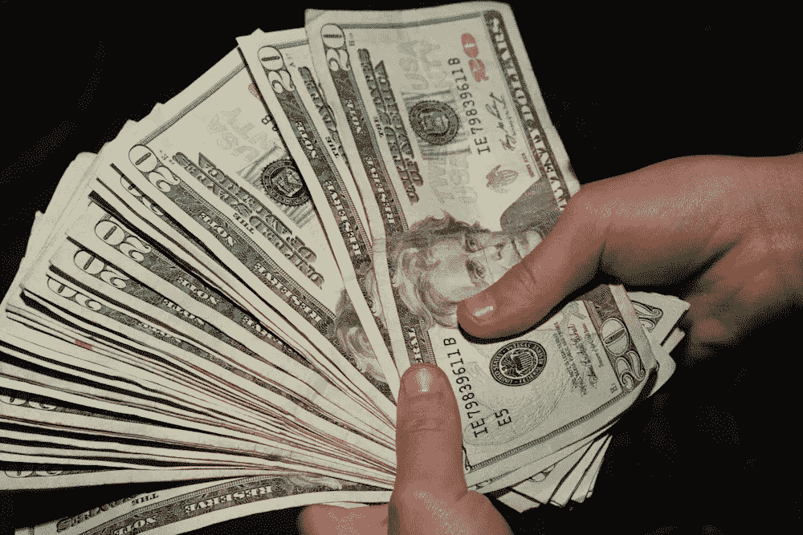

# 如何以中等被动收入赚取 23000 美元

> 原文：<https://medium.datadriveninvestor.com/how-to-earn-23000-with-passive-income-at-medium-771c7c3adb53?source=collection_archive---------3----------------------->

## 每个人都能做到

# 什么是被动收入？

根据维基百科的定义，*被动收入是指几乎不需要努力就能赚取和维持的收入。*

https://en.wikipedia.org/wiki/Passive_income

# 背后的数学原理

在我的 medium.com 账户中，每阅读 1 分钟意味着 0.023 美元。所以这是简单的数学。

1 百万分钟= 23000 美元

如果你想要这笔钱，你需要:

# 常青内容

再次，维基百科将有所帮助:在新闻和广播的背景下，常青内容是对时间不敏感的内容。

[https://en . Wikipedia . org/wiki/Evergreen _(新闻学)](https://en.wikipedia.org/wiki/Evergreen_(journalism))

你需要写一些能永远吸引注意力的内容。喜欢这个帖子。

人们会一直搜索这些内容。它不取决于季节、月份等…

这可以产生被动收入。

# 增加阅读的成员数量

因为你只有在会员阅读时才会收到信息，所以你需要接触到我们的目标受众:会员。

你需要建立关系。媒介宣布了一些变化:

> edium 变得越来越关系化，这是为了给作者更多的自由和权力来建立和维护与观众的关系。

因此，你的策略应该有利于关系的建立，而不是只关心读者的数量。

# 增加计时读数

你有两个变量一起工作:数量和质量。

所以你需要多写，写得更好。你写得越多，他们就会读得越多，但是如果这是一篇无聊的文章，你必须记住，你的读者可以简单地寻找其他事情去做。

另一个有趣的策略是识别最成功的故事，改进它们，增加信息量。这就是我对这个故事所做的。这将增加阅读时间，排名和读者将有更多的信息。因此这个故事的利润。

我正在使用这个策略，在某些情况下，我设法获得了两倍的收入。

这个策略的有趣之处在于，我设法将我的努力引向对读者来说最重要的东西，这将给我带来最多的结果。

# 被策划

媒体中有很多内容教你如何被策划。如果你的帖子是策划好的，你将扩大你的影响力。

# 也

 [## 永不放弃是成功的秘诀

### 坚持是成功之路

medium.com](https://medium.com/@andreuhlrich/never-giving-up-is-the-secret-to-success-1e7b28b691b9)  [## 我要把 37 美元换成 3 美分

### 我从互联网上获得经常性被动收入的计划

medium.com](https://medium.com/@andreuhlrich/i-will-exchange-37-00-for-3-cents-5112bdcdbe7e)