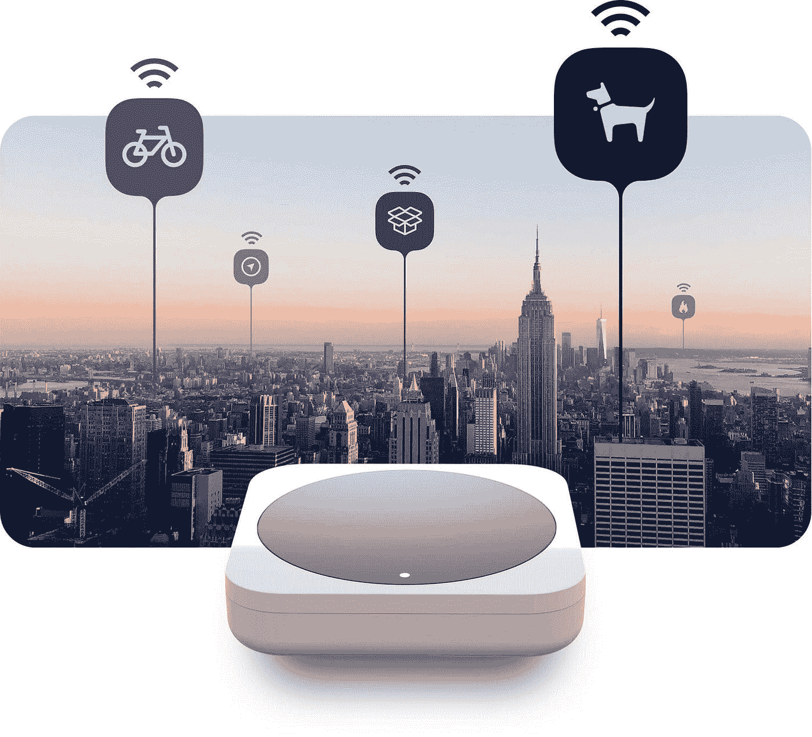
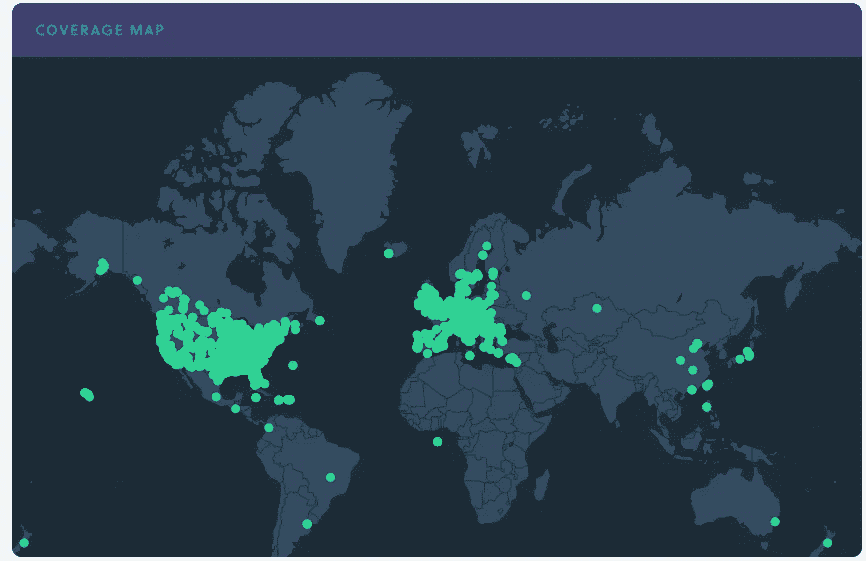
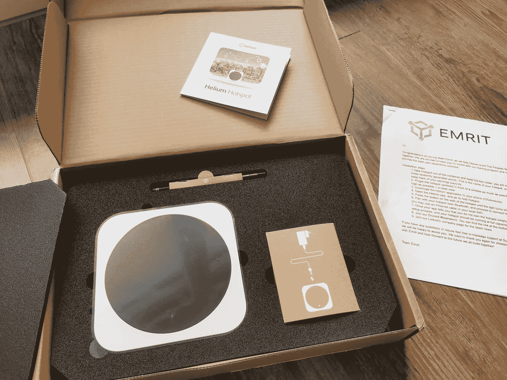
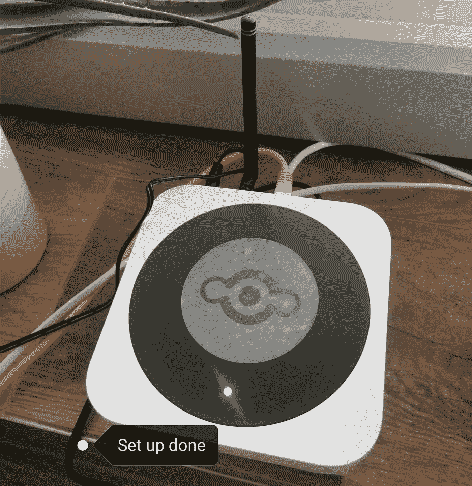

# 如何利用家里的网络热点赚取被动收入

> 原文：<https://medium.datadriveninvestor.com/how-to-earn-passive-income-with-your-internet-hotspot-at-home-5de5ebf3e09b?source=collection_archive---------1----------------------->

## 我一直相信双赢的商业模式，当我在与 Emrit 的 Peter 的播客采访中被介绍给氦网络时。我被说服去试一试。我几乎不知道，每个人在家里拥有一台小型设备，就能如此轻松地成为全球物联网的一部分。

世界各地的每个人都可以从 [Emrit.io](https://bit.ly/emritfasttrack) 订购一个免费的热点设备。他们将免费向您发送设备，以换取您收入的 80%来支持他们的运营支出。另外 20%将是你的被动收入。你只需要在家里将热点盒连接到你的互联网，然后你就可以为全球物联网网络提供互联网。你从提供互联网中得到什么？氦代币。

## 氦网络

[氦网](https://www.helium.com/)是世界上第一个点对点无线网络，成立于 2013 年，其使命是更容易地构建互联设备。与比特币使用工作证明不同，氦网络使用覆盖证明。它使用无线电波来验证提供合法无线覆盖的热点。通过验证交易，Hotspot 可以获得氦令牌(HNT)，新的区块被添加到区块链。这与其他区块链网络的逻辑相同，只是氦使用覆盖证明，而不是更广为人知的证明，如工作证明、利益证明等。

由于热点的位置是唯一的和不可改变的，氦区块链能够以高安全性和抗传感器的方式处理数据。作为个人，你不必担心氦网会知道你的个人数据。作为物联网网络用户，由于区块链技术的优势，您不必担心传输过程中的数据安全。

到目前为止，全球有 15，692 个人或热点设备是该网络的一部分。

source: [https://explorer.helium.com/coverage](https://explorer.helium.com/coverage)

## 赚取氦代币

如上所述，将您的互联网连接到全球物联网网络和热点可以验证交易。所以热点由氦代币奖励。每个人都有一个唯一的设备标识，你可以在 [Emrit.io](https://bit.ly/emritfasttrack) 上的账户仪表盘中看到你的收入和设备信息。

你可能听说过比特币矿工。比特币矿工验证比特币上的交易，并获得比特币奖励。如果你家里有一个热点设备，它就像一台“采矿”机。你可以直接在家里自己开采氦代币，订购他们的 RAK 热点采矿器，价格为 299 美元。这样，你就获得了 100%的回报。

如果你不想投入太多，并且可能需要很长时间才能达到收支平衡，你可以订购一个由 [Emrit 团队](https://bit.ly/emritfasttrack)提供的免费热点设备。您可以通过单击下面的按钮订购您的设备。

**第一步:在 [Emrit](https://bit.ly/emritfasttrack) 上注册账户**。输入你的名字和家庭地址。因此 Emrit 团队知道他们应该将包裹发送给谁以及发送到哪里。稍后，您可以在仪表板上看到所有的统计数据。

My hotspot arrived from the USA with a clear instruction

**第二步:安装。收到包装盒后，您可以按照说明进行安装。它将花费你大约 5 分钟或更少。然后去 Emrit.io 创建一个氦钱包地址。**

设置完成后，您将看到绿灯，并在[网络浏览器地图上找到您的设备。](https://explorer.helium.com/coverage)

第三步:赚取 HNT。你周围 2 英里范围内的设备越多，它就越强大。当您的设备验证交易时，您将在钱包中收到您在 [Emrit 网站](https://bit.ly/emritfasttrack)上提供的 HNT。当你加入，你也有一个个人的附属链接，你可以邀请朋友或家人，你在第一年赚取 5%的佣金。如果不使用它，你仍然可以获得 HNT。

## 总成本

设备成本:0 美元

运输成本:0 美元

电费:每小时 5 瓦特。以我们为例，每年大约 10 美元。

我总是觉得尝试新技术和新设备很令人兴奋。现在，订购、安装和运行都没有花费我任何精力。目前氦代用币的价格是 1.7 美元，如果我赚了 6 个代用币，我就可以不赔不赚电费了。但是这个费用太鸡毛蒜皮了，我连想都不会想。如果越来越多的人加入网络，氦可以为物联网设备供电，这甚至可以成为一个非常有用的物联网基础设施，来运行各种 SaaS 或服务。我期待着它的未来。

从我的[播客](https://bit.ly/fasttrackpodcast)和[博客](https://www.fasttrack.life)中了解更多关于如何赚取**被动收入**的信息。

相关主题:

## [加密货币赌注的被动收入](https://www.fasttrack.life/blog/passive-income-with-cryptocurrency-staking)

## [**使用这两个移动交易应用让自己走上财富积累的轨道**](https://www.fasttrack.life/blog/tradingapps)

## [如何建立投资组合](https://www.fasttrack.life/blog/how-to-build-an-investment-portfolio)

## 通过我们的[理财课程](https://www.fasttrack.life/moneycourse)学习如何实现财务独立

*原载于 2021 年 1 月 18 日*[*https://www . fast track . life*](https://www.fasttrack.life/blog/how-to-earn-passive-income-with-your-internet-hotspot-at-home)*。*